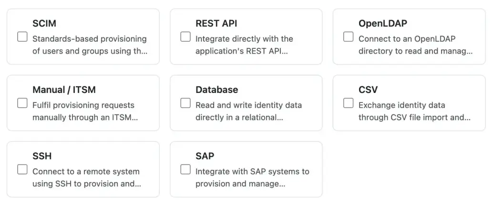
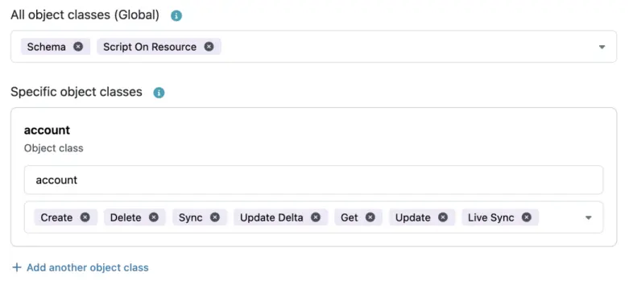
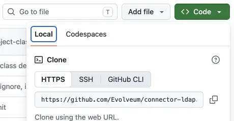
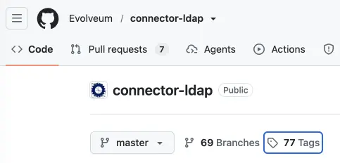
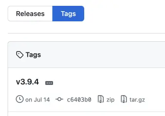

= Upload custom connector
:experimental:
:page-toc: top
:page-description: This describes how to upload custom connectors to the Integration catalog
:page-keywords: integration catalog, integration, custom connector, upload connector, share connector

This describes how to upload custom connectors to the xref:/midpoint/reference/interfaces/integration-catalog/[Integration catalog].

[[upload-integration]]
== Create new integration

You can upload your own connectors into the Integration catalog (IC) to make them available for your own engineers and for other midPoint engineers.
Connectors are uploaded together with some necessary configuration details as _integration methods_.

To start the upload, at the IC landing page, scroll down and click the [.nowrap]#icon:upload[] btn:[Upload and publish]# button.

.Uploading a new integration method

The upload process takes you through the steps below, in which you define particular aspects of the new integration.
These provide the necessary details that enable the Evolveum team to build and publish your custom connector in the Integration catalog.

Note that you need xref:/midpoint/reference/interfaces/integration-catalog/#permissions[sufficient privileges] to contribute to the Integration catalog.

. <<select-target-application,Select target application>> - You either choose from an existing application, i.e., one that has already been defined in the catalog, or define a new one.
. <<select-integration-method-type,Select integration method type>> - Choose one or more integration methods, such as SCIM, REST API, or Database.
. <<define-integration-method,Define integration method>> - Name the integration method and define its capabilities.
. <<select-connector-type,Select connector type>> - Define if your connector is a Java-based, or a low-code connector built using midPoint AI features.
. <<add-connector,Add connector>> - Define the basic connector information needed to access, build and use it.
. <<compatibility-settings,Compatibility settings>> - Define which versions of midPoint the connector is compatible with.
. <<review,Review>> - Review your new integration entry and submit it for approval by the Evolveum team.
. Submitting an integration creates a ticket.
Based on your submission, further interaction may be required in the ticket before your integration is approved and published in the catalog.

[[select-target-application]]
=== Select target application

In this step, you choose the target application that your custom connector integrates.
If the target application has no entry in the catalog, you can create a new entry.

Always xref:/midpoint/reference/interfaces/integration-catalog/download-integrations/[search for an existing application] first to make sure not to create a duplicate entry in the catalog.

. Either search for and select an existing application, or if your target application is not listed yet, click [.nowrap]#icon:plus[] btn:[Define new]#.
. Define the following basic information about the target application:
** *Display Name* - (Mandatory) This is how the application will be displayed in the IC.
** *Upload a logo* - Upload a logo of the application to make it easier to identify it.
If you do not upload any logo, the application will be represented by the first letter of its name.
** *Description* - Describe the application and its purpose for easier identification in case there are similar applications.
** *Origin(s)* - Select the country from which the application originates.
This may help with filtering available applications.
** *Category* - Specify the purpose of the application, such as HR System or Office and email systems.
** *Deployment type* - Specify if the application is deployed locally (on-prem), in cloud, or in both of those environments.
This is relevant as applications may support different integration methods in cloud and on-prem environments.

[[select-integration-method-type]]
=== Select integration method type

In this step, you need to select one or more integration method types.
These describe how midPoint exchanges data with the target application or system.
They include the most common protocols, such as SCIM, REST API, etc.

Typically, only one integration method type is selected, however, you can create hybrid integrations in which multiple protocols complement each other.

.Select integration method type

[[define-integration-method]]
=== Define integration method

In this step, you define the details for the selected integration method type.
This describes how your connector is deployed and what xref:/midpoint/reference/admin-gui/resource-wizard/object-type/capability/[capabilities] it supports.
In essence, this defines which features of the target application are accessible in midPoint for particular resource object classes.

Configure the following:

* *Integration method name* - Name the method.
* *Description* - Describe the integration method.
* *Define capabilities for* - Select the capabilities that the integration method has on two distinctive levels:
** All object classes - The selected capabilities apply globally for the connected application irrespective of a particular xref:/midpoint/reference/resources/shadow/kind-intent-objectclass/#object-class[object class].
** Specific object classes - Select capabilities that apply only to a specific object class.

+
.Example capabilities definition for object classes

* *Integration Tutorial* - Enables you to upload documentation, setup guides, or other relevant information related to the deployment of the integration method.
You can either input the text directly into the text field, or you can upload documents in one of the following formats: PDF, XML, JSON, YAML, TXT.
This is especially important if your integration requires some particular configuration.
Note that the maximum size of a file is 20MB.

[[select-connector-type]]
=== Select connector type

In this step, you choose how you want to provide the connector for the application to the catalog.
You can define a new connector using one of the available development approaches, or select an existing connector that has already been published in the Integration catalog.

You are selecting:

* The type of a new connector you will define in the upcoming step:
** Java-based - If you can supply the connector JAR file, or source code that compiles into a connector JAR file.
** Low-code - If the connector JAR file is composed (not compiled) using Evolveum AI features from sources located in your own repository (GitHub or GitLab).
In this case, you define the connector declaratively rather than implementing the Java code.
// this needs further details
** Low-code with repository - If you want to maintain your connector on your own but want Evolveum to provide a repository.
* Or an existing connector by clicking *Select one from the catalog* and selecting the connector.

[[add-connector]]
=== Add connector

In this step, you provide the information needed to define and build the connector.
This includes basic connector metadata, such as its name and maintainer, as well as technical details required to build the connector from its source code.

Depending on the selection made in the previous step, a particular subset of the following options is to be filled in:

* *Connector name* - Name the connector.
* *Connector version* - Specify the version of the connector you want to share.
You will provide the link to the specific version further down this page in the *Commit hash* setting.
* *Maintainer* - Specify the person (or team) responsible for the development of the connector. 

[[licenses]]
* *License type* - Specify the type of license under which the connector is distributed.
The following options are available:
** *MIT* - A permissive open-source license that allows the connector to be used, modified and redistributed, including proprietary software.
The copyright and license notice must be retained.
** *Apache 2.0* - A permissive open-source license that allows the connector to be used, modified, and redistributed, including commercially.
It also provides an explicit patent license. Copyright, license, and applicable notice information must be retained.
** *BSD* - A family of permissive open-source licenses.
They allow the connector to be used, modified, and redistributed, including commercially, provided that the applicable copyright and license notices are retained.
The exact obligations depend on the specific BSD variant.
** *EUPL 1.2* - A copyleft open-source license created by the European Commission.
It allows the connector to be used, modified, and redistributed, but redistribution of modified or combined software under the conditions of the license generally requires the derivative work to be made available under the EUPL or a compatible license.
* *Connector description* - Describe the connector.
* *Connector bundle name* - Specify the symbolic name that identifies the connector bundle in the ConnId framework.
This name is used by midPoint and ConnId to identify the connector bundle.
It is defined in the connector JAR's manifest, i.e., in the `MANIFEST.MF` file.
For example, for the Database table connector, it looks as follows: +
`ConnectorBundle-Name: com.evolveum.polygon.connector-databasetable`
* *Define capabilities*
** All object classes - The selected capabilities apply globally for the connected application irrespective of a particular xref:/midpoint/reference/resources/shadow/kind-intent-objectclass/#object-class[object class].
** Specific object classes - Select capabilities that apply only to a specific object class.
* *Project homepage* - Link to the official project repository.
This is the primary reference for the connector in the Integration catalog.

+
NOTE: Make sure the repository is available to public.
* *Support portal* - Define the address of the support portal where users can submit tickets, for example, to enter requests for improvements, report bugs, or obtain professional technical services provided by the maintainer of the connector.
* *Build tool* - Specify the build system that is used to compile the connector.
The following build automation and dependency management tools are available:
** Maven - Uses a `pom.xml` file to define the project's dependencies, build configuration, and other settings.
** Gradle - Uses build scripts, typically `build.gradle` or `build.gradle.kts` to define the project's dependencies and build configuration.
* *Git clone URL* - Define the address of the repository where it is possible to download the connector source code.
You can copy this directly from GitHub by clicking the btn:[Code] button, and subsequently, [.nowrap]#icon:copy[] *Copy URL to clipboard*#.

+
.Clone URL from GitHub

* *Commit hash* - Define the specific commit hash of the connector release tag that allows building a stable version of the connector.
Both full and short (7-character) notations of the commit hash from your Git repository are allowed. +
In GitHub, this can be found by:
.. Clicking the btn:[Tags] link.
+

.. Copying the 7-character commit hash for the appropriate tag.
+

* *Project folder path* - Specify the folder where the connector source code is located.
Leave this field empty if the code is in the main (root) directory of the repository.
* *Class name* - Specify the full Java class name that implements the connector.
This tells midPoint which part of the code to execute.
For example, the class name of the midPoint LDAP connector is `com.evolveum.polygon.connector.ldap.LdapConnector`, i.e., a concatenation of the `package` and the `public class` located in the connector `.JAVA` file.

[[compatibility-settings]]
=== Compatibility settings

This step specifies which midPoint and connector versions the integration method supports.
Compatibility settings help classify and search for integration methods.

* *Supported midPoint version* - Defines the supported version range of midPoint by defining *From version* (mandatory) and *To version*. +
Only specify versions that you have actively tested and verified work with the integration method.
If you later verify another version of midPoint works with the integration method, you can add that version to the supported range.
* *Connector version ranges* - Defines the supported version of the connector by selecting the *From version* (mandatory) and *To version*. +
If you expect your integration method will remain compatible with future versions of the connector, leave the *To version* filled empty.

[[review]]
=== Review

This is where you can review any previously entered configuration and update/correct it by clicking [.nowrap]#icon:pen[] *Edit*#.

Once you are certain all details are correct, click [.nowrap]#btn:[Publish integration method] icon:arrow-right[]#.

After submitting, the integration is assigned a ticket that you can follow for updates.
The Evolveum team will review all details and may get back to you in the ticket if further details or clarifications are needed.

[NOTE]
====
Make sure that all information you provide is accurate and up to date.
As the contributor, you are responsible for the information submitted with the integration method, including details such as the connector license, source repository, version, and maintainer information.
The Evolveum team reviews the submission, but some details, such as licensing information, cannot be independently verified in all cases and therefore rely on the information provided by the contributor.
====

The information you entered is used to build the connector from the provided source code by the Evolveum team.
The connector, together with the entered details, is then made available in the Integration catalog.

Once the connector is published, you can download the integrations sheet and xref:/midpoint/reference/interfaces/integration-catalog/share-connectors/validate-connector/[validate your custom connector] in your midPoint installation.
At the same time, other users will also be able to download the connector you have contributed to the catalog.

== See also

* xref:/midpoint/reference/interfaces/integration-catalog/[Integration catalog]
* xref:/midpoint/reference/interfaces/integration-catalog/download-integrations[Downloading integration methods]
* xref:/midpoint/reference/interfaces/integration-catalog/share-connectors[Sharing custom connectors]
* xref:/midpoint/reference/interfaces/integration-catalog/share-connectors/validate-connector/[Validating custom connectors]
* xref:/midpoint/reference/interfaces/integration-catalog/share-connectors/upgrade-integration/[Upgrading existing integration methods]
* xref:/midpoint/reference/interfaces/integration-catalog/request-integration[Requesting new integration methods]