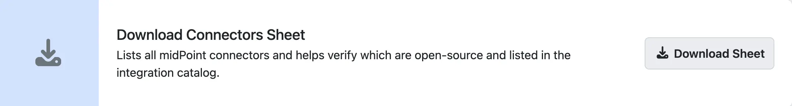
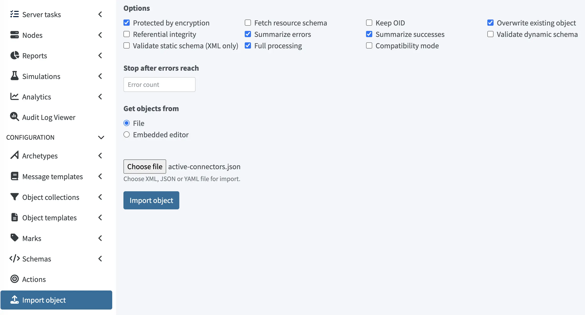

= Validate custom connector
:experimental:
:page-toc: top
:page-description: This page describes how to validate custom connectors.
:page-keywords: integration catalog, integration, validate connector, custom connector, connector validation

This page describes how to validate custom connectors.

== Introduction

Starting with midPoint 4.11, you can use your custom connectors without any limitations if you have a xref:/support/subscription-sponsoring/[midPoint Support Subscription].

If you do not have a midPoint subscription, you have a 90-day period since deploying the connector during which you need to either obtain a subscription, or make your custom connector available to public as open source, i.e., publish it as an integration method in the xref:/midpoint/reference/interfaces/integration-catalog/[Integration catalog] (IC), to continue using it.

This page describes the validation procedure that is required as a follow-up step to xref:/midpoint/reference/interfaces/integration-catalog/share-connectors/[sharing your custom connector] in the Integration catalog.

[[validation]]
== Validate custom connector

Before validating your custom connector, make sure you have xref:/midpoint/reference/interfaces/integration-catalog/share-connectors/[shared your custom connector] in the Integration catalog, and that the connector has been successfully built and published by the Evolveum team.
Only then will you be able to successfully validate your connector in your own midPoint installation.

Custom connector validation is a necessary step to make sure the connector will remain operational after the 90-day period after deploying it.

To validate your connector:

. On the IC landing page, scroll all the way down and click the [.nowrap]#icon:download[] btn:[Download Sheet]# button.

+
.Download connectors sheet

+
This downloads a JSON file containing the list of the currently available, Evolveum-approved connectors.
. In midPoint, in the left side main menu, click [.nowrap]#icon:upload[] btn:[Import object]#.
. In the Import object page, click [.nowrap]#btn:[Choose file]# and select the downloaded JSON file.
. Make sure [.nowrap]#*Overwrite existing object*# is checked, and click [.nowrap]#btn:[Import object]#.

+
.Importing connectors sheet into midPoint

This checks that your custom connector is available in the IC, and makes it available in your midPoint.

== See also

* xref:/midpoint/reference/interfaces/integration-catalog/[Integration catalog]
* xref:/midpoint/reference/interfaces/integration-catalog/download-integrations[Downloading integration methods]
* xref:/midpoint/reference/interfaces/integration-catalog/share-connectors[Sharing custom connectors]
* xref:/midpoint/reference/interfaces/integration-catalog/share-connectors/upgrade-integration/[Upgrading existing integration methods]
* xref:/midpoint/reference/interfaces/integration-catalog/request-integration[Requesting new integration methods]