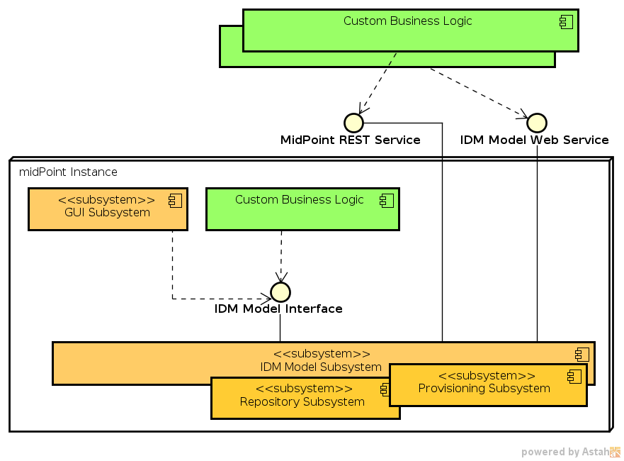

= Invoking MidPoint Services
:page-wiki-name: Invoking MidPoint Services HOWTO
:page-upkeep-status: red

// TODO: SOAP is out

// TODO: mention Java client and Python client

== Introduction

MidPoint is a complete identity provisioning system that can be used to build a comprehensive end-to-end provisioning solution.
But midPoint also exposes all its functionality using wiki:Interfaces[midPoint interfaces]. Therefore midPoint can also be used as a back-end provisioning engine, as embedded provisioning solution, as a non-interactive enterprise service (SOA component) and also in a variety of other scenarios.
The key to midPoint flexibility are the wiki:Interfaces[interfaces]. By invoking midPoint services that are exposed in the interfaces the entire midPoint becomes a programmable service.

MidPoint has several interfaces that can be used for different purposes.
There are broadly two categories of interfaces:

* *Local* interfaces (Java) can only be used from the Java Virtual Machine in which midPoint instance is running.
Which mostly means that the custom code needs to be either part of the midPoint product (compiled with midPoint) or it needs to be a runtime-script.
This is very efficient and also quite convenient way how to invoke midPoint services.

* *Remote* interfaces (Webservice, REST, ...) can be invoked over the network.
This gives good flexibility to the midPoint deployment and to the architecture of a complete solution.
However there are typical limitations that are inherent to all remote interfaces such as serialization, communication overhead, difficult to use callbacks, etc.
Therefore remote interfaces are less convenient to use.

Both local and remote interfaces expose roughly the same functionality and the invocation end up in the same midPoint code (in wiki:IDM+Model+Subsystem[IDM Model Subsystem]). Form this point of view these interfaces are roughly equivalent.
However the remote interfaces are typically adapted to the typical way how individual technology is used.
E.g. REST interface is designed in a very clean RESTful fashion (very web-like "resource-oriented" architecture).
Therefore the operations are segregated for each object individually.
The REST architecture does not provide a clean and easy way how to execute operations on several object at once.
Also the web service (SOAP) interface is designed in a procedural manner which is not perfect for midPoint object-orientation.
This may not be ideal for our purpose.
But we have decided that it is better to use standards and typical methods instead of reinventing the wheel.
Even though the Internet technology is not mature enough for our needs the midPoint remote interfaces are in fact *practical* and they work reasonably well.
It is easy to do basic operation in all the interfaces.
Advanced operations may be more tricky do to but they are still mostly practically possible to do.

All the versions of midPoint wiki:IDM+Model+Interface[IDM Model Interface] are object-oriented.
It means that they work with wiki:Basic+Data+Model[midPoint objects]. The interfaces are creating, reading (and searching), updating and deleting the objects.
This is known as link:http://en.wikipedia.org/wiki/CRUD[CRUD] semantics.
E.g. resource configuration is changed by modifying corresponding wiki:ResourceType[ResourceType] object, user is created by creating a new wiki:UserType[UserType] object and so on.
All the interfaces are also using the wiki:Relativity[relative change model] by using wiki:Deltas[deltas] to define change to individual midPoint objects.

Following table provides overview of interface operation groups and their availability in individual interfaces.

[%autowidth]
|===
| Operation group | Java API (2.x) | Web Service (3.x) | Web Service (1.x) | REST (3.0)

| *Reading object*
| getObject
| getObject
| getObject
| HTTP GET

| *Searching objects*
| searchObjects +
serachObjectsIterative +
countObjects
| searchObjects
| searchObjects
| HTTP POST +
(query in body)

| *Creating objects*
| executeChanges
| executeChanges
| addObject
| HTTP PUT +
HTTP POST

| *Modifying objects*
| executeChanges
| executeChanges
| modifyObject
| HTTP PATCH

| *Deleting objects*
| executeChanges
| executeChanges
| deleteObject
| HTTP DELETE

| *Other data management*
| findShadowOwner +
listResourceObjects
| findShadowOwner
| listAccountShadowOwner +
listResourceObjectShadows
| HTTP GET

| *Import and migration*
| importFromResource +
importObjectsFromFile +
importObjectsFromStream +
recompute
| importFromResource
| importFromResource
| HTTP POST

| *Diagnostics and maintenance*
| testResource +
discoverConnectors
| testResource
| testResource
| HTTP POST

| *Change notification*
| notifyEvent (ResourceEventListener)
| notifyChange
| notifyChange
| *TODO*

|===

== Java Interface

Main article: wiki:IDM+Model+Interface[IDM Model Interface]

wiki:IDM+Model+Interface[IDM Model Interface] is a local Java interface to most midPoint functionality.
It can be seen as the *primary* midpoint interface.
This interface can be used to create users, assign account and roles, modify accounts, redefine roles, configure resources and invoke almost any other midPoint feature.
The interface is using native Java classes and takes full advantage of this environment.
E.g. input-output (pass-by-reference) objects are used for tasks and results, callbacks are used and so on.
The objects and deltas are expected to be provided in the form of wiki:Prism+Objects[Prism Objects].

This interface is ideal for use from code that is local to the midPoint instance (runs in the same JVM), e.g. parts of midPoint such as GUI, plug-ins and hook implementations, custom compile-time add-ons and customization or scripts running midPoint mappings and expressions.

The unusual approach of this interface is to use a single method (`executeChanges`) for executing changes of all the types (additions, modifications, deletions).
This approach allows to group related changes together therefore they can be recomputed together and provide more meaningful results.
Java API with sophisticated delta-based data structures allows this form of approach.
This approach is very useful for sophisticated interface clients (such as midPoint GUI), e.g. there is ability to detect how individual deltas influence each other, detect policy conflicts before even a single delta was executed, provide fine-grained execution results for each individual delta and so on.

There are some information and examples how to use this interface:

* wiki:IDM+Model+Interface+Introduction[IDM Model Interface Introduction]

* *TODO*: example usage from scripts

== Web Service Interface

Main article: wiki:IDM+Model+Web+Service+Interface[IDM Model Web Service Interface]

wiki:IDM+Model+Web+Service+Interface[IDM Model Web Service Interface] is a SOAP-based web service interface to midPoint.
It provides operations that are very similar to Java-based wiki:IDM+Model+Interface[IDM Model Interface], however there are some necessary adjustments.
The wiki:IDM+Model+Web+Service+Interface[IDM Model Web Service Interface] is strongly RPC-based as this approach is dictated by the technology (SOAP, WSDL).
Also input-output objects (pass-by-reference) cannot be used and the use of callbacks is beyond practical usability therefore the interface is slightly simplified to overcome these limitations.
The objects and deltas are expected to be presented as XML objects.
Full WSDL and XSD definitions are available.
The interface was developed in a contract-first fashion therefore the WSDL and XSD are authoritative definitions.

There is also a wiki:Model+Web+Service+Client[Model Web Service Client] library based on Java and pure JAX-WS and JAX-B. It is designed to be used outside midPoint, e.g. in applications that need to invoke midPoint services.

There are few examples of the interface use:

* wiki:IDM+Model+Web+Service+Interface+Examples[IDM Model Web Service Interface Examples] describe some SOAP requests and responses

* wiki:Model+Web+Service+Client+Sample[Model Web Service Client Sample] describes a sample code which is part of midPoint source code.
This sample code is using model client library to invoke midPoint web service.

Note: wiki:IDM+Model+Web+Service+Interface[IDM Model Web Service Interface] is still "version 1" interface.
While the other interfaces were updated to midPoint version 2 releases this interface remains in roughly the state as it was in midPoint version 1 releases.
One of the reasons is compatibility.
Basic midPoint architecture haven't changed much from version 1 to version 2 and therefore we have decided it is not worth to update this interface and that it is better to keep it in the same "XML" spirit of midPoint version 1 (this is SOAP which means it is heavily based on XML anyway).
There was also very little user demand to update it.
Currently we have no plans to expand this interface in any significant manner.
However we will still maintain it and it will remain in this form as part of midPoint for any foreseeable future.
We do not rule out even the extension and update of this interface in case there is a user demand.

== REST Interface

Main article: wiki:REST+API[REST API]

MidPoint wiki:REST+API[REST] interface is a RESTful HTTP-based interface.
It is designed in accord with so-called RESTful service architecture.
Each midPoint object is presented as a web resource identified by URL.
The objects are fetched using HTTP GET operation by using a proper URL.
The objects are modified by using HTTP POST, PUT and PATCH operation on the same (or similar) URL.
The objects are presented in XML and (in later versions) JSON.
Formal interface definition is not available as there is no practical way to do this (RESTful interfaces are said to be self-describing).
However informal documentation is (will be) available and there is also a wiki:Data+Model[schema] that describes the structure of individual objects.

REST interface is *WORK IN PROGRESS*. It will be released in midPoint version 3.0.

== See Also

* wiki:Interfaces[Interfaces]

* wiki:Architecture+and+Design[Architecture and Design]

* wiki:IDM+Model+Interface[IDM Model Interface]

* wiki:IDM+Model+Web+Service+Interface[IDM Model Web Service Interface]

* wiki:REST+API[REST API]

