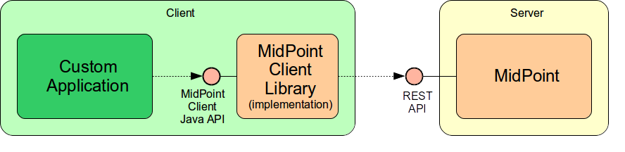

= MidPoint Client Library (Java)
:page-wiki-name: MidPoint Client Library
:page-wiki-id: 24675324
:page-wiki-metadata-create-user: semancik
:page-wiki-metadata-create-date: 2017-09-13T10:41:55.941+02:00
:page-wiki-metadata-modify-user: semancik
:page-wiki-metadata-modify-date: 2020-04-20T12:43:12.719+02:00
:page-alias: { "parent" : "/midpoint/devel/" }
:page-upkeep-status: yellow
:page-toc: top

This page describers midPoint Java client library.
The client library is designed to access midPoint functionality in a location-independent manner.
E.g. this library can be used to access midPoint functionality from a third-party application, command-line tool, simple web form and so on.

The client library is modeled in a way that reflects the structure of midPoint xref:/midpoint/reference/interfaces/rest/[REST API]. But the idea is that this library is location-independent and transport-independent.
Therefore it can be theoretically implemented as a REST client, SOAP client or even as a thin wrapper library using local Java calls.

[NOTE]
.Partially implemented
====
This feature is partially implemented. But there are some parts that are not completed. We are perfectly capable to implement, fix and finish the feature, just the funding for the work is needed. Please consider the possibility for xref:/support/subscription-sponsoring/[supporting] development of this feature by means of midPoint Platform subscription. If you already are midPoint Platform subscriber and this feature is within the goals of your deployment you may be able to use your subscription to endorse implementation of this feature.
====

== Design

The Java REST client library is composed from the library interface and implementation.
The applications should only access the library interface, allowing several implementations on the client library.
This may be very useful during evolution of the client library for several reasons.
Firstly the underlying technology will evolve.
Initial implementation is a simple one based on JAXB.
But later on when xref:/midpoint/devel/prism/[prism] is fully separated from midPoint we will switch the implementation to prism-based one.
Secondly, there may be several implementations of the API at the same time.
E.g. an implementation that will access the REST service using HTTP and an implementation that will go directly to the Java local xref:/midpoint/reference/interfaces/model-java/[IDM Model Interface]. Therefore the same application code can be deployed remotely and also co-located with midPoint in the same web application.

Structure and overall approach of the client library quite closely follows the structure of web resources in midPoint xref:/midpoint/reference/interfaces/rest/[REST API].

== Client Library Usage Examples

The client library is designed as a _fluent API_. This is a very elegant and readable way how to structure Java APIs.
It also overcomes some problems of Java language (e.g. lack of named method parameters).

Basic object of the entire API is _Service_. This object is configured with network and authentication parameters.
After that it can be used to access complete midPoint API functionality.
In the example below we will denote the variable that holds instance of the Service as `rest`.

=== Read Operations (GET)

Getting, listing and searching users:

[source,java]
----
List<UserType> users = rest.users().get();                            // list all users
UserType user = rest.users().oid("123").get();                        // get a specific user
List<UserType> users = rest.users().search().query().item("fullName").eq("Foo Bar").get();   // search users
----

=== Object-related Operations (POST)

Invoking operations on users, tasks, resources, etc.

[source,java]
----
rest.tasks().oid("123").suspend().post();                             // suspending a task
rest.resources().oid("123").test().post();                            // Test resource
rest.resources().oid("123")._import().objectClass("person").post();    // Import accounts from resource
rest.users().oid("123").validate().params().password(...).post();     // Validate user password
----

=== Object Modifications

Object changes

[source,java]
----
rest.users().add(user).post();                                                       // Add new user
rest.users().oid("123").modification().item("fullName").replace("Foo Bar").post();   // Replace user's fullName with value "Foo Bar"
rest.users().oid("123").delete();                                                    // Delete user
----

=== RPC Operations

Invoking RPC operations:

[source,java]
----
rest.rpc().compare(....).post();                                      // comparing objects
rest.rpc().notifyChange(....).post();                                 // comparing objects
----

Note: There are RPC operations, therefore the post() should not be required.
Theoretically.
But we think that the post() still has several benefits.
First of all it keeps the interface consistent.
Remote operation is always executed on post(), so this can be used for consistent error handling (see below).
Also, the presence of post() method allow to use builders for RPC operation arguments.

=== Error Handling

The interface is designed in such a way that only the "verb" operations (get, post, delete) may fail in a significant way.
The "significant way" means that only those methods execute server-side operations.
Until one of the "verb" methods is invoked there's almost no potential for failures.
The failures from the non-verb methods may indicate wrong argument types, null values, schema errors and so on.
But only the "verb" methods will indicate network errors and "business" errors such as "object not found" or "object already exists".

==== Exceptions and Operation Results

All the "verb" methods (get, post, delete) should return a "clean" return value if the invocation was successful (e.g. UserType, List<UserType>, etc.) If the invocation fails then an exception is thrown.
The exception should contain xref:/midpoint/architecture/concepts/operation-result/[OperationResult] structure inside them.

TODO: explain fetchResult for lists

TODO: what about validate?

==== Unification of Error Handling

The object-based operations should end with invocation of a method based on the HTTP verbs such as .get(), .post(), .delete(). This is the invocation that does the actual work.
All the invocations before that (users(), oid(...), etc.) are just setting up the "context" for the invocation.
But it is the get() or post() at the end that does the work.
Therefore it should be possible to "prepare" the invocation and then pass that to a common code that handles all the network errors (e.g. retries, error logging, etc):

[source,java]
----
{
  ...
  operation = rest.users().oid("123");
  invokeGet(operation);
  ...
}

T invokeGet(operation) {
   try {
       return operation.get();
   } catch (Exception e) {
       // log and process exceptions here
   }
}
----

=== Object References

TODO: redirects (e.g. add user)

[source,java]
----
ObjectReference<UserType> newUserRef = rest.users().add(user).post();
String newUserOid = newUserRef.getOid();
UserType newUser = newUserRef.get();  // This may invoke remote GET operation
----

TODO: redirects (e.g. add user)

=== Asynchronous Operations and Redirects

There are synchronous and asynchronous operations in the library interface:

[%autowidth,cols="h,1,1"]
|===
|  | Operations | Return Values

| Synchronous
| get(), post(), delete()
| original return value (e.g. UserType, String, ...)

| Asynchronous
| apost(), adelete()
| Future (TaskFuture)

|===

TODO

[source,java]
----
TaskFuture<Void> future = rest.users().oid("123").modification().item("assignment").add(roleOneAssignment).apost();
if (!future.isDone()) {
    ObjectReference<TaskType> taskRef = future.getTaskRef()
    ...
}
----

TODO: synchronous operations will fail (exception) if server indicates asnychronous return value

=== Service Construction and Setup

TODO

[source,java]
----
rest.proxy(username,ip).users()....
rest.proxy().username(username).ip(ip).....
----

=== Misc

TODO: serializability

TODO: thread safety

== Implementation

=== Source Code

Source code is on github: link:https://github.com/Evolveum/midpoint-client-java[https://github.com/Evolveum/midpoint-client-java]

=== Evolution and compatibility

The client library is maintained together with midPoint.
The API should remain compatible through the entire lifecycle of the API (until next major version, e.g. 4.0).
The compatibility means "compile-time" compatibility, not necessarily binary compatibility.
This means that the code written for early library versions should be compiled without changes with later library versions and then it should work.
But we do not guarantee that early compiled code will work with new library JARs.

However, there may be minor compatibility issues as the library evolves (until the phase 3 is reached, see below).

=== Phase 1

We will start with a simple implementation based on JAXB.
This will be probably limited to XML.
It may be slightly inconvenient when it comes to schema extensions, deltas and similar special data structures.
But there are utility methods to handle this.

Even though this will be fixed to XML, it should not make much difference for the application.
The application should not see any XML when dealing with the library (perhaps except for a little glimpse when dealing with schema extensions).

[TIP]
====
Implementation of phase 1 is done.
The client was released shortly after midPoint 4.1 release.
====

=== Phase 2

When xref:/midpoint/devel/prism/[prism library] gets separated from midPoint we can switch this REST client library implementation to use Prism instead of JAXB.
This will provide much better handling of schema definitions, object extensions, support for JSON/YAML and so on.

[NOTE]
.Planned feature
====
Implementation of phase 2 and 3 is roughly planned for the future.

However, there is currently no specific plan when it will be implemented because there is no funding for this development yet.
In case that you are interested in xref:/support/subscription-sponsoring/[supporting] development of this feature, please consider activating link:https://evolveum.com/services/professional-support/[midPoint Platform subscription].
====

=== Phase 3

Stabilization, final release, full compatibility.

== See Also

* xref:/midpoint/reference/interfaces/rest/[REST API]