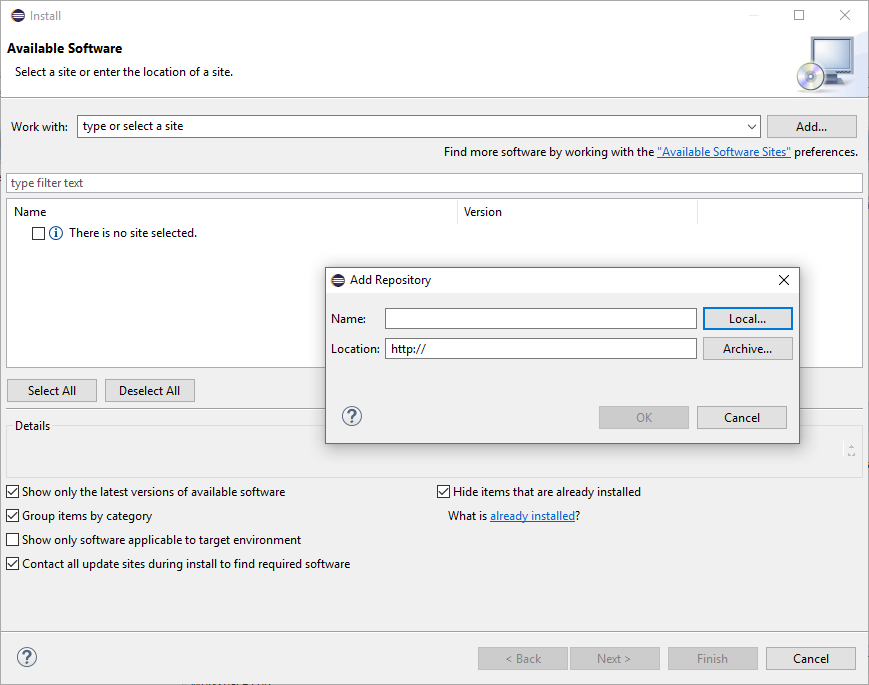
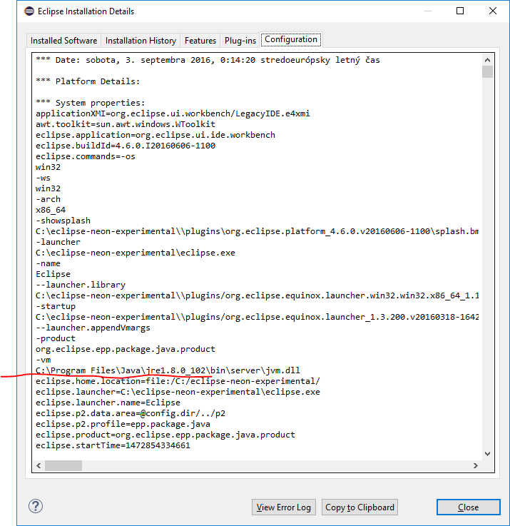

= Solving Eclipse Certificate Problems
:page-wiki-name: Solving Certificate Problems
:page-obsolete: true
:page-replaced-by: /midpoint/tools/studio/

The problem with connecting to link:https://download.evolveum.com/downloads/midpoint-eclipse-plugin/[https://download.evolveum.com/downloads/midpoint-eclipse-plugin/] from Eclipse was that the certificate for the particular CA used by Evolveum (StartCom, Ltd.) was not included in _cacerts_ file used by JRE used by Eclipse.

Perhaps the easiest way how to solve this problem is going around it.
You can simply download the eclipse repository using web browser (choose most current ZIP file from link:https://download.evolveum.com/downloads/midpoint-eclipse-plugin/[here]) and use it as "Archive..." in the dialog here:

(The dialog is opened by clicking on "Add..." in the upper right corner.)

The other, more complicated but also more correct way is to add the missing CA certificate into cacerts file.

Steps:

. Download CA certificate from this page: link:https://www.startssl.com/root[https://www.startssl.com/root] (Use the first one - Root 1, downloading the DER version.)

. Check out what JRE is used by your Eclipse installation (Help -> Installation details -> Configuration) +
+

. Go to the directory of _<java home>/lib/security_ (c:\program files\java\jre1.8.0\_102\lib\security in this case) and enter the following command:

[source]
----
<path-to-JDK>\bin\keytool -keystore cacerts -importcert -alias startcom -file ca.crt
----

E.g.:

[source]
----
c:\java\jdk1.8.0_102\bin\keytool -keystore cacerts -importcert -alias startcom -file ca.crt
----

The cacerts file password is "changeit".

After restarting Eclipse everything should work.

