= Eclipse plugin HOWTO
:page-wiki-name: Eclipse plugin HOWTO
:page-wiki-id: 23167305
:page-wiki-metadata-create-user: mederly
:page-wiki-metadata-create-date: 2016-09-02T17:16:10.507+02:00
:page-wiki-metadata-modify-user: semancik
:page-wiki-metadata-modify-date: 2020-09-25T14:28:25.404+02:00
:page-toc: top
:page-obsolete: true
:page-replaced-by: /midpoint/tools/studio/

[WARNING]
.ABANDONED
====
MidPoint plugin for Eclipse for *abandoned*  in favor of xref:/midpoint/tools/studio/[MidPoint Studio], which is based on open source link:https://www.jetbrains.com/opensource/idea/[IntelliJ platform].

Although the Eclipse plugin was an efficient tool used broadly by the community, maintaining the plugin in Eclipse environment proved to be a challenge.
Most of the midPoint developers migrated to link:https://www.jetbrains.com/opensource/idea/[IntelliJ platform], and the popularity of the platform was also indicated by our xref:/community/surveys/midpoint-2019-survey/[survey]. Therefore we have decided to abandon the old and de facto derelict Eclipse plugin.
There no plans to maintain the Eclipse plugin any further.
You can go ahead and use it if it works for you, but there will be no further improvements, bug fixes or even security fixes.

====

Experience with more complex deployments shows that there is a need of a tool that would facilitate development of a midPoint-based solution.
Here is a first prototype of such a tool: the _midPoint Eclipse plugin_.

== Installation

Installation is done directly into Eclipse using the following update site: *link:https://download.evolveum.com/downloads/midpoint-eclipse-plugin/[https://download.evolveum.com/downloads/midpoint-eclipse-plugin/]*. For more information, please see the xref:/midpoint/reference/legacy/eclipse-plugin/install/install/[installation HOWTO].

You can also have a look at simple release notes.

== Configuration

First of all, make sure your midPoint is up and running.
The required version is 3.4.1; but full functionality requires a more current version:

[%autowidth]
|===
| Version | Contains functionality

| midPoint *3.4.1*
| All except the one mentioned below.

| midPoint *v3.5devel-322-g7dc89ef* (September 19th, 2016)
| "Dry run" (i.e. invoking preview changes instead of real execution) for selected bulk actions. +
Resource validation accessible from the plugin. +
Server version reporting (earlier versions are reported as "null" or "unknown").

| midPoint *v3.5devel-323-g11d9fd5* (September 20th, 2016)
| Fixes bug that prevents modifying more than one object via bulk action (!) +
This fix is also present in support-3.4 branch.

|===

As for the plugin, please use at least version 0.10.0 (preferably the latest one that contains some link:https://github.com/Evolveum/midpoint-ide-plugins/commits/master[bugfixes and improvements]). Versions before 0.10.0 are not compatible with midPoint 3.4.1 or later.

=== Configuring connections

The first thing that has to be done is to configure connection to midPoint server or servers.
So, open *midPoint -> Preferences* and fill-in connection information.
You could then test the connection.

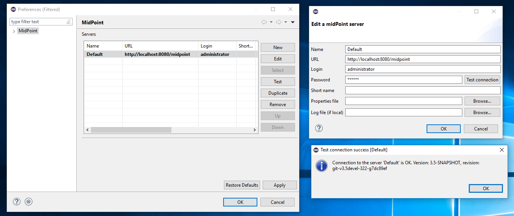

(Note that for midPoint 3.4.1, the server version is reported as "unknown".)

You can create more servers if you need to.
For example servers for development, QA, or production.

For each server you can fill-in the following information:

[%autowidth]
|===
| Parameter | Meaning | Example

| Name
| Name that is used to identify a server for example in logging messages.
If left empty, server's URL is used as an identifier.
| Development, Testing, Production, ...

| URL
| URL that is used to connect to the server.
It is obligatory.
| http://localhost:8080/midpoint

| Login
| User name that will be used to connect to the server.
It should have administrative rights.
| administrator

| Password
| Password used to connect to the server.
| 5ecr3t

| Short name
| Symbol that will be used when generating files specific to the server (e.g. action outputs or log fragments).
Can be omitted.
By default, it is not used.
| dev, test, prod

| Properties file
| Values for "macros" in the form of $(name) that will get automatically resolved when objects are uploaded to this server.
See below.
| /eclipse/workspace/Project123/servers/development.properties

| Log file
| Server log file.
This is used to show log file content (or fragments of it) in the plugin.
| /usr/share/tomcat7/logs/idm.log

|===

The configuration is saved in your workspace directory as ".metadata/.plugins/org.eclipse.core.runtime/.settings/com.evolveum.midpoint.eclipse.ui.prefs" file.

Before continuing, create at least one Eclipse project.
It should not be a Java project.
Best choice is a general project.

So,

. Switch perspective to *Resource*.

. Create a new project of type *General -> Project*. You can name it e.g. "Test".

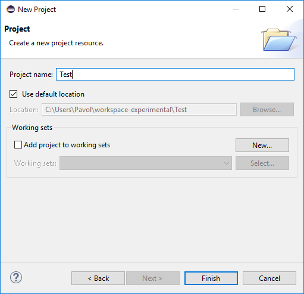

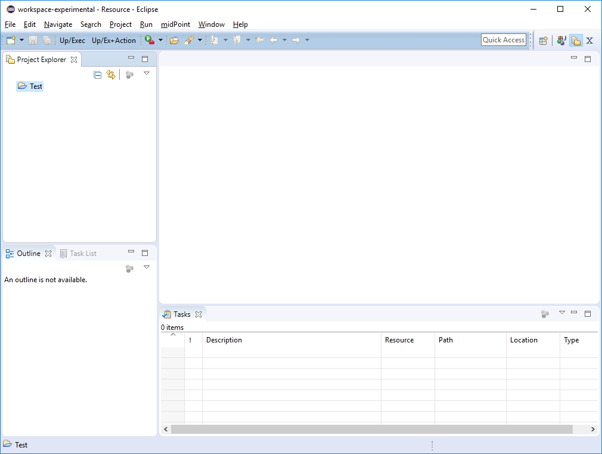

== First steps

This Eclipse plugin can be used in many ways, in various contexts.
For example:

. Your primary means of managing your servers can be traditional web GUI.
However, for some situation you might want to connect to a server, browse its objects, and execute a few changes using the plugin.

. Or, you can develop and maintain your configuration within the plugin, uploading changes to the server(s) as necessary.

. Yet another people can use the plugin to experiment with midPoint features, to hunt for midPoint bugs, to simulate various situations (e.g. to provide consultations to others).

Let us visit features of the plugin that could be helpful in these scenarios.

=== Browsing server objects

As first real step, let's have a look at the server objects.
So, select *midPoint -> Browse server objects*, or simply press *Alt+F1*. The following window will open:

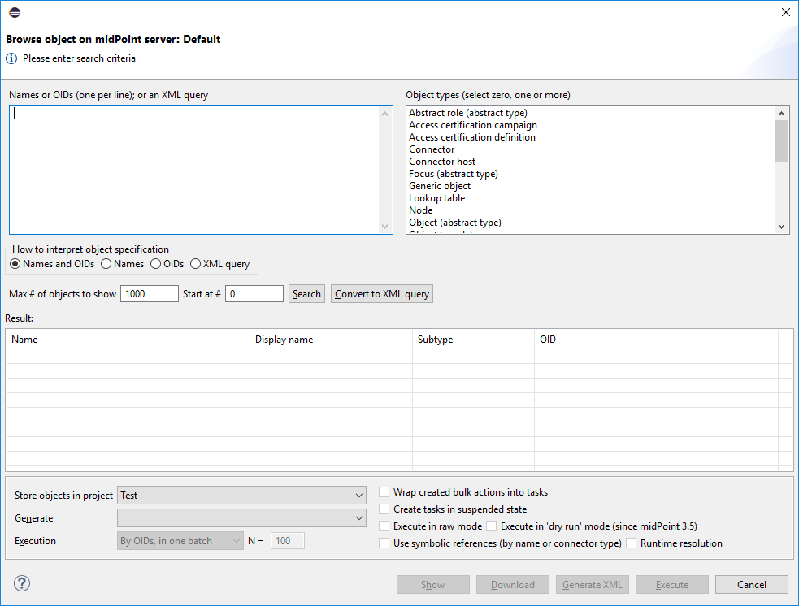

In the upper part of the window you can formulate a query.
The easiest way is to use empty query (i.e. not touch anything) and just hit *Search* (or *Alt+S*). You'll see all objects on the server:

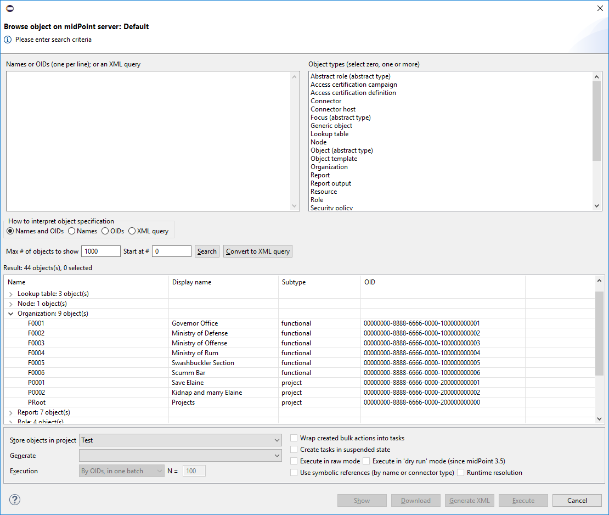

You can restrict the query by:

. providing names of objects, OIDs or both (names are interpreted as parts of normalized object names),

. choosing one or more object types in the list on the right side,

. even switching to XML - either by writing XML query by hand or clicking "Convert to XML query" - and fine-tuning the query by hand.

Like this:

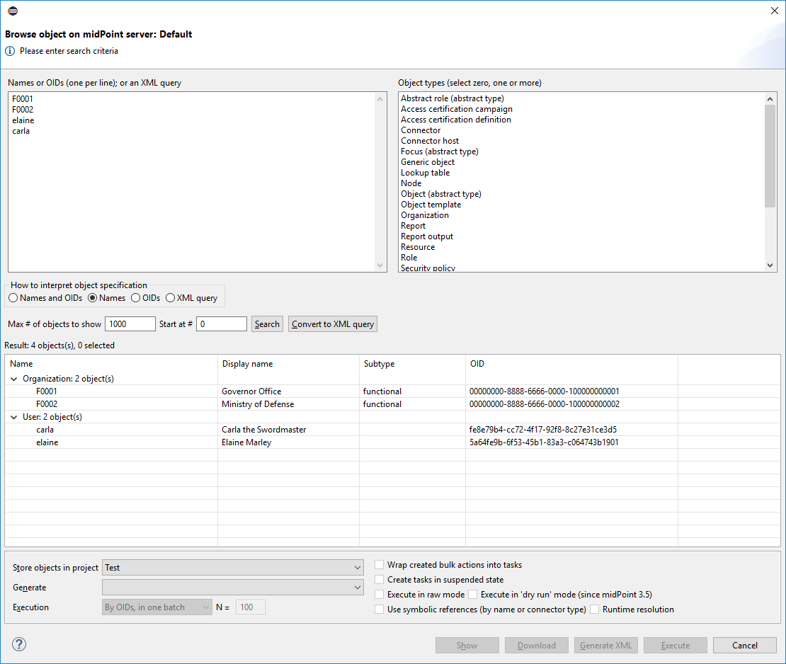

Note that because of quite bizarre midPoint bug bug:MID-3390[] it is not possible to select an abstract type (like Object or Focus) along with any type that precedes it in the list.
You can work around by selecting concrete types (or limiting use of abstract types to one).

==== Showing the objects

After executing a query, you can view the object or objects by using *Show* button, pressing *Alt+H* or simply double-clicking on an object.
The object(s) will be downloaded to newly created file (like scratch/gen/00000.xml) and opened in XML editor.

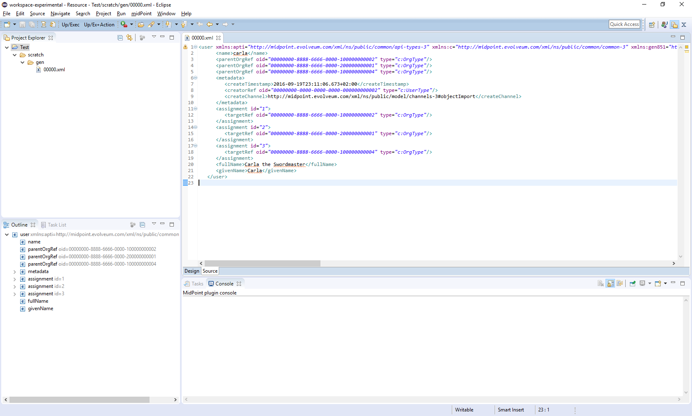

Other options (Download, Generate and Execute) will be covered later.

=== Downloading objects

Now imagine you want to systematically work with objects in your Eclipse workspace: you would like to edit them and upload to server as necessary.

There are more ways how to do this:

. Start from scratch, i.e. create all your objects manually in Eclipse.

. If you had previously managed your objects primarily in your local filesystem (perhaps under supervision of a version control system), import/copy them into the Eclipse project; or simply check them out from git/subversion/whatever you use.

. If you had previously managed your objects in midPoint, you can *download* them here.

Downloading can be done in two ways:

. Interactively: In server object browser, you will select object or objects and then click *Download*.

. In bulk: You invoke the function *midPoint -> Bulk download of predefined objects*.

The result is basically the same.
In the first option you can select exactly which objects to download.
In the second one, a configuration specified in plugin preferences is used instead:

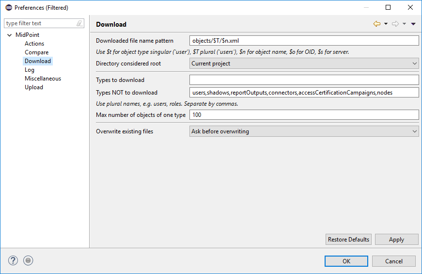

You see that all objects except for users, shadows, report outputs, connectors, certification campaigns and nodes are downloaded.

By default, objects are stored in tree structure, like this:

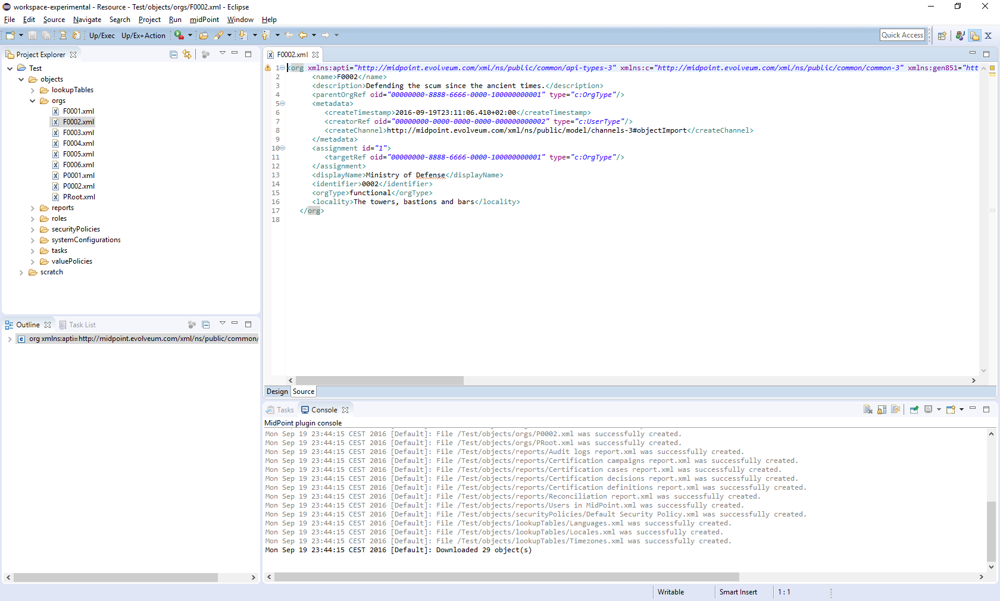

The structure is determined by "Downloaded file name pattern" option (_objects/$T/$n.xml_ by default).
It is advised to start with this setting.

=== Modifying and creating objects

You can then edit these objects or add new ones.

For example, you can create a user or a query.
You can do it at any place in your workspace.
It is recommended to place objects in the appropriate part of *objects* tree (even if they are not downloaded), and to keep actions and queries in separate folders under the project root.

There are a couple of ways to facilitate this task.

. Use samples provided with midPoint, as usual.

. Use existing objects on the server (downloaded or displayed using Show button) as inspiration.

. Use "Generate XML" button on the browser to generate bulk actions, tasks, assignments, references, or their parts.

. Use XML templates provided with the plugin.

Concerning the fourth option: you can use Ctrl+Space to select a template, like this:

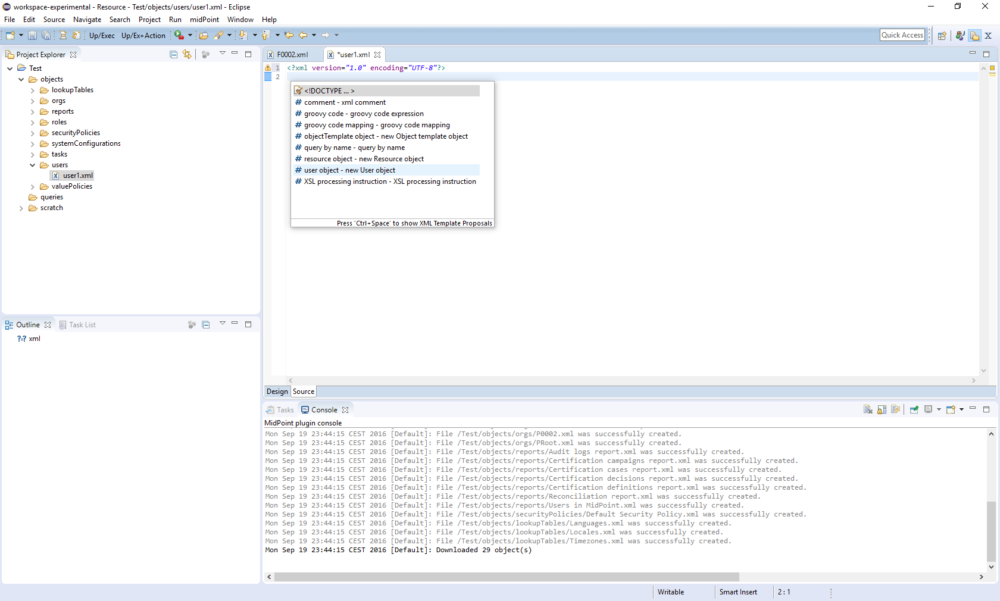

After clicking on "user object" you'll see the following:

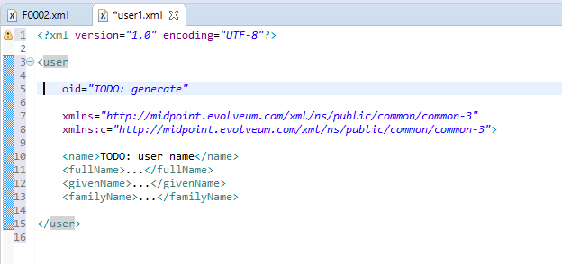

Now you can simply fill-in missing data, and enter additional user properties.
OID can be generated by invoking *midPoint -> Miscellaneous -> Generate random OID*. After that, it is shown in plugin console as well as placed into clipboard.
You can then simply paste it at appropriate place.

Currently there is only a few templates, but more will appear in future.

After creating an object you can upload it by selecting *midPoint -> Upload/execute* or pressing *Alt+F2*. This can be done for one XML file (containing one or more objects) or even for selection of more files and/or directories.

Objects are uploaded and bulk actions are executed.

=== Executing actions

Action execution deserves a few more words.
To try it, please create the following file (_queries/query.xml_):

.query.xml
[source,xml]
----
<?xml version="1.0"?>
<search>
    <type>UserType</type>
    <searchFilter>
        <substring>
            <matching>polyStringNorm</matching>
            <path>name</path>
            <value>user1</value>
            <anchorStart>true</anchorStart>
        </substring>
    </searchFilter>
    <action>
        <type>log</type>
    </action>
</search>
----

Before invoking the action, please make sure the midPoint server log file is set up:

 +

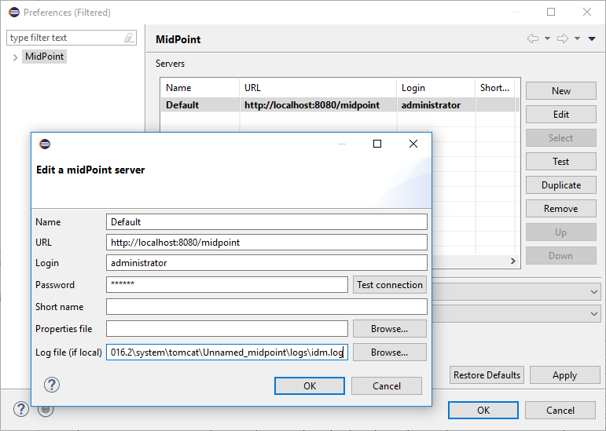

(Note that although midPoint can provide log file content via REST interface, the plugin can currently work only with the log that is stored as a file.)

After setting up the log file position, execute query.xml by selecting it and clicking on *Upload/execute* button (or by selecting *midPoint -> Upload/execute* from main menu or *Transfer-related actions -> Upload/execute* from the popup menu or by pressing *Alt+F2*).

After execution you should see the following:

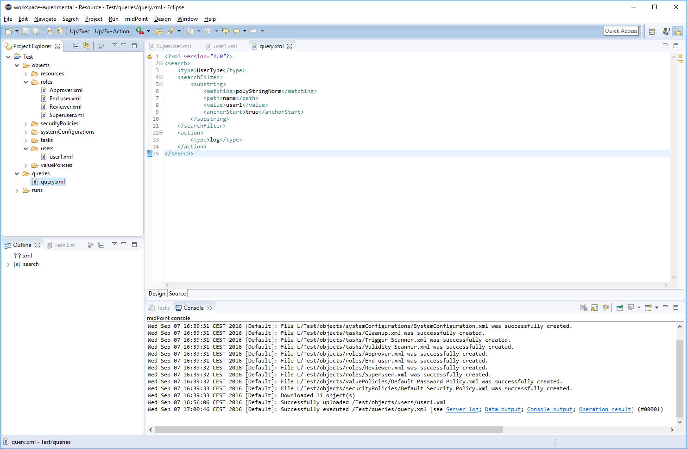

Outputs of the execution, namely:

. bulk action console output,

. bulk action data output,

. operation result,

. extract from the server log (idm.log) file,

are stored in your eclipse workspace (by default, in _scratch/runs_ subdirectory), and can be opened there, or by clicking on respective hyperlinks down in the midPoint console.
For example, the data output looks like this:

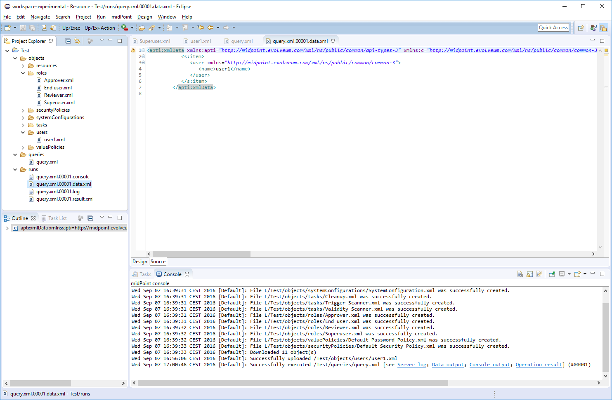

By setting appropriate preferences you can configure automatic opening of selected windows after execution of actions, and also automatic execution of selected actions after upload.
This is meant e.g. to facilitate mappings testing and bugfixing - to minimize number of clicks you have to do:

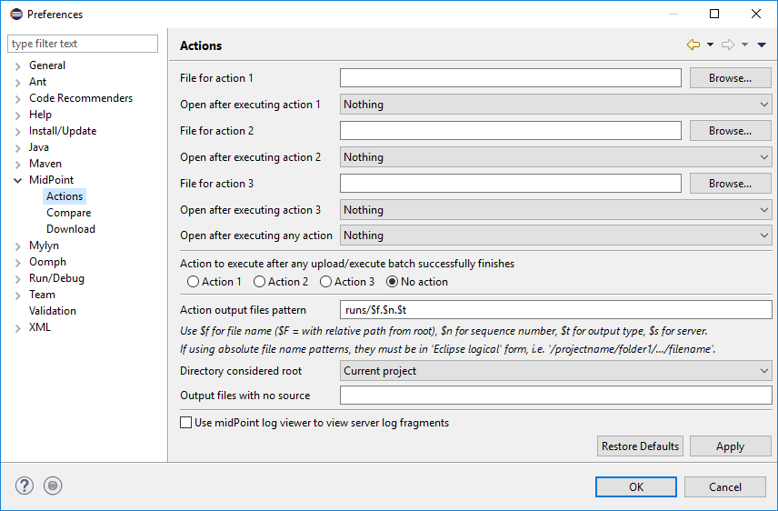

=== Comparing files

It is possible to compare local (Eclipse) and remote (midPoint) versions of one or more files by selecting them and choosing *Compute differences* command.
It looks like this:

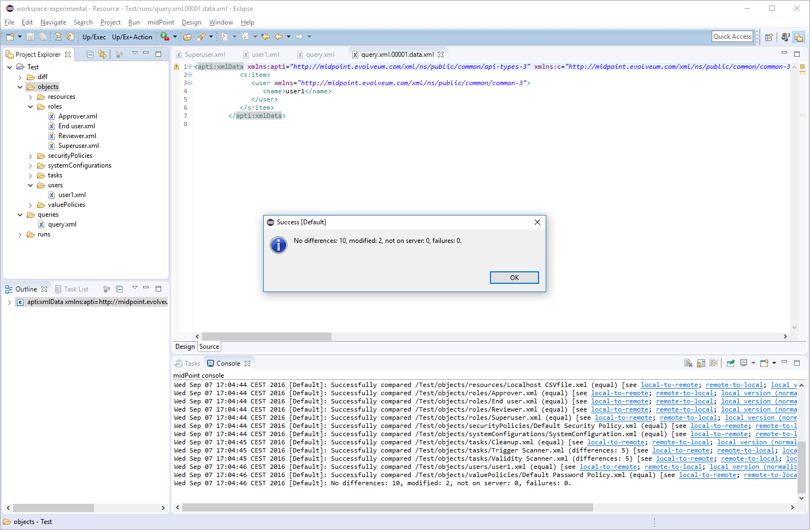

(We selected "objects" directory and invoked Compute differences.)

For each file, four results are provided:

. local version of the file, normalized into midPoint representation: macros resolved, parsed and reserialized by midPoint (`*.local.xml`),

. remote version of the file (`*.remote.xml`),

. delta from local to remote version (`*.local-to-remote.xml`),

. delta from remote to local version (`*.remote-to-local.xml`).

These files can be accessed by clicking on links in the console window, of by directly opening the files in "diff" directory.
Note that it is possible to use Eclipse mechanisms to compare local and remote versions of the file, leading to graphical information about the changes:

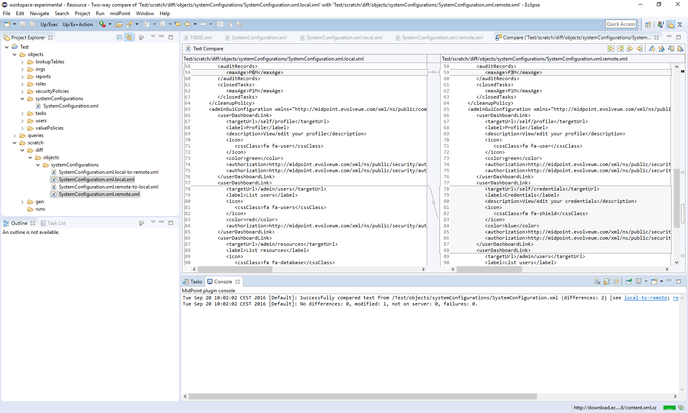

It is possible to configure items that should be excluded from comparison.
By default, all operational items are excluded, but you can specify any others.

=== Server-specific properties

This plugin provides a simple mechanism of "macro expansion" allowing to provide system-specific values for individual objects.
For example, you can have something like this:

[source,xml]
----
<resource>
   ...
   <connectorConfiguration>
      <icfc:configurationProperties xmlns:icfcldap="http://midpoint.evolveum.com/xml/ns/public/connector/icf-1/bundle/com.evolveum.polygon.connector-ldap/com.evolveum.polygon.connector.ldap.LdapConnector">
         <icfcldap:port>$(ldapPort)</icfcldap:port>
         <icfcldap:host>$(ldapHost)</icfcldap:host>
         <icfcldap:baseContext>$(ldapBaseContext)</icfcldap:baseContext>
         <icfcldap:bindDn>$(ldapAdmin)</icfcldap:bindDn>
         <icfcldap:bindPassword>
            <t:clearValue>$(ldapPassword)</t:clearValue>
         </icfcldap:bindPassword>
         <icfcldap:pagingStrategy>auto</icfcldap:pagingStrategy>
         <icfcldap:vlvSortAttribute>entryUUID</icfcldap:vlvSortAttribute>
         <icfcldap:operationalAttributes>ds-pwp-account-disabled</icfcldap:operationalAttributes>
         <icfcldap:operationalAttributes>isMemberOf</icfcldap:operationalAttributes>
      </icfc:configurationProperties>
  ...
</resource>
----

And the values for LDAP host, port, base context, and so on can be specified independently for each managed server.
They are stored in property files that are configured for the servers:

[source]
----
ldapPort=1389
ldapHost=localhost
ldapAdmin=uid=idm,ou=Administrators,dc=example,dc=com
ldapPassword=secret
ldapBaseContext=dc=example,dc=com
----

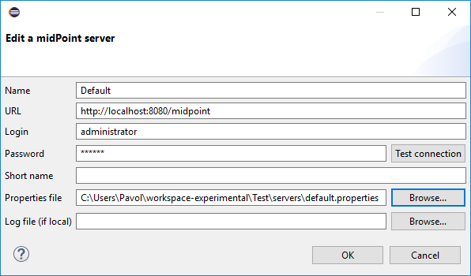

After uploading the object, you can see that macros got resolved:

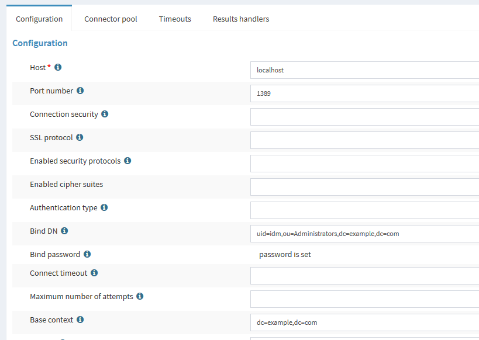

Besides $(property-name) you can use the following:

[%autowidth]
|===
| Symbol | Meaning | Example

| $(@filename)
| Take file with 'filename' (relative to the position of file when the symbol was used) and use the file content to replace the $(...) symbol.
| $(@notifications.txt) in system configuration objects.

| $(#project.name)
| Name of the current project.
|

| $(#project.dir)
| OS directory of the current project.
| Useful e.g. when configuring CSV resource pointing to a file that is contained directly within Eclipse project.

| $(#server.displayName)
| Name of the currently selected server (to which the file is being uploaded).
|

|===

Current restriction is that the text between parentheses - i.e. (...) - cannot contain whitespaces.

== Other functions and tips

. *Reload objects from server*: Takes object(s) and replaces them with the current state from the server.
Beware, this destroys all your local information, like comments or formatting of XML files.

. *Set as action 1, 2, 3*: Sets given object to be executed as action 1, 2 or 3 - from menu, by pressing Alt+1, 2, 3, or automatically after uploading object(s), if configured to do so.

. *Auto-opening of execution results*: It is possible to tell the plugin to automatically open e.g. server log fragment after execution of an action.
This facilitates quick debugging of e.g. bulk actions or mappings.

. *Server-side actions*:  +

.. When editing e.g. a resource, you can quickly upload, test, and validate it.
By validation we mean checking the file content for suspicious or errorneous items, and show them like in Resource wizard in midPoint web gui.
Unfortunately, all issues are currently shown at line #1 of particular XML file.
This will be fixed in the future.

.. Another possible action is to delete object(s) from the server and/or locally.

. *Server log management*: It is possible to show server log in Console view or in editor pane.
By opening it in console it allows for continuous updating of the view.
By opening in editor pane it is possible to employ plugin customized xref:/midpoint/reference/diag/logging/log-viewer/[log viewer].
You can also dynamically change logging levels for model, provisioning, repository and web modules.

. XML Catalog content assist - see below

=== XML Catalog content assist

It is quite useful to tell Eclipse about the midPoint schemas, so it can check the validity of XML files and it can provide hints (content assist) when editing them.
Although not 100% error-free, it is a big help.

It is done by these steps:

. Go to *Window -> Preferences -> XML -> XML Catalog*.

. Click on "User Specified Entries" in XML Catalog window

. Click on "Add..." -> "Catalog Entry" -> "File System..."

. Select XSD definitions from midPoint schemas directory; Use files from midPoint distribution (dist) directory

. Restart Eclipse

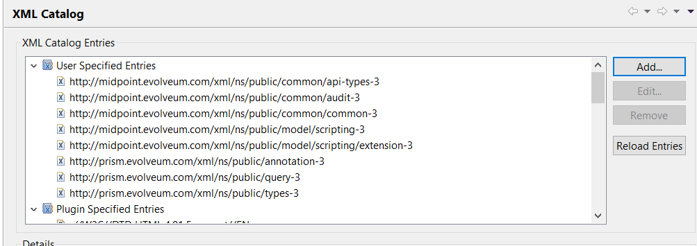

In order to Eclipse to provide content help you need to specify namespaces explicitly in the edited file.
When typing just use usual ctrl+space or wait for popup to appear after stating the prefix (_e.g. <q:_)

Creating new GUI bulk action script sample:

[source,xml]
----
<search xmlns="http://midpoint.evolveum.com/xml/ns/public/model/scripting-3"
	xmlns:c="http://midpoint.evolveum.com/xml/ns/public/common/common-3"
	xmlns:q="http://prism.evolveum.com/xml/ns/public/query-3">
	<type>c:UserType</type>
	<searchFilter>
		<q:equal>
			<q:path>c:fullName</q:path>
		</q:equal>
	</searchFilter>
	<action>
		<type>recompute</type>
	</action>
</search>
----

== Conclusion

As said, this plugin is in early stages of its development.
Some of the known limitations are:

. Log files from remote servers are not available.

. Computing differences is quite rough.
Custom list of ignored items is not working; and the management of resulting files (deltas, etc.) should be made more user friendly.

. The plugin is not much tested.
But this will hopefully change soon.

We would like to hear any experiences and suggestions regarding this plugin.