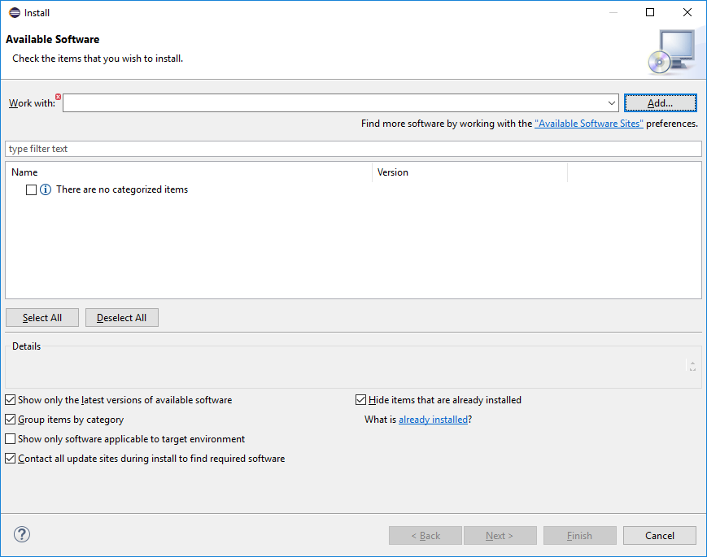
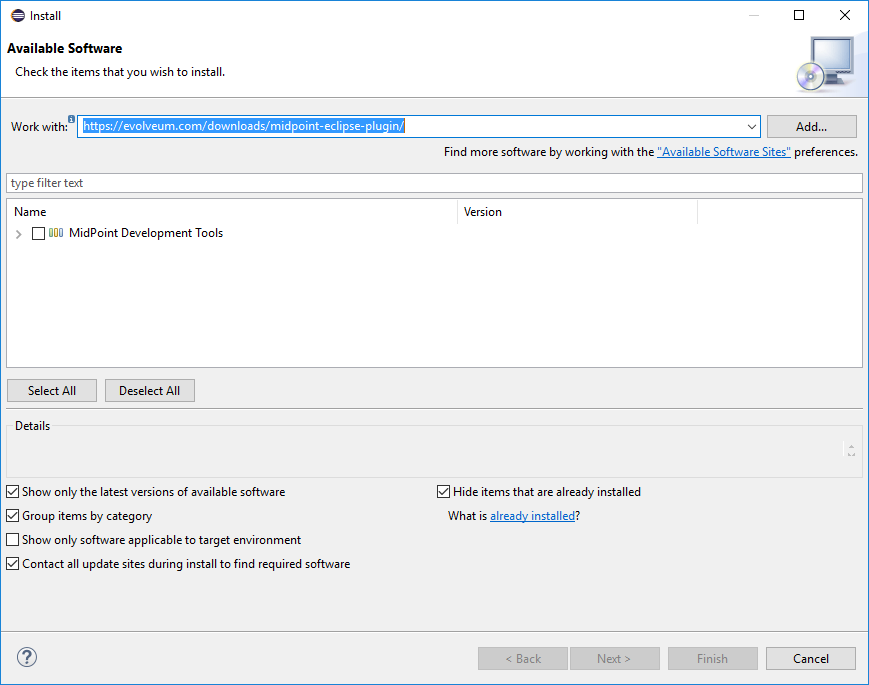
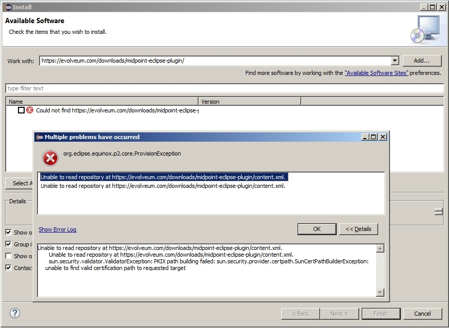
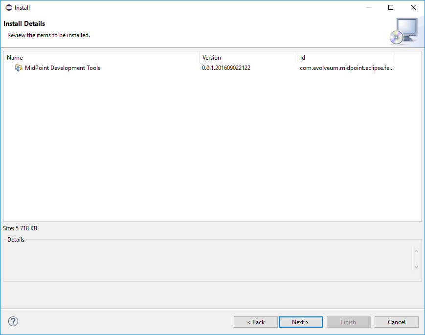
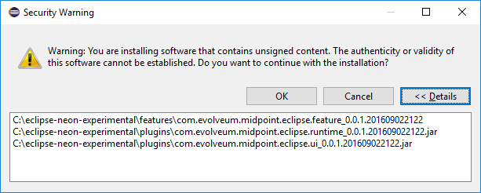
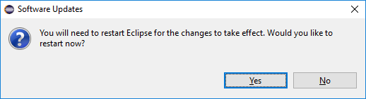
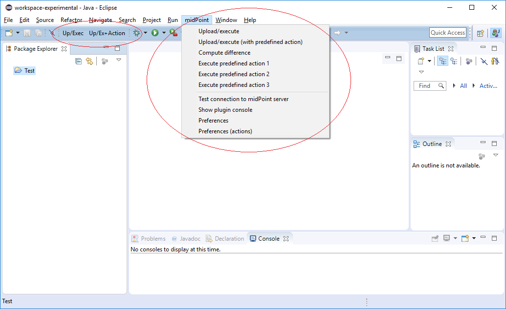

= Eclipse plugin installation HOWTO
:page-wiki-name: Eclipse plugin installation HOWTO
:page-wiki-id: 23167346
:page-wiki-metadata-create-user: mederly
:page-wiki-metadata-create-date: 2016-09-03T00:25:14.810+02:00
:page-wiki-metadata-modify-user: semancik
:page-wiki-metadata-modify-date: 2020-09-25T14:27:29.615+02:00
:page-obsolete: true
:page-replaced-by: /midpoint/tools/studio/

[WARNING]
.ABANDONED
====
MidPoint plugin for Eclipse for *abandoned*  in favor of xref:/midpoint/tools/studio/[MidPoint Studio], which is based on open source link:https://www.jetbrains.com/opensource/idea/[IntelliJ platform].

Although the Eclipse plugin was an efficient tool used broadly by the community, maintaining the plugin in Eclipse environment proved to be a challenge.
Most of the midPoint developers migrated to link:https://www.jetbrains.com/opensource/idea/[IntelliJ platform], and the popularity of the platform was also indicated by our xref:/community/surveys/midpoint-2019-survey/[survey]. Therefore we have decided to abandon the old and de facto derelict Eclipse plugin.
There no plans to maintain the Eclipse plugin any further.
You can go ahead and use it if it works for you, but there will be no further improvements, bug fixes or even security fixes.
====

. First of all, install the Eclipse.
During development of this plugin we were working with link:http://www.eclipse.org/downloads/packages/eclipse-ide-java-and-dsl-developers/neonr[Eclipse for Java and DSL Developers] (having great plans for sophisticated editors for midPoint objects) but a link:http://www.eclipse.org/downloads/packages/eclipse-ide-java-developers/neonr[standard one] should be OK as well.
The latest version (Neon) is recommended.

. Start Eclipse and select* Help -> Install New Software...*.
+

. Paste the following URL into "Work with:" field - *link:https://download.evolveum.com/downloads/midpoint-eclipse-plugin/[https://download.evolveum.com/downloads/midpoint-eclipse-plugin/]* and press ENTER.
You should see the following screen:
+

. It is possible that ProvisionException occurs, complaining about context.xml.
+

It is related to SSL/TLS and server certificates.
If you see the exception above, please use the guide to xref:/midpoint/reference/legacy/eclipse-plugin/certificate-problems/[Solving Certificate Problems].

. Now select "MidPoint Development Tools" from the list of available software.
Then click *Next...*

. Review items to be installed:
+

. Accept the license and click Finish.

. Accept warning about installing unsigned content (sorry for that):
+

. Finally, answer "Yes" on question about restarting Eclipse.
+

. After Eclipse restarts the plugin should be ready to use.
You can verify it by looking at "midPoint" menu as well as two additional toolbar buttons.
It should look similar to this (details may change in newer versions):

== Building from sources

If you'd like to build the plugin yourself, you can do the following:

[source]
----
git clone https://github.com/Evolveum/midpoint-ide-plugins.git
cd midpoint-ide-plugins\com.evolveum.midpoint.eclipse.parent
mvn clean install
----

The result is then in the file _com.evolveum.midpoint.eclipse.update/target/com.evolveum.midpoint.eclipse.update-x.x.x-SNAPSHOT.zip_. This is the file to be used as archive when adding new software sites (see xref:/midpoint/reference/legacy/eclipse-plugin/certificate-problems/[here]).

=== Eclipse Groovy plugin instalation

The installation steps are similar to instalation midPoint Eclipse plugin and was tested on _Neon.2 Release (4.6.2)_. For newer versions, please use link:https://github.com/groovy/groovy-eclipse/wiki[https://github.com/groovy/groovy-eclipse/wiki]:

. Start Eclipse and select* Help -> Install New Software...*.

. Paste the following URL into "_Work with:_" field - link:http://dist.springsource.org/snapshot/GRECLIPSE/e4.6/[http://dist.springsource.org/snapshot/GRECLIPSE/e4.6/] and press ENTER.

. Now select "_Groovy-Eclipse (Reqired)_" from the list of available software.
Then click *Next...*

. Review items to be installed

. Accept the license and click _Finish_

. Finally, answer "_Yes_" on question about restarting Eclipse

Note: For older Eclipse version _Neon.1 Release (4.6.1)_ use the link:http://dist.springsource.org/snapshot/GRECLIPSE/e4.5/[http://dist.springsource.org/snapshot/GRECLIPSE/e4.5/] link.