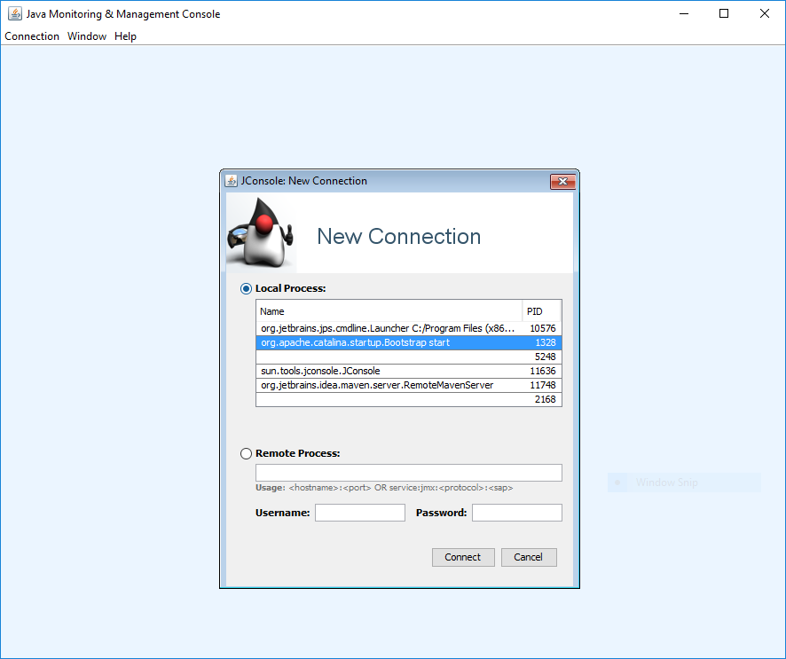
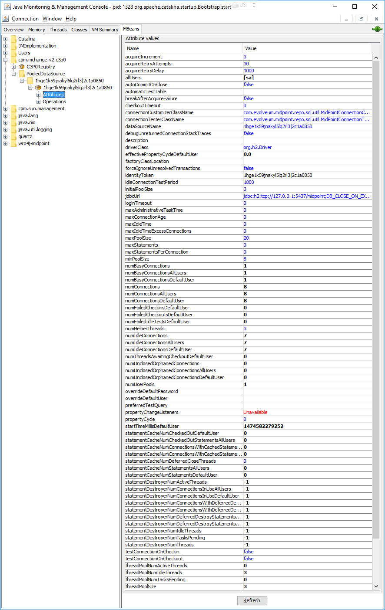

= Monitoring c3p0 state HOWTO
:page-wiki-name: Monitoring c3p0 state HOWTO
:page-wiki-id: 23167726
:page-wiki-metadata-create-user: mederly
:page-wiki-metadata-create-date: 2016-09-23T00:21:47.128+02:00
:page-wiki-metadata-modify-user: mederly
:page-wiki-metadata-modify-date: 2016-09-23T00:21:47.128+02:00
:page-obsolete: true

If you need to monitor the state of c3p0 connection pool, you can do it e.g. via JMX.
Here's how.

. If your server runs locally, you don't need to do anything special.
Local JMX connections should work without problems.
(There might be some issues when trying to connect to a tomcat running as a Windows service, though.
In such cases maybe the remote approach would work.)

. If your server runs remotely, you can allow JMX connections exactly in the same way as if xref:/midpoint/reference/deployment/clustering-ha/[configuring a cluster] (by setting com.sun.management.jmxremote.port, com.sun.management.jmxremote.ssl, com.sun.management.jmxremote.password.file and com.sun.management.jmxremote.access.file).

After setting up JMX and starting the server you can run a JMX tool such as JConsole to connect to it and view c3p0 statistics:

. Run jconsole (a part of JDK).
Select either local process to manage, or enter connection information needed to reach a remote one:

. After confirming insecure connection (that should not be a problem in a local environment), click on *MBeans* tab and select appropriate PooledDataSource and its attributes.
It should look like this:

