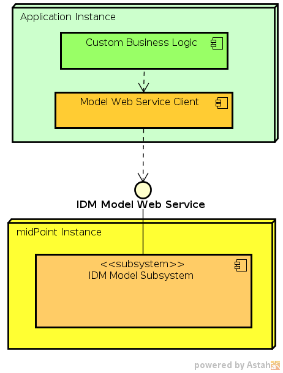

= Model Web Service SOAP Client
:page-wiki-name: Model Web Service Client
:page-wiki-id: 13074748
:page-wiki-metadata-create-user: semancik
:page-wiki-metadata-create-date: 2013-12-03T12:38:53.556+01:00
:page-wiki-metadata-modify-user: semancik
:page-wiki-metadata-modify-date: 2019-06-25T06:53:35.403+02:00
:page-obsolete: true

[WARNING]
====
xref:/midpoint/reference/legacy/soap/[IDM Model Web Service Interface] was deprecated in midPoint 4.0. Therefore the sample client does not bring any substantial value.
The client may even encourage the users to use deprecated SOAP functionality.
Therefore all the SOAP clients were removed from midPoint 4.0.
====

Model Web Service client is a simple and small Java component located in `model/model-client` subdirectory of xref:/midpoint/devel/source/structure/[midPoint source code]. This component is a web service client written in Java using JAX-WS and JAX-B standards.
It is designed to be independent on midPoint main code and midPoint libraries.
Its purpose it to be used as a simple library component in applications that access midPoint web service.

The Model Web Service Client is a simple Java library.
All the code generated by JAX-B and JAX-WS is already generated when the model client is being built as part of midPoint build process.
Therefore there are no special requirements on the build system when using the Model Web Service Client.
Embedding the client into the application is a simple matter of taking the `model-client-*.jar` and placing it on application classpath.
The model client JAR file can be obtained as a result of midPoint source code build process (`model/model-client/target/model-client-*.jar`).

The semantics of model web service client library corresponds to the definition of xref:/midpoint/reference/legacy/soap/[IDM Model Web Service Interface]. There is also a xref:/midpoint/reference/legacy/soap-client/sample/[sample code] that demonstrates the usage of the model client library.

== See Also

* xref:/midpoint/reference/legacy/soap-client/sample/[Model Web Service Client Sample]

* xref:/midpoint/reference/legacy/soap/[IDM Model Web Service Interface]