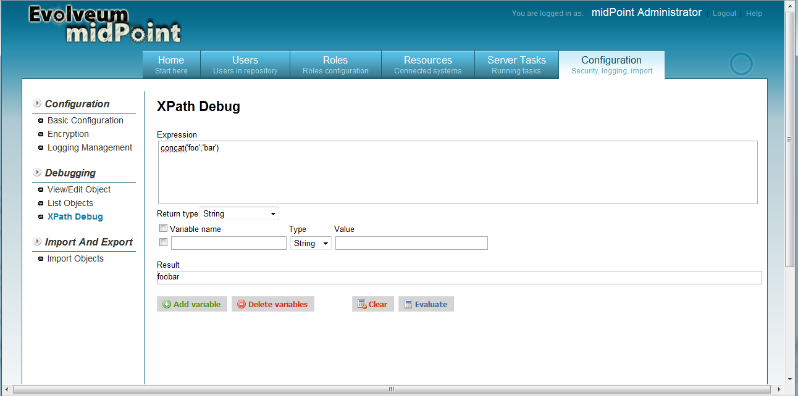
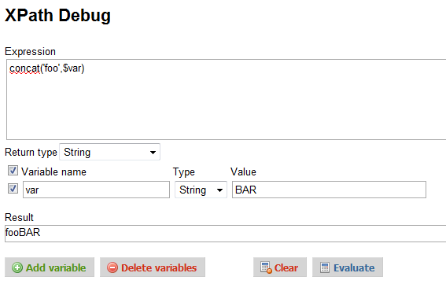
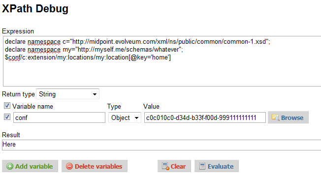
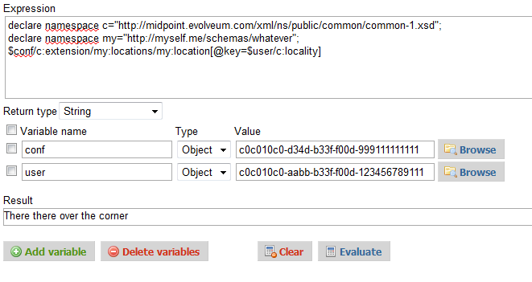
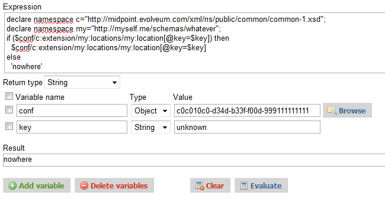

= XPath2 Tutorial
:page-wiki-name: XPath2 Tutorial
:page-wiki-id: 655374
:page-wiki-metadata-create-user: semancik
:page-wiki-metadata-create-date: 2011-04-29T11:49:22.963+02:00
:page-wiki-metadata-modify-user: semancik
:page-wiki-metadata-modify-date: 2013-01-11T20:25:48.032+01:00
:page-obsolete: true

This page provides a tutorial-like introduction to using XPath version 2 expressions in midPoint, especially for the purpose of implementing parts of synchronization logic.

== XPath Debug Page

There is a special debug page in midPoint that allows you to play with the XPath expressions and get familiar with them.
The page is designed to be a "safe playground".
It is using data from the repository, but it is not changing anything.
Therefore feel free to experiment.

The debug page can be found in the midPoint menu under `Configuration` -> `XPath debug page`. It looks like this:

The big textarea is there for you to enter your expression.
You can start with something simple, such as:

[source]
----

concat('foo','bar')

----

Press `Evaluate` and you should see the obvious result at the bottom of the screen.

== Using Variables

XPath expressions in midPoint are not very useful without variables.
All the real expressions are using at least one variable, this is kind of a parameters or arguments to the expression.
For a list of common variables please see the xref:/midpoint/reference/expressions/[Mappings and Expressions] page.
However, the XPath debug page is quite dumb in that aspect, it will not automatically assign any variable.
You have to specify the values for all the variables you use in debug pages.
You can use four fields for that, as shown in the picture above.

Let's demonstrate that using an example.
Let's set a variable `var` to a string value and then use it in an expression.
The variable will can used in the expression by prepending a dollar sign (`$`) to the variable name like this:

[source]
----
concat('foo',$var)
----

Now let's set the variable to the string value as shown below, hit the `Evaluate` again and you should get the expected result.

== XML Namespaces

XPath is a language designed for XML, therefore it is using namespaces to define individual elements.
The XPath segments should be namespace-qualified, but also the variable names are in fact QNames.
Pretty much everything in XPath is placed in a namespace.

Normally, namespace definitions are taken from the enclosing XML where the XPath expression is placed.
However, there is no enclosing XML in the XPath debug pages, therefore an alternative mechanism to declare a namespace prefix is used.
Namespace prefixes are declared like this:

[source]
----
declare namespace c="http://midpoint.evolveum.com/xml/ns/public/common/common-1.xsd";
declare namespace my="http://myself.me/schemas/whatever";
----

Then the namespace prefixes can be used in the expression itself, but also in variable names, as demonstrated by the following picture.

== XML Objects

String values in the variables may be useful, but the real power of the expressions is by using XML.
That's what XPath was designed for.

Next few examples assume that there is an XML object in midPoint repository that is being used in the examples.
Therefore please import the following object into the repository (e.g. by using `Configuration` -> `Import Page`).

[source,xml]
----

<c:objects xmlns:c="http://midpoint.evolveum.com/xml/ns/public/common/common-1.xsd"
           xmlns:my="http://myself.me/schemas/whatever">
    <c:genericObject oid="c0c010c0-d34d-b33f-f00d-999111111111">
        <c:name>My Sample Config Object</c:name>
        <c:extension>
            <my:locations>
                <my:location key="home">Here</my:location>
                <my:location key="work">There</my:location>
                <my:location key="somewhere">There there over the corner</my:location>
            </my:locations>
        </c:extension>
        <c:objectType>http://myself.me/schemas/objects#SampleConfigType</c:objectType>
    </c:genericObject>
</c:objects>

----

We will set the object to the variable `conf` by setting the variable type to `Object` and specifying object OID as the value.
The debug page will go to the repository, fetch the object and put the entire XML content of the object into the variable.

Let's demonstrate some XPath capabilities using that object.
First of all, let's use simple path expression:

[source]
----
declare namespace c="http://midpoint.evolveum.com/xml/ns/public/common/common-1.xsd";
declare namespace my="http://myself.me/schemas/whatever";
$conf/c:extension/my:locations/my:location[@key='home']
----

The path expression will take the content of the variable `conf` (which is an XML object), descend to the element `c:extension`, then into `my:locations` and then it will look for a child element `my:location` that has attribute `key` with a value of `home`. Content of that element will the result of this expression.
This is illustrated in the picture below.

This is the point in the tutorial where the expressions start to be useful.
The objects of the `genericObject` type can be used as a kind of global system configuration, containing various constants and tuning parameters.
The XPath expressions the can be used to access individual parameters from the configuration XML.
Therefore the configuration is stored in one place, and used by many expressions at various places in the system.

== Lookup Expression

Usual use of the expressions is to translate values from one vocabulary to the other, usually using a lookup tables.
This can be implemented in XML quite easily (as long as the table is not big) and XPath is very suitable to do the lookup.

The XML object that we have used in the previous section is such a lookup table.
The `key` attribute is a lookup key, the content of element `my:location` is the value.
The expression that we have used in the previous section is in fact doing the lookup we want, but it is static.
It always provides the same result.
Now we will do it dynamic and more realistic.

First of all we will need a source for the translation.
The usual case in midPoint is to translate values of the user object to the resource-specific values for accounts.
Therefore our source will be user object.
Let's use this one:

[source,xml]
----
<c:objects  xmlns:xsi='http://www.w3.org/2001/XMLSchema-instance'
   xmlns:c='http://midpoint.evolveum.com/xml/ns/public/common/common-1.xsd'>
    <c:user oid="c0c010c0-aabb-b33f-f00d-123456789111">
        <c:name>jack</c:name>
        <c:fullName>Cpt. Jack Sparrow</c:fullName>
        <c:givenName>Jack</c:givenName>
        <c:familyName>Sparrow</c:familyName>
        <c:honorificPrefix>Cpt.</c:honorificPrefix>
        <c:locality>somewhere</c:locality>
    </c:user>
</c:objects>
----

The user object has to be imported in the repository and set to the `user` variable in the XPath debug page.
User object is usually set to the `user` variable in most midPoint expressions, so this pretty much matches the reality.

To get a dynamic value translation, let's use the `user` variable inside the expression:

[source]
----
declare namespace c="http://midpoint.evolveum.com/xml/ns/public/common/common-1.xsd";
declare namespace my="http://myself.me/schemas/whatever";
$conf/c:extension/my:locations/my:location[@key=$user/c:locality]
----

The result is shown in the picture below.
The value from the user is translated using the lookup object from the previous section.

This expression is something that can be normally found in the `<outbound>` expressions in the `schemaHandling` section of midPoint resource definition.
In that case the `$user` will be set to the corresponding user automatically by midPoint, but the `$conf` variable will not.
midPoint does not know which configuration object is applied to a specific set of expression.
Therefore the configuration object needs to be set explicitly, similarly to the way how it was set in the XPath debug page.
The complete `<outbound>` expression will the look like this:

[source,xml]
----
<c:attribute ref="ri:l">
    <c:outbound>
        <c:variable name="my:conf">
            <c:objectRef oid="c0c010c0-d34d-b33f-f00d-999111111111"/>
        </c:variable>
        <c:valueExpression>
            declare namespace c="http://midpoint.evolveum.com/xml/ns/public/common/common-1.xsd";
            $my:conf/c:extension/my:locations/my:location[@key=$c:user/c:locality]
        </c:valueExpression>
    </c:outbound>
</c:attribute>
----

== Flow Control

XPath version 2 is quite a rich language.
Although it was built for expressions, it has some constructs usually found in algorithmic languages, such as if-then-else and loops.
Following example is quite a simple way how to provide a default value for a mapping.

[source]
----
declare namespace c="http://midpoint.evolveum.com/xml/ns/public/common/common-1.xsd";
declare namespace my="http://myself.me/schemas/whatever";
if ($conf/c:extension/my:locations/my:location[@key=$key]) then
  $conf/c:extension/my:locations/my:location[@key=$key]
else
  'nowhere'
----

If there is a mapping for the value stored in variable `key`, then the mapping will be returned.
If there is no mapping, the value `nowhere` will be returned instead.

== See Also

* link:http://www.w3.org/TR/xpath20/[XPath 2.0 Specification]

* link:http://www.w3schools.com/xpath/default.asp[XPath Tutorial at W3CScools]: XPath v1, but still useful

* link:http://nwalsh.com/docs/tutorials/extreme04/slides.pdf[Norman Walsh: XPath 2 and XSLT 2 tutorial slides]