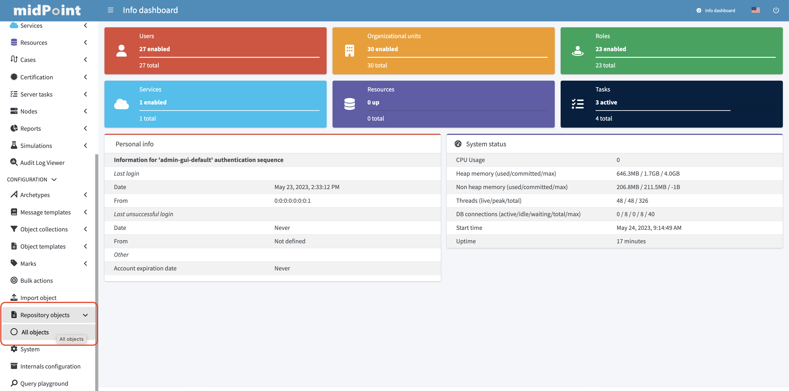
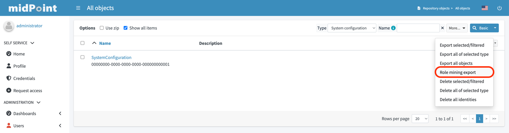
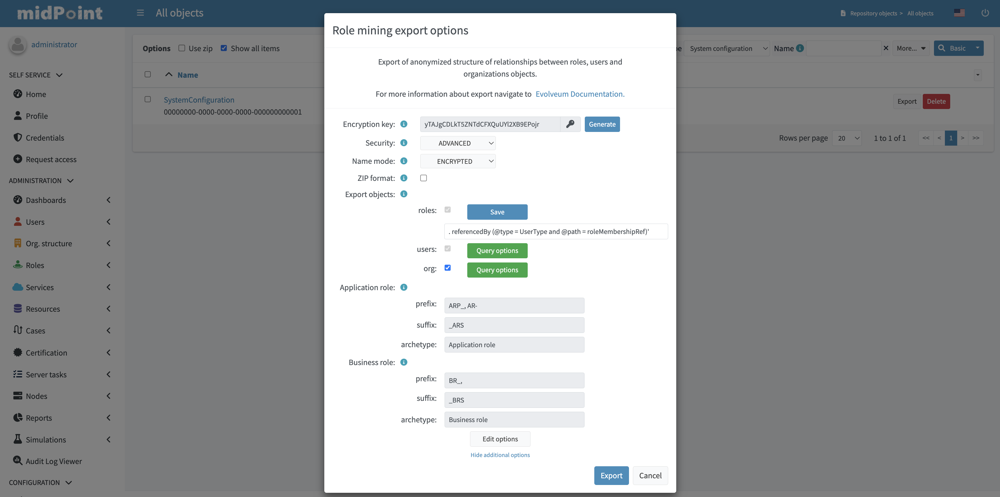
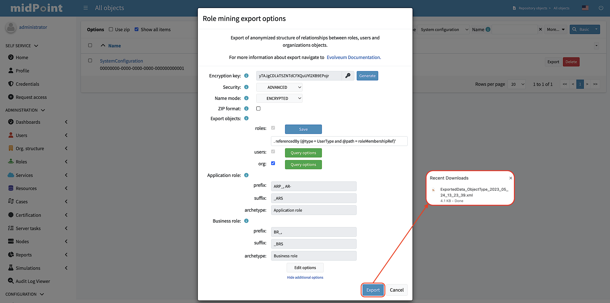

= Role Mining Export
:page-toc: top
:page-since: "4.8"
:page-upkeep-status: green

Role mining export is an anonymized export of relationships between roles, users, and
organizations. The goal of the export is to obtain a map of relations between objects, which could
be helpful in the development of new features such as "Role mining".

== Anonymization

Data anonymization plays a crucial role in ensuring the privacy and security of exported data. In
the context of role mining export, the Advanced Encryption Standard (AES) algorithm is utilized to
anonymize sensitive information such as the oid and name parameters. The following encryption
mechanisms are applied:

Advanced Encryption Standard (AES) can be used in two different settings:

1. `STANDARD`: This setting provides a security level of 128 bits. It offers strong encryption
measures suitable for most applications where a high level of security is required.
2. `ADVANCED`: In this setting, AES employs a higher level of security with a key size of 256 bits.
The 256-bit encryption provides even stronger protection.

Encrypt parameters:

* `oid`: The AES algorithm is used to encrypt the oid parameter. After encryption, the object identifiers are transformed
into UUIDs (due to object validation), resulting in the anonymization of the `oid` parameters of the
objects.
* `name`: To export the name parameter, a suffix *_AE* is appended. This suffix is used to distinguish
the type of export and facilitates easy validation during the import process. The export of the name
parameter can be performed in three different ways:

    1. `ENCRYPTED`: Parameter is anonymized using the AES algorithm.
    2. `SEQUENTIAL`:  Parameter is assigned a value based on the processing iteration. This
sequential approach ensures anonymity.
    3. `ORIGINAL`: The original value of the parameter is kept.

== Exported parameters

=== Roles (required)

* `name`: Name of the role formatted according to export settings.
* `oid`: Anonymized object identifier for the role in UUID format.
* `assignments`: ArchetypeType (Business role and Application role).
* `inducements`: RoleType.

=== Users (required)

* `name`: Name of the user formatted according to export settings.
* `oid`: Anonymized object identifier for the users in UUID format.
* `assignments`: RoleType and OrgType.

=== Organizations (optional)
* `name`: Name of the organization formatted according to export settings.
* `oid`: Anonymized object identifier for the users in UUID format.
* `assignments`: OrgType (parent org. units).

=== Role category identification

To ensure effective data analysis, it is crucial to classify roles into specific categories, namely
Business and Application roles. Two methods are employed for role identification:

1. Utilizing archetypes.
2. Using prefixes and suffixes.

When a role is identified within a particular category, the export process include and fills <identifier> element indicating the role category (e.g., "Business role" or "Application role"). In the case of archetype-based identification, the exported role assignment includes the unencrypted archetype oid (due to import validation).

.Example of an exported XML file
[source,xml]
----
<?xml version="1.0" encoding="UTF-8"?>
<objects xmlns="...">

    <!--Example role 1. -->
    <!--Encrypted and transformed oid to UUID-->
    <role oid="364f9e81-72e5-37a5-a282-7f02e403f26e" xmlns="...">
        <!--Encrypted name parameter-->
        <name>4++mJ4Ehm7sTdmb+H/+sCQ==_AE</name>
    </role>

    <!--Example role 2. -->
    <!--Encrypted and transformed oid to UUID-->
	<role xmlns="..." oid="dcee8444-a2a9-3587-a4c9-4f662a353fbc">
        <!--Encrypted name parameter-->
        <name>vWcNCBIPhz+ENZgYpheVTA==_AE</name>
        <!--Indicate Business role using archetype-->
        <assignment>
            <targetRef oid="00000000-0000-0000-0000-000000000321" relation="org:default" type="c:ArchetypeType"/>
        </assignment>
        <identifier>Business role</identifier>
        <!--Inducement of role 3.-->
        <inducement>
        <!--Encrypted and transformed oid to UUID-->
            <targetRef oid="41ab6794-c50e-3e7f-a431-f29fa8db8c92" relation="org:default" type="c:RoleType"/>
        </inducement>
        <!--Inducement of role 1.-->
        <inducement>
        <!--Encrypted and transformed oid to UUID-->
            <targetRef oid="364f9e81-72e5-37a5-a282-7f02e403f26e" relation="org:default" type="c:RoleType"/>
        </inducement>
    </role>

    <!--Example role 3. -->
    <!--Encrypted and transformed oid to UUID-->
	<role xmlns="..." oid="41ab6794-c50e-3e7f-a431-f29fa8db8c92">
    <!--Encrypted name parameter-->
        <name>aIFvSJcixkArccGb0OFxLg==_AE</name>
        <!--Indicate Application role using prefix/suffix-->
        <identifier>Application role</identifier>
    </role>

    <!--Example user 1. -->
	<user xmlns="..." oid="419d20c2-9220-3d17-a212-b3c0798bdaca">
    <!--Encrypted name parameter-->
        <name>FIfqF8jUNAK8vGiOa6TiCQ==_AE</name>
        <!--Assignment to role 2. -->
        <assignment>
        <!--Encrypted and transformed oid to UUID-->
            <targetRef oid="dcee8444-a2a9-3587-a4c9-4f662a353fbc" relation="org:default" type="c:RoleType"/>
        </assignment>
        <!--Assignment to org 2. -->
        <assignment>
        <!--Encrypted and transformed oid to UUID-->
            <targetRef oid="238921e6-6629-3a75-b6e7-dcc44791ac22" relation="org:default" type="c:OrgType"/>
        </assignment>
    </user>

    <!--Example org 1. -->
    <!--Encrypted and transformed oid to UUID-->
	<org oid="72d23c65-01e9-36eb-bcfe-bc5710e1a8ed" xmlns="...">
    <!--Encrypted name parameter-->
        <name>4++mJ4Ehm7sTdmb+H/+sCQ==_AE</name>
    </org>

    <!--Example org 2. -->
    <!--Encrypted and transformed oid to UUID-->
	<org xmlns="..." oid="238921e6-6629-3a75-b6e7-dcc44791ac22">
    <!--Encrypted name parameter-->
        <name>ofdbLLYzMKFlz4zJQR1vDw==_AE</name>
        <!--Assignment to org 1. -->
        <assignment>
        <!--Encrypted and transformed oid to UUID-->
            <targetRef oid="72d23c65-01e9-36eb-bcfe-bc5710e1a8ed" relation="org:default" type="c:OrgType"/>
        </assignment>
    </org>
</objects>
----

== Export using Ninja:

For users of the support-4.4 version or later, exporting anonymized role mining data using the Ninja tool is available. To perform the export, refer to the  xref:/midpoint/reference/deployment/ninja/#mining-exportimport[Ninja documentation].

== Export using MidPoint GUI (Repository objects)

If you prefer a graphical user interface (GUI), you can export role mining data using the MidPoint-4.8 GUI version.
Typically, you can navigate to the repository objects section and select the role mining data export option.

*1.* Navigate to the repository objects section.

*2.* Locate the role mining data export option within the repository objects section.

*3.* In the dialog window, customize the export according to your preferences.

*4.* To initiate the export process, simply click on the "Export" button located in the lower-right corner of the screen, and then wait for the export to complete.

== Import

There are multiple methods to import role mining exports such as:

1. *Ninja tool*: Utilize the Ninja tool to import role mining exports. Refer to the xref:/midpoint/reference/deployment/ninja/#mining-exportimport[Ninja documentation] for detailed instructions on how to perform the import using this tool.
2. *MidPoint Studio*: If you prefer using MidPoint Studio, you can import role mining exports directly through the application.
3. *MidPoint GUI*: Access the "Import object" section within the GUI to import your role mining exports.

== Export sharing

By sharing your data, you can help us develop new futures like "Role mining". The goal of this export is to obtain data structures representing relationships from a real deployment.
If you have imported data that you can share, please consider contributing to this project. If you have performed an anonymized export, you can make sure that the data does not contain any confidential information.

To submit export, follow these steps:

1. Prepare your exported data in a widely used and accessible format such as XML or JSON.
2. Compress the data into a ZIP archive for easy transfer.
3. Email the compressed archive as an attachment to [...].

Your contribution will be valuable in advancing the field of role mining and enhancing the capabilities of the system.

