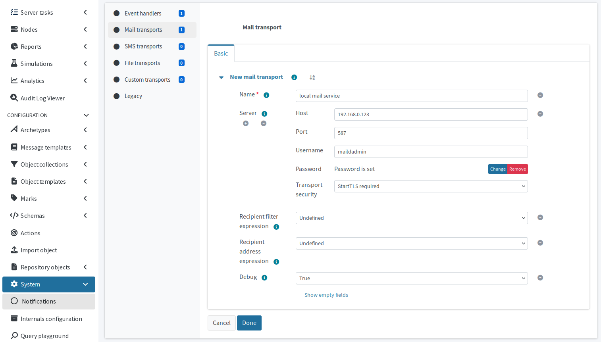

= Send e-mails from midPoint via SMTP server
:page-nav-title: SMTP server settings
:page-keywords: smtp, mail, email, e-mail, server
:page-description: Configure SMTP server connection to enable sending e-mails from midPoint
:experimental:

In order to have midPoint send notifications or any messages by e-mail at all, you need to configure a SMTP server connection.
MidPoint needs to send e-mails on various occasions, most notably to to send notifications and password reset links.

To enable sending e-mails, you need to configure mail transport in the `messageTransportConfiguration` object.
Refer to xref:/midpoint/reference/misc/notifications/configuration/#mail-transport[] for details.

To configure SMTP server connection in GUI:

. In [.nowrap]#icon:cog[] *System*#, select the [.nowrap]#icon:envelope[] *Notifications*# tile.
. In [.nowrap]#icon:circle[] *Mail transports*#, click [.nowrap]#icon:plus[] btn:[New]#.
. *Name* the transport descriptively and fill in the needed connection details.
    ** You can use the *Debug* option to have midPoint verbosely log connection and configuration issues to the xref:/midpoint/reference/diag/logging/[log file].
. Click btn:[Done] beneath the form.
. Click [.nowrap]#icon:save[] btn:[Save]# in the toolbar at the top.

.Basic SMTP server connection configuration

In XML, the mail transport configuration may look like this:

.Simple mail transport configuration
[source,xml]
----
<messageTransportConfiguration>
    <mail>
        <name>local mail service</name>
        <debug>true</debug>
        <server>
            <host>192.168.0.123</host>
            <port>587</port>
            <username>mailadmin</username>
            <password> <1>
                <t:encryptedData>
                    <t:encryptionMethod>
                        <t:algorithm>http://www.w3.org/2001/04/xmlenc#aes256-cbc</t:algorithm>
                    </t:encryptionMethod>
                    <t:keyInfo>
                        <t:keyName>...</t:keyName>
                    </t:keyInfo>
                    <t:cipherData>
                        <t:cipherValue>...</t:cipherValue>
                    </t:cipherData>
                </t:encryptedData>
            </password>
            <transportSecurity>starttlsRequired</transportSecurity> <2>
        </server>
        <defaultFrom>notification@midpoint.example.org</defaultFrom> <3>
    </mail>
</messageTransportConfiguration>
----
<1> Encrypted password used to log into the e-mail account on the SMTP server.
    You may find the GUI more convenient to create this part of the configuration.
<2> Connection security setup. Other options are `none`, `starttlsEnabled`, and `ssl`.
<3> The sender of e-mails from midPoint.
    You can override this value in a xref:/midpoint/reference/misc/notifications/configuration/#configuring-notifiers[notifier configuration] using `fromExpression`.

[NOTE]
====
If you do not need e-mail notifications and do not want users to reset their password using the xref:/midpoint/reference/security/credentials/password-reset/[_reset password_ link on the login prompt], you do not need to set up SMTP server connection at all.
====

== See also

* xref:/midpoint/reference/misc/notifications/configuration/[]
* xref:/midpoint/reference/misc/notifications/task-notifications/[]
* xref:/midpoint/reference/misc/notifications/use-cases/use-case-threshold-based-governance/[]
* xref:/midpoint/reference/security/credentials/password-reset/[]
* link:https://en.wikipedia.org/wiki/Simple_Mail_Transfer_Protocol[Simple Mail Transfer Protocol - Wikipedia]
