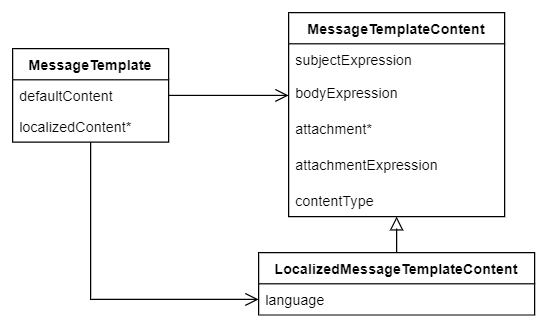
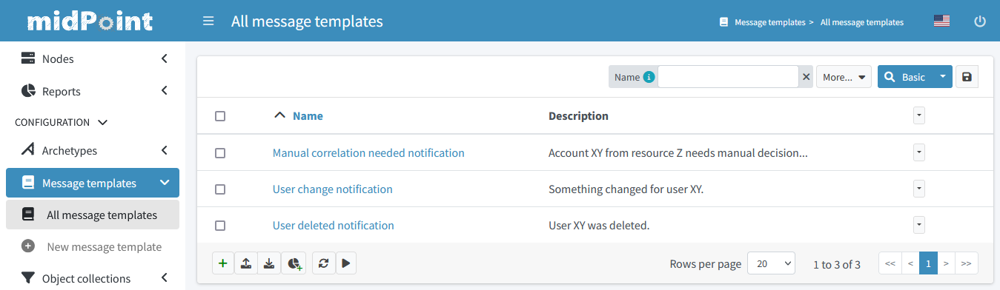
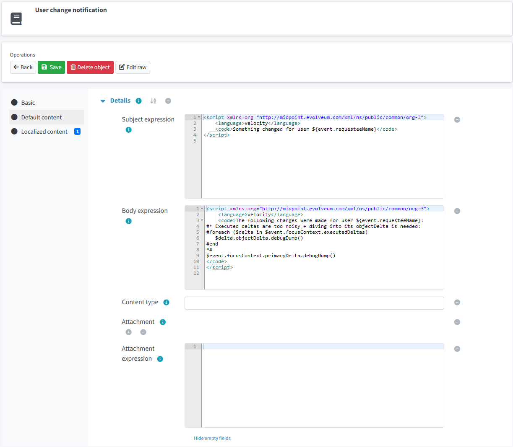

= Message templates
:page-since: 4.5
:page-toc: top

*Message template* is an object that provides a template for the content of a message, i.e. a notification message.
It specifies typical components of such a message - like subject, body and attachments.
In addition to the `defaultContent` for the message, additional localized contents can be defined based on _recipient's_ `preferredLanguage` or `locale` property.

== Message template structure

The logical structure of the message template is:

== GUI configuration

You can define the message templates in GUI:

The detail allows to enter the expressions for each content component:

The *Localized content* allows having localized templates for specific languages.
The message template language is selected according to _recipient's_ `preferredLanguage` or `locale` property.

Expressions in the message template produce string results.
For this reason, use of xref:../velocity/[Velocity templates] is a natural fit.
Currently, the expressions must be still entered as an XML code, but there are tentative plans
to make writing of templates easier, e.g. by copy/pasting HTML template for the message.

== Expression example

// TODO see TODO in velocity.adoc about options how to escape value returned from ${xxx} in HTML - currently missing.

An example of a body expression can look like this:
[source,xml]
----

----

The template expression above demonstrates:

* As mentioned, Velocity can be a better option for textual templates.
Since midPoint 4.5 one can specify the language with the local part of the language URL - which is `velocity` in this case.
* It is possible to iterate over collections with `#foreach` macro.
* It is possible to comment out some parts - here the whole iteration is actually commented with `pass:[#*]` ... `pass:[*#]` block.

Of course, it is possible to use xref:/midpoint/reference/expressions/expressions/script/[script expression]
with any other supported language (e.g. Groovy), or you can use any other xref:/midpoint/reference/expressions/expressions/[expression evaluator].
