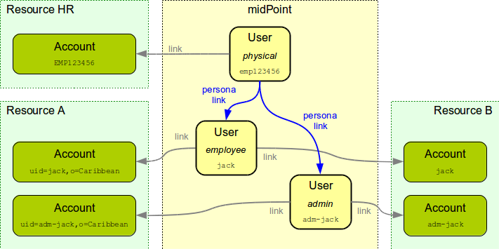

= Personas
:page-wiki-name: Personas
:page-wiki-id: 24085857
:page-wiki-metadata-create-user: semancik
:page-wiki-metadata-create-date: 2017-04-19T10:00:01.401+02:00
:page-wiki-metadata-modify-user: semancik
:page-wiki-metadata-modify-date: 2017-05-04T16:22:20.009+02:00
:page-upkeep-status: yellow
:page-toc: top

== Overview

Personas are virtual identities - alternative representations of physical persons.
Persona links are links between users in midPoint, which are used mostly to link physical identities with personas.
However the links can be used for variety of purposes.
In the usual case one midPoint user object represents the physical identity of a person.
This "physical" user is linked to several "persona" users, each of them representing different facet of identity: employee, administrator, student, contractor, ...

It is always the "persona" user that is important for midPoint.
The user will always log in to midPoint as a specific persona (as an employee, administrator, student).
User will always request roles for a specific persona.
The persona will be recorded in the audit log.
And so on.
The purpose of the "physical" user is to keep all the persona actions accountable to a physical identity.
And the physical identity is also used for identity data management (see below).
But it is always the persona that is executing an action.
The persona user is active, the physical user is passive.

== Links and Mappings

The personal links are not just simple links between user objects (`UserType`). These links may be couples with xref:/midpoint/reference/expressions/mappings/[mappings]. E.g. the mappings may be used to propagate the changes from the physical user to the personas.
The physical user identity may be linked to the HR system or a similar system that is an authoritative source for user legal name.
MidPoint can use ordinary xref:/midpoint/reference/expressions/mappings/inbound-mapping/[inbound mappings] to get the data from the HR system to the physical user object.
The persona link mappings can then be used to propagate these changes to all the linked persona users.
And then again ordinary xref:/midpoint/reference/expressions/mappings/outbound-mapping/[outbound mappings] can be used to propagate the changes to all affected resources.
This is a typical scenario how family name (surname) changes are propagated in a persona-enabled configuration.

== Persona Links vs Intents

The use of persona links is not the only way how to implement facets of user identity.
MidPoint has an alternative mechanism for years.
It is called "xref:/midpoint/reference/resources/shadow/kind-intent-objectclass/[intent]". The intent can be used to maintain several accounts for one user.
It is very useful and practical mechanism and it is frequently used in midPoint deployments.
E.g. the use of intent allows to assign employee accounts and administrative accounts to the same user.
However, what intent does not allow is to group all administrative accounts on all the resources.
Therefore implementing a stronger password policy for all the administrative accounts on all the resources is quite difficult to do by just using intents.

Therefore midPoint 3.6 introduced the mechanism of personal links.
However, this not means that persona links must be always used instead of intents.
Quite the contrary.
The mechanism of persona links is very powerful and flexible, but it also adds complexity.
And the use of personas may be somehow confusing for some of your users.
Our recommendation is to use intents if they are sufficient for your deployment.
And only use persona links if the limitation of intents are too prohibitive for your deployment.

== Configuration

Please see xref:/midpoint/reference/misc/persona/configuration/[Persona Configuration] page for configuration details.

== See Also

* xref:/midpoint/reference/schema/data-model-essentials/[Basic Data Model]

* xref:/midpoint/reference/expressions/[Mappings and Expressions]

* xref:/midpoint/reference/resources/shadow/kind-intent-objectclass/['Kind, Intent and ObjectClass']

* xref:/midpoint/reference/misc/persona/configuration/[Persona Configuration]
