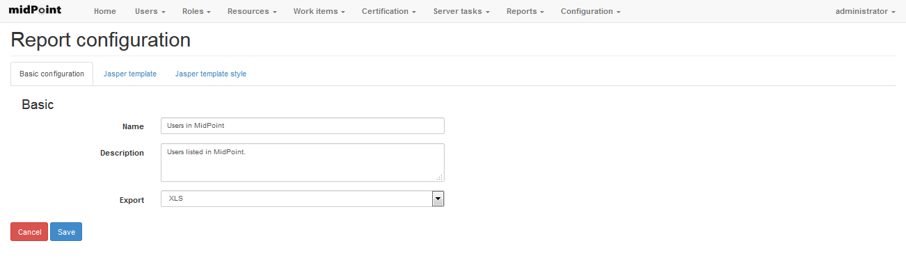
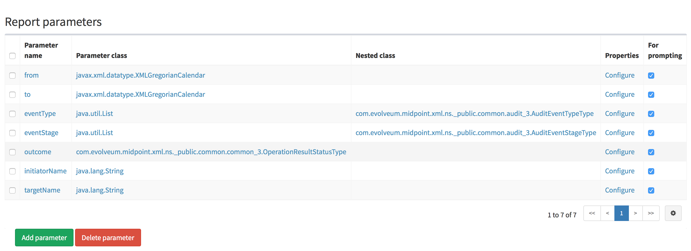
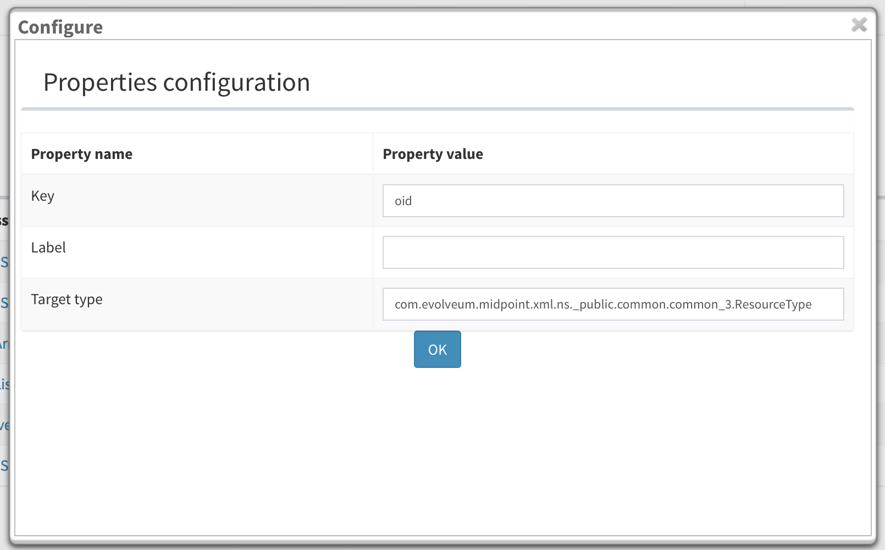
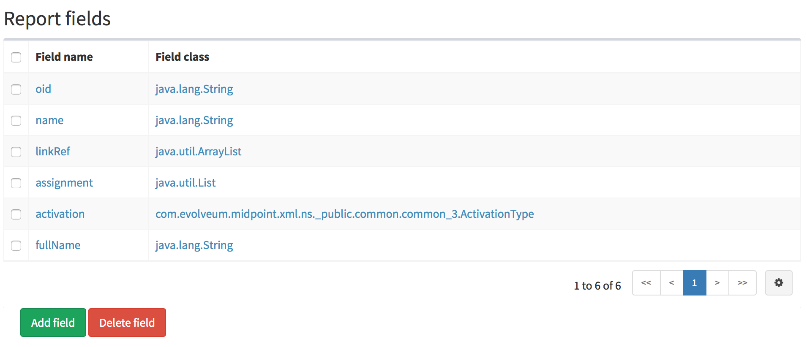
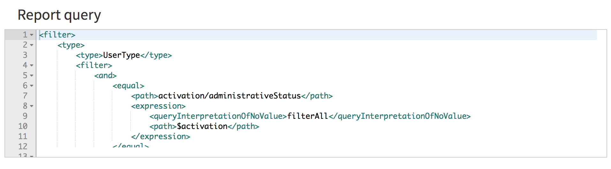
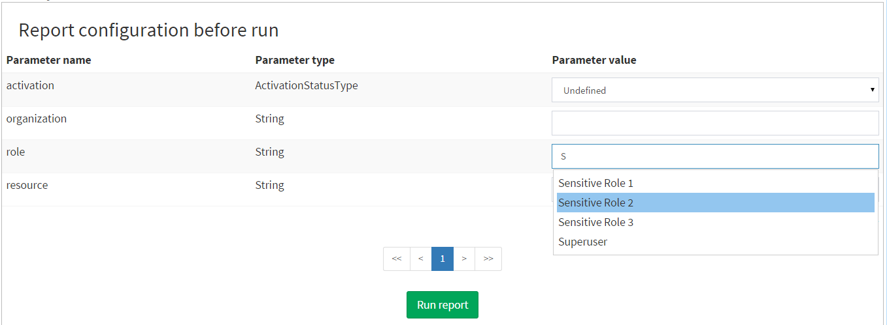
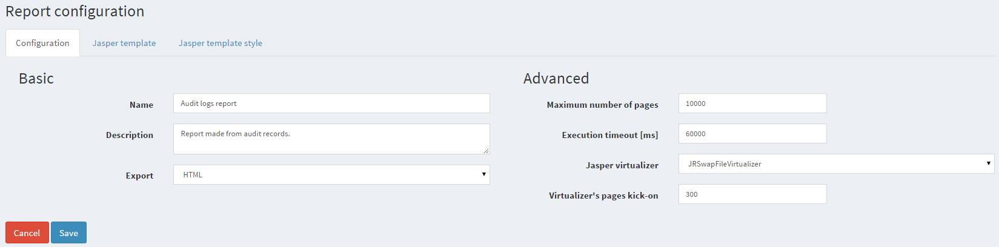
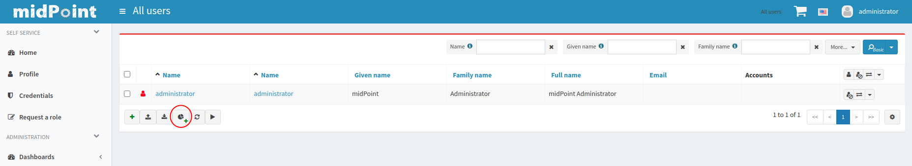

= Report Configuration before midPoint version 4.4
:page-wiki-name: Report Configuration
:page-wiki-id: 17761609
:page-wiki-metadata-create-user: katkav
:page-wiki-metadata-create-date: 2015-07-06T10:16:32.230+02:00
:page-wiki-metadata-modify-user: mmacik
:page-wiki-metadata-modify-date: 2020-12-04T09:35:19.721+01:00
:page-upkeep-status: orange
:page-toc: top

This guide is only for small customization which can be done directly in midPoint.
In the case you need more complex customization it is maybe better to create new report template or customize existing one with Jaspersoft Studio.
How to work with Jaspersoft Studio using live midPoint can be found xref:/midpoint/reference/legacy/jaspersoft-studio/[here].

== Report customization using midPoint

After listing reports in midPoint (Reports -> List Reports) and clicking on the configure button you are able to modify some basic report attributes.
As the picture below shows there are three tabs.
Each of them is related to different part of report which can be configured.
In the first tab 'Basic configuration' you can configure name of the report and export format.
The second tab 'Jasper template' can be used to customize existing template, e.g. you can add/remove parameters, modify query etc.
The last tab 'Jasper template style' is used as a style for the report.
You can change it according to your needs (e.g. font size, font family, ...)

=== Customizing Jasper template

In the midPoint's GUI you have available all the jasper template so it is possible to update it directly with midPoint.
But, as I stated before, I don't recommend doing complex modifications in the midPoint.
midPoint is not a reporting tool and for this purpose we decided to use Jasper Report framework.
I recommend doing only small modification in queries or parameters in midPoint.

. Report parameters - you can add/remove or modify report parameters.
Support for multi-value parameters exists since 3.6. If you check 'For prompting' attribute, it means that this parameter is shown in the pop-up panel when you run report.
Report parameters are used as input values to the query.
+

.. There is a special column Properties.
After clicking on the Configure link, new popup is shown.
In this popup you can define additional properties describing the parameters.
These properties are then used for customization of run popup such as lookup tables.
+

. Report fileds - you can add/remove or modify report fields.
But be aware that if you make any change to the report field, you have to seek for the original filed definition throughout  the whole jasper report definition and replace old filed with the new one defined.
+

. Report query - customize query according to you needs.
E.g. you can add filter to search only enabled user or user in some organization etc.
The query language is 'mql' which is a shortcut for MidPoint Query Language.
You can use the same query syntax as everywhere else (e.g. correlation rule).
It is also possible to define script instead of query.
All the existing midPoint function are available (xref:/midpoint/reference/expressions/expressions/script/functions/['Basic, midpoint, report']).

** Queries must be wrapped in <filter> element

** Scripts must be wrapped in <code> element

=== lookupAdding auto-complete to input parameters

MidPoint can visualize report input parameter as select box with auto-complete ability.
The optional auto-complete can be used for input parameters with limited set of values - e.g. whispering all available users, resources or organizations.
Normally non-enum parameters are displayed as text input fields.
If you wish midPoint to render parameters as select boxes with auto-complete, you need to specify these three parameter properties:

* key - property path to target attribute that will be passed to Jasper query as parameter value (e.g. name, oid)

* label - property path to target attribute that will be displayed as label in auto-complete box (e.g. name, fullName, oid)

* targetType - full class name of target type that will be populated into auto-complete box (UserType, RoleType, OrgType...)

This example populates auto-complete with all roles in midPoint:

[source]
----
<parameter name="role" class="java.lang.String">
	<property name="key" value="oid"/>
	<property name="label" value="name"/>
	<property name="targetType" value="com.evolveum.midpoint.xml.ns._public.common.common_3.RoleType"/>
</parameter>
----

Limitations:

* "key" and "label" properties can only reference prism properties of target object, not complex values like containers or references

* "key" and "label" properties can only reference single-value properties, not multi-value

=== multivalueConfiguring multi-value input parameters

++++

++++

Sometimes you need to specify report query using more than one value for the attribute, e.g you want to search users with employeeType=contractor and employeeType=fulltime.
To prevent defining two different reports - one for employeeType = contractor and second one for employeeType=fulltime the support for multi-value parameters was added in midPoint 3.6. To enable this feature, you need to configure parameter class as a java.util.List and than nested class with the real value of items which will be filled into the list.
However, be aware that after the parameter is changed to multi-value it is also needed to update the report query and (maybe) other jasper report parts.

In the picture above, there are two attributes defined as multivalue - eventType and eventStage.
As you can see, both of these attributes parameter class is set to java.util.List and the nested class then contains concrete type which will be in the list.

=== Performance and run-time settings

==== Virtualizers

Jasper report has ability to utilize so-called virtualizers that can optimize memory usage.
Virtualizers come handy when you *generate very large reports* of hundreds to thousands+ pages.
In these situations memory consumption can become crucial and you may run out of Java heap space.
Currently there are 3 virtualizers available in Jasper and what they basically do is they save memory consumption on account of consuming little more CPU or disk space.

Detailed virtualizers description can be found here: link:http://community.jaspersoft.com/wiki/virtualizers-jasperreports[http://community.jaspersoft.com/wiki/virtualizers-jasperreports]

MidPoint offers these two settings in report configuration to set Jasper virtualizer:

* Jasper virtualizer - select one of three prebuilt virtualizers or select none to disable feature.

** Recommended setting: JRSwapFileVirtualizer

** Both file virtualizers save temporary data into <midPoint_home>/tmp directory.

* Virtualizer's pages kick-on - only effective when virtualizer is selected. It defines number of report pages after virtualizer "kicks on". The more memory you have (Java Xmx), the higher number can be. Reports that do not reach the specified number of pages will not utilize any virtualizer.

** Recommended setting: 300

Limitation: Maximum size of object being stored in any virtualizer is 65K.
That equals massive number of text in one cell (one column X one row).
If you encounter "Error virtualizing object link:http://java.io[java.io].UTFDataFormatException" or other problems, you should disable virtualizer.

==== Governors

Another mechanism to control the Jasper report runtime are so-called governors.
Governors can *limit number of pages and/or execution time* of report.
MidPoint has two settings for this, but please be aware that Jasper enforces these limits little unintuitively and practically limits are enforced some time/pages after threshold value has been reached.
When limit is reached, report is cancelled without being generated.
Using governors can *increase robustness of reporting engine *and prevent overloading of midPoint's resources.
We strongly recommend using them.

* Maximum number of pages - maximum number of report pages after execution is cancelled.

* Execution timeout [ms] - maximum number of report execution time in miliseconds after report is cancelled. Please note that this time specifies only portion of total execution time - total execution time might be little longer than governor setting.

Set value to empty or 0 to disable governor.

==== Changing delimiter in CSV export

To change delimiter in CSV export you have to define it in jasper template for any report :

* Example

<property name="net.sf.jasperreports.export.csv.field.delimiter" value=";"/>

==== Removing names of fields on all pages except the 1st page in CSV export

To remove names of fields on all report pages except the 1st page in CSV report you have to define "printWhenExpression" in jasper template

Example:

[source,xml]
----
<columnHeader>
    <band height="24" splitType="Stretch">
        <printWhenExpression><![CDATA[$V{PAGE_NUMBER}==1]]></printWhenExpression>
        <frame>
            <reportElement style="Column header" mode="Transparent" x="0" y="1" width="1000" height="19" isRemoveLineWhenBlank="true" uuid="3e8fdd6d-a6ff-4407-9a1e-5d6b4706300a"/>
            <staticText>
                <reportElement style="Column header" x="0" y="0" width="300" height="18" uuid="86c74beb-bddd-48cc-945a-167b261b1e0b"/>
                <textElement textAlignment="Center" verticalAlignment="Middle"/>
                <text><![CDATA[Name]]></text>
            </staticText>
        </frame>
    </band>
</columnHeader>
----

== Security Of Report Expressions

Reports often use xref:/midpoint/reference/expressions/[expressions].
Expressions allow to customize midPoint behavior and they are essential for the success of midPoint deployments.
However, the expressions are very powerful and they may even be too powerful for some use cases.
The expressions can use general-purpose scripting languages such as Groovy or JavaScript.
Therefore such expressions have almost unlimited capabilities.
Which means that the expressions can damage the system or compromise security of the system.
*Use the expressions with utmost care.*

Currently, there are very little restraints for expression execution.
The xref:/midpoint/reference/expressions/expressions/script/functions/[expression functions] provided by midPoint usually check for proper authorizations.
But as the expressions can use general-purpose languages, there is no obligation for the expressions to use those libraries.
The expression can easily circumvent those weak protections.
Therefore do not let any unauthorized user to set up any kind of expression in midPoint.
*Allowing the right to edit any expression may lead to compromise of system security.*

Some expression security can be achieved by using xref:/midpoint/reference/expressions/expressions/profiles/[expression profiles].  Expression profiles can be used to limit the capabilities of report expressions, e.g. to limit them to safe operations that just manipulate strings and basic data structures.
This seems to work reasonably well for ordinary object-based reports.
However, when it comes to audit reports, this solution may not be sufficient.
xref:/midpoint/reference/security/audit/[Audit records] are *not*  midPoint objects, they are just rows in ordinary relational table.
Therefore the usual midPoint mechanisms do not apply to them.
E.g. they cannot be queries by using midPoint query mechanisms.
There is a way how a "safe" expression can construct a string query for audit table.
However, there is no protection against SQL injection or similar attacks.
Major improvement to auditing capabilities of midPoint would be needed for that purpose.

An example of such an audit report can be found in midPoint tests: link:https://github.com/Evolveum/midpoint/blob/master/model/report-impl/src/test/resources/reports/report-audit-csv.xml[https://github.com/Evolveum/midpoint/blob/master/model/report-impl/src/test/resources/reports/report-audit-csv.xml] +
However, this is just an example.
It may not be complete, it may not be secure.
There are no guarantees.
Use at your own risk.

In case that a secure audit reports are needed, the current recommendation is to make such reports outside of midPoint.
The xref:/midpoint/reference/security/audit/[structure of an audit table is documented] and it can be used for integration with data warehouse and/or SIEM systems.
MidPoint is neither of those systems and it has no ambition to become one.
Therefore such integration is likely to be required anyway to construct a complete information security solution.

See xref:/midpoint/reference/security/security-guide/[Security Guide] for more detail regarding security-related functionality of midPoint.

== New report

[WARNING]
.IN PROGRES
====
This is a features in progress. It means that it is not intended for production use.
The feature is not finished.
It is not stable.
The implementation may contain bugs, the configuration may change at any moment without any warning and it may not work at all.
Use at your own risk.

====

 +

[TIP]
.MidPoint 4.2 and later
====
This feature is available only in midPoint 4.2 and later.

====

New reports are intended to be native reporting mechanism for midPoint.
The aim is to use what midPoint provides without the need for Jasper framework.
Using Jasper framework as an engine is still possible, but it is deprecated and not recommended anymore.
It is recommended to use reports based on midPoint concepts, namely dashboards or objectCollection.
Current implementation support exporting reports to CSV and HTML file, other formats such as XSLX are planned to be added later.
Configuration attributes of report:

[%autowidth]
|===
| Name | Type | Description

| _reportEngine_
| *ReportEngineSelectionType*
| Selects which report engine should be used to render this report.
Possible value _jasper, dashboard_ and _collection._

| _fileFormat_
| *FileFormatConfigurationType*
| Define report output file format.

| _jasper_
| *JasperReportEngineConfigurationType*
| Configuration for jasper-based reports.
Only applicable if reportEngine=jasper.

| _dashboard_
| *DashboardReportEngineConfigurationType*
| Configuration for dashboard-based reports.
Only applicable if reportEngine=dashboard.

| _objectCollection_
| *ObjectCollectionReportEngineConfigurationType*
| Configuration for object collection-based reports.
Only applicable if reportEngine=collection.

| _defaultScriptConfiguration_
| *ScriptExpressionEvaluatorConfigurationType*
| Default configuration for the scripts executed inside the report.

| _postReportScript_
| *CommandLineScriptType*
| Command-line script that will be executed after the report is complete and the output file is completely produced.
Output filename will be passed to the script as the "file" argument.

|===

=== Export

For now, export to CSV and HTML is supported.
Configuration attributes:

[%autowidth]
|===
| Name | Type | Description

| _type_
| *FileFormatTypeType*
| Report data type.
Possible _csv_ and _html_.

| csv
| *CsvFileFormatType*
| Configuration attribute for csv export.

| html
| *HtmlFileFormatType*
| Configuration attribute for html export.

|===

==== HTML

Configuration of html file format doesn't contain any other attributes.

==== CSV

Configuration to CSV file contains attributes:

[%autowidth]
|===
| Name | Type | Description | Default

| _multivalueDelimiter_
| *string*
| Delimiter for multivalue property.
| ,

| _fieldDelimiter_
| *string*
| Delimiter for field of csv file.
| ;

| _escape_
| *string*
| The escape character of the format.
| \

| _quote_
| *string*
| Character for the quote.
| "

| _quoteMode_
| *QuoteModeType*
| Quote Mode for records.
Possible values is _all, allNonNull, minimal, nonNumeric_ and _none._
| nonNumeric

| _recordSeparator_
| *string*
| Separator of line of record.
| \r\n

| _trailingDelimiter_
| *boolean*
| Define, whether to add a trailing delimiter.
| false

| _trim_
| *boolean*
| Define, whether to trim leading and trailing blanks.
| false

| _createHeader_
| *boolean*
| Create header in csv output file.
| true

| _encoding_
| *string*
| Encoding of csv file.
| utf-8

|===

*QuoteModeType*

* all - Quotes all fields.

* allNonNull - Quotes all non-null fields.

* minimal - Quotes fields which contain special characters such as a the field delimiter, quote character or any of the characters in the line separator string.

* nonNumeric - Quotes all non-numeric fields.

* none - Never quotes fields.
When the delimiter occurs in data, the printer prefixes it with the escape character.
If the escape character is not set, format validation throws an exception.

=== Report engine

Report engine define type of report.

==== Jasper

Jasper is old deprecated type of reports.
We can use attribute jasper and in it we can use all attributes for jasper report.

==== Dashboard

You may generate HTML report from the dashboard.
Following code shows how to do it.

[source,xml]
----
<report>
    <name>System Status Dashboard report</name>
    <reportEngine>dashboard</reportEngine>
    <dashboard>
        <dashboardRef oid="--OID OF DASHBOARD--" >
        </dashboardRef>
                <showOnlyWidgetsTable>false</showOnlyWidgetsTable>
    </dashboard>
</report>
----

Some export configuration (for example html) create report with table of widgets and tables for objects from each widget and variable _showOnlyWidgetsTable_ define that created report contains only table for widgets.
For report is important _view_ variable in widget presentation.
Specifies a view for report of an object collection that is the result of the widget.
Defines columns of table in report.
When we don't use view, report will be contained default columns.
In expression of column you can use variable 'object' which represent searched object or object defined in tag _path_. For more information about view configuration please see xref:/midpoint/reference/admin-gui/collections-views/configuration/#views[Views].

[WARNING]
====
Definition of _view_ is EXPERIMENTAL.
It works only for some case, some parts are hardcoded, untested or do not even work at all.
Use at your own risk.
But it is perhaps best not to use this at all until the code stabilizes.

====

.Example of view for RoleType
[source,xml]
----
                <presentation>
                        ...
                        <view>
                <column>
                    <name>nameColumn</name>
                    <c:path>name</c:path>
                    <display>
                        <label>Name</label>
                    </display>
                </column>
                <column>
                    <name>members</name>
                    <display>
                        <label>Members</label>
                    </display>
                    <previousColumn>nameColumn</previousColumn>
                                        <export>
                            <expression>
                                
                            </expression>
                                        </export>
                </column>
            </view>
                </presentation>
----

Final view is result of merging of defaultView in objectCollection object, view in dashboard for current widget and view in report for same type of objects as is in widget.
Example of view in report:

.Example of view in Report
[source,xml]
----
<report>
    ...
    <dashboard>
        ...
                <view>
                <column>
                    <name>givenNameColumn</name>
                <c:path>givenName</c:path>
                <display>
                        <label>Given name</label>
                </display>
            </column>
                        <type>UserType</type>
        </view>
                <view>
                <column>
                    <name>nameColumn</name>
                <c:path>name</c:path>
                <display>
                        <label>Name</label>
                </display>
            </column>
                        <type>RoleType</type>
        </view>
    </dashboard>
</report>
----

===== Report for asynchronous widget

For asynchronous widget we need configure scheduled dashboard report task.
We will use _storeExportedWidgetData_, which can have next value:

[%autowidth]
|===
| Name | Description

| `onlyWidget`
| Exported widget data will be stored only in element of widget.

| `onlyFile`
| Exported widget data will be stored only in file.

| `widgetAndFile`
| Exported widget data will be stored only in element of widget and file.

|===

==== Collection

We can use following attributes:

[%autowidth]
|===
| Name | Type | Description

| _collection_
| *CollectionRefSpecificationType*
| Specification of an explicit or implicit object collection that will be used to select objects in report.

| _view_
| *GuiObjectListViewType*
| Specifies a view of an object collection that is be reported.

| _useOnlyReportView_
| *boolean*
| Specifies that during creating of report will be used only view in report without merging with other view.

| _condition_
| *ExpressionType*
| Condition for the searched objects. Searched object will be shown if the condition evaluates to true. This condition use only for reports and as last option because of performance.

| _parameter_
| *SearchFilterParameterType*
| Parameter used in filter expression.

| _subreport_
| *SubreportParameterType*
| Subreport with expression.

|===

View defines columns in report (order, name, ... ). View is merged from default view in collection or base collection with view in report.
When attribute _useOnlyReportView _is true, only the view from report configuration is used.
For collection report we can use object collection or filter and base object collection.

===== Object collection

When we want to use object collection easy use oid of collection in report.
For example:

.Object collection report with object collection reference
[source,xml]
----
<report>
	<name>Collection report 1</name>
	<reportEngine>collection</reportEngine>
    <objectCollection>
        <collection>
            <collectionRef oid="---COLLECTION_OID---" type="ObjectCollectionType"/>
        </collection>
    </objectCollection>
</report>
----

===== Filter

We can use only filter with base collection or view where we define object type.
Example with base collection.

.Object collection report with filter
[source,xml]
----
<report>
	<name>Collection report 2</name>
	<reportEngine>collection</reportEngine>
    <objectCollection>
        <collection>
			<filter>
				<all/>
			</filter>
			<baseCollectionRef>
            	<collectionRef oid="---COLLECTION_OID---" type="ObjectCollectionType"/>
			</baseCollectionRef>
        </collection>
    </objectCollection>
</report>
----

===== Parameters

When we want run some report, sometimes we need define some information for input for example role, organization, resource, etc.
For this situation we can define parameter, which user set before running of the report. For example we want report of all user
who have accounts on concrete resource. We won't create one report for each resource with different filter but use parameter
which define resource in filter and we set it before run of report. We can see example of this report below.

.Object collection report with parameter
[source,xml]
----
<report xmlns="http://midpoint.evolveum.com/xml/ns/public/common/common-3"
        xmlns:q="http://prism.evolveum.com/xml/ns/public/query-3"
        xmlns:c="http://midpoint.evolveum.com/xml/ns/public/common/common-3">
	<name>Collection report 2</name>
	<reportEngine>collection</reportEngine>
    <objectCollection>
        <collection>
			<filter>
				<q:ref>
                    <q:path>assignment/construction/resourceRef</q:path>
                    <expression>
                        <queryInterpretationOfNoValue>filterAll</queryInterpretationOfNoValue>
                        
                    </expression>
                </q:ref>
			</filter>
        </collection>
        <view>
            <type>UserType</type>
        </view>
        <parameter>
            <name>resource</name>
            <type>c:ObjectReferenceType</type>
            <targetType>c:ResourceType</targetType>
            <display>
                <label>
                    <orig>resource</orig>
                    <translation>
                        <key>ObjectTypeGuiDescriptor.resource</key>
                    </translation>
                </label>
            </display>
        </parameter>
    </objectCollection>
</report>
----

We can use following attributes for parameter:

[%autowidth]
|===
| Name | Type | Description

| _name_
| *String*
| Name of parameter.

| _type_
| *QName*
| Type of parameter value.

| _targetType_
| *QName*
| Type of target, when type of parameter value is ObjectReferenceType.

| _allowedValuesLookupTable_
| *ObjectReferenceType*
| Reference of Lookup Table, which define possible values of parameter.

| _allowedValuesExpression_
| *ExpressionType*
| Expression that determines allowed value. Expected List&#60;DisplayableValue&#62;.

|===

===== Subreports

Subreport defines some object, which we can get from expression. Next we can use this object in column expression,
so we don't have to search this object in every column expression. For example we need report with accounts(shadows) but we need some columns with attributes from owner of account, so we use subreport where in expression we define search of owner. Next in columns expressions we use owner and we get attributes from it.

We can use following attributes for subreport:

[%autowidth]
|===
| Name | Type | Description

| _name_
| *String*
| Name of subreport.

| _type_
| *QName*
| Type of parameter value.

| _order_
| *Integer*
| Order in which this entry is to be evaluated. (Related to other entries.) Smaller numbers go first. Entries with no order go last.

|===

== Creating of report

Simple way how to create report is to click on 'Create report' under table on object list pages (e.g. All users page).

After click you will be redirected to Create report page with predefined filter from search panel over object table and columns from previous table.

== 'Import report'

Since version 4.2, midPoint supports 'import report'/'reverse report'. This feature is *xref:/midpoint/versioning/experimental/[experimental]*.
Report output generated by midPoint can also be used in reverse way - you can import it back to midPoint.
In addition, it is also possible to import custom defined report output.
Midpoint support two kind of import configuration .  Configuration for Object import and Import script.

=== Object import

MidPoint has to understand the report output data structure to preform import correctly.
This is configured in report (ReportType), in similar way as for exporting.
For now, only _ObjectCollectionReportEngineConfigurationType_ and CSV format is supported (CSV FileFormatType).

Example of imported file:

.CSV file
[source,csv]
----
"Name";"Administrative status";"Valid from";"Nick";"AssignmentOid";"Subtype"
"testUser01";"enabled";"2020-07-07T00:00:00.000+02:00";"nick1";"00000000-0000-0000-0000-000000000008,00000000-0000-0000-0000-000000000004";"sub1,sub22"
"testUser02";"enabled";"2020-07-07T00:00:00.000+02:00";"NICK2";;
----

....
Example below shows report (ReportType) configuration for importing CSV file with header and two records above.
....

.Report-JSON
[source,json]
----
{
  "@ns" : "http://midpoint.evolveum.com/xml/ns/public/common/common-3",
  "report" : {
    "name" : "Object Collection import report with view",
    "objectCollection" : {
      "view" : {
        "column" : [ {
          "name" : "nameColumnCollection",
          "path" : "name",
          "display" : {
            "label" : "Name (Collection)"
          }
        }, {
          "name" : "activationColumn",
          "path" : "activation/administrativeStatus",
          "previousColumn" : "nameColumnCollection"
        }, {
          "name" : "validFromColumn",
          "path" : "activation/validFrom",
          "previousColumn" : "activationColumn"
        }, {
          "name" : "nickColumn",
          "path" : "nickName",
          "display" : {
            "label" : "Nick"
          },
          "previousColumn" : "validFromColumn",
          "import" : {
            "expression" : {
              "script" : [ {
                "@type" : "http://midpoint.evolveum.com/xml/ns/public/common/common-3#ScriptExpressionEvaluatorType",
                "code" : "import com.evolveum.midpoint.prism.polystring.PolyString\n\n                                return new PolyString(\"New nick: \" + input)\n                            "
              } ]
            }
          }
        }, {
          "name" : "assignmentColumn",
          "path" : "assignment",
          "display" : {
            "label" : "AssignmentOid"
          },
          "previousColumn" : "nickColumn",
          "import" : {
            "expression" : {
              "script" : [ {
                "@type" : "http://midpoint.evolveum.com/xml/ns/public/common/common-3#ScriptExpressionEvaluatorType",
                "code" : "\n                                import com.evolveum.midpoint.xml.ns._public.common.common_3.AssignmentType;\n                                import com.evolveum.midpoint.xml.ns._public.common.common_3.ObjectReferenceType;\n                                import com.evolveum.midpoint.xml.ns._public.common.common_3.RoleType;\n\n                                assignments = new ArrayList();\n\n                                for (String oid : input) {\n                                    if (oid != null) {\n                                        role = new ObjectReferenceType();\n                                        role.setOid(oid);\n                                        role.setType(RoleType.COMPLEX_TYPE);\n\n                                        AssignmentType assignment = new AssignmentType();\n                                        assignment.asPrismContainerValue()\n                                        assignment.setTargetRef(role);\n                                        assignments.add(assignment)\n                                    }\n                                }\n                                return assignments\n                            "
              } ]
            }
          }
        }, {
          "name" : "subtypeColumn",
          "path" : "subtype",
          "previousColumn" : "assignmentColumn"
        } ],
        "type" : "UserType"
      }
    },
    "behavior" : {
      "direction" : "import"
    }
  }
}
----

.Report-XML
[source,xml]
----
<report>
    <name>Object Collection import report with view</name>
    <objectCollection>
        <view>
            <column>
                <name>nameColumnCollection</name>
                <path>name</path>
                <display>
                    <label>Name (Collection)</label>
                </display>
            </column>
            <column>
                <name>activationColumn</name>
                <path>activation/administrativeStatus</path>
                <previousColumn>nameColumnCollection</previousColumn>
            </column>
            <column>
                <name>validFromColumn</name>
                <path>activation/validFrom</path>
                <previousColumn>activationColumn</previousColumn>
            </column>
            <column>
                <name>nickColumn</name>
                <path>nickName</path>
                <display>
                    <label>Nick</label>
                </display>
                <previousColumn>validFromColumn</previousColumn>
                <import>
                    <expression>
                        
                    </expression>
                </import>
            </column>
            <column>
                <name>assignmentColumn</name>
                <path>assignment</path>
                <display>
                    <label>AssignmentOid</label>
                </display>
                <previousColumn>nickColumn</previousColumn>
                <import>
                    <expression>
                        
                    </expression>
                </import>
            </column>
            <column>
                <name>subtypeColumn</name>
                <path>subtype</path>
                <previousColumn>assignmentColumn</previousColumn>
            </column>
            <type>UserType</type>
        </view>
    </objectCollection>
    <behavior>
        <direction>import</direction>
<!-- In case of non raw execution -->
<!--        <importOptions>-->
<!--            <modelExecutionOptions>-->
<!--                <raw>false</raw>-->
<!--            </modelExecutionOptions>-->
<!--        </importOptions>-->
    </behavior>
</report>

----

==== Behaviour and Options

We need define that this report is import and not export, for this we need define element _behavior.__Behavior_  contains direction _Import_ or _Export_. Also _behavior_ contains _importOptions_, which contains next elements:

[%autowidth]
|===
| Name | Description | Type

| *overwrite*
| If set to a true value it will cause that objects that are already in the repository will be overwritten by the imported objects.
It may not be applicable to all import types.
E.g. it makes no sense for import from resource, as this is not storing objects in the repository directly.
| *boolean*

| *keepOid*
| If set to a true value it will cause that objects that overwritten objects will reuse the same OID as previous objects.
May be potentially dangerous.
USE WITH CARE.
| *boolean*

| *stopAfterErrors*
| Number of errors that will cause import to stop.
If set to one the import will stop on first error.
If set to zero or negative value the import will not stop on any error.
| *int*

| *summarizeSucceses*
| If set to true the successfully imported items will be summarized in the result.
WARNING: setting this to false may result in a very large result structure and may cause overflow of the system memory.
| *boolean*

| *summarizeErrors*
| If set to true the import errors will be summarized in the result.
| *boolean*

| *referentialIntegrity*
|

| *boolean*

| *validateStaticSchema*
|

| *boolean*

| *validateDynamicSchema*
|

| *boolean*

| *encryptProtectedValues*
|

| *boolean*

| *fetchResourceSchema*
|

| *boolean*

| *keepMetadata*
| If set to true then the importer will keep the metadata from the source file.
If set to false then the imported will re-generate metadata on each object.
| *boolean*

| *modelExecutionOptions*
| If present, these options are used for adding objects into the repository.
Null option values might be overridden by import-related options.
In particular, the missing "raw" option is overridden to "true".
So, if you want the operation run in non-raw mode, set "raw" option to "false" (e.g. runs also global templates, policy configuration, etc...).
| *ModelExecuteOptionsType*

| *compatMode*
| Compatibility model.
If selected then the data parsing will be less strict.
E.g. removed element will be ingnored.
| *boolean*

|===

In previous example of report we define mapping values from columns to items in new object.
Name of column in CSV file have to be same as name defined in view.
Definition of name from view have some rules.
Name is obtained from _Label_ of _DispalyType_ for column, when _Label_ is empty, then Midpoint finds name for item from item definition based on _Path_ element in column.

Definition of column also contains _import/expression_ which can define script for generating items.
Script have to return real value for example _String_ or _List_ of values for multivalue items for example _List<AssignmentType>. _Script get _input_ variable which is _String_, when item is singlevalue, or _List<String>_, when item is multivalue.

=== Import script

We can define _importScript_ in element _behaviour. _Import script is_ExecuteScriptType _type, so we can define more actions.
Script contains variables with same name as headers of imported CSV file.
For example from next file will be created variables with names _username, role_name, action, valid_from_ and _valid_to_.

Example of imported file:

.CSV file
[source,csv]
----
"username";"role_name";"action";"valid_from";"valid_to"
"testUser02";"Superuser";"A";"2018-01-01";"2018-05-01"
"testUser01";"Superuser";"D";;
"fakeUser";"Superuser";"M";"2018-01-01";"2018-05-01"
"jack";"Superuser";"M";"2018-01-01";"2018-05-01"
"jack";"FakeRole";"M";"2018-01-01";"2018-05-01"
"jack";"Superuser";;"2018-01-01";"2018-05-01"
----

In next example we add/modify/delete assignment on user defined variable _username_ (in first line 'testUser02'). Operation define variable _action_ ('A'=add, 'M'=modify, 'R'=remove).
Target of assignment define via name of role variable _role_name_.  Variables _valid_from_ and _valid_to_ define property _activation/validFrom_ and _activation/validTo_ of assignment.

.Example of Import script - XML
[source,xml]
----
<report>
    <name>Report with import script</name>
    <behavior>
        <importScript xmlns:c="http://midpoint.evolveum.com/xml/ns/public/common/common-3"
                      xmlns:s="http://midpoint.evolveum.com/xml/ns/public/model/scripting-3">
            <s:options>
                <s:continueOnAnyError>true</s:continueOnAnyError>
            </s:options>
            <s:pipeline>
                <s:search  xmlns:q="http://prism.evolveum.com/xml/ns/public/query-3">
                    <s:type>UserType</s:type>
                    <s:searchFilter>
                        <q:equal>
                            <q:path>name</q:path>
                            <c:expression>
                                <c:script>
                                    <c:code>username</c:code>
                                </c:script>
                            </c:expression>
                        </q:equal>
                    </s:searchFilter>
                </s:search>
                <s:execute>
                    <s:forWholeInput>true</s:forWholeInput>
                    <s:script>
                        <s:code>
                            if (input == null || input.getData().isEmpty()){
                                log.error("Couldn't find user with name" + username + ". Skip this line.")
                            }
                        </s:code>
                    </s:script>
                </s:execute>
                <s:modify>
                    <s:parameter>
                        <s:name>delta</s:name>
                        <s:execute>
                            <s:parameter>
                                <s:name>outputItem</s:name>
                                <c:value>ObjectDeltaType</c:value>
                            </s:parameter>
                            <s:script>
                                <s:code>
                                    import com.evolveum.midpoint.xml.ns._public.common.common_3.AssignmentType;
                                    import com.evolveum.midpoint.xml.ns._public.common.common_3.ObjectReferenceType;
                                    import com.evolveum.midpoint.xml.ns._public.common.common_3.RoleType;
                                    import com.evolveum.midpoint.xml.ns._public.common.common_3.UserType;
                                    import com.evolveum.midpoint.xml.ns._public.common.common_3.ActivationType;
                                    import java.text.SimpleDateFormat;
                                    import java.util.GregorianCalendar;
                                    import com.evolveum.midpoint.prism.equivalence.EquivalenceStrategy;
                                    import javax.xml.datatype.DatatypeFactory;
                                    import com.evolveum.midpoint.schema.DeltaConvertor;

                                    log.info("-----------START-----------");
                                    log.info("username: " + username);
                                    log.info("role_name: " + role_name);
                                    log.info("action: " + action);
                                    log.info("valid_from: " + valid_from);
                                    log.info("valid_to: " + valid_to);
                                    log.info("input: " + input);

                                    user = input;
                                    userBefore = user.clone();
                                    role = midpoint.searchObjectByName(RoleType.class, role_name);
                                    if (role == null) {
                                        log.error("Couldn't find role with name " + role_name);
                                        return null;
                                    }
                                    if (action.equals("A")) {
                                        roleRef = new ObjectReferenceType();
                                        roleRef.setOid(role.getOid());
                                        roleRef.setType(RoleType.COMPLEX_TYPE);
                                        AssignmentType assignment = new AssignmentType();
                                        assignment.setTargetRef(roleRef);

                                        if (valid_from != null || valid_to != null) {
                                            activation = new ActivationType();
                                            format = new SimpleDateFormat("yyyy-MM-dd");
                                            if (valid_from != null) {
                                                date = format.parse(valid_from);
                                                cal = new GregorianCalendar();
                                                cal.setTime(date);
                                                xmlGregCal =  DatatypeFactory.newInstance().newXMLGregorianCalendar(cal);
                                                activation.setValidFrom(xmlGregCal);
                                            }

                                            if (valid_to != null) {
                                                date = format.parse(valid_to);
                                                cal = new GregorianCalendar();
                                                cal.setTime(date);
                                                xmlGregCal = DatatypeFactory.newInstance().newXMLGregorianCalendar(cal);
                                                activation.setValidTo(xmlGregCal);
                                            }
                                            assignment.setActivation(activation);
                                        }
                                        user.getAssignment().add(assignment);
                                    } else if (action.equals("M")) {
                                        for (AssignmentType assignment : user.getAssignment()) {
                                            if (assignment.getTargetRef() != null &amp;&amp; role.getOid().equals(assignment.getTargetRef().getOid())) {
                                                if (valid_from != null || valid_to != null) {
                                                    activation = new ActivationType();
                                                    format = new SimpleDateFormat("yyyy-MM-dd");
                                                    if (valid_from != null) {
                                                        date = format.parse(valid_from);
                                                        cal = new GregorianCalendar();
                                                        cal.setTime(date);
                                                        xmlGregCal =  DatatypeFactory.newInstance().newXMLGregorianCalendar(cal);
                                                        activation.setValidFrom(xmlGregCal);
                                                    }

                                                    if (valid_to != null) {
                                                        date = format.parse(valid_to);
                                                        cal = new GregorianCalendar();
                                                        cal.setTime(date);
                                                        xmlGregCal = DatatypeFactory.newInstance().newXMLGregorianCalendar(cal);
                                                        activation.setValidTo(xmlGregCal);
                                                    }
                                                    assignment.setActivation(activation);
                                                }
                                                break;
                                            }
                                        }
                                    } else if (action.equals("D")) {
                                        for (AssignmentType assignment : user.getAssignment()) {
                                            if (assignment.getTargetRef() != null &amp;&amp; role.getOid().equals(assignment.getTargetRef().getOid())) {
                                                user.getAssignment().remove(assignment);
                                                break;
                                            }
                                        }
                                    } else {
                                        log.error("Action column have unexpected value '" + action + "'")
                                        return null;
                                    }
                                    if (userBefore.equals(user)) {
                                        log.error("Couldn't create delta, because user before executing of script is same as after executing of script.")
                                        return null;
                                    }
                                    delta = userBefore.asPrismObject().diff(user.asPrismObject(), EquivalenceStrategy.LITERAL_IGNORE_METADATA);
                                    log.info("delta: " + delta);
                                    log.info("-----------FINISH-----------");
                                    return DeltaConvertor.toObjectDeltaType(delta);
                                </s:code>
                            </s:script>
                        </s:execute>
                </s:parameter>
                </s:modify>
            </s:pipeline>
        </importScript>
        <direction>import</direction>
    </behavior>
</report>

----

.Example of Import script - JSON
[source,json]
----
{
  "@ns" : "http://midpoint.evolveum.com/xml/ns/public/common/common-3",
  "report" : {
    "name" : "Report with import script",
    "behavior" : {
      "direction" : "import",
      "importScript" : {
        "@ns" : "http://midpoint.evolveum.com/xml/ns/public/model/scripting-3",
        "pipeline" : [ {
          "@element" : "search",
          "type" : "UserType",
          "searchFilter" : {
            "@ns" : "http://prism.evolveum.com/xml/ns/public/query-3",
            "equal" : {
              "path" : "name",
              "http://midpoint.evolveum.com/xml/ns/public/common/common-3#expression" : {
                "@ns" : "http://midpoint.evolveum.com/xml/ns/public/common/common-3",
                "script" : {
                  "code" : "username"
                }
              }
            }
          }
        }, {
          "@element" : "execute",
          "script" : {
            "@ns" : "http://midpoint.evolveum.com/xml/ns/public/common/common-3",
            "code" : "\n                            if (input == null || input.getData().isEmpty()){\n                                log.error(\"Couldn't find user with name\" + username + \". Skip this line.\")\n                            }\n                        "
          },
          "forWholeInput" : true
        }, {
          "@element" : "modify",
          "parameter" : [ {
            "name" : "delta",
            "execute" : {
              "parameter" : [ {
                "name" : "outputItem",
                "http://midpoint.evolveum.com/xml/ns/public/common/common-3#value" : "ObjectDeltaType"
              } ],
              "script" : {
                "@ns" : "http://midpoint.evolveum.com/xml/ns/public/common/common-3",
                "code" : "\n                                    import com.evolveum.midpoint.xml.ns._public.common.common_3.AssignmentType;\n                                    import com.evolveum.midpoint.xml.ns._public.common.common_3.ObjectReferenceType;\n                                    import com.evolveum.midpoint.xml.ns._public.common.common_3.RoleType;\n                                    import com.evolveum.midpoint.xml.ns._public.common.common_3.UserType;\n                                    import com.evolveum.midpoint.xml.ns._public.common.common_3.ActivationType;\n                                    import java.text.SimpleDateFormat;\n                                    import java.util.GregorianCalendar;\n                                    import com.evolveum.midpoint.prism.equivalence.EquivalenceStrategy;\n                                    import javax.xml.datatype.DatatypeFactory;\n                                    import com.evolveum.midpoint.schema.DeltaConvertor;\n\n                                    log.info(\"-----------START-----------\");\n                                    log.info(\"username: \" + username);\n                                    log.info(\"role_name: \" + role_name);\n                                    log.info(\"action: \" + action);\n                                    log.info(\"valid_from: \" + valid_from);\n                                    log.info(\"valid_to: \" + valid_to);\n                                    log.info(\"input: \" + input);\n\n                                    user = input;\n                                    userBefore = user.clone();\n                                    role = midpoint.searchObjectByName(RoleType.class, role_name);\n                                    if (role == null) {\n                                        log.error(\"Couldn't find role with name \" + role_name);\n                                        return null;\n                                    }\n                                    if (action.equals(\"A\")) {\n                                        roleRef = new ObjectReferenceType();\n                                        roleRef.setOid(role.getOid());\n                                        roleRef.setType(RoleType.COMPLEX_TYPE);\n                                        AssignmentType assignment = new AssignmentType();\n                                        assignment.setTargetRef(roleRef);\n\n                                        if (valid_from != null || valid_to != null) {\n                                            activation = new ActivationType();\n                                            format = new SimpleDateFormat(\"yyyy-MM-dd\");\n                                            if (valid_from != null) {\n                                                date = format.parse(valid_from);\n                                                cal = new GregorianCalendar();\n                                                cal.setTime(date);\n                                                xmlGregCal =  DatatypeFactory.newInstance().newXMLGregorianCalendar(cal);\n                                                activation.setValidFrom(xmlGregCal);\n                                            }\n\n                                            if (valid_to != null) {\n                                                date = format.parse(valid_to);\n                                                cal = new GregorianCalendar();\n                                                cal.setTime(date);\n                                                xmlGregCal = DatatypeFactory.newInstance().newXMLGregorianCalendar(cal);\n                                                activation.setValidTo(xmlGregCal);\n                                            }\n                                            assignment.setActivation(activation);\n                                        }\n                                        user.getAssignment().add(assignment);\n                                    } else if (action.equals(\"M\")) {\n                                        for (AssignmentType assignment : user.getAssignment()) {\n                                            if (assignment.getTargetRef() != null && role.getOid().equals(assignment.getTargetRef().getOid())) {\n                                                if (valid_from != null || valid_to != null) {\n                                                    activation = new ActivationType();\n                                                    format = new SimpleDateFormat(\"yyyy-MM-dd\");\n                                                    if (valid_from != null) {\n                                                        date = format.parse(valid_from);\n                                                        cal = new GregorianCalendar();\n                                                        cal.setTime(date);\n                                                        xmlGregCal =  DatatypeFactory.newInstance().newXMLGregorianCalendar(cal);\n                                                        activation.setValidFrom(xmlGregCal);\n                                                    }\n\n                                                    if (valid_to != null) {\n                                                        date = format.parse(valid_to);\n                                                        cal = new GregorianCalendar();\n                                                        cal.setTime(date);\n                                                        xmlGregCal = DatatypeFactory.newInstance().newXMLGregorianCalendar(cal);\n                                                        activation.setValidTo(xmlGregCal);\n                                                    }\n                                                    assignment.setActivation(activation);\n                                                }\n                                                break;\n                                            }\n                                        }\n                                    } else if (action.equals(\"D\")) {\n                                        for (AssignmentType assignment : user.getAssignment()) {\n                                            if (assignment.getTargetRef() != null && role.getOid().equals(assignment.getTargetRef().getOid())) {\n                                                user.getAssignment().remove(assignment);\n                                                break;\n                                            }\n                                        }\n                                    } else {\n                                        log.error(\"Action column have unexpected value '\" + action + \"'\")\n                                        return null;\n                                    }\n                                    if (userBefore.equals(user)) {\n                                        log.error(\"Couldn't create delta, because user before executing of script is same as after executing of script.\")\n                                        return null;\n                                    }\n                                    delta = userBefore.asPrismObject().diff(user.asPrismObject(), EquivalenceStrategy.LITERAL_IGNORE_METADATA);\n                                    log.info(\"delta: \" + delta);\n                                    log.info(\"-----------FINISH-----------\");\n                                    return DeltaConvertor.toObjectDeltaType(delta);\n                                "
              }
            }
          } ]
        } ],
        "options" : {
          "continueOnAnyError" : true
        }
      }
    }
  }
}
----

== See Also

* xref:/midpoint/reference/expressions/expressions/profiles/[Expression Profiles]

* xref:/midpoint/reference/security/security-guide/[Security Guide]
