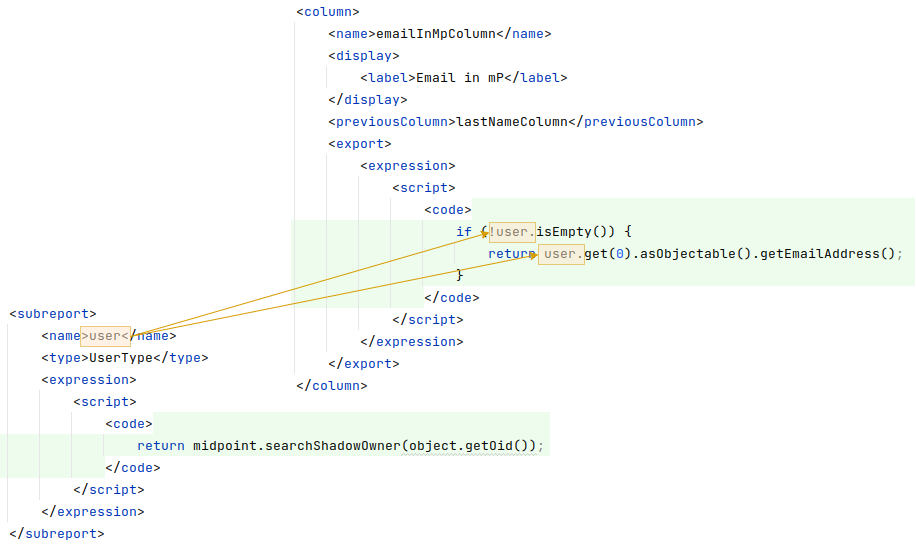

= Report from Collections
:page-nav-title: Report from Collections
:page-display-order: 100
:page-toc: top
:page-keywords: [ 'report', 'collection' ,'collections' ]
:page-upkeep-status: green

== Collection Report

Collection reports generate reports based on Object collection configuration.
Collection reports support audit records, containers and objects, such as users, roles, organizations and so on.
Basic part of configuration for Collection reports are query, columns, parameters, sub-reports and condition.

[%autowidth]
|===
| Name | Type | Description

| _collection_
| *CollectionRefSpecificationType*
| Specification of an explicit or implicit object collection that will be used to select objects for report.

| _view_
| *GuiObjectListViewType*
| Specifies a view of an object collection that is reported.

| _useOnlyReportView_
| *boolean*
| Specifies that during report creation, only view defined in report will be used.
No other views defined outside the report will merger or considered.

| _condition_
| *ExpressionType*
| Condition for the searched objects.
Generated report will contain only objects satisfying the condition.
Condition is used only for generated reports.
Use wisely, performance might suffer.

| _parameter_
| *SearchFilterParameterType*
| Parameter used in filter expression.

| _sub-report_
| *SubreportParameterType*
| Sub-report with expression.

|===

=== Objects to be Reported

Objects to be reported for object collection based reports are defined using the `collection` configuration property.
There are three possibilities how the `collection` can be defined:

* using reference to the existing collection,
* directly configuring the collection attribute without a reference to a base collection,
* combination of previous two options, and so writing filter directly in ghd collection attribute and using reference to existing collection.

Following are examples for how the collection definition might look like:

.**Object collection ** report with object collection *reference*.
[source,xml]
----
<report>
    <name>Collection report 1</name>
    <objectCollection>
        <collection>
            <collectionRef oid="---COLLECTION_OID---" type="ObjectCollectionType"/>
        </collection>
    </objectCollection>
</report>
----

.Object collection report with *filter*.
[source,xml]
----
<report>
    <name>Collection report 2</name>
    <objectCollection>
        <collection>
            <filter>
                <all/>
            </filter>
            <baseCollectionRef>
                <collectionRef oid="---COLLECTION_OID---" type="ObjectCollectionType"/>
            </baseCollectionRef>
        </collection>
    </objectCollection>
</report>
----

If a `collection` contains a reference to an existing collection and a custom filter, midPoint has two filters for the report, one from the report and one from the base collection.
MidPoint makes the conjunction of the filters.
Let's have an example where the first filter says that we want to see users with membership in Organization Evolveum.
The second filter is for users with a role "End user".
As the result we will see users that have the memberships in organization Evolveum and role 'End user' at the same time.

image::collection-query.png[]

[#_collection_columns]
=== Columns

Columns are defined using `view`.
Configuration of `view` can be used at more places in midpoint, such as the configuration in `adminGuiConfiguration`.
For reports, there might be a view defined in report and view defined in object collection.
When the view is defined in both places, merging of these two definitions is performed.

For example, let's have a view defined for report and also view defined for object collection used to generate the report.
Report view contains definition for _Name_ and _Email_ column, while view in object collection contains definition for _Given name_ and _Family name_ columns.
The report generated based on this configuration will contain columns for _Name_, _Email_, _Given name_ and _Family name_.

image::collection-columns.png[]

Of course when we want to use only view in report it is possible by attribute `useOnlyReportView`.

The configuration of columns can be skipped when the report deals with audit records or any midPoint focal object (such as `UserType`, `RoleType`, `ServiceType`,...).
If no custom columns are defined for the report, midPoint will use a default (system defined) view for specific types of objects.
However, when the report is defined for containers, the columns definition cannot be omitted.

The following variables are available in column expressions:

[%autowidth]
|===
| Variable | Description

| `object`
| Contains the whole object for the currently processed row.
This is a single object from the collection, e.g. one result from a query.
If sub-reports are used to multiply rows (see below), this object contains the same object for all such rows.

| `input`
| Contains the value for this column, as extracted from the `object` with the provided `path`.
If no `path` was specified for the column, it has the same value as `object` variable.

| `report`
| xref:/midpoint/reference/misc/reports/configuration/report-functions/[Report Script Library]
provides functions supporting report processing.

| `basic`
| xref:/midpoint/reference/expressions/expressions/script/functions/#basic-library[Basic Library].
Part of standard script evaluator variable set.

| `midpoint`
| xref:/midpoint/reference/expressions/expressions/script/functions/midpoint/[midPoint Script Library].
Part of standard script evaluator variable set.

| `prismContext`
| Prism context component providing access to various Prism related functionality.
Part of standard script evaluator variable set.

| `localizationService`
| Localization service providing message translation functions.
Part of standard script evaluator variable set.

| `log`
| xref:/midpoint/reference/expressions/expressions/script/functions/#midpoint-library[Logging Library].
Part of standard script evaluator variable set.

| sub-report variables
| Variable is present for each sub-report (see below).

| parameter variables
| Variable is present for each parameter (see below).

|===

[#_collection_parameter]
=== Parameters

There are situation when we want to run report with slightly different settings.
In such cases, we don't want to define the report for each case separately.
Rather, we want to have one report definition and run the report with different parameters.
Imagine that you need to report all users who have an account on specific resources.
In such a case, _resource_ will be a parameter for the report, so we don't need to prepare a new report definition for each resource.
The _resource_ parameter will be set before the report is run.
The parameter is set in the "Report configuration before run" modal window when you "Run" the report from the UI.
In the modal window you can see the parameters in the "search" section.

Usage of the parameter is very simple.
We just use the name of the parameter in expression of query.

If the _Report configuration before run_ attribute in an expression is set to "filterAll", the outcome is that if the parameter is not set all values are returned as valid.

image::collection-parameters.png[]

.*Object Collection Report with Parameter*
[%collapsible]
====
sampleRef::samples/reports/report-user-list-advanced.xml[]
====

When you click on the "Run original report" button, a report preview will be generated in a modal window.
In this window you can click the "Run report" button.
This will create a task which will generate the actual report output.
Bear in mind that even the report preview can take some time to generate based on the complexity and size of data.
We have a work package tracking this bug:MID-9648[]

image::collection-parameter-example.png[75%]

We can use following attributes for parameter:

[%autowidth]
|===
| Name | Type | Description

| _name_
| *String*
| Name of parameter.

| _type_
| *QName*
| Type of parameter value.

| _targetType_
| *QName*
| Type of target, when type of parameter value is ObjectReferenceType.

| _allowedValuesLookupTable_
| *ObjectReferenceType*
| Reference of Lookup Table which defines possible values of parameter.

| _allowedValuesExpression_
| *ExpressionType*
| Expression that determines allowed value.
Expected `List<DisplayableValue>`.

|===

[#_sub_reports]
=== Sub-reports

Sub-report is an expression which can be used when we need to collect additional data for the processed object (row).
To avoid performing expensive operations (such as search) in each column (where we would like to use the "additional data"), there is a possibility to execute an expression once per row and use the output later in the column expression.
Please see the example below.

In the example above we have the report where for each shadow (row) we want to search for the owner of the shadow.
Therefore, the sub-report is defined with the expression to look for the shadow owner.
The result of the expression is stored to the property called `user` and later used in the column expression to pull the desired information.
In this case, we need to get the e-mail address of the user.

The return value of the expression in the sub-report is represented as a collection.

We can use the following attributes for a sub-report:

[%autowidth]
|===
| Name | Type | Description

| _name_
| *String*
| Name of the sub-report.

| _type_
| *QName*
| Type of parameter value.

| _order_
| *Integer*
| Order in which this entry is to be evaluated.
Smaller numbers go first.
Entries with no order go last.

| _resultHandling_
| *SubreportResultHandlingType*
| Enables advanced sub-report behavior, like row generation or row elimination.
The element is optional and by default does not generate new rows nor does it drop any.
See the following sections for the details.

|===

After the sub-report is evaluated, it is available as a variable in the subsequent sub-report expressions as well.

The following variables are available in sub-report expressions:

[%autowidth]
|===
| Variable | Description

| `object`
| Contains the whole object for the currently processed row.
This is a single object from the collection, e.g. one result from a query.
If sub-reports are used to multiply rows (see below), this object contains the same object for all such rows.

| `report`
| xref:/midpoint/reference/misc/reports/configuration/report-functions/[Report Script Library]
provides functions supporting report processing.

| `basic`
| xref:/midpoint/reference/expressions/expressions/script/functions/#basic-library[Basic Library].
Part of standard script evaluator variable set.

| `midpoint`
| xref:/midpoint/reference/expressions/expressions/script/functions/midpoint/[midPoint Script Library].
Part of standard script evaluator variable set.

| `prismContext`
| Prism context component providing access to various Prism related functionality.
Part of standard script evaluator variable set.

| `localizationService`
| Localization service providing message translation functions.
Part of standard script evaluator variable set.

| `log`
| xref:/midpoint/reference/expressions/expressions/script/functions/#midpoint-library[Logging Library].
Part of standard script evaluator variable set.

| sub-report variables
| Variable is present for each previous sub-report (with lower order).

| parameter variables
| Variable is present for each parameter (see below).

|===

=== Sub-reports Generating Rows

++++

++++

Sometimes we want to produce multiple rows for one search result.
For example, we want separate rows for each assignment even though we used object search (there is an alternative, you can search for assignments directly).
It is possible to generate rows for values of any other multi-value property.
Another example would be a xref:/midpoint/reference/misc/reports/examples/reference-search-based-report/["Reference search based report"] which further splits its rows depending on the value metadata stored in each reference.

Let's start with a simple example:

[source,xml]
----
<subreport>
    <name>assignment</name>
    <order>1</order>
    <resultHandling>
        <multipleValues>splitParentRow</multipleValues>
    </resultHandling>
    <expression>
        
    </expression>
</subreport>
----

This sub-report takes the result row from the collection (e.g. a user search) and for each
object returns its assignments - and *generates new row for each assignment*.
The only other value of `resultHandling/multipleValues` is `embedInParentRow` - but as this is the default behavior, it is rarely needed.

[WARNING]
Because the new rows are generated after the search was executed, pagination becomes unreliable.
Also, as of 4.7, the report preview functionality does not support reports with `splitParentRow` properly.
The preview does not split the rows properly and content of columns using such sub-report variable is likely invalid.

Now we can use the `assignment` variable in a column:

[source,xml]
----
<column>
    <name>activation</name>
...
    <export>
        <expression>
            
        </expression>
    </export>
</column>
----

Note, that the `assignment` variable provides a single element from the collection returned by its sub-report.
This is the mechanics of `splitParentRow` handling which is more convenient.
In case the sub-report returns no elements, the original row is preserved and `null` value is provided.
That's why we used null-safe dereferencing `?.` in the code above.
Just as a demonstration of `?:` operator, instead of null (unlikely here) we return some default value.

Summary of `splitParentRow` sub-report and its usage:

* Sub-report should return a collection, possibly empty (`null` is treated as empty collection too).
* Row is generated for each element of the collection.
* Sub-report variable in columns contains a single element - or `null` if sub-report returned nothing.
* If sub-report returned nothing (empty collection or null), original row is still preserved.
See the next section with the description of `resultHandling/noValues` element for different behavior.

=== Dropping Parent Row With Sub-reports

++++

++++

In some cases we want to remove rows from the result.
There are traditional options to do that - the best case is to use a `filter`, or you can add a `condition`.
But these options do not work after a previous sub-report generated new rows.
That's where the `resultHandling/noValues` element comes handy.

The default value for this option is `keepParentRow` which is the existing behavior - the row is kept.
When set to `removeParentRow`, the row is eliminated if the return value of the sub-report is `[]` or `null`.
This means that you can generate rows from a single collection result and then filter only the interesting ones.

This can be done also directly in the sub-report that generates the rows, e.g. by using `findAll` in the Groovy code.
But sometimes we want to do more sophisticated processing of each of the sub-rows and prepare a new variable.
That's the prime example of using another sub-report after the sub-report with `splitParentRow`.
If we are not interested in some sub-rows at all, simply return `[]` or `null` from this subsequent sub-report
and specify the `removeParentRow` option on it.

You may also combine generating rows with their elimination in a single report:

* For instance, using just `splitParentRow` (implying `keepParentRow`) always preserves the parent row,
even if the returned value is an empty collection (or null).
For SQL savvy users, this works just like `OUTER JOIN`.

* If you combine `splitParentRow` with `removeParentRow`, the parent row is dropped if the sub-report returns nothing (empty collection or null).
This works just like `INNER JOIN` in the SQL.
This more or less shifts the focus of the report from the originally searched objects to the values returned by this sub-report (e.g. to assignments or some ref targets).

In any case, the wording "parent" is important.
It doesn't have to be the "original" row from the collection.
It may just as well be previously generated row from the sub-report with lower order.
Multiple `splitParentRow` can be chained, although one should cover 90% of cases and more than two are very unlikely.

=== Mixing Normal Sub-reports with Row Generation/Dropping

The following example shows how mixing sub-report with various result handling works:

[source,xml]
----
<subreport>
    <!-- Just for example, object name is hardly a good fit for sub-report. -->
    <name>objectName</name>
    <order>1</order>
    <expression>
        
    </expression>
</subreport>
<subreport>
    <name>assignment</name>
    <order>2</order>
    <resultHandling>
        <multipleValues>splitParentRow</multipleValues>
    </resultHandling>
    <expression>
        
    </expression>
</subreport>
<subreport>
    <name>target</name>
    <order>3</order>
    <resultHandling>
        <noValues>removeParentRow</noValues>
    </resultHandling>
    <expression>
        
    </expression>
</subreport>
----

These sub-reports are in the context of a report based on a collection of users.

The first sub-report is a very simple standard sub-report, that just sets-up the variable `objectName`.
The first sub-report does nothing with the original row, it merely adds an input variable for the following sub-reports and columns.

The second sub-report demonstrates `multipleValues` set to `splitParentRow`.
It may create additional rows for each assignment of the object - but only for objects starting with the character `a`.

* If the object has no assignments, or it doesn't match the condition, empty list (`[]`) is returned.
In that case, original row stays as-is and `assignment` variable will have the value of `null` in the subsequent expressions.
* If there is a single assignment on the object, just one row will be present and the `assignment` variable will hold the assignment value.
* If there are multiple assignment, additional rows are generated for each of them, with the same `object` value provided for them.
Variable `assignment` in the following sub-reports/columns holds a single assignment from the returned collection, each per row.

In any case, the `assignment` variable will be of the `AssignmentHolderType` (or its respective prism value if the script uses `valueVariableMode` set to `prismValue`) or `null`.
It will never be a collection, which is a specific of `splitParentRow` handling and makes it more convenient to work with the sub-report variable.

Finally, there is the third sub-report that tries to resolve target reference from the assignment.
This one demonstrate `noValues` handling set to `removeParentRow`.
Not every assignment has a targetRef, and not every reference points to an existing object.
In both cases, the `target` sub-report would return `null`.
Because no value is returned and `removeParentRow` is specified for this scenario - the row for which the target is null is omitted from the results.

[IMPORTANT]
====
When combining these behaviors, the order obviously matters, and you have to be aware of it - especially when dropping rows.
With the example above, even for a user starting with `a` - if it has no `assignment` with existing targetRef, the row for such user is dropped completely.
This may be what you want - if you're interested in those target objects primarily.
====

If you needed a behavior "show users starting with 'a', optionally with assignment targets, each per row", you'd need to approach it differently:

* You can use `condition` element inside `objectCollection` of the report to filter the users starting with `a`.
* In this case it's also easy to specify this condition as a `filter` for the search query directly - that's always the best way.
* After that you can generate rows for assignments, but filter only those with target refs, for instance:
+
[source,groovy]
----
return object?.assignments?.findAll(a -> a.targetRef != null)
----
+
This would be used in the `assignment` sub-report with `splitParentRow` option.
* Finally, you can resolve these refs, but not dropping the rows to preserve the rows for the owning object.

In any case, with great power comes great responsibility - and both `splitParentRow` and `removeParentRow` behavior gives you a lot of power.

==== Example of Generated Report

In the picture below we can see an example of generated HTML report of all users in midPoint.
Report contains columns for Name, Full Name, Administrative status, Roles, Organizations and Accounts of every user.

image::collection-example.png[75%]

== See Also

- xref:/midpoint/reference/misc/reports/examples/[Report Examples]
- xref:/midpoint/reference/misc/reports/configuration/[Report Configuration]
- xref:/midpoint/reference/misc/reports/configuration/dashboard-report.adoc[Dashboard Based Reports]
- xref:/midpoint/reference/misc/reports/configuration/report-security.adoc[Report Security]
- xref:/midpoint/reference/misc/reports/configuration/report-task-definition.adoc[Report Task Definition]
