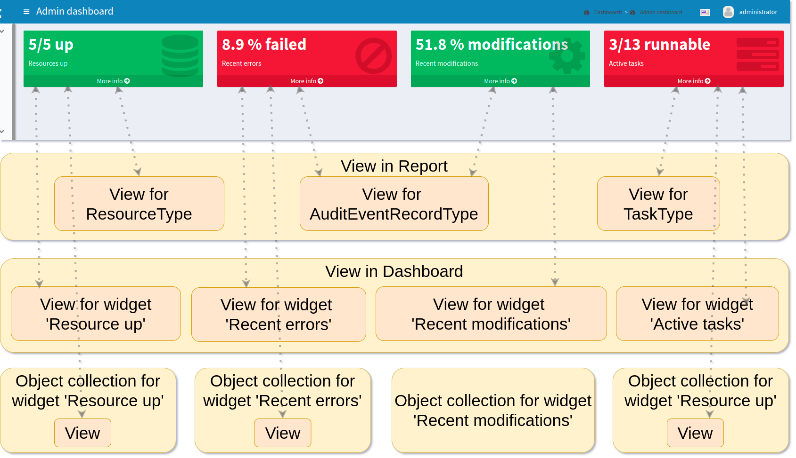
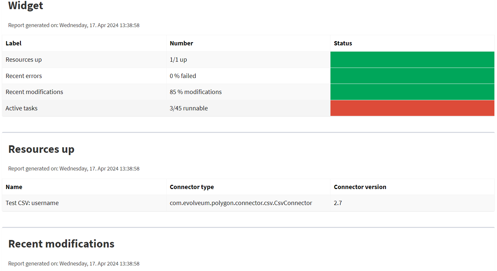

= Report from Dashboard
:page-nav-title: Report from Dashboard
:page-display-order: 200
:page-toc: top
:page-keywords: [ 'report', 'collection' ,'collections' ]
:page-upkeep-status: green

== Dashboard Report

The dashboard engine generates reports based on a xref:/midpoint/reference/admin-gui/dashboards/[Dashboard object].
A dashboard consists out of objects which we call widgets.
This provides the administrator with easy to access information in the form of a custom gui component.
Documentation for dashboard configuration can be found in xref:/midpoint/reference/admin-gui/dashboards/configuration/[Dashboard configuration].

The reports based on dashboards can be exported based on both currently supported file formats, but there is a difference.
CSV contains only the table of widgets with basic message and status.
HTML on the other hand, contains the full widget table and also the information for each object related to the widgets.
We can turn off this default behaviour via attribute _showOnlyWidgetTable_ and show only the table of widgets.

Following code shows basic configuration of dashboard report.

[source,xml]
----
<report>
    <name>System Status Dashboard report</name>
    <dashboard>
        <dashboardRef oid="--OID OF DASHBOARD--" >
        </dashboardRef>
        <showOnlyWidgetsTable>false</showOnlyWidgetsTable>
    </dashboard>
</report>
----

The _view_ (configuration of columns present in the report) can be defined at a couple of places in midPoint.

For example in our picture, in the first line under the screenshot, you can see the views for types `ResourceType`, `AuditEventRecordType` and `TaskType`.

The final view of the widget in a dashboard report is merged from the three levels of definitions for the view.

The view configuration in a report for the type of object, view in a dashboard for widget and from view in an object collection which contains configuration for a widget.
Columns from views are merged in the same way as in a Collection report.
Also, we can use attribute `useOnlyReportView` for using only views defined by report.

When we don't use the _view_ parameters, the report  will contain default columns.
In an expression for a column you can use the variable 'object' which represent the searched object or object defined in the _path_ property.
For more information about view configuration please see xref:/midpoint/reference/admin-gui/collections-views/configuration/#views[Views].

.*Example of View for RoleType*
[source,xml]
----
<presentation>
        ...
        <view>
            <column>
                <name>nameColumn</name>
                <c:path>name</c:path>
                <display>
                    <label>Name</label>
                </display>
            </column>
            <column>
                <name>members</name>
                <display>
                    <label>Members</label>
                </display>
                <previousColumn>nameColumn</previousColumn>
                    <export>
                        <expression>
                            
                        </expression>
                    </export>
            </column>
    </view>
</presentation>
----

.*Example of View in Report*
[source,xml]
----
<report>
    ...
    <dashboard>
        ...
        <view>
            <column>
                <name>givenNameColumn</name>
                <c:path>givenName</c:path>
                <display>
                    <label>Given name</label>
                </display>
            </column>
            <type>UserType</type>
        </view>
        <view>
            <column>
                <name>nameColumn</name>
                <c:path>name</c:path>
                <display>
                    <label>Name</label>
                </display>
            </column>
            <type>RoleType</type>
        </view>
    </dashboard>
</report>
----

=== Report for an Asynchronous Widget

A Dashboard report has two kinds of output.
The most common case is to generate an output file with reported data.
However, it is also possible to save results of a report and use them in a dashboard.
The reason for this is the fact that when we click in the GUI to open a dashboard, midPoint synchronously sends requests to the repository to generate the widgets on the screen.
This is no problem if there are not too many objects, the requests are quick.
In other cases when the request take too long a better solution would be to generate the widget data in advance.
For this we can save a result of a report and use it when we need to present the data on a dashboard widget.

Configuration of Dashboard report contains attribute _storeExportedWidgetData_, and using it you can define whether result of report will be saved to file, widget or both.

[%autowidth]
|===
| Name | Description

| `onlyWidget`
| Exported widget data will be stored only in element of widget.

| `onlyFile`
| Exported widget data will be stored only in file.

| `widgetAndFile`
| Exported widget data will be stored only in element of widget and file.

|===

//TODO check after sampleRef is fully in prod
[%collapsible]
.*Example Report Configuration*
====

link:https://github.com/Evolveum/midpoint-samples/blob/master/samples/dashboard/report-asynchronous-widget.xml[Git]

sampleRef::samples/dashboard/report-asynchronous-widget.xml[]
====

include::/midpoint/docs/admin-gui/dashboards/dashboards-reports-and-recurring-tasks-config-limitation.adoc[]

Please also have a look at the full configuration documentation of asynchronous xref:/midpoint/reference/admin-gui/dashboards/configuration/#_asynchronous_widget[dashboards].

=== Example of Generated Report

On the screenshot, we can see an example of a generated report of a Dashboard report in the HTML format.
On the top, we can see the table of widgets with name, message and status.
Under the table of widgets, the report continues with one table for every widget.

== See Also

- xref:/midpoint/reference/admin-gui/dashboards/index.adoc[Customizable Dashboards]
- xref:/midpoint/reference/misc/reports/examples/[Report Examples]
- xref:/midpoint/reference/misc/reports/configuration/[Report Configuration]
- xref:/midpoint/reference/misc/reports/configuration/collection-report.adoc[Collection Based Reports]
- xref:/midpoint/reference/misc/reports/configuration/report-security.adoc[Report Security]
- xref:/midpoint/reference/misc/reports/configuration/report-task-definition.adoc[Report Task Definition]
