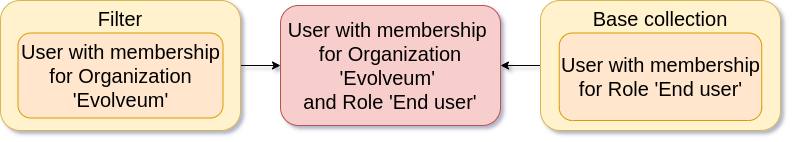
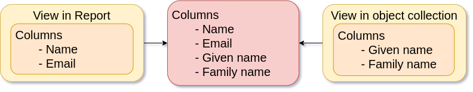
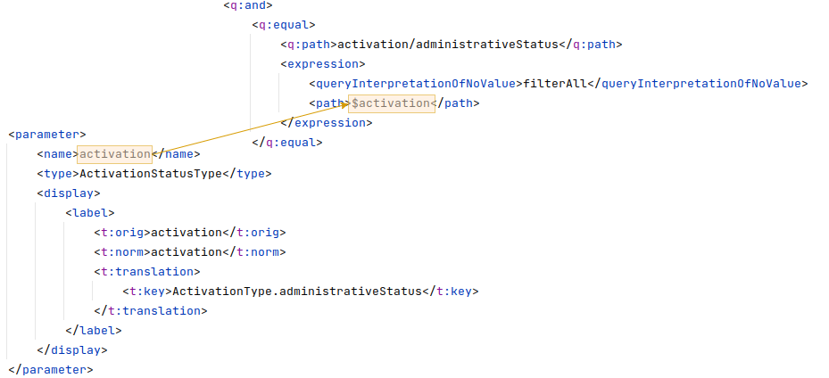
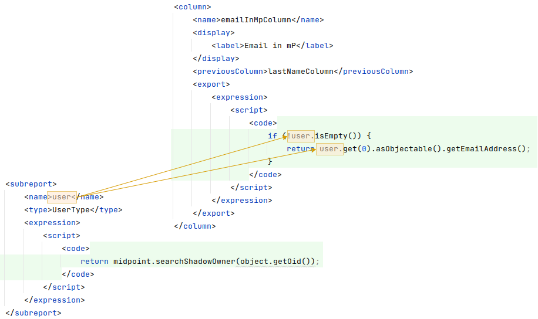
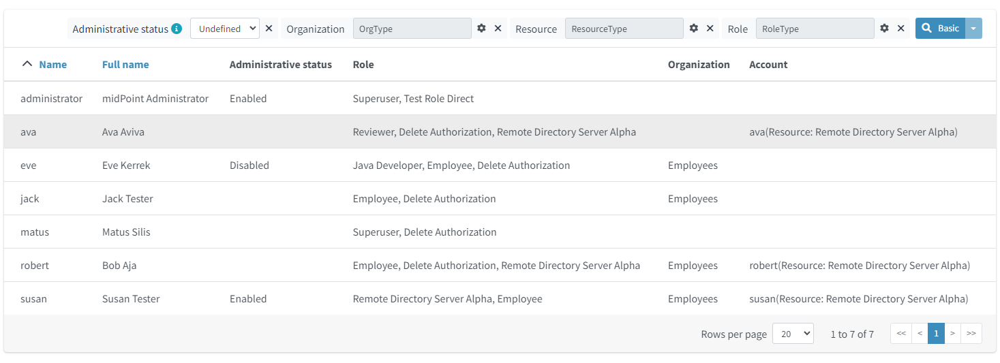
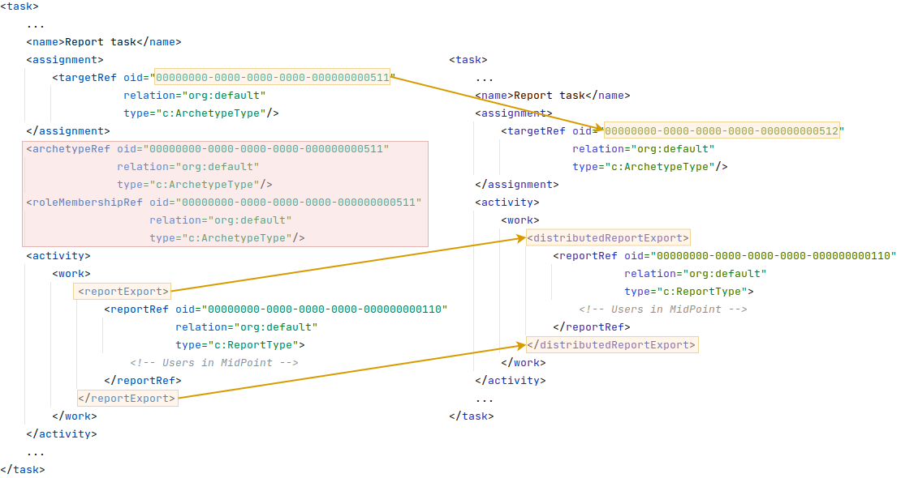

= Report Configuration
:page-since: "4.4"
:page-toc: top
:toclevels: 3

[TIP]
.MidPoint 4.4 and later
This feature is available only in midPoint 4.4 and later.
For configuration before 4.4 please see xref:../configuration-before-4-4/[Report Configuration before midPoint version 4.4].

Native reports are intended to be native reporting mechanism for midPoint.
The aim is to use what midPoint provides without the need for Jasper framework.
Jasper framework was removed in midPoint 4.4.
It is recommended to use reports based on midPoint concepts, namely dashboards or objectCollection.
Current implementation supports exporting reports to CSV and HTML file, other formats such as XSLX are planned to be added later.

One of the requirements for _Native reports_ was supporting multithreading and bucketing.
Since 4.4, multithreading is fully supported for all possible kinds of reported objects such as containers, objects and audit records.
Bucketing is supported for objects and audit records, because currently bucketing of task  don't support containers.

Every report output is stored in _export_ directory in `midPoint.home`.
It is possible to send generated reports via email using notifier handler.

Every report object consists of configuration of three basic parts:

* `behavior` - represents the direction of the report.
There are two possible types of `behavior`: _export_ and _import_.
+
_Export_ behavior represents basic reporting mechanism, where the file with reported objects is generated.
This behavior is default and was common also in versions before 4.4.
+
_Import_ behavior can be used in situations, when the objects need to be imported to the midPoint from external file.
Supported format is the CSV.
Import behavior is experimental.
* `engine` - defines the report generation base.
There are two supported options, reports based on object collections and reports based on dashboard.
Only one can be defined at the same time.
* `fileFormat` - represents format of the generated report file.
Supported formats for now are CSV and HTML.
Default format for the dashboard-based reports is HTML and for object collection based reports is CSV.

All configuration attributes of report:

[%autowidth]
|===
| Name | Type | Description

| _fileFormat_
| *FileFormatConfigurationType*
| Define report output file format.

| _dashboard_
| *DashboardReportEngineConfigurationType*
| Configuration for dashboard-based reports.
When defined, dashboard engine is used to generate reports.

| _objectCollection_
| *ObjectCollectionReportEngineConfigurationType*
| Configuration for object collection-based reports.
When defined, object collection engine is used to generate report.

| _defaultScriptConfiguration_
| *ScriptExpressionEvaluatorConfigurationType*
| Default configuration for the scripts executed inside the report.

| _postReportScript_
| *CommandLineScriptType*
| Command-line script that will be executed after the report is complete and the output file is completely produced.
Output filename will be passed to the script as the "file" argument.

|===

== Export behaviour

For now, export to CSV and HTML is supported.

Configuration attributes:

[%autowidth]
|===
| Name | Type | Description

| _type_
| *FileFormatTypeType*
| Report data type.
Possible values: _csv_ and _html_.

| csv
| *CsvFileFormatType*
| Configuration attribute for CSV export.

| html
| *HtmlFileFormatType*
| Configuration attribute for html export.

|===

=== HTML

Configuration for HTML file format doesn't contain any other attributes.

=== CSV

Configuration for CSV file format contains attributes:

[%autowidth]
|===
| Name | Type | Description | Default

| _multivalueDelimiter_
| *string*
| Multi-value delimiter.
| ,

| _fieldDelimiter_
| *string*
| Field delimiter.
| ;

| _escape_
| *string*
| The escape character of the format.
| \

| _quote_
| *string*
| Character for the quote.
| "

| _quoteMode_
| *QuoteModeType*
| Quote Mode for records.
Possible values is _all, allNonNull, minimal, nonNumeric_ and _none._
| nonNumeric

| _recordSeparator_
| *string*
| Separator of line of record.
| \r\n

| _trailingDelimiter_
| *boolean*
| Define, whether to add a trailing delimiter.
| false

| _trim_
| *boolean*
| Define, whether to trim leading and trailing blanks.
| false

| _createHeader_
| *boolean*
| Create header in CSV output file.
| true

| _encoding_
| *string*
| Encoding of CSV file.
Most common encodings (UTF-8, windows-125x, ISO-8859-x) are supported.

See https://www.iana.org/assignments/character-sets/character-sets.xml[IANA list of charsets]
for proper values - generally, both IANA and MIME names are supported as well as many aliases.
Details of supported character sets depend on the concrete JDK used to run midPoint,
but it is unlikely that your charset is not supported.
| UTF-8

|===

*QuoteModeType*

* `all` - Quotes all fields.

* `allNonNull` - Quotes all non-null fields.

* `minimal` - Quotes fields which contain special characters such as the field delimiter, quotes character or any of the characters in the line separator string.

* `nonNumeric` - Quotes all non-numeric fields.

* `none` - Never quotes fields.
When the delimiter occurs in data, the printer prefixes it with the escape character.
If the escape character is not set, format validation throws an exception.

== Report engine

Report engine is defined with the configuring either `objectCollection` or `dashboard` element in report.

=== Collection report

Collection reports generate reports based on Object collection configuration.
Collection reports support audit records, containers and objects, such as users, roles, organizations and so on.
Basic part of configuration for Collection reports are query, columns, parameters, sub-reports and condition.

[%autowidth]
|===
| Name | Type | Description

| _collection_
| *CollectionRefSpecificationType*
| Specification of an explicit or implicit object collection that will be used to select objects for report.

| _view_
| *GuiObjectListViewType*
| Specifies a view of an object collection that is reported.

| _useOnlyReportView_
| *boolean*
| Specifies that during report creation, only view defined in report will be used.
No other views defined outside the report will merger or considered.

| _condition_
| *ExpressionType*
| Condition for the searched objects.
Generated report will contain only objects satisfying the condition.
Condition is used only for generated reports.
Use wisely, performance might suffer.

| _parameter_
| *SearchFilterParameterType*
| Parameter used in filter expression.

| _subreport_
| *SubreportParameterType*
| Subreport with expression.

|===

==== Objects to be reported

Objects to be reported for object collection based reports are defined using `collection` configuration property.
There are three possibilities how the `collection` can be defined:

* using reference to the existing collection,
* writing filter directly in collection attribute without reference to base collection,
* combination of previous two options, and so writing filter directly in collection attribute and using reference to existing collection.

Following are the examples for what the collection definition might look like.

.Object collection report with object collection reference.
[source,xml]
----
<report>
    <name>Collection report 1</name>
    <reportEngine>collection</reportEngine>
    <objectCollection>
        <collection>
            <collectionRef oid="---COLLECTION_OID---" type="ObjectCollectionType"/>
        </collection>
    </objectCollection>
</report>
----

.Object collection report with filter.
[source,xml]
----
<report>
    <name>Collection report 2</name>
    <reportEngine>collection</reportEngine>
    <objectCollection>
        <collection>
            <filter>
                <all/>
            </filter>
            <baseCollectionRef>
                <collectionRef oid="---COLLECTION_OID---" type="ObjectCollectionType"/>
            </baseCollectionRef>
        </collection>
    </objectCollection>
</report>
----

If `collection` contains reference to existing collection and custom filter, midPoint has two filters for report, one from report and one from base collection.
MidPoint makes the conjunction with the filters.
Let's have an example where the first filter says that we want to see users with membership in Organization Evolveum.
The second filter is for users with role End user.
As the result we will see users that have memberships in organization Evolveum and role 'End user' at the same time.

==== Columns

Columns are defined using `view`.
Configuration for `view` can be used at more places in midpoint, such as configuration in `adminGuiConfiguration`.
For reports, there might be a view defined in report and view defined in object collection.
When the view is defined in both places, merging of these two definitions is performed.

For example, let's have a view defined for report and also view defined for object collection used to generate the report.
Report view contains definition for _Name_ and _Email_ column, while view in object collection contains definition for _Given name_ and _Family name_ columns.
The report generated based on this configuration will contain columns for _Name_, _Email_, _Given name_ and _Family name_.

Of course when we want to use only view in report it is possible by attribute `useOnlyReportView`.

Defining columns can be skipped when report in meant for audit records or any of the midPoint objects (such as `UserType`, `RoleType`, `ServiceType`,...).
If no custom columns are defined for report, midPoint will use default (system defined) view for specific type of object.
However, then the report is defined for containers, the columns definition cannot be omitted.

The following variables are available in column expressions:

[%autowidth]
|===
| Variable | Description

| `object`
| Contains the whole object for the currently processed row.
This is a single object from the collection, e.g. one result from a query.
If subreports are used to multiply rows (see below), this object contains the same object for all such rows.

| `input`
| Contains the value for this column, as extracted from the `object` with the provided `path`.
If no `path` was specified for the column, it has the same value as `object` variable.

| `report`
| xref:/midpoint/reference/misc/reports/report-functions/[Report Script Library]
provides functions supporting report processing.

| `basic`
| xref:/midpoint/reference/expressions/expressions/script/functions/#basic-library[Basic Library].
Part of standard script evaluator variable set.

| `midpoint`
| xref:/midpoint/reference/expressions/expressions/script/functions/midpoint/[midPoint Script Library].
Part of standard script evaluator variable set.

| `prismContext`
| Prism context component providing access to various Prism related functionality.
Part of standard script evaluator variable set.

| `localizationService`
| Localization service providing message translation functions.
Part of standard script evaluator variable set.

| `log`
| xref:/midpoint/reference/expressions/expressions/script/functions/#midpoint-library[Logging Library].
Part of standard script evaluator variable set.

| subreport variables
| Variable is present for each subreport (see below).

| parameter variables
| Variable is present for each parameter (see below).

|===

==== Parameters

There are situation when we want to run report with slightly different settings.
In such cases, we don't want to define the report for each case separately.
Rather, we want to have one report definition and run the report with different parameters.
Imagine that you need to report all users who have account on specific resources.
In such a case, _resource_ will be a parameter to the report, so we don't need to prepare report definition for each resource.
The resource parameter will be set before the report is run.

Usage of the parameter is very simple.
We just use the name of the parameter in expression of query.

.Object collection report with parameter
[source,xml]
----
<report xmlns="http://midpoint.evolveum.com/xml/ns/public/common/common-3"
        xmlns:q="http://prism.evolveum.com/xml/ns/public/query-3"
        xmlns:c="http://midpoint.evolveum.com/xml/ns/public/common/common-3">
	<name>Collection report 2</name>
	<reportEngine>collection</reportEngine>
    <objectCollection>
        <collection>
            <filter>
                <q:ref>
                    <q:path>assignment/construction/resourceRef</q:path>
                    <expression>
                        <queryInterpretationOfNoValue>filterAll</queryInterpretationOfNoValue>
                        
                    </expression>
                </q:ref>
            </filter>
        </collection>
        <view>
            <type>UserType</type>
        </view>
        <parameter>
            <name>resource</name>
            <type>c:ObjectReferenceType</type>
            <targetType>c:ResourceType</targetType>
            <display>
                <label>
                    <orig>resource</orig>
                    <translation>
                        <key>ObjectTypeGuiDescriptor.resource</key>
                    </translation>
                </label>
            </display>
        </parameter>
    </objectCollection>
</report>
----

We can use following attributes for parameter:

[%autowidth]
|===
| Name | Type | Description

| _name_
| *String*
| Name of parameter.

| _type_
| *QName*
| Type of parameter value.

| _targetType_
| *QName*
| Type of target, when type of parameter value is ObjectReferenceType.

| _allowedValuesLookupTable_
| *ObjectReferenceType*
| Reference of Lookup Table which defines possible values of parameter.

| _allowedValuesExpression_
| *ExpressionType*
| Expression that determines allowed value.
Expected `List<DisplayableValue>`.

|===

==== Subreports

Subreport is defined by expression and can be used in situations when we need to collect additional information for the processed object (row).
To avoid performing expensive operations (such as search) for each column, there is a possibility to define it once per row and use it later in the column expression as in the example below.

In the example above, we have the report, where for each shadow (row) we want to search for the owner of the shadow.
Therefore, the subreport is defined with the expression to look for the shadow owner.
The result of the expression is stored to the property called `user` and later used in the column expression to pull the desired information.
In this case, we need to get the e-mail address of the user.

The return from the expression in subreport is represented by the collection.

We can use following attributes for subreport:

[%autowidth]
|===
| Name | Type | Description

| _name_
| *String*
| Name of subreport.

| _type_
| *QName*
| Type of parameter value.

| _order_
| *Integer*
| Order in which this entry is to be evaluated.
Smaller numbers go first.
Entries with no order go last.

| _resultHandling_
| *SubreportResultHandlingType*
| Enables advanced subreport behavior, like row generation or row elimination.
The element is optional and by default does not generate new rows nor does it drop any.
See the following sections for the details.

|===

After the subreport is evaluated, it is available as a variable in the subsequent subreport expressions as well.

The following variables are available in subreport expressions:

[%autowidth]
|===
| Variable | Description

| `object`
| Contains the whole object for the currently processed row.
This is a single object from the collection, e.g. one result from a query.
If subreports are used to multiply rows (see below), this object contains the same object for all such rows.

| `report`
| xref:/midpoint/reference/misc/reports/report-functions/[Report Script Library]
provides functions supporting report processing.

| `basic`
| xref:/midpoint/reference/expressions/expressions/script/functions/#basic-library[Basic Library].
Part of standard script evaluator variable set.

| `midpoint`
| xref:/midpoint/reference/expressions/expressions/script/functions/midpoint/[midPoint Script Library].
Part of standard script evaluator variable set.

| `prismContext`
| Prism context component providing access to various Prism related functionality.
Part of standard script evaluator variable set.

| `localizationService`
| Localization service providing message translation functions.
Part of standard script evaluator variable set.

| `log`
| xref:/midpoint/reference/expressions/expressions/script/functions/#midpoint-library[Logging Library].
Part of standard script evaluator variable set.

| subreport variables
| Variable is present for each previous subreport (with lower order).

| parameter variables
| Variable is present for each parameter (see below).

|===

==== Subreports generating rows

++++

++++

Sometimes we want to produce multiple rows for one search result.
For example, we want separate row for each assignment even though we used object search
(there is an alternative, you can search for assignments directly).
It is possible to generate rows for values of any other multi-value property.
Another example would be xref:/midpoint/reference/misc/reports/examples/reference-search-based-report/[Reference search based report]
which further splits its rows depending on the value metadata stored in each reference.

Let's start with a simple example:

[source,xml]
----
<subreport>
    <name>assignment</name>
    <order>1</order>
    <resultHandling>
        <multipleValues>splitParentRow</multipleValues>
    </resultHandling>
    <expression>
        
    </expression>
</subreport>
----

This subreport takes the result row from the collection (e.g. a user search) and for each
object returns its assignments - and *generates new row for each assignment*.
The only other value of `multipleValues` is `embedInParentRow` - but as this is the default behavior, it is rarely needed.

[WARNING]
Because the new rows are generated after the search was executed, pagination becomes unreliable.
Also, as of 4.7, the report preview functionality does not support reports with `splitParentRow` properly.
The preview does not split the rows properly and content of columns using such subreport variable is likely invalid.

Now we can use `assignment` variable in a column like this:

[source,xml]
----
<column>
    <name>activation</name>
...
    <export>
        <expression>
            
        </expression>
    </export>
</column>
----

Note, that the `assignment` variable provides a single element from the collection returned by its subreport.
This is the mechanics of `splitParentRow` handling and is more convenient.
In case the subreport returns no elements, the original row is preserved and `null` value is provided.
That's why we used null-safe dereferencing `?.` in the code above.
Just as a demonstration of `?:` operator, instead of null (unlikely here) we return some default value.

Summary of `splitParentRow` subreport and its usage:

* Subreport should return a collection, possibly empty (`null` is treated as empty collection too).
* Row is generated for each element of the collection.
* Subreport variable in columns contains a single element - or `null` if subreport returned nothing.
* If subreport returned nothing (empty collection or null), original row is still preserved.
See the next section with the discussion of `resultHandling/noValues` element for different behavior.

==== Dropping parent row with subreports

++++

++++

In some cases we want to remove rows from the result.
There are traditional options to do that - the best case is to use the `filter`, or you can add a `condition`.
But these options do not work after a previous subreport generated new rows.
That's where the `resultHandling/noValues` element comes handy.

The default value for this option is `keepParentRow` which is the existing behavior - the row is kept.
When set to `removeParentRow`, the row is eliminated if the return value of the subreport is `[]` or `null`.
This means that you can generate rows from a single collection result and then filter only the interesting ones.

This can be done also directly in the subreport that generates the rows, e.g. by using `findAll` in the Groovy code.
But sometimes we want to do more sophisticated processing of each of the sub-rows and prepare a new variable.
That's the prime example of using another subreport after the subreport with `splitParentRow`.
If we are not interested in some sub-rows at all, simply return `[]` or `null` from this subsequent subreport
and specify the `removeParentRow` option on it.

You may also combine generating rows with their elimination in a single report:

* For instance, using just `splitParentRow` (implying `keepParentRow`) always preserves the parent row,
even if the returned value is an empty collection (or null).
For SQL savvy users, this works just like `OUTER JOIN`.

* If you combine `splitParentRow` with `removeParentRow`, the parent row is dropped if the subreport returns nothing (empty collection or null).
This works just like `INNER JOIN` in the SQL.
This more or less shifts the focus of the report from the originally searched objects to the values retruned by this subreport (e.g. to assignments or some ref targets).

In any case, the wording "parent" is important.
It doesn't have to be the "original" row from the collection.
It may just as well be previously generated row from the subreport with lower order.
Multiple `splitParentRow` can be chained, although one should cover 90% of cases and more than two are very unlikely.

==== Mixing normal subreports with row generation/dropping

The following contrived example shows how mixing subreport with various result handling works:

[source,xml]
----
<subreport>
    <!-- Just for example, object name is hardly a good fit for subreport. -->
    <name>objectName</name>
    <order>1</order>
    <expression>
        
    </expression>
</subreport>
<subreport>
    <name>assignment</name>
    <order>2</order>
    <resultHandling>
        <multipleValues>splitParentRow</multipleValues>
    </resultHandling>
    <expression>
        
    </expression>
</subreport>
<subreport>
    <name>target</name>
    <order>3</order>
    <resultHandling>
        <noValues>removeParentRow</noValues>
    </resultHandling>
    <expression>
        
    </expression>
</subreport>
----

These subreports are in the context of a report based on a collection of users.

The first subreport is a very simple standard subreport, that just prepares the variable `objectName`.
As mentioned in the comment, it is very simple and not heavy on processing, that it would not require a subreport.
But it demonstrates the option to reuse it in the following subreports.
The first subreport does nothing with the original row, it merely adds additional input variable for the following subreports and columns.

The second subreport demonstrates `multipleValues` set to `splitParentRow`.
It may create additional rows for each assignment of the object - but only for objects starting with `a`.

* If the object has no assignments or it doesn't match the condition, empty list (`[]`) is returned.
In that case, original row stays as-is and `assignment` variable will have value of `null` in the subsequent expressions.
* If there is a single assignment on the object, there is still just one row and `assignment` variable will hold the assignment value.
* If there are multiple assignment, rows are generated for each of them, with the same `object` value provided for them.
Variable `assignment` in the following subreports/columns holds a single assignment from the returned collection, each per row.

In any case, `assignment` variable will be of `AssignmentHolderType` (or its respective prism value if the script uses `valueVariableMode` set to `prismValue`) or `null`.
It will never be a collection, which is a specifics of `splitParentRow` handling and makes it more convenient to work with the subreport variable.

Finally, there is the third subreport that tries to resolve target reference from the assignment.
This one demonstrate `noValues` handling set to `removeParentRow`.
Not every assignment has a targetRef, and not every reference points to an existing object.
In both cases, the `target` subreport would return `null`; not that `resolveReferenceIfExists` function is null-safe and returns null for null input.
Because no value is returned and `removeParentRow` is specified for this scenario - the row for which the target is null is omitted from the results.

[IMPORTANT]
====
When combining these behaviors, the order obviously matters and you have to be aware of it - especially when dropping rows.
With the example above, even for user starting with `a` - if it has no `assignment` with existing targetRef, the row for such user is dropped completely.
This may be what you want - if you're interested in those target objects primarily.
====

If you needed a behavior "show users starting with 'a', optionally with assignment targets, each per row", you'd need to approach it differently:

* You can use `condition` element inside `objectCollection` of the report to filter the users starting with `a`.
* In this case it's also easy to specify this condition as a `filter` for the search query directly - that's always the best way.
* After that you can generate rows for assignments, but filter only those with target refs, for instance:
+
[source,groovy]
----
return object?.assignments?.findAll(a -> a.targetRef != null)
----
+
This would be used in the `assignment` subreport with `splitParentRow` option.
* Finally, you can resolve these refs, but not dropping the rows to preserve the rows for the owning object.

If you wanted just a single row for multiple unresolved targetRefs, the things get complicated, but that is already beyond the scope of this example.
It's probably better to get `assignment.targetRef.oid` into one of the columns and use that to deal with the broken references instead.

In any case, with great power comes great responsibility - and both `splitParentRow` and `removeParentRow` behavior gives you a lot of power.

==== Example of generated report

In the picture below we can see example of generated HTML report of all users in midPoint.
Report contains columns for Name, Full Name, Administrative status, Roles, Organizations and Accounts of every user.

=== Dashboard Report

Dashboard engine generates reports by dashboard object.
Dashboard object can be shown in GUI.
Dashboard contains widgets, which showed actual state of midpoint.
Documentation for dashboard configuration can be found in xref:/midpoint/reference/admin-gui/dashboards/configuration/[Dashboard configuration].

Dashboards support both currently supported file formats, but there is a difference.
CSV contains only table of widget with basic message and status, unlike HTML, which as default showing table for widgets and one table for every widget with objects which meet the condition in widget.
We can turn off this default behaviour via attribute _showOnlyWidgetTable_ and show only table of widgets.

Following code shows basic configuration of dashboard report.

[source,xml]
----
<report>
    <name>System Status Dashboard report</name>
    <reportEngine>dashboard</reportEngine>
    <dashboard>
        <dashboardRef oid="--OID OF DASHBOARD--" >
        </dashboardRef>
        <showOnlyWidgetsTable>false</showOnlyWidgetsTable>
    </dashboard>
</report>
----

Configuration for dashboard report contains definition for _view_, _view_ attribute in dashboard report is multivalue.
We can configure view for every type of objects, which are showed via widgets.
View defines columns of table in report.

image::dashboard-view.png[]

For example in our example it is first line under screenshot.
We can see views for types `ResourceType`, `AuditEventRecordType` and `TaskType`.

The final view of widget is merged from three levels of view.
View in report for type of object, view in dashboard for widget and from view in object collection which contains configuration for widget.
Columns from views are merged in a same way as in Collection report.
Also, we can use attribute `useOnlyReportView` for using only view defined by report.

When we don't use view, report will be contained default columns.
In expression of column you can use variable 'object' which represent searched object or object defined in tag _path_.
For more information about view configuration please see xref:/midpoint/reference/admin-gui/collections-views/configuration/#views[Views].

.Example of view for RoleType
[source,xml]
----
<presentation>
        ...
        <view>
            <column>
                <name>nameColumn</name>
                <c:path>name</c:path>
                <display>
                    <label>Name</label>
                </display>
            </column>
            <column>
                <name>members</name>
                <display>
                    <label>Members</label>
                </display>
                <previousColumn>nameColumn</previousColumn>
                    <export>
                        <expression>
                            
                        </expression>
                    </export>
            </column>
    </view>
</presentation>
----

.Example of view in Report
[source,xml]
----
<report>
    ...
    <dashboard>
        ...
        <view>
            <column>
                <name>givenNameColumn</name>
                <c:path>givenName</c:path>
                <display>
                    <label>Given name</label>
                </display>
            </column>
            <type>UserType</type>
        </view>
        <view>
            <column>
                <name>nameColumn</name>
                <c:path>name</c:path>
                <display>
                    <label>Name</label>
                </display>
            </column>
            <type>RoleType</type>
        </view>
    </dashboard>
</report>
----

==== Report for asynchronous widget

Dashboard report has two kinds of output.
Common case is to generated output file with reported data.
However, it is also possible to save results of report to dashboard which configuration was used for generating report.
Maybe you ask why? It is very simple, when we click in GUI for showing dashboard, midpoint synchronously send requests to repository for objects because of generating widget on screen.
It is all right if we do not have many objects and requests are quick.
But when we have to wait very long for showing page with widgets we can use saving result of report to dashboard and next configure dashboard in order to show this value.

Configuration of Dashboard report contains attribute _storeExportedWidgetData_, and using it you can define whether result of report will be save to file, widget or both.

[%autowidth]
|===
| Name | Description

| `onlyWidget`
| Exported widget data will be stored only in element of widget.

| `onlyFile`
| Exported widget data will be stored only in file.

| `widgetAndFile`
| Exported widget data will be stored only in element of widget and file.

|===

==== Example of generated report

On screenshot we can see example generated report of Dashboard report in HTML format.
On top we see table of widgets with name, message and status.
Under table of widgets, report continue with one table for every widget.

image::dashboard-example.png[]

== Creating of report

We have two choices for it.
One of the choices is using classical flow for creating new object, so we find Report menu item on left side of screen and select new Report

Second simplify way how to create report is to click on 'Create report' under table on object list pages (e.g. All users page).

image::users.png[]

After click you will be redirected to Create report page with predefined filter from search panel over object table and columns from previous table.

== Tasks for reports

If we create new report via GUI in 4.4.
Midpoint create task with work definition of activity with 'classcal' way for actual kind of report.
We know three kind of activities for reports.

=== ClassicReportExportWorkDefinitionType 'reportExport'

Exports any report in a "classical" way.
Supports multithreading but not bucketing (multi-node mode).
Support objects, containers and audit reports.
Contains two parameter 'reportRef' and 'reportParam'.
'reportRef' represent reference to report object.
'reportParam' represent parameters for report, which are defined via GUI.

=== ClassicReportImportWorkDefinitionType 'reportImport'

Imports a report in a "classical" way.
Supports multithreading but not bucketing (multi-node mode).
Contains only one parameter 'reportRef'.

=== DistributedReportExportWorkDefinitionType 'distributedReportExport'

Exports report of repository objects or audit reports.
Supports bucketing (multi-node mode) and multithreading.
Contains two parameter 'reportRef' and 'reportParam'.
'reportRef' represent reference to report object.
'reportParam' represent parameters for report, which are defined via GUI.

=== Convert ClassicReportExportWorkDefinitionType to DistributedReportExportWorkDefinitionType

If we running report via GUI, then the task with classic report export definition will be created.
If we are running report for objects or audit records and Midpoint is running in clustered mode, then we can convert the 'classical' way to distributed.
We can rewrite it by modifying its xml configuration.
In the configuration of task in raw mode we change 'reportExport' to 'distributedReportExport'.
We change archetype from 'Report export task' to 'Distributed report export task', by changing oid for assignment, that define archetype.
Next we remove current arhetypeRef and rolememberRef attributes for old archetype.
And finally we add configuration for xref:/midpoint/devel/design/multi-node-partitioned-and-stateful-tasks/[Bucket-based work state management].

Also we can create new task with distributed report export definition and set reference to our report.

== Import behaviour 'Import report'

Since version 4.2, midPoint supports 'import report'/'reverse report'.
This feature is *xref:/midpoint/versioning/experimental/[experimental]*.
Report output generated by midPoint can also be used in reverse way - you can import it back to midPoint.
In addition, it is also possible to import custom defined report output.
Midpoint support two kind of import configuration.
Configuration for Object import and Import script.

=== Object import

MidPoint has to understand the report output data structure to preform import correctly.
This is configured in report (ReportType), in similar way as for exporting.
For now, only _ObjectCollectionReportEngineConfigurationType_ and CSV format is supported (CSV FileFormatType).

Example of imported file:

.CSV file
[source,csv]
----
"Name";"Administrative status";"Valid from";"Nick";"AssignmentOid";"Subtype"
"testUser01";"enabled";"2020-07-07T00:00:00.000+02:00";"nick1";"00000000-0000-0000-0000-000000000008,00000000-0000-0000-0000-000000000004";"sub1,sub22"
"testUser02";"enabled";"2020-07-07T00:00:00.000+02:00";"NICK2";;
----

....
Example below shows report (ReportType) configuration for importing CSV file with header and two records above.
....

.Report-JSON
[source,json]
----
{
  "@ns" : "http://midpoint.evolveum.com/xml/ns/public/common/common-3",
  "report" : {
    "name" : "Object Collection import report with view",
    "objectCollection" : {
      "view" : {
        "column" : [ {
          "name" : "nameColumnCollection",
          "path" : "name",
          "display" : {
            "label" : "Name (Collection)"
          }
        }, {
          "name" : "activationColumn",
          "path" : "activation/administrativeStatus",
          "previousColumn" : "nameColumnCollection"
        }, {
          "name" : "validFromColumn",
          "path" : "activation/validFrom",
          "previousColumn" : "activationColumn"
        }, {
          "name" : "nickColumn",
          "path" : "nickName",
          "display" : {
            "label" : "Nick"
          },
          "previousColumn" : "validFromColumn",
          "import" : {
            "expression" : {
              "script" : [ {
                "@type" : "http://midpoint.evolveum.com/xml/ns/public/common/common-3#ScriptExpressionEvaluatorType",
                "code" : "import com.evolveum.midpoint.prism.polystring.PolyString\n\n                                return new PolyString(\"New nick: \" + input)\n                            "
              } ]
            }
          }
        }, {
          "name" : "assignmentColumn",
          "path" : "assignment",
          "display" : {
            "label" : "AssignmentOid"
          },
          "previousColumn" : "nickColumn",
          "import" : {
            "expression" : {
              "script" : [ {
                "@type" : "http://midpoint.evolveum.com/xml/ns/public/common/common-3#ScriptExpressionEvaluatorType",
                "code" : "\n                                import com.evolveum.midpoint.xml.ns._public.common.common_3.AssignmentType;\n                                import com.evolveum.midpoint.xml.ns._public.common.common_3.ObjectReferenceType;\n                                import com.evolveum.midpoint.xml.ns._public.common.common_3.RoleType;\n\n                                assignments = new ArrayList();\n\n                                for (String oid : input) {\n                                    if (oid != null) {\n                                        role = new ObjectReferenceType();\n                                        role.setOid(oid);\n                                        role.setType(RoleType.COMPLEX_TYPE);\n\n                                        AssignmentType assignment = new AssignmentType();\n                                        assignment.asPrismContainerValue()\n                                        assignment.setTargetRef(role);\n                                        assignments.add(assignment)\n                                    }\n                                }\n                                return assignments\n                            "
              } ]
            }
          }
        }, {
          "name" : "subtypeColumn",
          "path" : "subtype",
          "previousColumn" : "assignmentColumn"
        } ],
        "type" : "UserType"
      }
    },
    "behavior" : {
      "direction" : "import"
    }
  }
}
----

.Report-XML
[source,xml]
----
<report>
    <name>Object Collection import report with view</name>
    <objectCollection>
        <view>
            <column>
                <name>nameColumnCollection</name>
                <path>name</path>
                <display>
                    <label>Name (Collection)</label>
                </display>
            </column>
            <column>
                <name>activationColumn</name>
                <path>activation/administrativeStatus</path>
                <previousColumn>nameColumnCollection</previousColumn>
            </column>
            <column>
                <name>validFromColumn</name>
                <path>activation/validFrom</path>
                <previousColumn>activationColumn</previousColumn>
            </column>
            <column>
                <name>nickColumn</name>
                <path>nickName</path>
                <display>
                    <label>Nick</label>
                </display>
                <previousColumn>validFromColumn</previousColumn>
                <import>
                    <expression>
                        
                    </expression>
                </import>
            </column>
            <column>
                <name>assignmentColumn</name>
                <path>assignment</path>
                <display>
                    <label>AssignmentOid</label>
                </display>
                <previousColumn>nickColumn</previousColumn>
                <import>
                    <expression>
                        
                    </expression>
                </import>
            </column>
            <column>
                <name>subtypeColumn</name>
                <path>subtype</path>
                <previousColumn>assignmentColumn</previousColumn>
            </column>
            <type>UserType</type>
        </view>
    </objectCollection>
    <behavior>
        <direction>import</direction>
<!-- In case of non raw execution -->
<!--        <importOptions>-->
<!--            <modelExecutionOptions>-->
<!--                <raw>false</raw>-->
<!--            </modelExecutionOptions>-->
<!--        </importOptions>-->
    </behavior>
</report>

----

==== Behaviour and Options

We need define that this report is import and not export, for this we need define element _behavior_.
_Behavior_  contains direction _Import_ or _Export_.
Also _behavior_ contains _importOptions_, which contains next elements:

[%autowidth]
|===
| Name | Description | Type

| *overwrite*
| If set to a true value it will cause that objects that are already in the repository will be overwritten by the imported objects.
It may not be applicable to all import types.
E.g. it makes no sense for import from resource, as this is not storing objects in the repository directly.
| *boolean*

| *keepOid*
| If set to a true value it will cause that objects that overwritten objects will reuse the same OID as previous objects.
May be potentially dangerous.
USE WITH CARE.
| *boolean*

| *stopAfterErrors*
| Number of errors that will cause import to stop.
If set to one the import will stop on first error.
If set to zero or negative value the import will not stop on any error.
| *int*

| *summarizeSucceses*
| If set to true the successfully imported items will be summarized in the result.
WARNING: setting this to false may result in a very large result structure and may cause overflow of the system memory.
| *boolean*

| *summarizeErrors*
| If set to true the import errors will be summarized in the result.
| *boolean*

| *referentialIntegrity*
|

| *boolean*

| *validateStaticSchema*
|

| *boolean*

| *validateDynamicSchema*
|

| *boolean*

| *encryptProtectedValues*
|

| *boolean*

| *fetchResourceSchema*
|

| *boolean*

| *keepMetadata*
| If set to true then the importer will keep the metadata from the source file.
If set to false then the imported will re-generate metadata on each object.
| *boolean*

| *modelExecutionOptions*
| If present, these options are used for adding objects into the repository.
Null option values might be overridden by import-related options.
In particular, the missing "raw" option is overridden to "true".
So, if you want the operation run in non-raw mode, set "raw" option to "false" (e.g. runs also global templates, policy configuration, etc...).
| *ModelExecuteOptionsType*

| *compatMode*
| Compatibility model.
If selected then the data parsing will be less strict.
E.g. removed element will be ingnored.
| *boolean*

|===

In previous example of report we define mapping values from columns to items in new object.
Name of column in CSV file have to be same as name defined in view.
Definition of name from view have some rules.
Name is obtained from _Label_ of _DispalyType_ for column, when _Label_ is empty, then Midpoint finds name for item from item definition based on _Path_ element in column.

Definition of column also contains _import/expression_ which can define script for generating items.
Script have to return real value for example _String_ or _List_ of values for multivalue items for example _List<AssignmentType>_.
Script get _input_ variable which is _String_, when item is singlevalue, or _List<String>_, when item is multivalue.

=== Import script

We can define _importScript_ in element _behaviour_.
Import script is _ExecuteScriptType_ type, so we can define more actions.
Script contains variables with same name as headers of imported CSV file.
For example from next file will be created variables with names _username, role_name, action, valid_from_ and _valid_to_.

Example of imported file:

.CSV file
[source,csv]
----
"username";"role_name";"action";"valid_from";"valid_to"
"testUser02";"Superuser";"A";"2018-01-01";"2018-05-01"
"testUser01";"Superuser";"D";;
"fakeUser";"Superuser";"M";"2018-01-01";"2018-05-01"
"jack";"Superuser";"M";"2018-01-01";"2018-05-01"
"jack";"FakeRole";"M";"2018-01-01";"2018-05-01"
"jack";"Superuser";;"2018-01-01";"2018-05-01"
----

In next example we add/modify/delete assignment on user defined variable _username_ (in first line 'testUser02').
Operation define variable _action_ ('A'=add, 'M'=modify, 'R'=remove).
Target of assignment define via name of role variable _role_name_.
Variables _valid_from_ and _valid_to_ define property _activation/validFrom_ and _activation/validTo_ of assignment.

.Example of Import script - XML
[source,xml]
----
<report>
    <name>Report with import script</name>
    <behavior>
        <importScript xmlns:c="http://midpoint.evolveum.com/xml/ns/public/common/common-3"
                      xmlns:s="http://midpoint.evolveum.com/xml/ns/public/model/scripting-3">
            <s:options>
                <s:continueOnAnyError>true</s:continueOnAnyError>
            </s:options>
            <s:pipeline>
                <s:search  xmlns:q="http://prism.evolveum.com/xml/ns/public/query-3">
                    <s:type>UserType</s:type>
                    <s:searchFilter>
                        <q:equal>
                            <q:path>name</q:path>
                            <c:expression>
                                <c:script>
                                    <c:code>username</c:code>
                                </c:script>
                            </c:expression>
                        </q:equal>
                    </s:searchFilter>
                </s:search>
                <s:execute>
                    <s:forWholeInput>true</s:forWholeInput>
                    <s:script>
                        <s:code>
                            if (input == null || input.getData().isEmpty()){
                                log.error("Couldn't find user with name" + username + ". Skip this line.")
                            }
                        </s:code>
                    </s:script>
                </s:execute>
                <s:modify>
                    <s:parameter>
                        <s:name>delta</s:name>
                        <s:execute>
                            <s:parameter>
                                <s:name>outputItem</s:name>
                                <c:value>ObjectDeltaType</c:value>
                            </s:parameter>
                            <s:script>
                                <s:code>
                                    import com.evolveum.midpoint.xml.ns._public.common.common_3.AssignmentType;
                                    import com.evolveum.midpoint.xml.ns._public.common.common_3.ObjectReferenceType;
                                    import com.evolveum.midpoint.xml.ns._public.common.common_3.RoleType;
                                    import com.evolveum.midpoint.xml.ns._public.common.common_3.UserType;
                                    import com.evolveum.midpoint.xml.ns._public.common.common_3.ActivationType;
                                    import java.text.SimpleDateFormat;
                                    import java.util.GregorianCalendar;
                                    import com.evolveum.midpoint.prism.equivalence.EquivalenceStrategy;
                                    import javax.xml.datatype.DatatypeFactory;
                                    import com.evolveum.midpoint.schema.DeltaConvertor;

                                    log.info("-----------START-----------");
                                    log.info("username: " + username);
                                    log.info("role_name: " + role_name);
                                    log.info("action: " + action);
                                    log.info("valid_from: " + valid_from);
                                    log.info("valid_to: " + valid_to);
                                    log.info("input: " + input);

                                    user = input;
                                    userBefore = user.clone();
                                    role = midpoint.searchObjectByName(RoleType.class, role_name);
                                    if (role == null) {
                                        log.error("Couldn't find role with name " + role_name);
                                        return null;
                                    }
                                    if (action.equals("A")) {
                                        roleRef = new ObjectReferenceType();
                                        roleRef.setOid(role.getOid());
                                        roleRef.setType(RoleType.COMPLEX_TYPE);
                                        AssignmentType assignment = new AssignmentType();
                                        assignment.setTargetRef(roleRef);

                                        if (valid_from != null || valid_to != null) {
                                            activation = new ActivationType();
                                            format = new SimpleDateFormat("yyyy-MM-dd");
                                            if (valid_from != null) {
                                                date = format.parse(valid_from);
                                                cal = new GregorianCalendar();
                                                cal.setTime(date);
                                                xmlGregCal =  DatatypeFactory.newInstance().newXMLGregorianCalendar(cal);
                                                activation.setValidFrom(xmlGregCal);
                                            }

                                            if (valid_to != null) {
                                                date = format.parse(valid_to);
                                                cal = new GregorianCalendar();
                                                cal.setTime(date);
                                                xmlGregCal = DatatypeFactory.newInstance().newXMLGregorianCalendar(cal);
                                                activation.setValidTo(xmlGregCal);
                                            }
                                            assignment.setActivation(activation);
                                        }
                                        user.getAssignment().add(assignment);
                                    } else if (action.equals("M")) {
                                        for (AssignmentType assignment : user.getAssignment()) {
                                            if (assignment.getTargetRef() != null &amp;&amp; role.getOid().equals(assignment.getTargetRef().getOid())) {
                                                if (valid_from != null || valid_to != null) {
                                                    activation = new ActivationType();
                                                    format = new SimpleDateFormat("yyyy-MM-dd");
                                                    if (valid_from != null) {
                                                        date = format.parse(valid_from);
                                                        cal = new GregorianCalendar();
                                                        cal.setTime(date);
                                                        xmlGregCal =  DatatypeFactory.newInstance().newXMLGregorianCalendar(cal);
                                                        activation.setValidFrom(xmlGregCal);
                                                    }

                                                    if (valid_to != null) {
                                                        date = format.parse(valid_to);
                                                        cal = new GregorianCalendar();
                                                        cal.setTime(date);
                                                        xmlGregCal = DatatypeFactory.newInstance().newXMLGregorianCalendar(cal);
                                                        activation.setValidTo(xmlGregCal);
                                                    }
                                                    assignment.setActivation(activation);
                                                }
                                                break;
                                            }
                                        }
                                    } else if (action.equals("D")) {
                                        for (AssignmentType assignment : user.getAssignment()) {
                                            if (assignment.getTargetRef() != null &amp;&amp; role.getOid().equals(assignment.getTargetRef().getOid())) {
                                                user.getAssignment().remove(assignment);
                                                break;
                                            }
                                        }
                                    } else {
                                        log.error("Action column have unexpected value '" + action + "'")
                                        return null;
                                    }
                                    if (userBefore.equals(user)) {
                                        log.error("Couldn't create delta, because user before executing of script is same as after executing of script.")
                                        return null;
                                    }
                                    delta = userBefore.asPrismObject().diff(user.asPrismObject(), EquivalenceStrategy.LITERAL_IGNORE_METADATA);
                                    log.info("delta: " + delta);
                                    log.info("-----------FINISH-----------");
                                    return DeltaConvertor.toObjectDeltaType(delta);
                                </s:code>
                            </s:script>
                        </s:execute>
                </s:parameter>
                </s:modify>
            </s:pipeline>
        </importScript>
        <direction>import</direction>
    </behavior>
</report>

----

.Example of Import script - JSON
[source,json]
----
{
  "@ns" : "http://midpoint.evolveum.com/xml/ns/public/common/common-3",
  "report" : {
    "name" : "Report with import script",
    "behavior" : {
      "direction" : "import",
      "importScript" : {
        "@ns" : "http://midpoint.evolveum.com/xml/ns/public/model/scripting-3",
        "pipeline" : [ {
          "@element" : "search",
          "type" : "UserType",
          "searchFilter" : {
            "@ns" : "http://prism.evolveum.com/xml/ns/public/query-3",
            "equal" : {
              "path" : "name",
              "http://midpoint.evolveum.com/xml/ns/public/common/common-3#expression" : {
                "@ns" : "http://midpoint.evolveum.com/xml/ns/public/common/common-3",
                "script" : {
                  "code" : "username"
                }
              }
            }
          }
        }, {
          "@element" : "execute",
          "script" : {
            "@ns" : "http://midpoint.evolveum.com/xml/ns/public/common/common-3",
            "code" : "\n                            if (input == null || input.getData().isEmpty()){\n                                log.error(\"Couldn't find user with name\" + username + \". Skip this line.\")\n                            }\n                        "
          },
          "forWholeInput" : true
        }, {
          "@element" : "modify",
          "parameter" : [ {
            "name" : "delta",
            "execute" : {
              "parameter" : [ {
                "name" : "outputItem",
                "http://midpoint.evolveum.com/xml/ns/public/common/common-3#value" : "ObjectDeltaType"
              } ],
              "script" : {
                "@ns" : "http://midpoint.evolveum.com/xml/ns/public/common/common-3",
                "code" : "\n                                    import com.evolveum.midpoint.xml.ns._public.common.common_3.AssignmentType;\n                                    import com.evolveum.midpoint.xml.ns._public.common.common_3.ObjectReferenceType;\n                                    import com.evolveum.midpoint.xml.ns._public.common.common_3.RoleType;\n                                    import com.evolveum.midpoint.xml.ns._public.common.common_3.UserType;\n                                    import com.evolveum.midpoint.xml.ns._public.common.common_3.ActivationType;\n                                    import java.text.SimpleDateFormat;\n                                    import java.util.GregorianCalendar;\n                                    import com.evolveum.midpoint.prism.equivalence.EquivalenceStrategy;\n                                    import javax.xml.datatype.DatatypeFactory;\n                                    import com.evolveum.midpoint.schema.DeltaConvertor;\n\n                                    log.info(\"-----------START-----------\");\n                                    log.info(\"username: \" + username);\n                                    log.info(\"role_name: \" + role_name);\n                                    log.info(\"action: \" + action);\n                                    log.info(\"valid_from: \" + valid_from);\n                                    log.info(\"valid_to: \" + valid_to);\n                                    log.info(\"input: \" + input);\n\n                                    user = input;\n                                    userBefore = user.clone();\n                                    role = midpoint.searchObjectByName(RoleType.class, role_name);\n                                    if (role == null) {\n                                        log.error(\"Couldn't find role with name \" + role_name);\n                                        return null;\n                                    }\n                                    if (action.equals(\"A\")) {\n                                        roleRef = new ObjectReferenceType();\n                                        roleRef.setOid(role.getOid());\n                                        roleRef.setType(RoleType.COMPLEX_TYPE);\n                                        AssignmentType assignment = new AssignmentType();\n                                        assignment.setTargetRef(roleRef);\n\n                                        if (valid_from != null || valid_to != null) {\n                                            activation = new ActivationType();\n                                            format = new SimpleDateFormat(\"yyyy-MM-dd\");\n                                            if (valid_from != null) {\n                                                date = format.parse(valid_from);\n                                                cal = new GregorianCalendar();\n                                                cal.setTime(date);\n                                                xmlGregCal =  DatatypeFactory.newInstance().newXMLGregorianCalendar(cal);\n                                                activation.setValidFrom(xmlGregCal);\n                                            }\n\n                                            if (valid_to != null) {\n                                                date = format.parse(valid_to);\n                                                cal = new GregorianCalendar();\n                                                cal.setTime(date);\n                                                xmlGregCal = DatatypeFactory.newInstance().newXMLGregorianCalendar(cal);\n                                                activation.setValidTo(xmlGregCal);\n                                            }\n                                            assignment.setActivation(activation);\n                                        }\n                                        user.getAssignment().add(assignment);\n                                    } else if (action.equals(\"M\")) {\n                                        for (AssignmentType assignment : user.getAssignment()) {\n                                            if (assignment.getTargetRef() != null && role.getOid().equals(assignment.getTargetRef().getOid())) {\n                                                if (valid_from != null || valid_to != null) {\n                                                    activation = new ActivationType();\n                                                    format = new SimpleDateFormat(\"yyyy-MM-dd\");\n                                                    if (valid_from != null) {\n                                                        date = format.parse(valid_from);\n                                                        cal = new GregorianCalendar();\n                                                        cal.setTime(date);\n                                                        xmlGregCal =  DatatypeFactory.newInstance().newXMLGregorianCalendar(cal);\n                                                        activation.setValidFrom(xmlGregCal);\n                                                    }\n\n                                                    if (valid_to != null) {\n                                                        date = format.parse(valid_to);\n                                                        cal = new GregorianCalendar();\n                                                        cal.setTime(date);\n                                                        xmlGregCal = DatatypeFactory.newInstance().newXMLGregorianCalendar(cal);\n                                                        activation.setValidTo(xmlGregCal);\n                                                    }\n                                                    assignment.setActivation(activation);\n                                                }\n                                                break;\n                                            }\n                                        }\n                                    } else if (action.equals(\"D\")) {\n                                        for (AssignmentType assignment : user.getAssignment()) {\n                                            if (assignment.getTargetRef() != null && role.getOid().equals(assignment.getTargetRef().getOid())) {\n                                                user.getAssignment().remove(assignment);\n                                                break;\n                                            }\n                                        }\n                                    } else {\n                                        log.error(\"Action column have unexpected value '\" + action + \"'\")\n                                        return null;\n                                    }\n                                    if (userBefore.equals(user)) {\n                                        log.error(\"Couldn't create delta, because user before executing of script is same as after executing of script.\")\n                                        return null;\n                                    }\n                                    delta = userBefore.asPrismObject().diff(user.asPrismObject(), EquivalenceStrategy.LITERAL_IGNORE_METADATA);\n                                    log.info(\"delta: \" + delta);\n                                    log.info(\"-----------FINISH-----------\");\n                                    return DeltaConvertor.toObjectDeltaType(delta);\n                                "
              }
            }
          } ]
        } ],
        "options" : {
          "continueOnAnyError" : true
        }
      }
    }
  }
}
----

== Security Of Report Expressions

Reports often use xref:/midpoint/reference/expressions/[expressions].
Expressions allow to customize midPoint behavior and they are essential for the success of midPoint deployments.
However, the expressions are very powerful and they may even be too powerful for some use cases.
The expressions can use general-purpose scripting languages such as Groovy or JavaScript.
Therefore such expressions have almost unlimited capabilities.
Which means that the expressions can damage the system or compromise security of the system.
*Use the expressions with utmost care.*

Currently, there are very little restraints for expression execution.
The xref:/midpoint/reference/expressions/expressions/script/functions/[expression functions] provided by midPoint usually check for proper authorizations.
But as the expressions can use general-purpose languages, there is no obligation for the expressions to use those libraries.
The expression can easily circumvent those weak protections.
Therefore do not let any unauthorized user to set up any kind of expression in midPoint.
*Allowing the right to edit any expression may lead to compromise of system security.*

Some expression security can be achieved by using xref:/midpoint/reference/expressions/expressions/profiles/[expression profiles].
Expression profiles can be used to limit the capabilities of report expressions, e.g. to limit them to safe operations that just manipulate strings and basic data structures.
This seems to work reasonably well for ordinary object-based reports.
However, when it comes to audit reports, this solution may not be sufficient.
xref:/midpoint/reference/security/audit/[Audit records] are *not*  midPoint objects, they are just rows in ordinary relational table.
Therefore the usual midPoint mechanisms do not apply to them.
E.g. they cannot be queries by using midPoint query mechanisms.
There is a way how a "safe" expression can construct a string query for audit table.
However, there is no protection against SQL injection or similar attacks.
Major improvement to auditing capabilities of midPoint would be needed for that purpose.

An example of such an audit report can be found in midPoint tests: link:https://github.com/Evolveum/midpoint/blob/master/model/report-impl/src/test/resources/reports/report-audit-csv.xml[https://github.com/Evolveum/midpoint/blob/master/model/report-impl/src/test/resources/reports/report-audit-csv.xml] +
However, this is just an example.
It may not be complete, it may not be secure.
There are no guarantees.
Use at your own risk.

In case that a secure audit reports are needed, the current recommendation is to make such reports outside of midPoint.
The xref:/midpoint/reference/security/audit/[structure of an audit table is documented] and it can be used for integration with data warehouse and/or SIEM systems.
MidPoint is neither of those systems and it has no ambition to become one.
Therefore such integration is likely to be required anyway to construct a complete information security solution.

See xref:/midpoint/reference/security/security-guide/[Security Guide] for more detail regarding security-related functionality of midPoint.

== See Also

* xref:/midpoint/reference/misc/reports/examples/[Report Examples]

* xref:/midpoint/reference/expressions/expressions/profiles/[Expression Profiles]

* xref:/midpoint/reference/security/security-guide/[Security Guide]
