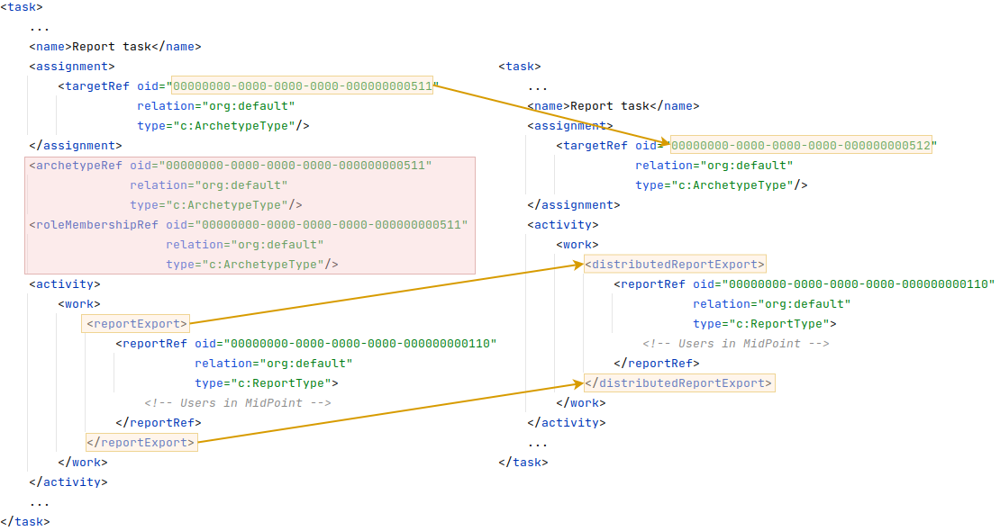

= Report Task Definition
:page-nav-title: Report Task Definition
:page-display-order: 300
:page-toc: top
:page-keywords: [ 'report', 'task' , 'reports', 'import', 'export', 'bucketing' ]
:page-upkeep-status: green

== Description

A report is generated from a report definition ("run report" function), this is done with a task.

The task is executed asynchronously with a special kind of configuration which we call *"Activity"*.
As the name might imply, "Activity" is a kind of definition of what work should be done inside the task, and also how the work load should be processed.
Activity is quite a large topic on itself, if you want some more information regarding "Activity", please see this xref:/midpoint/reference/tasks/activities[page].

[#_default_report_task_work_items]
== Default Report Task Work Items

The task "Activity" can be defined by one of three different types of work items.
By default, when you run a report and a task is created, it's activity will contain some kind of work item.
The default's differ based on the type of report you are running.
The reports can be either "Export" reports or "Import" reports.

=== Export Report

*"Export"* reports are the well known type of reports, where you export the information from midPoint into an export file of a supported xref:/midpoint/reference/misc/reports/report-formats.adoc[format].

- Support objects, containers and audit reports. Can contain two parameters, represent reference to report object 'reportRef' and 'reportParam' which represent parameters for report which tend to be defined with the GUI.

.*Export* Work item
[source,xml]
----
    <activity>
        <work>
            <reportExport>
                <reportRef oid="d328c16c-f581-422b-9ea3-e599753c04f1"
                           relation="org:default"
                           type="c:ReportType">
                </reportRef>
            </reportExport>
        </work>
    </activity>
----

=== Import From Report

The second kind of reports are the *"Import"* reports, these work the other way around.
A CSV is uploaded into midPoint in a similar format as a report, based on this midPoint will create or update objects.
For some more information on Import reports, have a look at xref:/midpoint/reference/misc/reports/configuration/import-report.adoc[this] page.

- Supports multithreading but not bucketing (multi-node mode). Contains only one parameter 'reportRef'.

.*Import* Work item
[source,xml]
----
    <activity>
        <work>
            <reportImport>
                <reportRef oid="b2da996e-e753-49d0-bf63-ba3b1ab3acd8"
                           relation="org:default"
                           type="c:ReportType">
                </reportRef>
            </reportImport>
        </work>
    </activity>
----

=== Distributed Report Export

Usually used in case of a huge bulk of data, i.e. reports about repository objects or audit reports.
Supports bucketing (multi-node mode) and multithreading.
Can contain two parameters.
Reference to report object, 'reportRef'.
Parameters for report, 'reportParam', which tend to be defined via GUI.

==== Convert Default Export to Distributed

If Midpoint is running in *clustered mode* then we can convert the default export tasks to *distributed* ones.
This can be done by modifying its configuration.
In the configuration of the tasks in *raw mode* we change '*reportExport*' to '*distributedReportExport*'.
You also need to change the archetype from '*Report export task*' to '*Distributed report export task*', by changing the oid for archetype assignment.
Next you have to remove the current "arhetypeRef" and "roleMembershipRef" attributes.
And finally you need to add configuration for xref:/midpoint/reference/tasks/activities/distribution[Bucket-based] work state management.

[#_multithreading_and_bucketing]
== Multithreading and Bucketing

Multithreading is fully supported for all possible kinds of reported objects such as containers, objects and audit records.
Bucketing is supported only for full objects and audit records, because currently bucketing of task don't support containers.

Configuration options in regard to workload distribution for tasks can be found xref:/midpoint/reference/tasks/activities/distribution.adoc[here]
The support of specific distribution options depends on the task "activity", have a look at <<_default_report_task_work_items>> for more information.
To see which activities are supported in regard to workload distribution please have a look at this xref:/midpoint/reference/tasks/activities/work.adoc[page]

== See Also

- xref:/midpoint/reference/misc/reports/examples/[Report Examples]
- xref:/midpoint/reference/misc/reports/configuration/[Report Configuration]
- xref:/midpoint/reference/misc/reports/configuration/collection-report.adoc[Collection Based Reports]
- xref:/midpoint/reference/misc/reports/configuration/dashboard-report.adoc[Dashboard Based Reports]
- xref:/midpoint/reference/tasks/activities/distribution[Task Distribution]
- xref:/midpoint/reference/misc/reports/configuration/import-report.adoc[Import From Report]
