= Create an Advanced Report

:page-upkeep-status: green
:page-keywords: [ 'report', 'create', 'reporting', 'advanced' ]
:search-alias: "create an advanced report"

This guide describe how to create report in GUI. We chose the example report of accounts with resource as parameter and with columns which shows some attributes from owner, to demonstrate all the functionality.

In first step we click on 'Reports' in left menu and next click on 'All Reports' in submenu. In footer of showed report table we click on new report button.

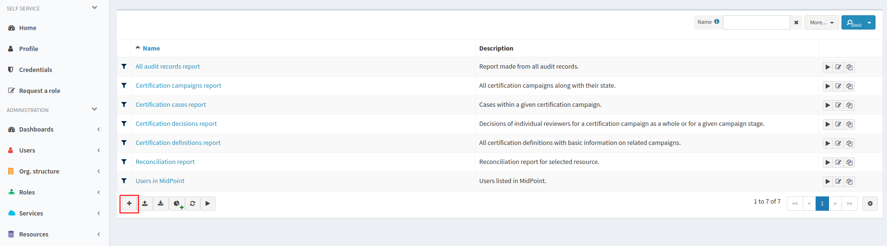

We want to create Collection report, so we select 'Collection report' in showed popup.

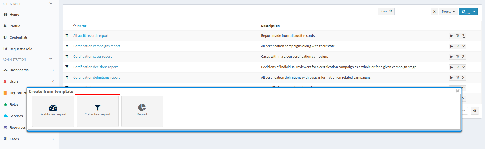

Now we see page for editing/creating report. We can fill basic properties, we need fill only name.

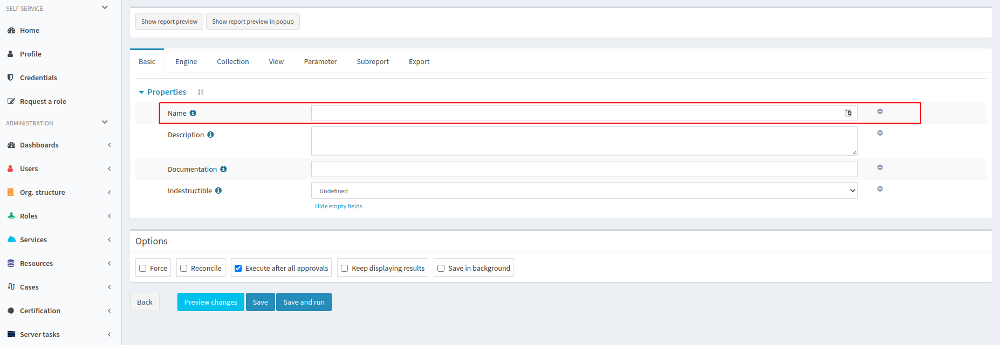

Next we can define type of exported file on tab 'Export'. Collection report have default CSV format, so we don't need fill it.

Basic configuration of report define engine, so we open 'Engine' tab. We can see Basic Tab for report engine. We don't need fill basic properties of collection report engine.

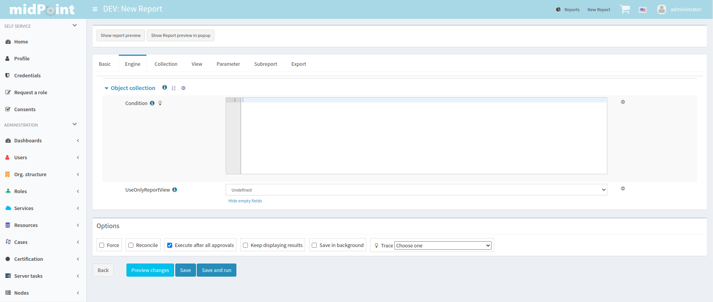

As first, we open 'Collection' tab, where we define base collection and filter for shadows. Select the object collection 'All shadows' as the base collection. We want to use resource as parameter, so we have to use it in filter.

//TODO

.Filter
[source,xml]
----
<filter xmlns="http://midpoint.evolveum.com/xml/ns/public/common/common-3"
        xmlns:q="http://prism.evolveum.com/xml/ns/public/query-3">
    <q:ref>
        <q:path>resourceRef</q:path>
        <expression>
            <queryInterpretationOfNoValue>filterAll</queryInterpretationOfNoValue>
            
        </expression>
    </q:ref>
</filter>
----

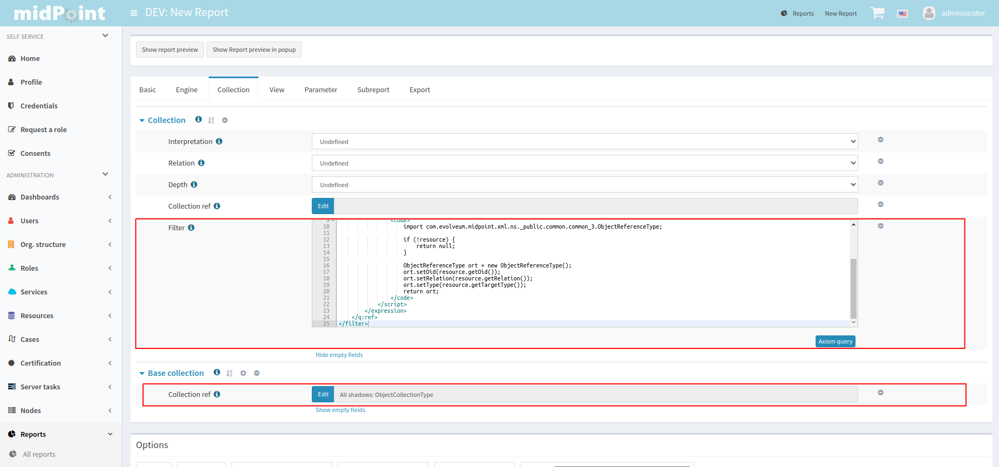

Next, we define a parameter, so we open the tab 'Parameter' and add a new value to the table.

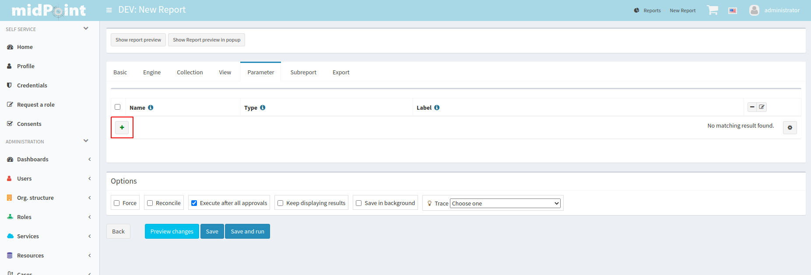

We fill out the fields:

* name with "resource"
* type with "ObjectReferenceType"
* label with "Resource"

Now we can edit the row by the edit button in the last row.
Now in the details panel for the parameter select "Resource" in the dropdown as the 'Target type'.

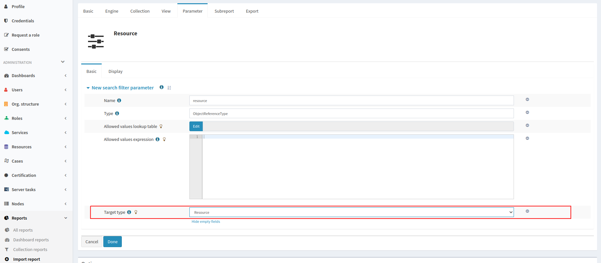

We need to define a view, so we click on the tab 'View' and select type 'Shadow'.

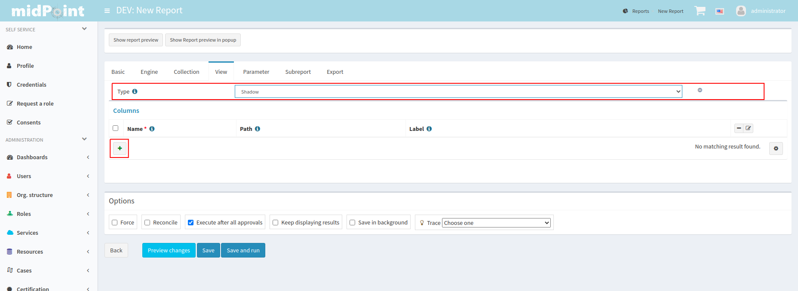

As the next step we add a few new columns for shadow attributes: name, kind, intent and also one column to demonstrate a custom column.
Creation of columns for shadows attributes is easy.
We add three new column and fill out the fields name and path.
When we want some specific label, we can fill it in.

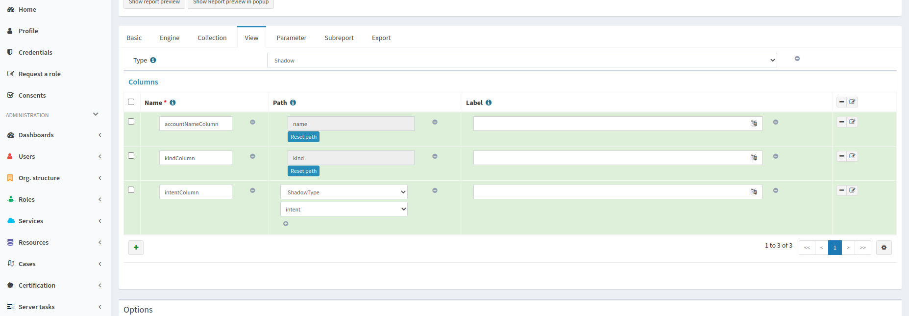

We add one additional new column and fill out the fields for name with "customColumn" and label with "Intent and Kind". Now we click on edit button in last column of row. We scroll down to 'Export' container and fill attribute expression with next code:

.Expression for custom column
[source,xml]
----

----

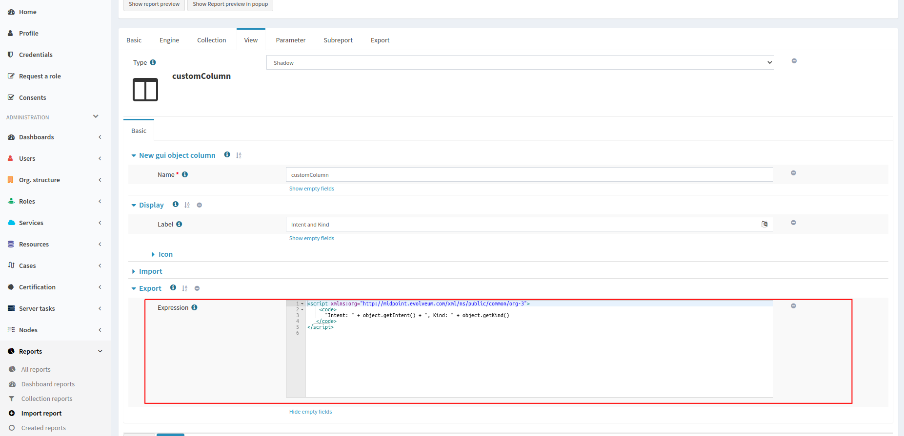

Now we can have a look at the preview of the actual report.
We can see the preview at the bottom of the screen or in a popup, we chose popup.
For showing the table at the bottom of the screen click on 'Show report preview' or for the popup option click on 'Show report preview in popup'.

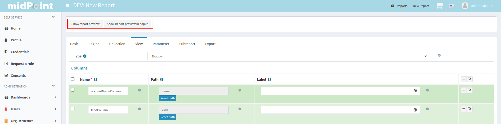

On the report preview we can see the table with columns and content, which will be part of the exported file.

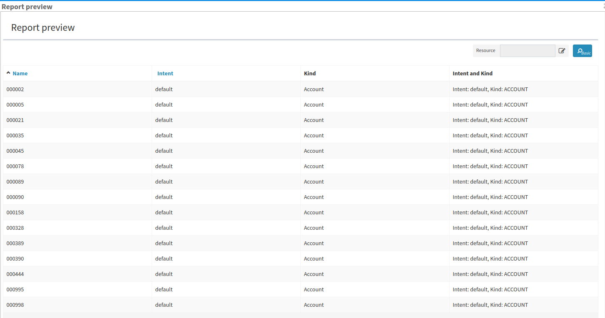

Next we can add a sub-report field to our report.
We need to close the popup and open the 'Subreport' the tab.
We will add a new column and fill the name field with "owner" and the field type with "FocusType".

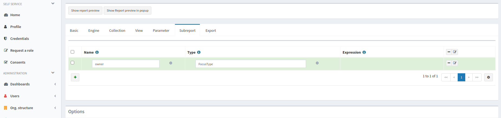

In the next step we will edit the new sub-report "find" field expression and set the following snippet of code:

.Expression of subreport
[source,xml]
----

----

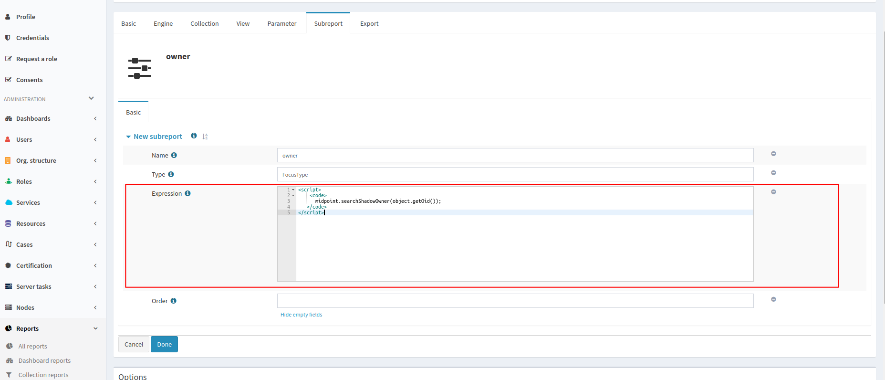

Now we can add new a new column for the email attribute of the owner.
We add a new column similar as in the case of the custom column, and we set the next snippet as the export expression of the column.
Also, we can fix the order of columns.
For this we edit every column and fill out the field for 'Previous column' by name of column which we want see before it.

.Expression of owner email column
[source,xml]
----

----

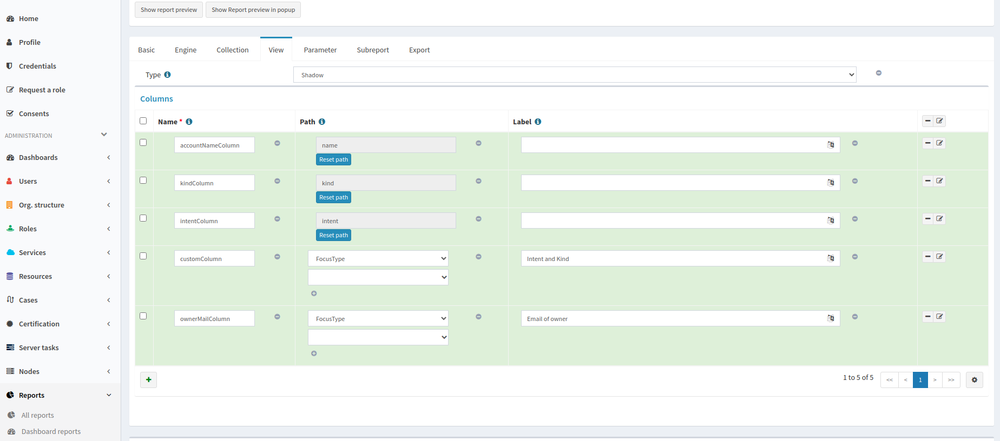

After we added the new column, we can have a look at the report preview in the popup.
Here we can see a new column with email address of the owner, which we got from the sub-report.

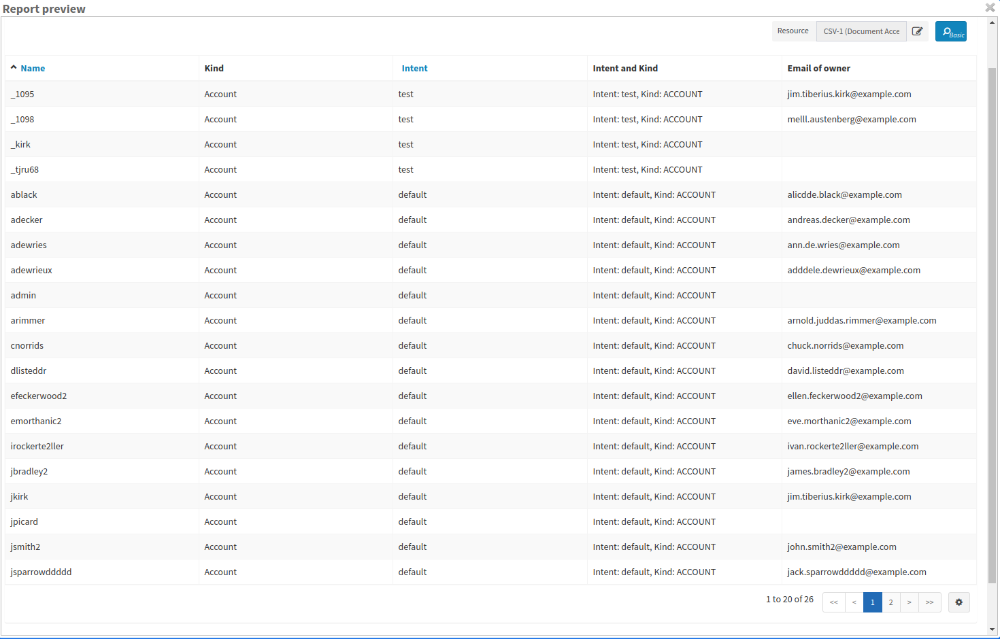

Finally, we can save and run the report and open the task which generated the report output.
When the task finishes, we can download the exported file.

== See Also

- xref:/midpoint/reference/misc/reports/examples/[Report Examples]
- xref:/midpoint/reference/misc/reports/configuration/[Report Configuration]
- xref:/midpoint/reference/misc/reports/configuration/collection-report.adoc[Collection Based Reports]
- xref:/midpoint/reference/misc/reports/configuration/dashboard-report.adoc[Dashboard Based Reports]
