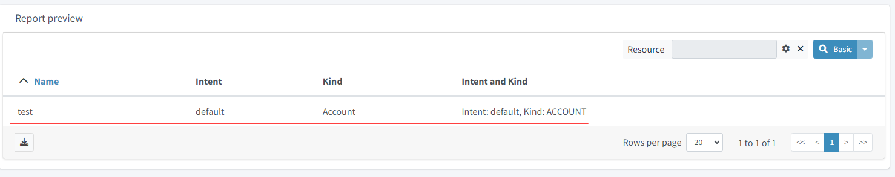

= Create an Advanced Report

:page-upkeep-status: green
:page-keywords: [ 'report', 'create', 'reporting', 'advanced' ]
:search-alias: "advanced report"

This guide describes how to create a report in the GUI.
We chose and example report of accounts with resource as parameter and with columns which shows some attributes from the owner of the account.

* in the first step we click on *"Reports"* in the left menu
* click on "*All Reports"* in the submenu.
* in the footer of the report table we click on the *"New report"* button.


* In this case we will create a xref:/midpoint/reference/misc/reports/configuration/collection-report.adoc[collection report], select *'Collection report'* in the popup.


* in the create/edit page, let us fill out the *"Name"*.


Collection reports default format is CSV, so we don't need to select anything in the *"Type"* drop down.
Yet we can define the type of exported file in the *"File Format"* menu panel.

* let us open the 'Collection' menu panel, where we define the collection of objects which we want to report and filter to fine tune the collection

* find the *"Base collection"* container


* edit the *"Collection ref"* attribute
* in the "Type" drop down choose *"Object collection"*
* select the object collection *"All shadows"* as the base collection.


In our example we are going to use a custom xref:/midpoint/reference/misc/reports/configuration/collection-report/#_collection_parameter[parameter] in our filter.

* find the *"Collection"* container
* edit the *"Filter"* attribute (See Warning below) and add the following xml :

//TODO

[WARNING]
.Known bug
====
The ui might produce *exceptions* when editing this parameter, or in general not allow the user to edit the parameter.
Please see bug:MID-9602[] and bug:MID-9603[]

As a workaround you might need to edit the *"raw"* (edit raw) object by adding the xml snipped directly.
in that case "save" the report in this step and, open the report and click *"edit raw"*

To do this add the example text into the following xml container:

[source.xml]
----
    <collection>
        <filter>
            <text>
                        <!--Add the filter here-->
            </text>
        </filter>

            <baseCollectionRef>
                    .....
            </baseCollectionRef>
    </collection>
----

After the collection is added

====

The name of the parameter will be *'resource'* , so we have to use it in the collection filter.
The following are examples of the filter needed in this sample. The filter writen in "midPoint query" is currently also mentioned
in the following work-case bug:MID-9618[] because of the current complexity of filters containing parametric expressions, and will be simplified in the future.

.Filter
[source,midpoint-query]
----
. type ShadowType and resourceRef = yaml```
expression:
  queryInterpretationOfNoValue: "filterAll"
  script:
  - objectVariableMode: "prismReference"
    code: |
        import com.evolveum.midpoint.xml.ns._public.common.common_3.ObjectReferenceType;
        if (!resource) {
            return null;
        }
        ObjectReferenceType ort = new ObjectReferenceType();
        ort.setOid(resource.getOid());
        ort.setRelation(resource.getRelation());
        ort.setType(resource.getTargetType());
        return ort;
```
----

[source,xml]
----
<filter xmlns="http://midpoint.evolveum.com/xml/ns/public/common/common-3"
        xmlns:q="http://prism.evolveum.com/xml/ns/public/query-3">
    <q:ref>
        <q:path>resourceRef</q:path>
        <expression>
            <queryInterpretationOfNoValue>filterAll</queryInterpretationOfNoValue>
            <script>
                <objectVariableMode>prismReference</objectVariableMode>
                <code>
                    import com.evolveum.midpoint.xml.ns._public.common.common_3.ObjectReferenceType;

                    if (!resource) {
                        return null;
                    }

                    ObjectReferenceType ort = new ObjectReferenceType();
                    ort.setOid(resource.getOid());
                    ort.setRelation(resource.getRelation());
                    ort.setType(resource.getTargetType());
                    return ort;
                </code>
            </script>
        </expression>
    </q:ref>
</filter>
----


Next, we define a parameter, so we open the tab 'Parameter' and add a new value to the table.

We fill out the fields:

* name with *resource*
* type with *ObjectReferenceType*
* label with *Resource*


We need to define a view:
* click on the panel *View* and select type 'Shadow'.

As the next step we add a few new xref:/midpoint/reference/misc/reports/configuration/collection-report/#_collection_columns[columns] for shadow attributes: name, kind, intent and also one column to demonstrate a custom column.

* add three new columns and fill out the fields, name and path.
* add the first column
**  Name: *"accountNameColumn"*
**  Path: *"Focus"*/*"name"*
* add the second column
**  Name: *"kindColumn"*
**  Path: *"Shadow"*/*"kind"*
* add the third column
**  Name: *"intentColumn"*
**  Path: *"Shadow"*/*"intent"*

When we want some specific label, we can fill it in.


We add one additional new column.

* add the fourth column
**  Name: *"customColumn"*
**  Label: *"Intent and Kind"*

* now we click on the *"edit"* button in last column of the row.

* scroll down to *"Export"* container
* set attribute *"Expression"* to "Script"
* click *"Show script"*
* *"insert"* the following code

.Expression for custom column
[source,groovy]
----
    return  "Intent: " + object.getIntent() + ", Kind: " + object.getKind()
----


Now we can have a look at the preview of the actual report.

There are two options for the report preview:
"Show report preview" or "Show report preview in popup"

* click *"Show report preview"*

We can see the preview at the *"bottom"* of the screen.


On the report preview we can see the table with columns and content, which will be part of the exported file.



Next we can add a xref:/midpoint/reference/misc/reports/configuration/collection-report/#_sub_reports[subreport] field to our report.

* click on the *"Subreport"* panel

* add a new column
* fill out the name field with *"owner"*
* fill out the field type with *"FocusType"*


We also need to change the subreport expression.

* click the *"edit"* button on the right side of the row.
* in the "New subreport" container set the *"Expression"* attribute to  *"Script"*
* click the *"Show script"* button next to the "Expression" attribute
* input the following *code*

.Expression of subreport
[source,groovy]
----
      midpoint.searchShadowOwner(object.getOid());
----


Let's get back to the view definition.

* click the *"View"* panel

Now we can add new a new column for the email attribute of the owner.

* add the fifth column
**  Name: *"ownerMailColumn"*
**  Label: *"Email of owner"*


* scroll down to *"Export"* container
* set attribute *"Expression"* to "Script"
* click *"Show script"*
* *insert* the following code

.Expression of owner email column
[source,Groovy]
----
if (owner.isEmpty()) {
        return null;
      }

      for(o in owner){
         if(o!=null){
         oUser=o.asObjectable();
         return oUser.getEmailAddress();
         }
      }

return null;
----


Also, we can fix the order of columns.
For this we edit every column and fill out the field for 'Previous column' by name of column which we want see before it.

* click *"Edit"*
* in the first container edit the Attribute *"Previous column"*
* do this for each column except the one which should be the first one (chose it by your self)


After we added the new column, we can have a look at the report preview in the popup.
Here we can see a new column with email address of the owner, which we got from the sub-report.

Finally, we can save and run the report and open the task which generated the report output.

* *save* the report
* return to the report basic page
* click "Run original report"


* in the preview click *"Run report"*


A task was executed to generate the report.

* At the top of the page click "Show task" in the blue prompt


* in this the task page you can download the report by clicking "Download report"

When the task finishes, we can download the exported file.


== See Also

- xref:/midpoint/reference/misc/reports/examples/[Report Examples]
- xref:/midpoint/reference/misc/reports/configuration/[Report Configuration]
- xref:/midpoint/reference/misc/reports/configuration/collection-report.adoc[Collection Based Reports]
- xref:/midpoint/reference/misc/reports/configuration/dashboard-report.adoc[Dashboard Based Reports]
