= Create Report Guide
:page-since: "4.4"

This guide describe how to create report in GUI. We chose the example report of accounts with resource as parameter and with columns which shows some attributes from owner, to demonstrate all the functionality.

In first step we click on 'Reports' in left menu and next click on 'All Reports' in submenu. In footer of showed report table we click on new report button.

image::create-report-0.png[]

We want to create Collection report, so we select 'Collection report' in showed popup.

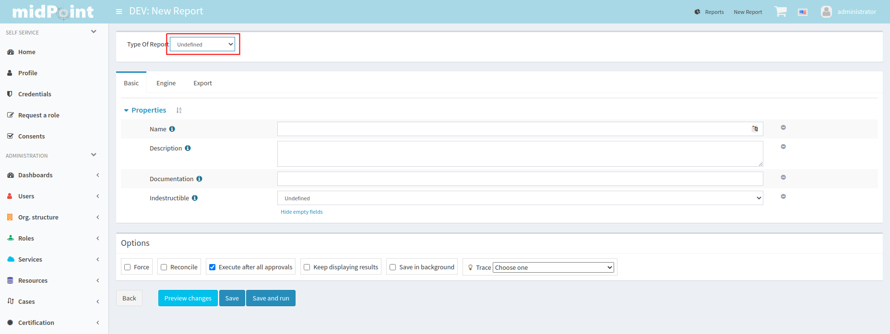

Now we see page for editing/creating report. We can fill basic properties, we need fill only name.

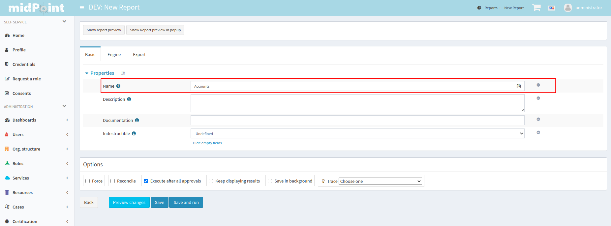

Next we can define type of exported file on tab 'Export'. Collection report have default CSV format, so we don't need fill it.

Basic configuration of report define engine, so we open 'Engine' tab. We can see Basic Tab for report engine. We don't need fill basic properties of collection report engine.

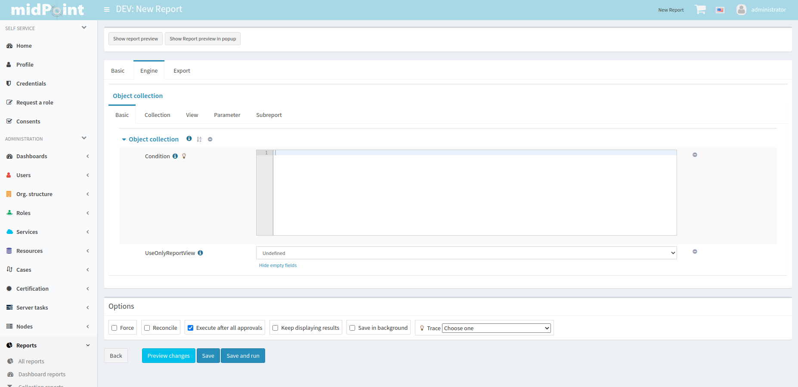

As first we open 'Collection' tab, where we define base collection and filter for shadows. At first we select object collection 'All shadows' as base collection. We want to use resource as parameter, so we have to use it in filter.

.Filter
[source,xml]
----
<filter xmlns="http://midpoint.evolveum.com/xml/ns/public/common/common-3"
        xmlns:q="http://prism.evolveum.com/xml/ns/public/query-3">
    <q:ref>
        <q:path>resourceRef</q:path>
        <expression>
            <queryInterpretationOfNoValue>filterAll</queryInterpretationOfNoValue>
            
        </expression>
    </q:ref>
</filter>
----

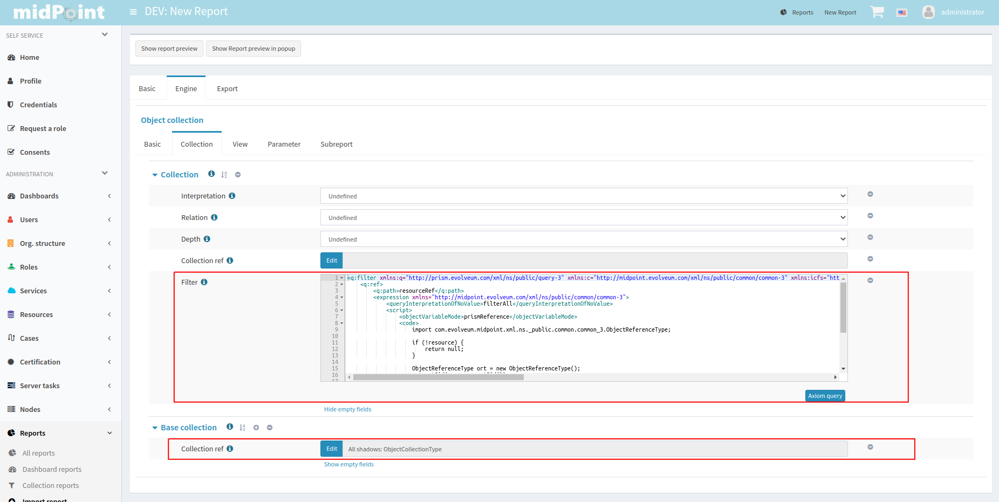

As next, we define parameter, so we open tab 'Parameter' and add new value to table.

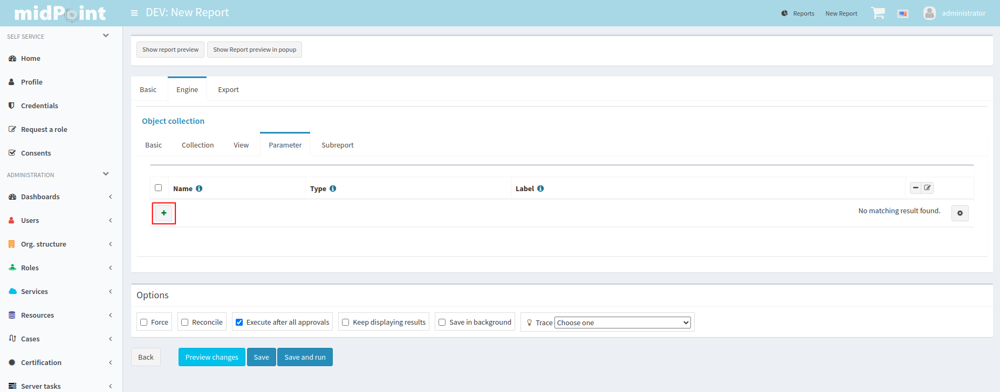

We fill fileds for name with "resource", for type with "ObjectReferenceType" and for label with "Resource". Now we can edit row by edit button in last row. In panel with details of parameter select "Resource" in dropdown of field for 'Target type'.

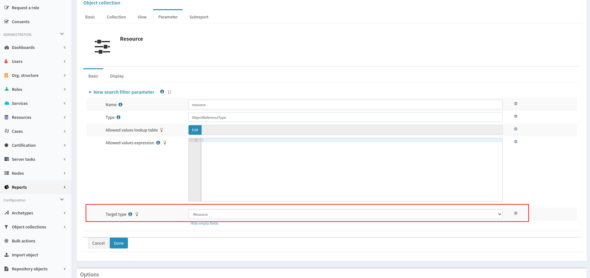

As next we need define view, so we click on tab 'View' and select type 'Shadow'.

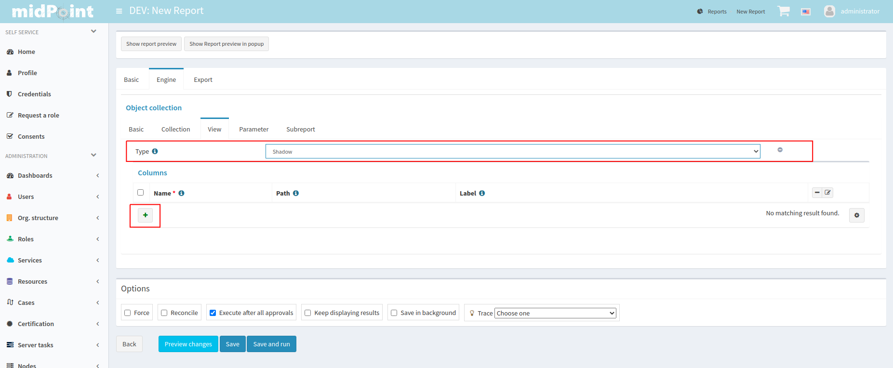

In next step we add new columns for shadow attributes name, kind, intent and one column for demonstration of custom column.
Creation of columns for shadows attributes is easy. We add three new column and fill fields name, path. When we want some specific label, we can fill it.

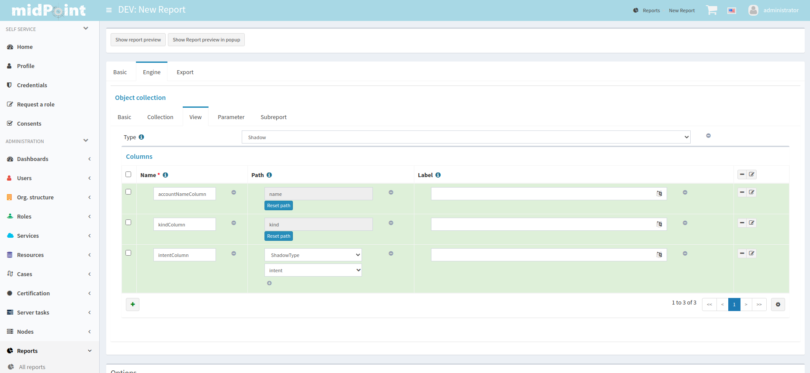

We add one more new column and fill fields for name with "customColumn" and label with "Intent and Kind". Now we click on edit button in last column of row. We scroll down to 'Export' container and fill attribute expression with next code:

.Expression of custom column
[source,xml]
----

----

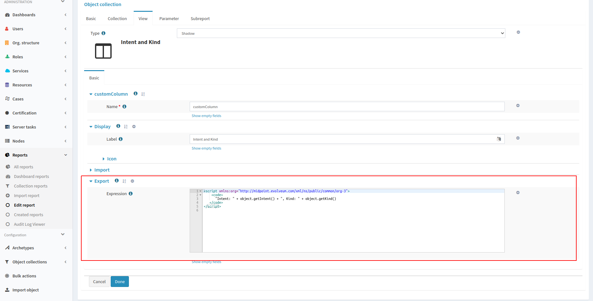

Now we can show preview of actual report. We can show preview in bottom of the screen or in popup, we chose popup. For showing table in bottom of screen click on 'Show report preview' or showing in popup click on 'Show report preview in popup'.

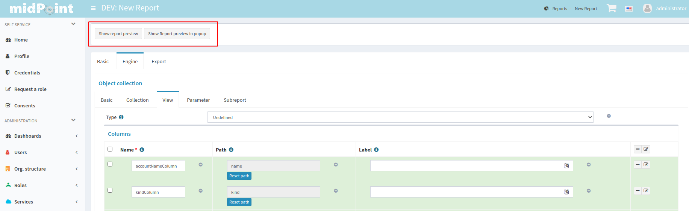

On report preview we can see table with columns and content, which will be shown in exported file.

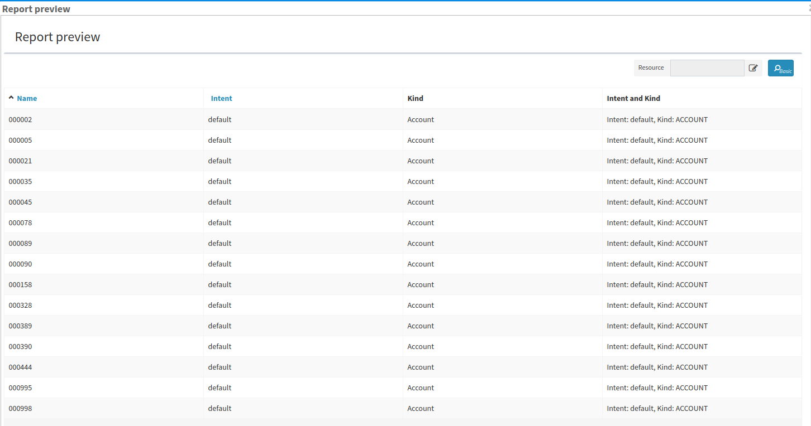

Now we can add subreport to our report. We close popup and open 'Subreport' tab. We add new column and fill name field with "owner" and field type with "FocusType".

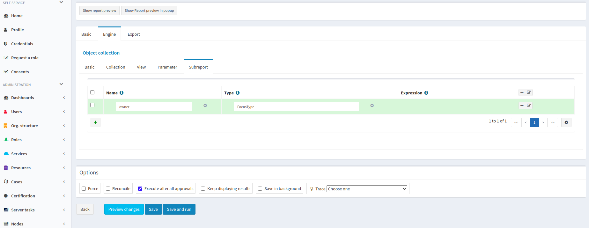

In next step we edit new subreport find field expression and set next snippet of code:

.Expression of subreport
[source,xml]
----

----

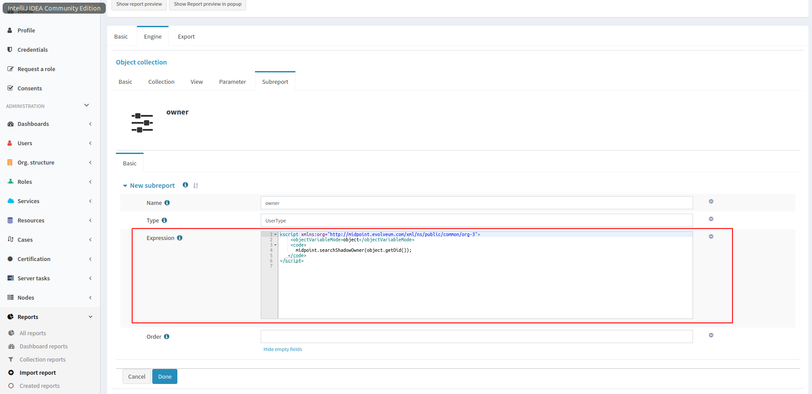

Now we can add new column for email of owner. We add new column similar as for custom column and we set next snippet to export expression of column. Also we can fix of order of columns, so we edit every column and fill field for 'Previous column' by name of column which we want see before it.

.Expression of owner email column
[source,xml]
----

----

image::create-report-14.png[]

After we added new column, we can show again report preview in popup. We can see new column with email address from owner, which we got from subreports.

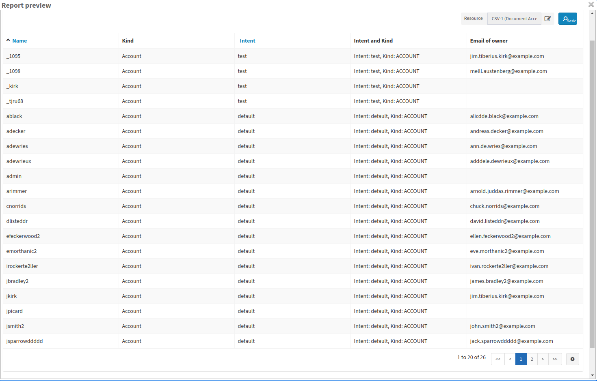

To end we can save and run report and open task. When task will finish, we can download exported file.

