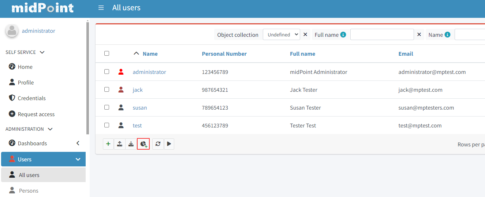
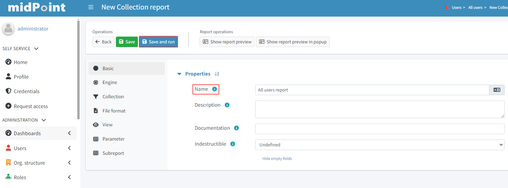
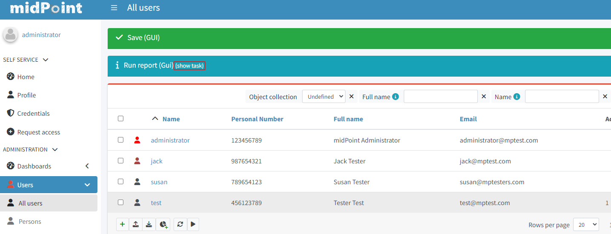
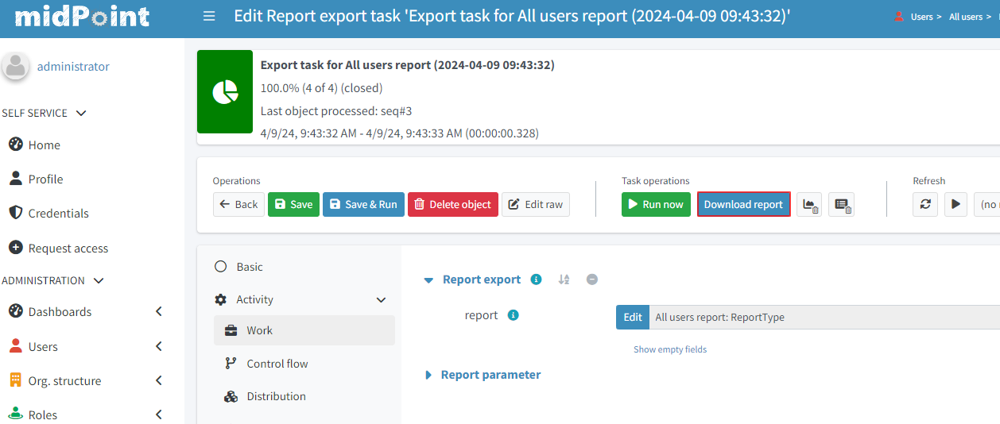

= Create Report Guide

:page-upkeep-status: green
:page-keywords: [ 'report', 'create', 'reporting' ]
:search-alias: "create report"

== Create A Basic Report

There is a quick and easy way how to generate a report form an object list.
This is an example how you can do it.

Let's visit a list of users:

* go to *Users >All Users*
* scroll to the *bottom of the screen*
* click *Create report* (‘pie chart’ button)

The screen represents a *“new” Collection report*. There are a couple of parameters we have to *input*
here

* type in the Name: *All users report*
* click *Save and run*

After success the top screen should have a “blue” banner stating that there is a task on the
background.

* click *show task* on it

* in the action button container on the top of the page click on the button *Download report*
* you should have a csv with *all the users in midPoint.*

== Intermediate Report Customization

If you want an *example with more customization* please see the xref:/midpoint/reference/misc/reports/create-report-guide/intermediate[intermediate use-case]

== Advanced Reporting Use-Case

In this next topic we look at an advanced reporting set-up.
In the following article we have described a *custom report* created via the GUI where we fine tune the reported collection and use some *advanced configuration parameters*:
Some customization via scripting is involved as well.

xref:/midpoint/reference/misc/reports/create-report-guide/advanced[advanced use-case]

== See Also

- xref:/midpoint/reference/misc/reports/examples/[Report Examples]
- xref:/midpoint/reference/misc/reports/configuration/[Report Configuration]
- xref:/midpoint/reference/misc/reports/configuration/collection-report.adoc[Collection Based Reports]
- xref:/midpoint/reference/misc/reports/configuration/dashboard-report.adoc[Dashboard Based Reports]
