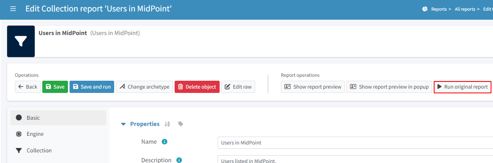

= How To Create A Report

:page-upkeep-status: green
:page-keywords: [ 'report', 'create', 'reporting' ]
:search-alias: "create report"

== Description

This Guide contains a list of possibilities how you are capable to create a Report in midPoint.

In case you are interested in some more advanced configuration topics regarding reports please have a look at the following pages.

- xref:/midpoint/reference/misc/reports/configuration/[General Report Configuration]
- xref:/midpoint/reference/misc/reports/configuration/collection-report.adoc[Collection Based Reports Configuration]
- xref:/midpoint/reference/misc/reports/configuration/dashboard-report.adoc[Dashboard Based Reports Configuration]

If you are interested in some *more advanced examples* please have a look at the following set of articles:

- xref:/midpoint/reference/misc/reports/examples/[Report Examples]

[#_create_basic_report]
== Create A Basic Report

There is a quick and easy way how to generate a report form an object list.
This is an example how you can do it.

Let's visit a list of users:

* go to *"Users >All Users"*
* scroll to the *bottom of the screen*
* click *"Create report"* (‘pie chart’ button)

image::users-all.png[75%]

The screen represents a *“new” Collection report*. There are a couple of parameters we have to *input*
here

* type in the Name: *"All users report"*
* click *"Save and run"*

image::new-collection-report.png[75%]

After success the top screen should have a “blue” banner stating that there is a task on the
background.

* click *show task* on it

image::show-tasks.png[75%]

* in the action button container on the top of the page click on the button *"Download report"*
* you should have a csv with *all the users in midPoint.*

image::export-report.png[75%]

[#_create_o_o_t_b]
== Execute an Already Existing Report

If we already have a *Report Definition present*, either one which was created by us or one pre-configure out of the box, we just need to find it among the *list of reports*.

* in *"Reports >All reports"* (or choose one of the report types)

* Click on *"Users in MidPoint"*
* In the reports page Click *"Run original report"*

* Because the report has configurable *parameters* a window called "Report configuration before run" will pop up, click on *"Run Report"*

* A blue banner will show up, click the *"show task"* string which is on it

* in the action button container on the top of the page click on the button *"Download report"*

== Intermediate Report Customization

If you want an *example with more customization* regarding the report columns and the output format, please see the xref:/midpoint/reference/misc/reports/create-report-guide/intermediate[intermediate use-case]

== Advanced Reporting Use-Case

In this next topic we look at an advanced reporting set-up.
In the following article we have described a *custom report* created via the GUI where we fine tune the reported collection and use some *advanced configuration parameters*:
Some customization via scripting is involved as well.

xref:/midpoint/reference/misc/reports/create-report-guide/advanced[advanced use-case]

== See Also

- xref:/midpoint/reference/misc/reports/examples/[Report Examples]
- xref:/midpoint/reference/misc/reports/configuration/[Report Configuration]
- xref:/midpoint/reference/misc/reports/configuration/collection-report.adoc[Collection Based Reports]
- xref:/midpoint/reference/misc/reports/configuration/dashboard-report.adoc[Dashboard Based Reports]
