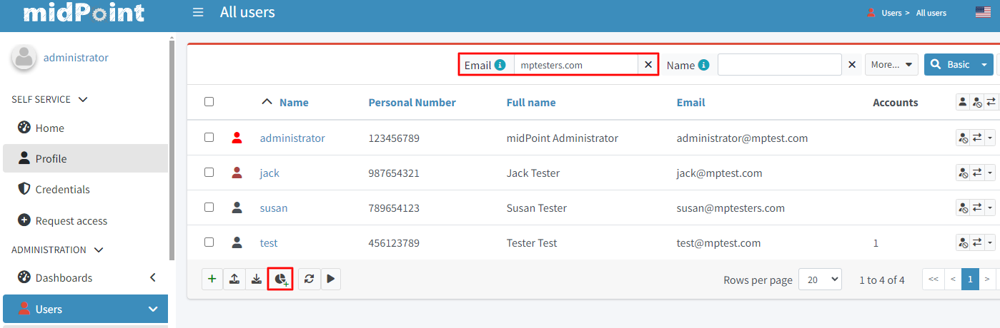
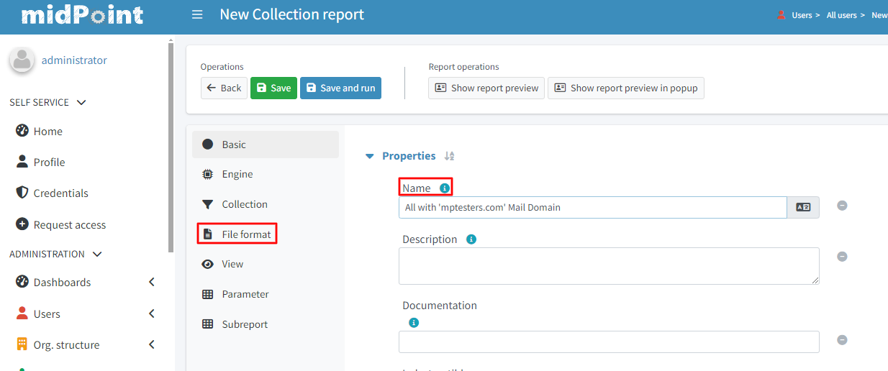
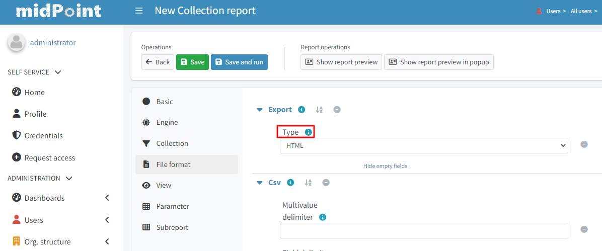
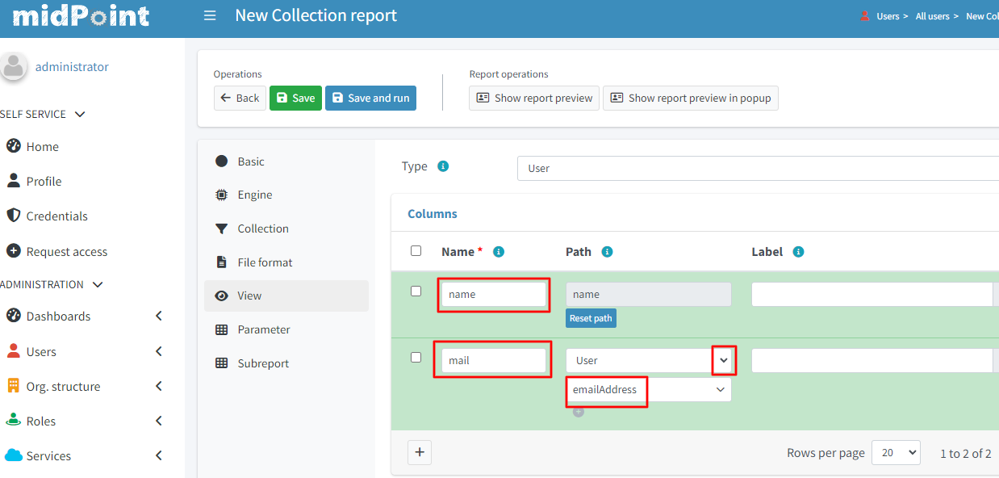
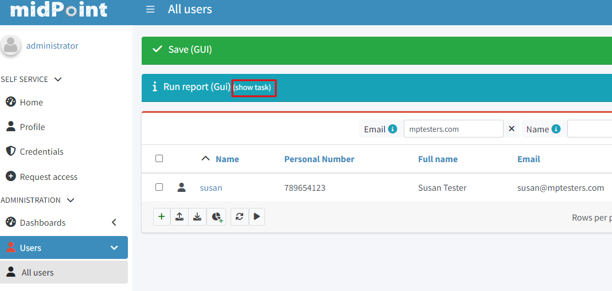
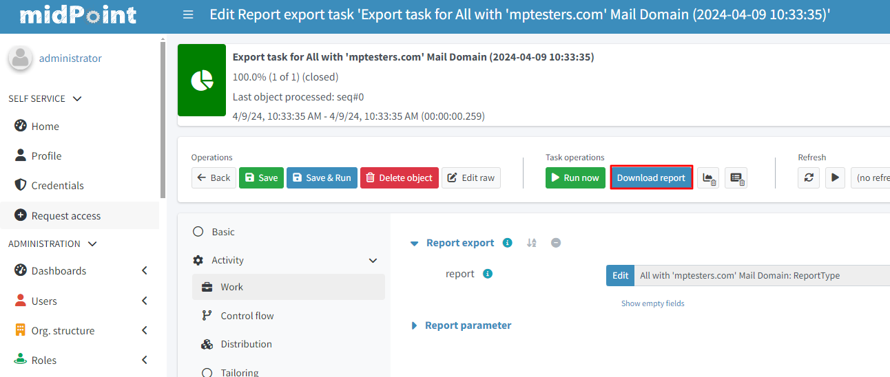

= Report With Basic Parameter Customization

:page-upkeep-status: green
:page-keywords: [ 'report', 'create', 'reporting' ]

== Report With Basic Parameter Customization

* go to *"Users >All Users"*
* in the filter section pick the parameter *"Email"*
* set it to *your custom value*
* click search

* scroll to the *bottom* of the screen
* click *"Create report"* (‘pie chart’ button)
* type in the *"Name"*: "All with 'mptesters' Mail Domain"

]

* click the *"File Format"* panel
* in the *"Export"* container set the value to *"HTML"*

* click the *"View"* panel
* click + to *add a new column*
* in *"Name"* type *"name"*
* in *"Path"* click the bottom drop-down and type *"name"*
* click + to *add a new column*
* in *"Name"* type *"mail"*
* in *"Path"* click the top drop-down and select *"User"*
* in *"Path"* click the bottom drop-down and type *"emailAddress"*

* after success the top screen should have a “blue” banner stating that there is a task on the
background, click *show task* on it

* in the action button container on the top of the page click on the button *"Download report"*
* you should have a *html* with your specific demands

== See Also

- xref:/midpoint/reference/misc/reports/examples/[Report Examples]
- xref:/midpoint/reference/misc/reports/configuration/[Report Configuration]
- xref:/midpoint/reference/misc/reports/configuration/collection-report.adoc[Collection Based Reports]
- xref:/midpoint/reference/misc/reports/configuration/dashboard-report.adoc[Dashboard Based Reports]
