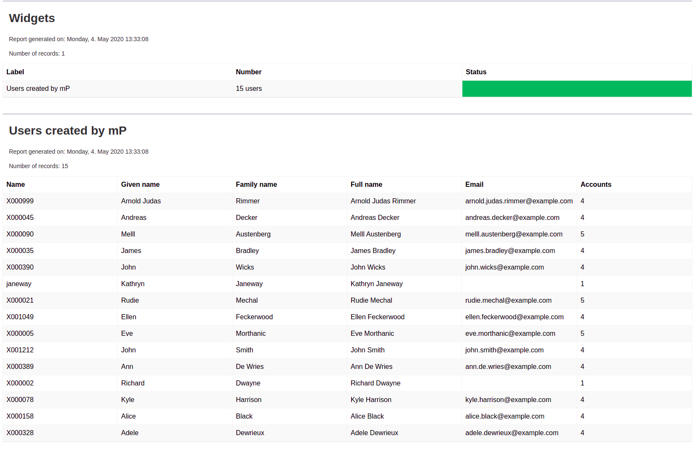

= Example of Dashboard report: Using policySituation for report
:page-nav-title: Example: policySituation
:page-wiki-name: Example of dashboard report: Using policySituation for report
:page-wiki-id: 52002836
:page-wiki-metadata-create-user: lskublik
:page-wiki-metadata-create-date: 2020-05-04T13:00:25.101+02:00
:page-wiki-metadata-modify-user: lskublik
:page-wiki-metadata-modify-date: 2020-05-04T14:37:22.496+02:00

Please see xref:/midpoint/reference/admin-gui/dashboards/configuration/[Dashboard configuration] for basic information about configuration variables.

== Usecase

Administrator needs display all users which have value of description is 'Created by mP'

== Configuration

As first we need configure policy rule. In this Example we add next snippet of configuration to our system configuration in Midpoint.

.Snippet of system configuration
[source,xml]
----
<systemConfiguration>
    ...
    <globalPolicyRule>
        <name>test</name>
        <policyConstraints>
            <objectState>
                <filter>
                    <q:equal>
                        <q:path>description</q:path>
                        <q:value>Created by midPoint</q:value>
                    </q:equal>
                </filter>
            </objectState>
        </policyConstraints>
        <policySituation>#userCreatedByMidpoint</policySituation>
        <policyActions>
            <record/>
        </policyActions>
        <focusSelector>
            <type>UserType</type>
            <filter>
                <q:all/>
            </filter>
        </focusSelector>
    </globalPolicyRule>
    ...
</systemConfiguration>
----

Now, we have to recompute all users in order to set our policySituation for them, when they meet the criteria of our filter.
In this situation we can use jasper report in Midpoint and modify search query base-on our policySituation or use dashboard reports with object collection, in this example we use dashboard report.
We need configure object collection for users with policySituation.

.Object collection
[source,xml]
----
<objectCollection oid="72b1f98e-f587-4b9f-b92b-72e251dbb266">
    <name>Users with policySituation</name>
    <type>UserType</type>
    <filter>
        <equal>
            <path>policySituation</path>
            <value>#userCreatedByMidpoint</value>
        </equal>
    </filter>
</objectCollection>

----

When we have object collection, then import Dashboard object with widget for our object collection.

.Dashboard
[source,xml]
----
<dashboard oid="72b1f98e-f587-4b9f-b92b-72e251da3456">
    <name>users-created-by-mp-dashboard</name>
    <display>
        <label>Users created by mP dashboard</label>
    </display>
    <widget>
        <identifier>users</identifier>
        <display>
            <label>Users created by mP</label>
            <color>#00a65a</color>
            <icon>
                <cssClass>fa fa-user</cssClass>
            </icon>
        </display>
        <data>
            <sourceType>objectCollection</sourceType>
            <collection>
                <collectionRef oid="72b1f98e-f587-4b9f-b92b-72e251dbb266" type="ObjectCollectionType"/>
            </collection>
        </data>
        <presentation>
            <dataField>
                <fieldType>value</fieldType>
                <expression>
                    <proportional>
                        
                    </proportional>
                </expression>
            </dataField>
            <dataField>
                <fieldType>unit</fieldType>
                <expression>
                    <value>users</value>
                </expression>
            </dataField>
        </presentation>
    </widget>
</dashboard>
----

After successful import of dashboard object and reload of page you can see dashboard in menu *Dashboards* > *Users created by mP dashboard*.

We want report with table of users created by Midpoint, so we import dashboard report.

.Report
[source,xml]
----
<report>
    <name>Users created by mP dashboard report</name>
    <reportEngine>dashboard</reportEngine>
    <dashboard>
        <dashboardRef oid="72b1f98e-f587-4b9f-b92b-72e251da3456" type="DashboardType"/>
    </dashboard>
</report>
----

Now we can run report in report menu, show task, and download report.
Every report from dashboard is in HTML format.

Report:

