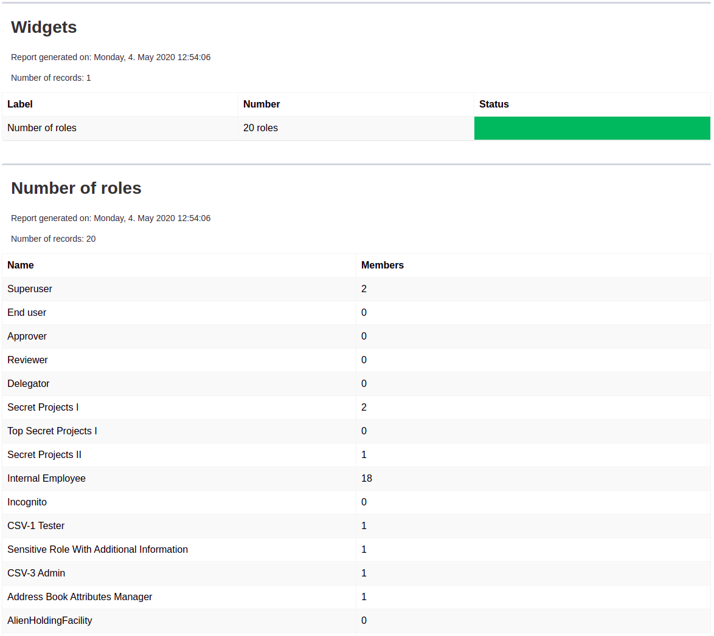

= Example of Dashboard report: Number of members
:page-nav-title: Example: Number of members
:page-wiki-name: Example of dashboard report: Number of members
:page-wiki-id: 52002832
:page-wiki-metadata-create-user: lskublik
:page-wiki-metadata-create-date: 2020-05-04T12:41:02.412+02:00
:page-wiki-metadata-modify-user: lskublik
:page-wiki-metadata-modify-date: 2020-07-27T09:14:49.594+02:00

Please see xref:/midpoint/reference/admin-gui/dashboards/configuration/[Dashboard configuration] for basic information about configuration variables.

== Usecase

Administrator needs display all roles with number of members.

== Configuration

As first we need configure object collection for all roles.

.Object collection
[source,xml]
----
<objectCollection oid="72b1f98e-f587-4b9f-b92b-72e251dbb255">
    <name>All roles</name>
    <type>RoleType</type>
    <filter>
        <all/>
    </filter>
</objectCollection>

----

When we have object collection, then import Dashboard object with widget for our object collection.

.Dashboard
[source,xml]
----
<dashboard oid="72b1f98e-f587-4b9f-b92b-72e251da2345">
    <name>role-dashboard</name>
    <display>
        <label>Role dashboard</label>
    </display>
    <widget>
        <identifier>roles</identifier>
        <display>
            <label>Number of roles</label>
            <color>#00a65a</color>
            <icon>
                <cssClass>fe fe-role_icon</cssClass>
            </icon>
        </display>
        <data>
            <sourceType>objectCollection</sourceType>
            <collection>
                <collectionRef oid="72b1f98e-f587-4b9f-b92b-72e251dbb255" type="ObjectCollectionType"/>
            </collection>
        </data>
        <presentation>
            <dataField>
                <fieldType>value</fieldType>
                <expression>
                    <proportional>
                        
                    </proportional>
                </expression>
            </dataField>
            <dataField>
                <fieldType>unit</fieldType>
                <expression>
                    <value>roles</value>
                </expression>
            </dataField>
            <view>
                <column>
                    <name>nameColumn</name>
                    <path>name</path>
                    <display>
                        <label>Name</label>
                    </display>
                </column>
                <column>
                    <name>members</name>
                    <display>
                        <label>Members</label>
                    </display>
                    <previousColumn>nameColumn</previousColumn>
					<export>
                    	<expression>
                        	
                    	</expression>
					</export>
                </column>
            </view>
        </presentation>
    </widget>
</dashboard>
----

After successful import of dashboard object and reload of page you can see dashboard in menu *Dashboards* > *Role dashboard*.

We want report with table of roles, so we import dashboard report.

.Report
[source,xml]
----
<report>
    <name>Roles dashboard report</name>
    <reportEngine>dashboard</reportEngine>
    <dashboard>
        <dashboardRef oid="72b1f98e-f587-4b9f-b92b-72e251da2345" type="DashboardType"/>
    </dashboard>
</report>
----

Now we can run report in report menu, show task, and download report.
Every report from dashboard is in HTML format.

Report:

