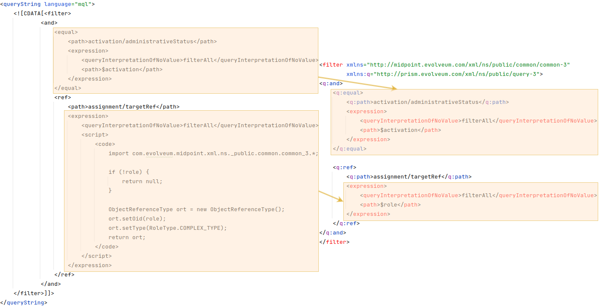
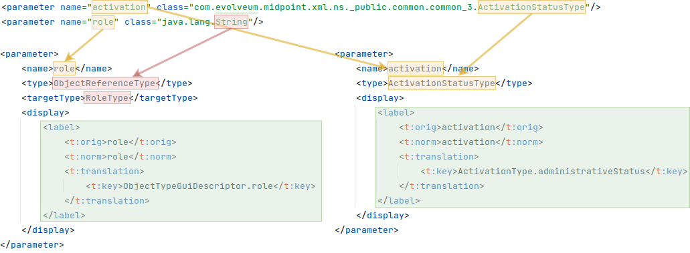
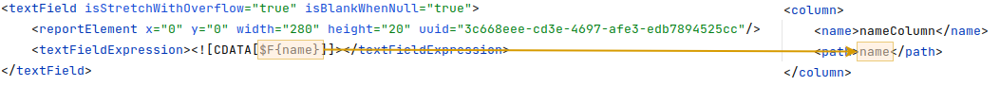
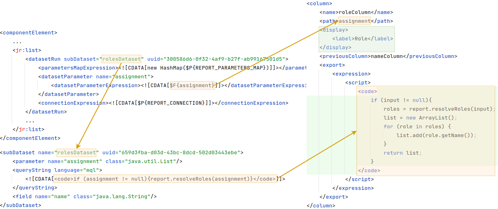

= Rewrite Jasper to Object Collection Report Guide
:page-since: "4.4"

From version 4.4 midpoint doesn't support jasper report, but midpoint contains object collection reports. This guide describes how rewrite unsupported jasper report to new object collection report.
As example we use default midpoint user report, which you can find in midpoint under the name 'Users in MidPoint' and oid '00000000-0000-0000-0000-000000000110'. We can find it on link:https://github.com/Evolveum/midpoint/blob/support-4.0/gui/admin-gui/src/main/resources/initial-objects/110-report-user-list.xml[Jasper report].

As first step we have to decode value of 'template' attribute from base64 format. We get xml with jasper report configuration.

.Jasper template
[source,xml]
----
<?xml version="1.0" encoding="UTF-8"?>
<jasperReport xmlns="http://jasperreports.sourceforge.net/jasperreports" xmlns:xsi="http://www.w3.org/2001/XMLSchema-instance" xsi:schemaLocation="http://jasperreports.sourceforge.net/jasperreports http://jasperreports.sourceforge.net/xsd/jasperreport.xsd" name="reportUserList" pageWidth="1120" pageHeight="595" orientation="Landscape" whenNoDataType="AllSectionsNoDetail" columnWidth="1080" leftMargin="20" rightMargin="20" topMargin="30" bottomMargin="30" uuid="67e465c5-46ea-40d2-bea0-469c6cf38937">
    .
    .
    .
</jasperReport>
----

When we have jasper configuration, then we can create basic xml of new report we can use old jasper report and remove attribute 'jasper' and create tag 'objectCollection'.

.Basic report
[source,xml]
----
<report oid="00000000-0000-0000-0000-000000000110"
        xmlns="http://midpoint.evolveum.com/xml/ns/public/common/common-3">
    <name>Users in MidPoint</name>
    <description>Users listed in MidPoint.</description>
    <objectCollection>

    </objectCollection>
</report>
----

Now we can start with rewriting, as first find tag 'queryString' and copy it's filter to tag 'objectCollection/collection' of new report. Filter from jasper template contains expression for create objectreferencetype because of as parameter contains String of oid for role. New report can use ObjectReferenceType as type of parameter, so we can use path evaluator with parameter.

.Filter
[source,xml]
----
<objectCollection>
    <collection>
        <filter>
            <q:and>
                <q:equal>
                    <q:path>activation/administrativeStatus</q:path>
                    <expression>
                        <queryInterpretationOfNoValue>filterAll</queryInterpretationOfNoValue>
                        <path>$activation</path>
                    </expression>
                </q:equal>
                <q:ref>
                    <q:path>assignment/targetRef</q:path>
                    <expression>
                        <queryInterpretationOfNoValue>filterAll</queryInterpretationOfNoValue>
                        <path>$organization</path>
                    </expression>
                </q:ref>
                <q:ref>
                    <q:path>assignment/targetRef</q:path>
                    <expression>
                        <queryInterpretationOfNoValue>filterAll</queryInterpretationOfNoValue>
                        <path>$role</path>
                    </expression>
                </q:ref>
                <q:ref>
                    <q:path>assignment/construction/resourceRef</q:path>
                    <expression>
                        <queryInterpretationOfNoValue>filterAll</queryInterpretationOfNoValue>
                        <path>$resource</path>
                    </expression>
                </q:ref>
            </q:and>
        </filter>
    </collection>
    <view>
        <type>UserType</type>
    </view>
</objectCollection>
----

Now we need to convert parameters to a new report, so in template we have to find tags 'parameter'. We create new Parameter in new report. We copy name and class name to new parameter. When we need reference for object, in jasper parameter was type string and use oid of object, but new report uses ObjectReferenceType and target type element in parameter, so we use ObjectReferenceType instead of string. Also we can add label configuration for GUI.

.Example of parameter from jasper template
[source,xml]
----
<parameter name="activation" class="com.evolveum.midpoint.xml.ns._public.common.common_3.ActivationStatusType"/>
----

.Rewrite parameter in new report
[source,xml]
----
<parameter>
    <name>activation</name>
    <type>ActivationStatusType</type>
    <display>
        <label>
            <orig>activation</orig>
            <translation>
                <key>ActivationType.administrativeStatus</key>
            </translation>
        </label>
    </display>
</parameter>
----

Next snippet describe all rewrite parameters.

.Rewrite parameters in new report
[source,xml]
----
<objectCollection>
    ...
    <parameter>
        <name>activation</name>
        <type>ActivationStatusType</type>
        <display>
            <label>
                <orig>activation</orig>
                <translation>
                    <key>ActivationType.administrativeStatus</key>
                </translation>
            </label>
        </display>
    </parameter>
    <parameter>
        <name>organization</name>
        <type>c:ObjectReferenceType</type>
        <targetType>c:OrgType</targetType>
        <display>
            <label>
                <orig>organization</orig>
                <translation>
                    <key>ObjectTypeGuiDescriptor.org</key>
                </translation>
            </label>
        </display>
    </parameter>
    <parameter>
        <name>role</name>
        <type>c:ObjectReferenceType</type>
        <targetType>c:RoleType</targetType>
        <display>
            <label>
                <orig>role</orig>
                <translation>
                    <key>ObjectTypeGuiDescriptor.role</key>
                </translation>
            </label>
        </display>
    </parameter>
    <parameter>
        <name>resource</name>
        <type>c:ObjectReferenceType</type>
        <targetType>c:ResourceType</targetType>
        <display>
            <label>
                <orig>resource</orig>
                <translation>
                    <key>ObjectTypeGuiDescriptor.resource</key>
                </translation>
            </label>
        </display>
    </parameter>
</objectCollection>
----

As last thing we need rewrite columns, so we have to find tag with path 'jasperReport' in it 'details' in it 'band' in it 'textField' and in it we see 'textFieldExpression' tag. When column describe attribute of object, then we define path for column, it is easier. Every column can have label, which is shown in header of column, or midpoint uses attribute name base on path.

.Columns from jasper template
[source,xml]
----
<textField isStretchWithOverflow="true" isBlankWhenNull="true">
    <reportElement x="0" y="0" width="280" height="20" uuid="3c668eee-cd3e-4697-afe3-edb7894525cc"/>
    <textFieldExpression><![CDATA[$F{name}]]></textFieldExpression>
</textField>
----

.Columns in new report
[source,xml]
----
<column>
    <name>nameColumn</name>
    <path>name</path>
</column>
----

Jasper template can contain complicated columns, when we need define expression for column. We find tag 'componentElement' in jasper in same parent as for 'textField' tag. We find attribute 'subDataset' in subtags and use definition for this subDataset in expression of new column configuration. In our example, we add code for return only name of resolved roles. As path for new collumn we use value of datasetParameterExpression, in example it is  assignment. As last we add label for new collumn because we reporting only roles not all assignments of user.

.Columns in new report
[source,xml]
----
<componentElement>
    <reportElement x="560" y="0" width="140" height="19" uuid="42a7f01f-358a-4a0d-a6aa-4c9c093be3c6"/>
    <jr:list xmlns:jr="http://jasperreports.sourceforge.net/jasperreports/components" xsi:schemaLocation="http://jasperreports.sourceforge.net/jasperreports/components http://jasperreports.sourceforge.net/xsd/components.xsd" printOrder="Horizontal">
        <datasetRun subDataset="rolesDataset" uuid="300586d6-0f32-4af9-b27f-ab99167501d5">
            <parametersMapExpression><![CDATA[new HashMap($P{REPORT_PARAMETERS_MAP})]]></parametersMapExpression>
            <datasetParameter name="assignment">
                <datasetParameterExpression><![CDATA[$F{assignment}]]></datasetParameterExpression>
            </datasetParameter>
            <connectionExpression><![CDATA[$P{REPORT_CONNECTION}]]></connectionExpression>
        </datasetRun>
        <jr:listContents height="18" width="140">
            <textField isStretchWithOverflow="true" isBlankWhenNull="true">
                <reportElement x="0" y="0" width="140" height="18" uuid="61dc940e-1df4-473d-a1f5-c21df666e8a1"/>
                <textFieldExpression><![CDATA[$F{name}]]></textFieldExpression>
            </textField>
        </jr:listContents>
    </jr:list>
</componentElement>
----

.Definition of subDataset
[source,xml]
----
<subDataset name="rolesDataset" uuid="659d3fba-d03d-43bc-8dcd-502d03443ebe">
	<parameter name="assignment" class="java.util.List"/>
    <queryString language="mql">
		<![CDATA[<code>if (assignment != null){report.resolveRoles(assignment)}</code>]]>
	</queryString>
	<field name="name" class="java.lang.String"/>
</subDataset>
----

In expression we get roles as in definition of subDataset. Next we can show multivalue attribute, so we create list of names of roles.

.Column in new report
[source,xml]
----
<column>
    <name>roleColumn</name>
    <path>assignment</path>
    <display>
        <label>Role</label>
    </display>
    <export>
        <expression>
            
        </expression>
    </export>
    <previousColumn>activationColumn</previousColumn>
</column>
----

Next snippet shown all new columns.

.Columns in new report
[source,xml]
----
<view>
    <column>
        <name>nameColumn</name>
        <path>name</path>
    </column>
    <column>
        <name>fullNameColumn</name>
        <path>fullName</path>
        <previousColumn>nameColumn</previousColumn>
    </column>
    <column>
        <name>activationColumn</name>
        <path>activation/administrativeStatus</path>
        <previousColumn>fullNameColumn</previousColumn>
    </column>
    <column>
        <name>roleColumn</name>
        <path>assignment</path>
        <display>
            <label>Role</label>
        </display>
        <export>
            <expression>
                
            </expression>
        </export>
        <previousColumn>activationColumn</previousColumn>
    </column>
    <column>
        <name>orgColumn</name>
        <path>assignment</path>
        <display>
            <label>Organization</label>
        </display>
        <export>
            <expression>
                
            </expression>
        </export>
        <previousColumn>roleColumn</previousColumn>
    </column>
    <column>
        <name>accountColumn</name>
        <path>linkRef</path>
        <display>
            <label>Account</label>
        </display>
        <export>
            <expression>
                
            </expression>
        </export>
        <previousColumn>orgColumn</previousColumn>
    </column>
    <type>UserType</type>
</view>
----

We can see new complete report on
link:https://github.com/Evolveum/midpoint/blob/master/gui/admin-gui/src/main/resources/initial-objects/110-report-user-list.xml[User list report]