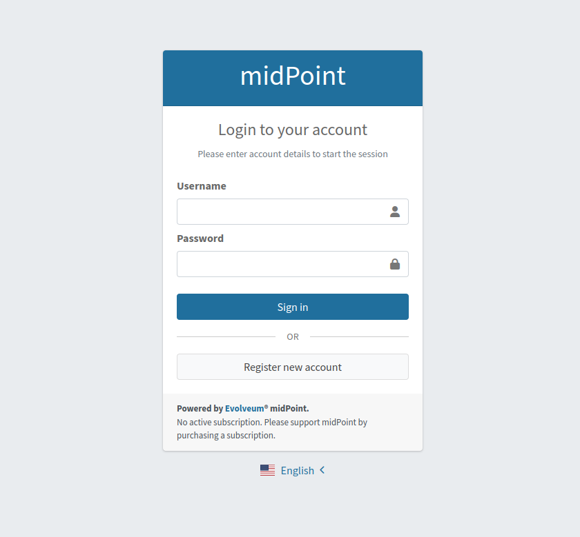
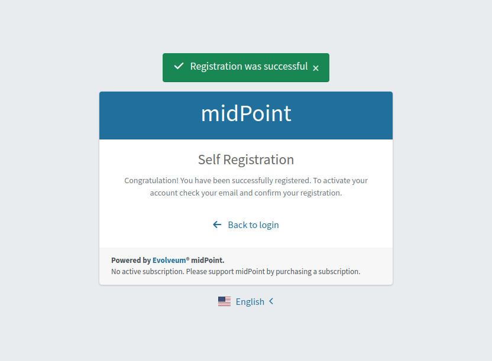

= Self Registration Configuration
:page-wiki-name: Self Registration Configuration
:page-wiki-id: 23691393
:page-wiki-metadata-create-user: katkav
:page-wiki-metadata-create-date: 2016-11-04T13:05:05.383+01:00
:page-wiki-metadata-modify-user: khazelton
:page-wiki-metadata-modify-date: 2021-02-23T15:21:40.478+01:00
:page-toc: top
:page-since: "3.5"
:page-upkeep-status: yellow

[TIP]
.MidPoint 4.6 and later

This configuration is valid in midPoint 4.6 and later. For configuration before 4.6 please see xref:./configuration-before-4-6/[Self Registration Configuration before 4.6].

Self registration in midPoint provides possibility for unauthenticated user to enroll to midPoint and request assignments.
By default, self registration is disabled.
Following text describes how to enable self registration in midPoint.

== Enabling Self Registration

To enable this feature you'll need to configure security policy and reference this security policy from system configuration.
After this, self registration process is enabled globally (in the multi-tenant environment it means that the configuration will be shared between tenants, the plan is to support self registration configuration per tenant in later midPoint versions).

[source,xml]
----
<systemConfiguration xmlns="http://midpoint.evolveum.com/xml/ns/public/common/common-3"
                     xmlns:q="http://prism.evolveum.com/xml/ns/public/query-3"
                     xmlns:c="http://midpoint.evolveum.com/xml/ns/public/common/common-3"
                     xmlns:t="http://prism.evolveum.com/xml/ns/public/types-3"
                     xmlns:icfs="http://midpoint.evolveum.com/xml/ns/public/connector/icf-1/resource-schema-3"
                     xmlns:ri="http://midpoint.evolveum.com/xml/ns/public/resource/instance-3"
                     oid="00000000-0000-0000-0000-000000000001">
   <name>SystemConfiguration</name>
    ....
   <globalSecurityPolicyRef oid="28bf845a-b107-11e3-85bc-001e8c717e5b" type="c:SecurityPolicyType"/>
    ....
   <publicHttpUrlPattern>http://localhost:8080/midpoint</publicHttpUrlPattern>
    ....
</systemConfiguration>
----

In the example above, you can see globalSecurityPolicyRef which refers to the security policy which will be used and checked if the self registration is enabled.
The above example also works with *publicHttpUrlPattern* attribute.
This value is used while generating confirmation link for self registration verification process.

== Configuring Security Policy

Configuration for self registration is in Security Policy object and it is separated into three parts - registration, authentication and credentials.
Using these three parts you can configure the self registration process, e.g how to confirm registered user, which roles should be assigned to the user after confirmation and more.
Basically there are two major different scenarios:

* self-registration for the new users

* self post-registration (or invite) for existing users in midPoint

== Self Registration For The New Users

In this scenario, users are allowed to register by themselves.
There is no policy and rules which force the existence of the user in the midPoint or anything like this.
Self registration allows everyone to register to the midPoint.
The configuration for self registration can look like following:

[source,xml]
----
    <flow>
      <selfRegistration>
         <name>selfRegistration</name>
         <initialLifecycleState>draft</initialLifecycleState>
         <displayName>Self Registration</displayName>
         <additionalAuthenticationSequence>confirmationLink</additionalAuthenticationSequence>
         <defaultRole oid="00000000-0000-0000-0000-000000000008" type="c:RoleType"/>
      </selfRegistration>
   </flow>
----

With the configuration above, after user submits the registration form, a new user entry is created in midPoint.
For this newly created user, lifecycle state is set to the draft.
Until user doesn't confirm his/her registration it cannot do anything, it is disabled and no roles are assigned.
After confirmation, specified default roles are assigned to the user.

== Self Post-Registration (or Invite) For Existing Users in MidPoint

This scenario can be used for various scenarios, e.g:

* Imagine that you are deploying midPoint in the existing environment.
In your environment you already have an existing LDAP server (and other applications).
You imported users from LDAP to the midPoint and you want to let the users know, that there is an IDM solution which they will use for requesting access rights, reset password, etc.
You want the users to change the password and confirm that they are still active and still want to use the provided services.

* There is time constraint policy.
Users can be active for one year.
After the year, they are marked as disabled and are requested to remake the registration process to be active again.

* You started to provide new service and you want to invite some users to use this service.

* .....

For such scenarios, the configuration can look like following:

[source,xml]
----
    <flow>
      <postAuthentication>
         <name>selfRegistration</name>
         <initialLifecycleState>proposed</initialLifecycleState>
         <requiredLifecycleState>draft</requiredLifecycleState>
         <displayName>Self Registration</displayName>
         <additionalAuthenticationSequence>confirmationLink</additionalAuthenticationSequence>
         <defaultRole oid="00000000-0000-0000-0000-000000000008" type="c:RoleType"/>
      </postAuthentication>
   </flow>
----

Example above shows configuration for self post-registration where it is required that the user already exists in midPoint.
The lifecycle state which is required to successfully register the user is specified with attribute requiredLifecyleState.
This is to support situations, where all potential users are pre-created/pre-registered by administrators (but  they are not active until they don't  register and confirm the registration).
After user fills in registration form and submits it, existing user is modified in midPoint with the configured lifecycle state (initialLifecycleState attribute).
This newly created user is disabled and doesn't have any roles assigned until he/she confirms the registration.
Confirmation of registration is configurable using additionalAuthenticationSequence attribute.
After user successfully confirms the registration, default roles are assigned to him/her - default roles are configured using defaultRole attribute.

More information about lifecycle configuration, please, see xref:/midpoint/reference/security/authentication/post-authentication-configuration/#configure-lifecycle-activation[Configure lifecycle activation]

=== Authentication Part

[source, xml]
----
<authentication>
    <modules>
    ...
        <mailNonce>
            <name>MailNonce</name>
            <description> Authentication based on mail message with a nonce. Used for user registration.</description>
            <credentialName>mailNonce</credentialName>
        </mailNonce>
     </modules>
     ...
     <sequence>
        <name>selfRegistrationAuth</name>
        <description>Just a nonce mail to validate e-mail address.</description>
        <channel>
            <channelId>http://midpoint.evolveum.com/xml/ns/public/common/channels-3#selfRegistration</channelId>
            <urlSuffix>registration</urlSuffix>
        </channel>
        <module>
            <name>MailNonce</name>
            <order>10</order>
            <necessity>sufficient</necessity>
        </module>
     </sequence>
</authentication>
----

Authentication part contains configuration for the sequence used for registration confirmation.
Examples above uses mailNonce authentication sequence which means that the user receives the mail with the confirmation link.
After clicking on the link in the mail midPoint tries to confirm the user.

=== Credentials Part

[source,xml]
----
   <credentials>
      <nonce>
         <maxAge>PT10M</maxAge>
         <name>mailNonce</name>
         <valuePolicyRef oid="00000000-0000-1111-0000-000000000003" type="c:ValuePolicyType" />
      </nonce>
   </credentials>
----

Credentials configuration can contain various rules for different types of credentials.
In the example above there is a configuration for nonce credentials.
It is used for generating and validating nonce by self registration.
Max age is the time how long is the nonce valid and valuePolicyRef is reference to the policy used for generating the nonce - e.g. the length, unique characters etc.

== Self-Registration And Custom Form

It is (probably) more than welcome to support definition of custom form when talking about self-registration process.
With introducing xref:/midpoint/reference/admin-gui/custom-forms/[custom forms] in midPoint they can be also used with the self-registration.
All what is needed is to reference to the concrete form in the self-registration configuration as in the example below

.Self registration with custom form
[source,xml]
----
<flow>
      <selfRegistration>

        ...

         <formRef oid="6818a918-109a-4b82-876b-f72dec9d561a" type="c:FormType"><!-- Registration form --></formRef>
      </selfRegistration>
   </flow>
----

== Email Notifications

To enable email confirmation notification shall be configured first.
For the registration there is UserRegistrationNotifier.
Configuration looks as follows:

* default registration notifier.Simple registration notifier
[source,xml]
----
<userRegistrationNotifier>
            <recipientExpression>
               
            </recipientExpression>
            <transport>mail</transport>
            <confirmationMethod>link</confirmationMethod>
         </userRegistrationNotifier>
----

* custom registration notifier - while using custom expression for the body, don't forget to add call for `midpoint.createRegistrationConfirmationLink(userType); `which will generate the confirmation link needed to finish the registration.

[source,xml]
----
<notificationConfiguration>
      <handler>
         <userRegistrationNotifier>
            <recipientExpression>
               
            </recipientExpression>
            <bodyExpression>
               
            </bodyExpression>
            <transport>mail</transport>
            <confirmationMethod>link</confirmationMethod>
         </userRegistrationNotifier>
      </handler>
 <!-->BEGIN: Handler in case of post-registration<-->
   <handler>
    <simpleUserNotifier>
        <expressionFilter>
            
        </expressionFilter>
        <recipientExpression>
            
        </recipientExpression>
        <bodyExpression>
            
        </bodyExpression>
        <transport>mail</transport>
    </simpleUserNotifier>
</handler>
 <!-->END: Handler in case of post-registration<-->
      <mail>
         <server>
            <host>smtp.gmail.com</host>
            <port>587</port>
            <username>mail@google.com</username>
            <password>
               <t:clearValue>password</t:clearValue>
            </password>
            <transportSecurity>starttlsRequired</transportSecurity>
         </server>
         <defaultFrom>mail@gmail.com</defaultFrom>
         <debug>true</debug>
      </mail>
</notificationConfiguration>
----

The important setting for the notifier is attribute <confirmationMethod>.
According to the value for the confirmation method, confirmation link/pin is generated to verify user.
Other parts of configuration are same as for other notifiers.
Details for notification configuration are described xref:/midpoint/reference/misc/notifications/configuration/[here].

== How it works

== End user guide

. Open midPoint in browser.
If the self registration is enabled, you will see the button "Sign up" on the login page
+

. Click on the Sign up button and you'll see following form
+

. Fill in all fields and click on the "Register" button.
+

. Mail with confirmation link will be send on the mail you entered.
+
image::confirmation-mail.png[]

. Click on the confirmation link in your email.
If your registration is successful you can continue with login.
+
image::confirmation-success.png[]

. In the case you got any error during registration process, please contact your system administrator.

== See also

* xref:/midpoint/reference/admin-gui/custom-forms/[Custom Forms]

* xref:/midpoint/reference/security/credentials/password-policy/[Password Policy]

* xref:/midpoint/reference/security/authentication/flexible-authentication/configuration/[Flexible Authentication]