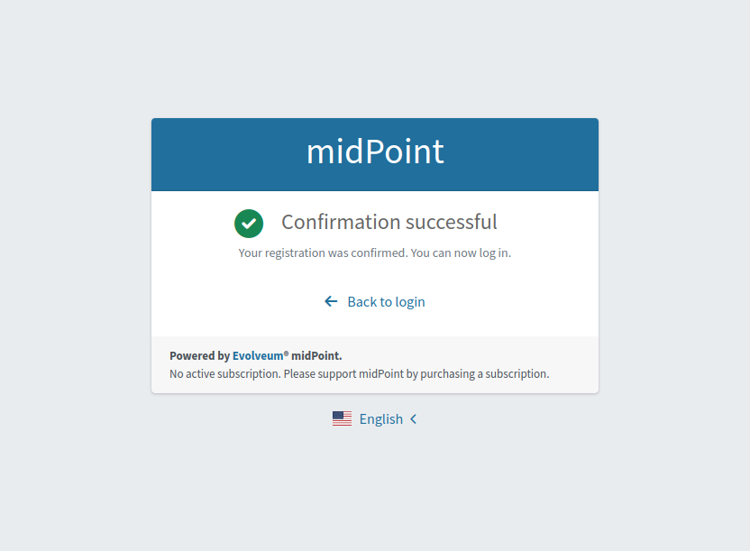

= Self Registration Configuration
:page-wiki-name: Self Registration Configuration
:page-wiki-id: 23691393
:page-wiki-metadata-create-user: katkav
:page-wiki-metadata-create-date: 2016-11-04T13:05:05.383+01:00
:page-wiki-metadata-modify-user: khazelton
:page-wiki-metadata-modify-date: 2021-02-23T15:21:40.478+01:00
:page-toc: top
:page-since: "4.6"
:page-upkeep-status: yellow
:page-toc: top

Self registration in midPoint provides possibility for unauthenticated user to enroll to midPoint and request assignments.

Also this feature covers the post-registration scenario when a user already exists in the system (e.g. a user was created by administrator) and self registration process starts after the user opens the invitation link sent to them by the system.
This scenario is called _Invitation_ flow.

By default, self registration is disabled.

Following text describes how to enable and configure self registration in midPoint.

== Enabling Self Registration

To enable this feature it's necessary to configure security policy and reference this security policy from the system configuration.
After this, self registration process is enabled globally (in the multi-tenant environment it means that the configuration will be shared between tenants, the plan is to support self registration configuration per tenant in later midPoint versions).

[source,xml]
----
<systemConfiguration xmlns="http://midpoint.evolveum.com/xml/ns/public/common/common-3"
                     xmlns:c="http://midpoint.evolveum.com/xml/ns/public/common/common-3"
                     ...
                     oid="00000000-0000-0000-0000-000000000001">
   <name>SystemConfiguration</name>
    ....
   <globalSecurityPolicyRef oid="28bf845a-b107-11e3-85bc-001e8c717e5b" type="c:SecurityPolicyType"/>
    ....
   <publicHttpUrlPattern>http://localhost:8080/midpoint</publicHttpUrlPattern>
    ....
</systemConfiguration>
----

In the example above, you can see globalSecurityPolicyRef which refers to the security policy which will be used and checked if the self registration is enabled.
The above example also works with *publicHttpUrlPattern* attribute.
This value is used while generating confirmation link for self registration verification process.

== Configuring Security Policy

Configuration for self registration is situated in Security Policy object and it is separated into three parts - registration, authentication and credentials.
Using these three parts you can configure the self registration process, e.g how to confirm registered user, which roles should be assigned to the user after confirmation and more.
Basically there are two major different scenarios:

More about security policy configuration and merging different security policies can be found xref:/midpoint/reference/security/security-policy/[here].

== Self Registration For The New Users

In this scenario, users are allowed to register themselves.
There is no policy and rules which check the existence of the user in the midPoint or anything like this.
Self registration allows everyone to register to the midPoint.
The configuration for self registration can look like the following:

[source,xml]
----
    <flow>
      <selfRegistration>
         <name>selfRegistration</name>
         <initialLifecycleState>draft</initialLifecycleState>
         <displayName>Self Registration</displayName>
         <additionalAuthenticationSequence>confirmationLink</additionalAuthenticationSequence>
         <defaultRole oid="00000000-0000-0000-0000-000000000008" type="c:RoleType"/>
      </selfRegistration>
   </flow>
----

With the configuration above, after user submits the registration form, a new user entry is created in midPoint.
For this newly created user, lifecycle state is set to the draft.
Until user doesn't confirm their registration they cannot do anything, they are disabled and no roles are assigned.
After confirmation, specified default roles are assigned to the user.

== Self Post-Registration (or Invitation) For Existing Users in MidPoint

This scenario can be used for various scenarios, e.g:

* Imagine that you are deploying midPoint in the existing environment.
In your environment you already have an existing LDAP server (and other applications).
You imported users from LDAP to the midPoint and you want to let the users know, that there is an IDM solution which they will use for requesting access rights, reset password, etc.
You want the users to change the password and confirm that they are still active and still want to use the provided services.

* There is time constraint policy.
Users can be active for one year.
After the year, they are marked as disabled and are requested to remake the registration process to be active again.

* You started to provide new service and you want to invite some users to use this service.

To activate the invitation flow the similar flow configuration should be used.

[source,xml]
----
    <flow>
      <selfRegistration>
         <name>selfRegistration</name>
         <initialLifecycleState>proposed</initialLifecycleState>
         <requiredLifecycleState>draft</requiredLifecycleState>
         <displayName>Self Registration</displayName>
         <additionalAuthenticationSequence>confirmationLink</additionalAuthenticationSequence>
         <defaultRole oid="00000000-0000-0000-0000-000000000008" type="c:RoleType"/>
      </selfRegistration>
   </flow>
----

The invitation flow also requires an invitation sequence to be added to the authentication part of the security policy (please, see Authentication Part chapter) and a notifier to be configured to send the invitation link (please, see Email Notifications chapter).
For invitation sequence a mail nonce authentication module is used.
As for notifier, different possibilities are available depending on the use case, in this documentation simple user notifier configuration is used to generate and send an invitation link.
Current flow requires that the user already exists in midPoint.
The lifecycle state which is required to successfully register the user is specified with attribute requiredLifecyleState.
This is to support situations, where all potential users are pre-created/pre-registered by administrators (but  they are not active until they don't  register and confirm the registration).
After user fills in registration form and submits it, existing user is modified in midPoint with the configured lifecycle state (initialLifecycleState attribute).
This newly created user is disabled and doesn't have any roles assigned until he/she confirms the registration.
Confirmation of registration is configurable using additionalAuthenticationSequence attribute.
After the user successfully confirms the registration, default roles are assigned to them (default roles are configured using defaultRole attribute).

For more information about lifecycle configuration, please, see xref:/midpoint/reference/security/authentication/post-authentication-configuration/#configure-lifecycle-activation[Configure lifecycle activation]

As an example let's see on the use case when the user is created by the administrator and the invitation link is sent to the user.

1. Administrator creates new user.
Lifecycle state is set to Draft (notification configuration example sends invitation link just in case when the lifecycle is draft).

2. Simple user notifier is triggered. Invitation link is created (please, see notification configuration part) and sent to the user. While this action producing the nonce is created and saved to the new user. This nonce is used to authenticate the user while invitation link opening.

3. The user receives the link and opens it.

4. Registration form is opened.
The user fills in the necessary fields and confirms the form.

5. Registration confirmation link is sent to the user (please, see user registration notifier configuration).

6. User opens registration confirmation link.

7. Invitation flow is finished.
If all authentications were successful, the user lifecycle state is changed to Active.

== Authentication Part

[source, xml]
----
<authentication>
    <modules>
    ...
        <mailNonce>
            <identifier>MailNonce</identifier>
            <description> Authentication based on mail message with a nonce. Used for user registration.</description>
            <credentialName>mailNonce</credentialName>
        </mailNonce>
     </modules>
     ...
    <!-- sequence which is used to authenticate the user after registration form submitting -->
     <sequence>
        <identifier>selfRegistrationAuth</identifier>
        <description>A nonce mail used to confirm user's registration</description>
        <channel>
            <channelId>http://midpoint.evolveum.com/xml/ns/public/common/channels-3#selfRegistration</channelId>
            <urlSuffix>registration</urlSuffix>
        </channel>
        <module>
            <identifier>MailNonce</identifier>
            <order>10</order>
            <necessity>sufficient</necessity>
        </module>
     </sequence>

    <!-- sequence which is used to authenticate the user while opening the invitation link -->
     <sequence>
        <identifier>invitationAuth</identifier>
        <description>A nonce mail to authenticate the user while invitation link opening</description>
        <channel>
            <channelId>http://midpoint.evolveum.com/xml/ns/public/common/channels-3#invitation</channelId>
            <urlSuffix>invitation</urlSuffix>
        </channel>
        <module>
            <identifier>MailNonce</identifier>
            <order>10</order>
            <necessity>sufficient</necessity>
        </module>
     </sequence>
</authentication>
----

Authentication part contains one sequence ("selfRegistrationAuth") for the registration confirmation and one sequence ("invitationAuth") for the user authentication while invitation link opening.
In both sequences mail authentication module is used.
This means that the user receives the mail with the confirmation/invitation link.
After clicking on the link in the mail midPoint tries to authenticate the user.
If the authentication is successful, the user is redirected to the next step.

=== Credentials Part

[source,xml]
----
   <credentials>
      <nonce>
         <maxAge>PT10M</maxAge> <!-- be aware of setting the appropriate maxAge value for the invitation link usage-->
         <name>mailNonce</name>
         <valuePolicyRef oid="00000000-0000-1111-0000-000000000003" type="c:ValuePolicyType" />
      </nonce>
   </credentials>
----

Credentials configuration can contain various rules for different types of credentials.
In the example above there is a configuration for nonce credentials.
It is used for generating and validating nonce by self registration.
Max age is the time how long the nonce is valid and valuePolicyRef is reference to the policy used for generating the nonce - e.g. the length, unique characters etc.

== Self-Registration And Custom Form

It is possible to define a custom form for self-registration process.
With introducing xref:/midpoint/reference/admin-gui/custom-forms/[custom forms] in midPoint they can be also used with the self-registration.
All what is needed is to reference to the concrete form in the self-registration configuration as in the example below

.Self registration with custom form
[source,xml]
----
<flow>
    <selfRegistration>
        ...
        <formRef oid="6818a918-109a-4b82-876b-f72dec9d561a" type="c:FormType"><!-- Registration form --></formRef>
    </selfRegistration>
   </flow>
----

== Email Notifications

=== Confirmation notification while new user registration

To force midpoint to send confirmation notification, notification part should be configured in the system configuration.
For the registration event there is UserRegistrationNotifier.

To send the default message about user's registration, the default notifier should be configured as the following:

.Default user registration notifier.
[source,xml]
----
<notificationConfiguration>
    <handler>
        <userRegistrationNotifier>
            <recipientExpression>
                
            </recipientExpression>
            <transport>mail</transport>
            <confirmationMethod>link</confirmationMethod>
        </userRegistrationNotifier>
    </handler>
    ...
</notificationConfiguration>
----

There is also a possibility to configure custom message by using custom expression for the body.
In this case don't forget to add call for `midpoint.createRegistrationConfirmationLink(userType);` which will generate the confirmation link needed to finish the registration.

.Custom notification message.
[source,xml]
----
<notificationConfiguration>
      <handler>
         <userRegistrationNotifier>
            <recipientExpression>
               
            </recipientExpression>
            <bodyExpression>
               
            </bodyExpression>
            <transport>mail</transport>
            <confirmationMethod>link</confirmationMethod>
         </userRegistrationNotifier>
      </handler>
    ...
</notificationConfiguration>

----

To make _Invitation_ scenario working, one more notifier should be configured.
This notifier will send invitation link to the user by call for `midpoint.createInvitationLink(userType);` method.
In the following example Simple user notifier is used to send the invitation link.
This notifier is triggerred by the user creation event in case when the lifecycle state of the created user equals to Draft.

.Simple user notifier for sending an invitation link.
[source,xml]
----
<notificationConfiguration>
   <handler>
            <simpleUserNotifier>
                <expressionFilter>
                    
                </expressionFilter>
                <recipientExpression>
                    <value>recipient@evolveum.com</value>
                </recipientExpression>
                <bodyExpression>
                    
                </bodyExpression>
                <transport>mail</transport>
            </simpleUserNotifier>
 </handler>
 ....
</notificationConfiguration>
----

The important setting for the notifier is attribute <confirmationMethod>.
According to the value for the confirmation method, confirmation link/pin is generated to verify user.
Other parts of configuration are same as for other notifiers.
Details for notification configuration are described xref:/midpoint/reference/misc/notifications/configuration/[here].

== How it works

image::self-registration.png[]

== End user guide

. Open midPoint in browser.
If the self registration is enabled, you will see the button "Sign up" on the login page
+
image::login-page.png[]

. Click on the "Register new account" button and you'll see following form
+
image::registration-page.png[]

. Fill in all fields and click on the "Register" button.
+
image::confirm-message.png[]

. Mail with confirmation link will be send on the mail you entered.
+
image::confirmation-mail.png[]

. Click on the confirmation link in your email.
If your registration is successful you can continue with login.
+

. In the case you got any error during registration process, please contact your system administrator.

== Security
The registration form is protected from spam bots by the honeypot technique.
Think of it as a fake door in a maze. And the only things trying to get through are bots.
It is a hidden field that form fillers can't see, but bots can.
Since real people can't see it, they won't fill it in.

Previous versions of midPoint used captcha, but due to the Web Content Accessibility Guidelines (WCAG) we had to change this.

== See also

* xref:/midpoint/reference/admin-gui/custom-forms/[Custom Forms]

* xref:/midpoint/reference/security/credentials/password-policy/[Password Policy]

* xref:/midpoint/reference/security/authentication/flexible-authentication/configuration/[Flexible Authentication]
