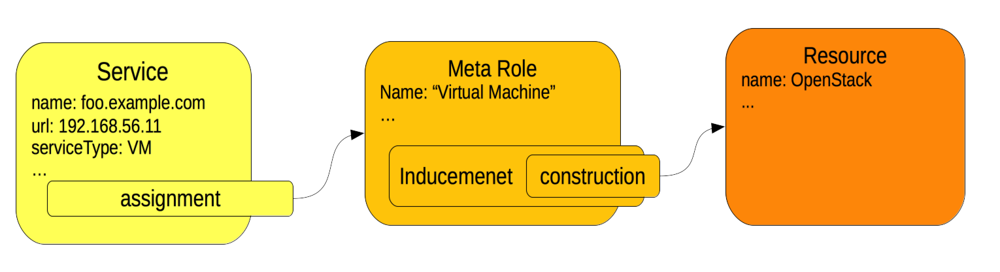
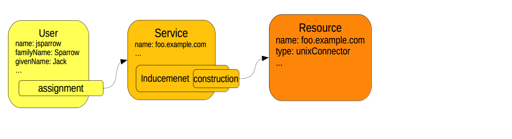

= Services
:page-wiki-name: Services
:page-wiki-id: 23167084
:page-wiki-metadata-create-user: katkav
:page-wiki-metadata-create-date: 2016-08-16T11:51:42.847+02:00
:page-wiki-metadata-modify-user: semancik
:page-wiki-metadata-modify-date: 2016-08-18T19:10:33.466+02:00
:page-upkeep-status: yellow
:page-toc: top

== Introduction

Nowadays its usual that companies provide different services for their employees, partners or even some services for public.
With introducing or becoming a service provider, there are at least two different point of views - the one thing is how to manage these services and the second one is how to manage the users for them to be able to use them.

Introducing the concept of services in midPoint we want to provide the way for both of them.
Not only managing users and their access right to different applications, printers, mobile devices, virtual machines or different things like in IoT world (what is a standard feature of midPoint), but also provide provisioning of the services itself.

For example, you need to create new virtual machine and create accesses for the users (in it) to be able to install some application or do whatever they need to do with it.
Both steps are necessary to make the service available to users.
Traditionally these two steps were managed by two different systems.
With the introduction of the service concept midPoint can now manage both the provisioning of the service and the provisioning of the access to the service.
Of course, there is lot of tools which are helpful with service provisioning, such as cloud managements systems and configuration management tools.
MidPoint is not a replacement for these tools.
MidPoint will integrate with them and manage them.
By leveraging existing tools and integrating it with midPoint it is possible to manage everything from one centralised place.

== The Concept of the Service

MidPoint service object is designed to represent logical or physical services or devices such as virtual machines, mobile devices, servers, printers, network devices, application containers ... and essentially almost anything else.

Services in midPoint can be expressed using midPoints `ServiceType` objects.
The usage and the structure for the ServiceType object is almost the same as xref:/midpoint/reference/roles-policies/roles/rbac/[midPoint roles] (xref:/midpoint/architecture/archive/data-model/midpoint-common-schema/roletype/[RoleType]). It means, you can define rules for provisioning, you can assign roles, xref:/midpoint/reference/roles-policies/policies/metaroles/gensync/['meta-roles, meta-meta-roles'] to them etc.
The one difference is that using services in addition will provide also automatic creation of resource definition (in midPoint terminology it means the target systems, where the users are provisioned).
It can be said that working with services is divided into two parts:

* defining services and generating resource definitions,

* defining provisioning rules  this part is the same like with roles

So, defining service means to create new object of type ServiceType.
It is needed to fill required attributes and all other setting according to the service requirements.
If the standard attributes defined in the schema for ServiceType are not satisfactory, xref:/midpoint/reference/schema/custom-schema-extension/[extension schema] can be used.
The service provisioning is shown on the picture below.
It consist of ServiceType, meta-role definition and the target system (resource) where the new service will be created.

Service objects in midPoint act as xref:/midpoint/reference/schema/focus-and-projections/[focal objects]. It is expected that xref:/midpoint/reference/schema/focus-and-projections/[projections] of the service objects will be objects that represent the services on the resource.
In the above example the service foo.example.com is modeled as service object in midPoint.
When all the provisioning is done then the midPoint service object will have a projection (xref:/midpoint/reference/resources/shadow/[shadow]) in the OpenStack resource.
This project will represent the virtual machine that was created in the open stack.
Of course, as any other focal object service can have many projections.
Therefore the virtual machine may have additional projections that may represent network connections, it may automatically provision the configuration to the network and system management software and so on.
The concept of midPoint service is really a complete service, with all the bits and pieces that are needed to properly run the service.
MidPoint is designed to talk to many different system to completely set up accounts for a user and groups for new project.
Now the same approach is used for services.
MidPoint will make sure all the necessary management, OSS/BSS, monitoring and accounting systems are properly set up when a new service is created.

== Defining Resource for Service

It is planned to support automatic creation of resource definition for service.
But for now, this step needs to be provided manually.
E.g. if the new service defined and provisioned was some unix virtual machine (VM), you will probably want to manage also users for this new VM.
It can be achieved by configuring UNIX Connector.
There exists a lot of connector which can be used with midPoint (xref:/connectors/connectors/[listed here]). After the resource is created for the service, provisioning for users and their access right for the service can start.

Using Services as Roles

Each service behaves as a role.
That means, you can specify provisioning rules (incudements) in the service object and so use that service object for assigning access rights/permissions to users for the service.
So far, you could use roles or orgs (resp.
organizational structure) for it.
But introducing ServiceType, it can be also easier to differentiate between different types of access rights you need to manage.
For example, let the

* roles to represent a business roles such as administrators, auditors, accountant etc,

* orgs to represent organizational structure, either for projects or for organizational units,

* services to represent different things like mobile devices, printers, applications which the users can use.

The brief comparison which object type to use in which situation can be also find xref:/midpoint/reference/roles-policies/roles/roles-services-and-orgs/[here].

== See also

* xref:/midpoint/reference/roles-policies/roles/rbac/[Advanced Hybrid RBAC]

* xref:/midpoint/reference/org/organizational-structure/[Organizational Structure]

* xref:/midpoint/reference/roles-policies/roles/roles-services-and-orgs/['Roles, Services and Orgs']
