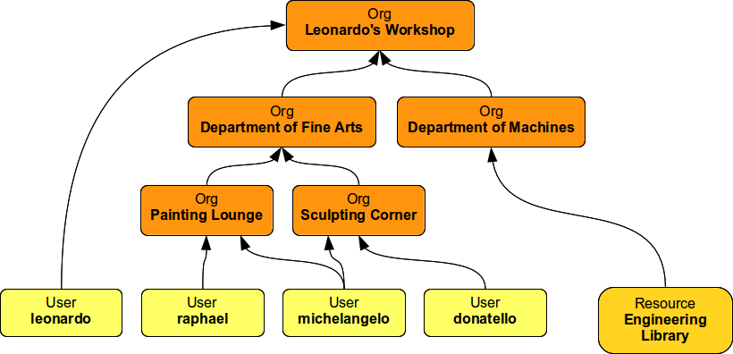
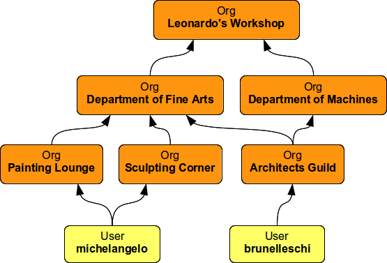
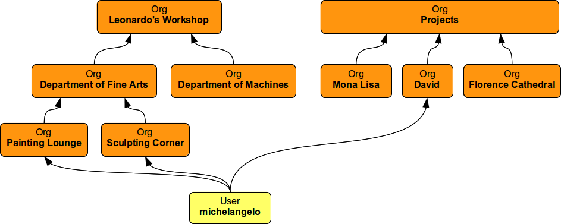
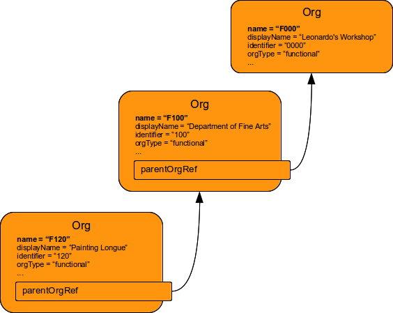
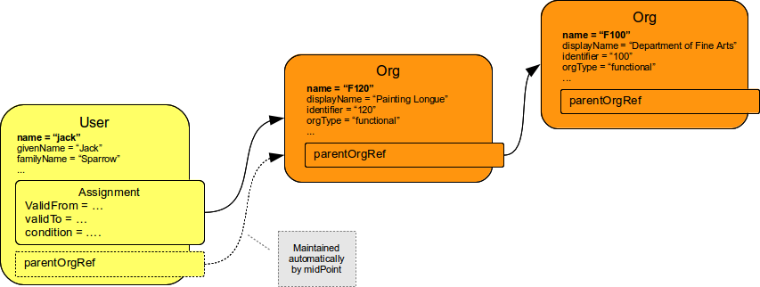

= MidPoint Organizational Structure Introduction
:page-nav-title: Introduction
:page-wiki-name: Organizational Structure
:page-wiki-id: 11370672
:page-wiki-metadata-create-user: semancik
:page-wiki-metadata-create-date: 2013-07-24T10:01:15.792+02:00
:page-wiki-metadata-modify-user: semancik
:page-wiki-metadata-modify-date: 2016-09-16T11:33:44.628+02:00
:page-upkeep-status: orange
:page-upkeep-note: Need to re-structure the pages, empty stub page (one level up) does not make sense.

== Introduction

MidPoint has a native support for organizational structures.
The organizational structure model implemented in midPoint is very flexible.
Although the organizational structure model is primarily designed and optimized to support hierarchical organizational trees it is quite flexible to accommodate even other organization structure types.

Organizational structure is composed of objects called _orgs_ (see xref:/midpoint/architecture/archive/data-model/midpoint-common-schema/orgtype/[OrgType]). An _org_ is a universal grouping mechanism.
Its purpose is to group other objects and orgs.
Orgs usually represent organizations, divisions, departments, sections, workgroups, projects, teams, subteams, ad-hoc groups, domains, realms or similar organizational division units.
Orgs are designed to "nest" inside other orgs hence creating an organizational hierarchy.
However they work equally well in a flat structure.

Figure: Simple hierarchical organizational structure

== Org Structure Features

The basic features of the "org model" are:

=== Can Group All Objects

Organizational structure can be applied to any midPoint object, not just users.
Therefore it is possible to create orgs to group resources or roles, e.g. for the purposed of delegated administration.
However non-org objects may only belong to orgs.
E.g. a user may have an org as a parent but it must not have another user as a parent.
Mathematically speaking the orgs are nodes of the graph while non-org objects may only be leafs.
This does not limits the number of parents a non-org object may have.
E.g. a user may belong to two or more orgs.

=== Multiple Parents

An org may be part of any number of other orgs (having a _parent_ org).
This is a primary tool to create hierarchical structures.
The structure is optimized for fast searches through the structure (e.g. subtree searches).
There is no limitations with respect to the number of parent that an org can have.
Therefore the model can accommodate even a very queer structures (e.g. a section that belongs to two divisions).
The only requirement is that the structure must not form cycles (e.g. an org belonging to itself).
Mathematically speaking the structure must form acyclic oriented graph.

Figure: Object can belong to several orgs

=== Multiple Structures

The number of org "trees" or "graphs" is not limited.
A single midPoint installation may have many organizational structure or organizational structure views.
E.g. it is usual that an enterprise has a functional organizational hierarchy and a flat project project structure at the same time.
This is easy to model in midPoint (see below).
Such individual organizational structures may be completely independent or they may even share some orgs and therefore may be connected.
This is all fine as longs as the "acyclic oriented graph" limitation holds for the entire structure.

Figure: Multiple organizational structures

=== Relation

An object may have several _relation_ types for an org.
The default relation is usually interpreted as "belongs to".
But an object may also have other relation to the same or different org.
This _relation_ mechanism may be used to distinguish organizational unit managers from other employees.
It may be used to distinguish group owners and administrators from other members, etc.

== Creating Organizational Structure

Organizational structure is composed of org objects (xref:/midpoint/architecture/archive/data-model/midpoint-common-schema/orgtype/[OrgType]). Therefore the organizational structure is created by creating appropriate org objects and linking them into a structure by using `parentOrgRef` references.
Part of an organizational structure is illustrated in the following diagram.

Figure: Linking org objects using `parentOrgRef` references.

The org objects have a slightly different use of common object attributes than other objects.
This is motivated by a sensitive nature of organizational structure when it comes to changes in the objects.
Change in a single _user_ object usually only affects only a very small portion of a user base (single user).
E.g. if a user record is deleted and re-created the collateral damage is usually small.
While change in a single _org_ object may affect significant portions of user base (entire departments, divisions or organizations).
If a single organizational unit is deleted and re-created there may be too many users that are affected and the total damage may be more than significant.
This is usually not an issue if the organizational structure is managed manually inside midPoint.
However the organizational structure is frequently synchronized from external sources such as HR database or project management systems.
Changes in organizational structure are common and usually include renames and moves of organizational units.
If the synchronization is automatic it is essential that the synchronization process does as little damage as possible.
E.g. renaming organizational unit is quite a simple operation.
However if the rename is processed as delete of _org_ with an old name and create of _org_ with a new name it may cause a lot of churn in the user base.

The important properties of _org_ objects are described in the following table:

[%autowidth]
|===
| Property | Description | Example Values

| `name`
| Unique identifier of the _org_ object in midPoint repository.
It is used to display an org in administration GUI, in exports, and so on.
It is usually a combination of org type and identifier.
It is often generated by midPoint code and not shared with any external system.
| `F0001`, `projX4567A`

| `description`
| Free text description of the org.
May be quite long (several kilobytes).
It is displayed when detailed description of the org is requested in the GUI.
It may also be used as an implementation comment.
| `This OU is created especially to group common resources that all admin groups needs access to ...`

| `parentOrgRef`
| Reference to the parent organizational unit.
|

| `displayName`
| User-friendly name of the org.
This name is displayed to the end user when dealing with organizational structure.
| `Department of Fine Arts`, `Project Mona Lisa`

| `identifier`
| Identifier of the org.
This identifier should be immutable and act as a primary identifier of the organizational unit, project or group.
It is usually the identifier that is used by the external system (HR system, project management, etc.) It is used as a correlation identifier during organizational structure synchronization. +
There is no requirement on org identifier uniqueness in midPoint.
We assume that the identifier uniqueness will be enforced by the external system.
Also there may be legal need for several orgs with the same identifier, e.g. in case they belong to independent organizational trees.
| `0001`, `X4567A`

| `orgType`
| Type of organizational structure that the org belongs to.
It is usually used to distinguish functional (formal) organizational hierarchies, (flat) project-oriented structures and (informal) ad-hoc or self-managed structures.
If several independent organizational structures are configured then the orgType value is used to quickly distinguish org objects from different organizational trees.
| `functional`, `project`, `ad-hoc`

|===

It is essential to rely on immutable identifiers when synchronizing organizational structure.
Uncontrolled changes in organizational structure affects many users.
Therefore it is recommended to use the combimation of `identifier` and `orgType` as primary composite identifier of organizational unit for the purposes of synchronization.
If this identifier changes then we can assume that the old organizational unit is gone and new unit is created even if the `displayName` is the same.
But even more importantly: we can correctly detect renames.
If only the name of the unit changes that only a `displayName` property needs to be updated and the rest of the org object remains the same.
It is not deleted and re-created and therefore also OID remanins the same.
Users (and other objects) are linked to the org using OID-based references therefore the membership is correctly maintained.

=== XML Structure of Org Objects

.XML structure of a basic organizational unit
[source,xml]
----
    <org oid="c74a7d86-7798-11e2-964e-100000000000">
        <name>F0000</name>
        <description>Famous workshop of Leonardo da Vinci</description>
        <displayName>Leonardo's Workshop</displayName>
        <identifier>0000</identifier>
        <orgType>functional</orgType>
        <costCenter>CC000</costCenter>
        <locality>Florence</locality>
    </org>
----

.Structure of a second-level organizational unit
[source,xml]
----
<org oid="c74a7d86-7798-11e2-964e-100000000100">
        <name>F0100</name>
        <description>Fine arts and stuff</description>
        <parentOrgRef oid="c74a7d86-7798-11e2-964e-100000000000" type="OrgType"/>
        <displayName>Department of Arts</displayName>
        <identifier>0100</identifier>
        <orgType>functional</orgType>
        <costCenter>CC100</costCenter>
        <locality>Florence</locality>
    </org>
----

== Assigning Objects to Orgs

Organizational structure is linked together using `parentOrgRef` references.
Vast majority of midPoint components will look at these references only when working with organizational structure, displaying it, etc.
The references are internally backed by indexing structures that make it very efficient to suppport tree-like structures - which is something that relational databases are not usually built for.
But there is price to pay for this efficiency.
The `parentOrgRef` references are very simple and quite static.
There is no (direct) way how to specify conditional or temporary membership in an org just by using `parentOrgRef`. Doing so would complicate the system to the point that it would no longer be efficient or maintainable.
But conditional and temporary membership is something for which xref:/midpoint/reference/roles-policies/roles/assignment/[assignments] were designed.
Therefore the plain organizational structure is combined with assignments to get the benefits of both mechanisms.

[%autowidth]
|===
| Object types | Linking Mechanism | Description

| Org to Org
| parentOrgRef
|

| focus to Org +
(User to Org)
| assignment
| Focal objects (such as User) are _assigned_ to the orgs.
If the assignment is valid (condition is true and the time constraints are satisfied) then a `parentOrgRef` will be automatically created by midPoint.
When the assignment becomes invalid the `parentOrgRef` is removed which efficiently removes memebrship in the org (the assignment remains unmodified).

| configuration to Org +
(Resource to Org)
| parentOrgRef
| Configuration objects (such as Resource or Connector) does not have assignments.
Such objects are directly linked to the orgs into which they belong using `parentOrgRef`.

|===

== Organizational Structure and RBAC

Organizational structure is usually related to the role structure (RBAC).
E.g. it is usual that all users belonging to a specific department have the same role.
MidPoint makes this arrangement easy to implement by a simple mechanism: *every org is also a role at the same time*. This may be quite unusual and it may take some time to fully understand but it is a powerful mechanism.
Most of the orgs do not have any inducements therefore they are considered empty roles and nothing special happens.
But it all gets much more interesting if an org has an inducement.
If a user is assigned to such org the org behaves as a role and automatically computes and executes all the construction element that the inducement leads to.

// TODO: better description

// TODO: == Searching Organizational Structure

// TODO: search filters that are special for organizational units (depth)

// TODO: mention that searching in the org hierarchies is efficient (index table)

== See Also

* xref:/midpoint/reference/roles-policies/roles/assignment/[Assignment]

* xref:/midpoint/reference/roles-policies/roles/rbac/[Advanced Hybrid RBAC]
