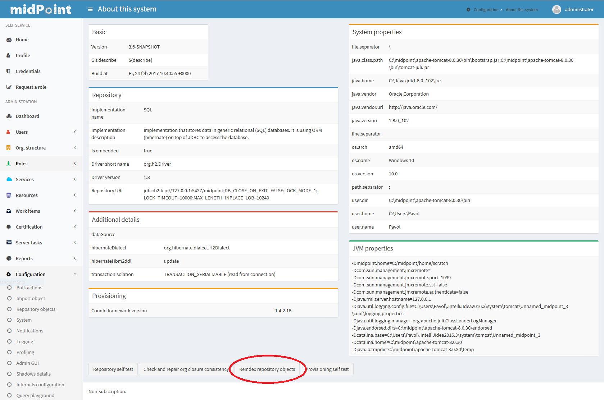
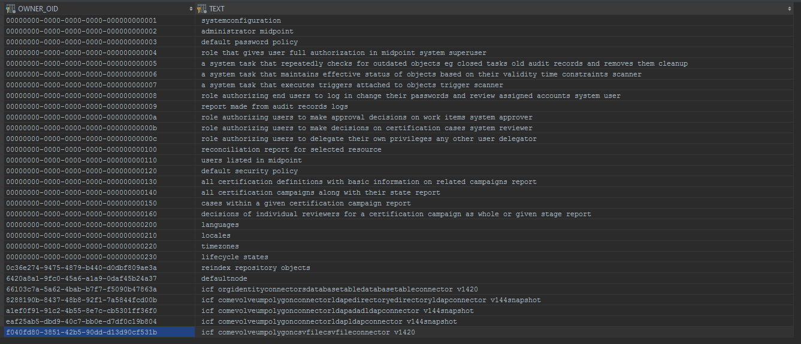
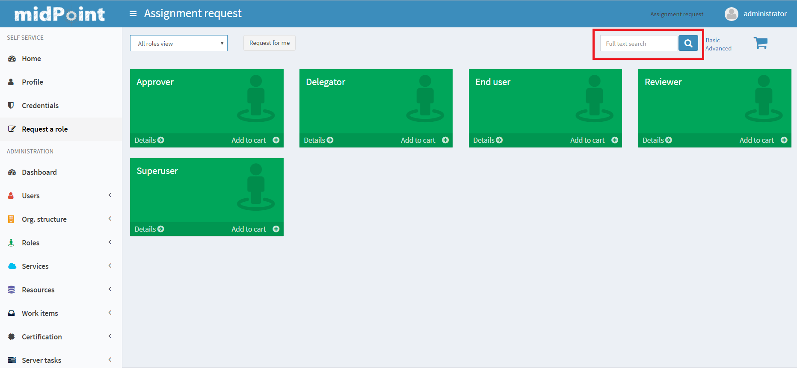

= Full-Text Search
:page-wiki-name: Full-text search HOWTO
:page-wiki-id: 24085323
:page-wiki-metadata-create-user: mederly
:page-wiki-metadata-create-date: 2017-02-27T11:45:43.315+01:00
:page-wiki-metadata-modify-user: vix
:page-wiki-metadata-modify-date: 2018-04-19T13:43:10.256+02:00
:page-alias: { "parent" : "/midpoint/guides/" }
:page-since: "3.6"
:page-upkeep-status: yellow
:page-display-order: 60
:page-toc: top

== Background information

MidPoint contains a simple full-text search feature.
Selected items can be indexed and then queries can be put against their content.
More specifically:

. Any textual properties of midPoint objects can be designated as "full-text search indexed" in system configuration.
These can be either standard properties (e.g. user's given and family names) or extension properties.

. When updating these objects, midPoint extracts content of these properties, normalizes it, and stores in a separate `m_object.fullTextInfo` column (or a separate `m_object_text_info` table for the old Generic repository).
Normalization consists of applying default PolyString normalizer that removes diacritics marks and converts all characters to lowercase.
Also, during normalization, duplicate words are eliminated, in order to optimize space and processing speed.

. The normalized indexed content is available for querying.
A user can specify a word (or a part of it) and midPoint will look up all objects that contain that word (or its part) in the indexed content.

Current limitations:

. Because conventional database mechanisms (standard indices) are used, this feature is applicable to small or medium-sized installations; we estimate the threshold to be few thousands or tens of thousands records.
(In the future we expect to apply specialized approaches to full-text search to provide wider applicability.)

. Because of the implementation chosen, it is not possible to search for a phrase.
Since 3.6.1 if multiple words are entered, midPoint looks for objects that contain all the specified words (possibly in different parts of the object).
In "plain" 3.6, the result of multiple words searches is undefined and can be falsely negative.

== Setting it up

By default, the full-text search feature is disabled.
How to enable it:

. Provide a list of items to be indexed.
This is done in system configuration object, for example by including the following configuration:

.Sample configuration for indexing objects' text content
[source,xml]
----
<fullTextSearch>
   <indexed>  <!-- no "objectType" element means this applies to all objects -->
      <item>name</item>
      <item>description</item>
   </indexed>
   <indexed>
      <objectType>UserType</objectType>
      <item>fullName</item>
      <item>givenName</item>
      <item>familyName</item>
      <item>additionalName</item>
      <item>nickName</item>
      <item>emailAddress</item>
      <item>telephoneNumber</item>
      <item>honorificPrefix</item>
      <item>honorificSuffix</item>
      <item>title</item>
      <item>employeeNumber</item>
      <item>employeeType</item>
      <item>costCenter</item>
      <item>organization</item>
      <item>organizationalUnit</item>
      <item>locality</item>
   </indexed>
   <indexed>
      <objectType>AbstractRoleType</objectType>  <!-- use AbstractRoleType for self-service with Role catalog ! -->
      <item>displayName</item>
      <item>identifier</item>
   </indexed>
   <indexed>
      <objectType>RoleType</objectType> <!-- there can be more "objectType" elements for a single entry (not shown here) -->
      <item>roleType</item>
   </indexed>
   <indexed>
      <objectType>OrgType</objectType>
      <item>orgType</item>
      <item>costCenter</item>
      <item>locality</item>
      <item>mailDomain</item>
   </indexed>
   <indexed>
      <objectType>ServiceType</objectType>
      <item>serviceType</item>
      <item>locality</item>
   </indexed>
</fullTextSearch>
----

. Re-index existing objects.
This can be done by _About -> Reindex repository objects_ action.

The `m_object_text_info` table content (Generic repo) will then look like this:

The same result (only with different colum names) can be achived by running the following SQL in the Native repository:

[source,sql]
----
select oid, fulltextinfo from m_object
----

== Using it

If the full-text search feature is enabled in the system configuration, it can be used from the GUI.

== Limitations

Current version of full-text search has the following limitations:

* Full-text of items inside multi-value containers is not supported.

* Full-text of index-only items is not supported.
It may seem working, but it is unreliable and the results are undefined.
The reason for this is that when object is modified any change of the full-text-indexed attribute
refreshes the full-text system column from the fetched part of the object - and the object is
likely to be fetched without index-only attributes.

* It is not possible to search for the start/end of the words or for whole words only.

* It is not possible to search for diacritics because both prepared index and values used
for search are normalized before compared.
E.g. "šiť" will also find word "sit" and anything containing the substring as well.

These limitations apply at least up to version 4.4 and to both repository implementations.

== See also

* xref:/midpoint/reference/repository/native-postgresql/[Native PostgreSQL repository]

* xref:/midpoint/reference/repository/generic/[Generic repository implementation] - not recommended from 4.4 on
