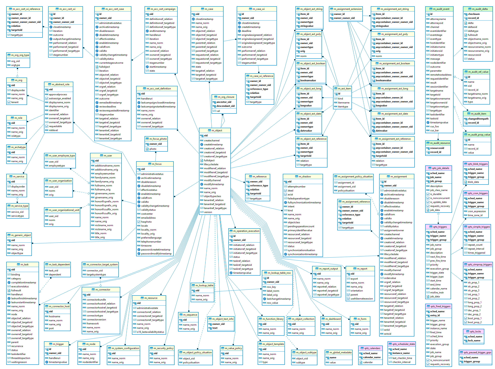

= Generic SQL Repository Implementation
:page-wiki-name: Generic SQL Repository Implementation
:page-nav-title: Implementation
:page-display-order: 20
:page-wiki-id: 4424005
:page-wiki-metadata-create-user: semancik
:page-wiki-metadata-create-date: 2012-06-18T10:16:38.030+02:00
:page-wiki-metadata-modify-user: virgo
:page-wiki-metadata-modify-date: 2020-10-30T16:45:12.599+01:00
:page-upkeep-status: green
:page-deprecated-since: "4.4"
:page-toc: top

[NOTE]
This page discusses deprecated repository implementation that was replaced with xref:/midpoint/reference/repository/native-postgresql/[Native PostgreSQL reposit].

SQL repository implements both repository and audit API.
It facilitates Hibernate 5 as persistence framework, and for connection pooling link:https://brettwooldridge.github.io/HikariCP/[HikariCP] (previously c3p0).

Audit records are stored synchronously and implementation currently shares connection pool with main repository.
There are few planned improvements for audit, see link:https://jira.evolveum.com/browse/MID-4745[MID-4745].

== Configuration

Repository component configuration is placed in main `config.xml` file in `midpoint.home` folder.
Basic configuration is quite simple.
It will use embedded H2 database which will be placed in `midpoint.home` folder.

[source,xml]
----
<configuration>
  <midpoint>
  <repository>
     <repositoryServiceFactoryClass>com.evolveum.midpoint.repo.sql.SqlRepositoryFactory</repositoryServiceFactoryClass>
     <baseDir>${midpoint.home}</baseDir>
  </repository>
  </midpoint>
</configuration>
----

For more complex configurations using different DB vendors see xref:/midpoint/reference/repository/generic/configuration/[Repository Configuration].

== DB tables, structures

Our data objects defined in link:https://github.com/Evolveum/midpoint/blob/master/infra/schema/src/main/resources/xml/ns/public/common/common-3.xsd[common-3.xsd] schema which are managed by SQL repository are quite complex.
They are stored in `m_object` table in `fullObject` column as blobs.
Parts of these objects are stored in related tables for better searching.

The following picture shows DB schema for version 4.2 (ER diagram extracted with DBeaver from PostgreSQL):

Objects from main schema are designated with yellow title background, audit is green and Quartz tables (scheduler, or jobs store) are purple.
Both Quartz and audit can be placed in different databases using different JDBC configurations.

=== General

PrismObject represented as XML objects contain one natural primary key - oid attribute.
Some objects also contain PrismContainers which use id as container identifier (assignments, inducements, triggers, etc.). Identifiers for objects and containers are generated in midPoint.
Object references introduced in XSD schema are transformed to entities with weak reference which means reference doesn't use foreign key to achieve full consistency across midPoint repository.
This will simplify work with objects during import or delete as it's not necessary to correctly sort objects before making any changes.
To further improve hibernate performance we've introduced `EntityState` interface.
This interface is used within most entities.
Developer knows in most cases whether entity is transient or detached, therefore hibernate doesn't need to do any checks (we'll get rid of many unnecessary select queries).

=== Storing xsd:any attributes

xsd:any container can be found in:

* ObjectType - extension (and subclasses)

* ShadowType - attributes

* AssignmentType - extension

Schema for extension containers is static for first and third case.
ShadowType attributes use dynamic schema which depends on defined resources.
Extension container can contain elements of different types.
SQL repository supports `String`, `Long`, `Date`, `Clob`, `ObjectReferenceType` and `PolyStringType`.
All elements are aggregated to these types (tables).

* Long, Integer, Short -> *Long*

* Date (Gregorian calendar) -> *Date*

* String, Double, Float -> *String*

* ObjectReferenceType and PolyString types are handled via custom tables

* Everything else goes to *Clob*

Long, Date and String values are indexed, clob is not indexed.
Real types for aggregated types are saved as QName values.
Aggregation translation for xsd:any values is provided by link:https://github.com/Evolveum/midpoint/blob/master/repo/repo-sql-impl/src/main/java/com/evolveum/midpoint/repo/sql/data/common/any/RAnyConverter.java[RAnyConverter]. Repository uses dictionary implementation to store/load different properties, see link:https://github.com/Evolveum/midpoint/blob/master/repo/repo-sql-impl/src/main/java/com/evolveum/midpoint/repo/sql/data/common/dictionary/ExtItemDictionary.java[ExtItemDictionary]. New items are added to dictionary in transaction other than current add/modify operation is in.
In such case parent transaction is restarted.

=== Audit structures

Audit tables uses `IDENTITY` columns (autoincrement).

== Transactions, locking failover

SQL repository uses simple transactions which last during single operation (e.g. add/modify/delete/search).
When transaction fails because of locking (table lock timeout, record timeout), SQL repository tries to repeat operation for number https://github.com/Evolveum/midpoint/blob/b83a83a91a19cc6cc1579e806557a1305d18c560/repo/repo-sql-impl/src/main/java/com/evolveum/midpoint/repo/sql/SqlRepositoryServiceImpl.java#L81[SqlRepositoryServiceImpl#RESTART_LIMIT] times.
As this implementation supports databases from multiple vendors, transaction and locking configuration is different for each vendor.
Default configurations are defined in `SqlRepositoryConfiguration`.

== Querying

See the relevant section in xref:/midpoint/reference/concepts/query/#differences-in-filter-interpretation[Query API]
documentation for details about what is or is not supported from our Query API in the repository.

Query processing is implemented in `QueryInterpreter` which uses `QueryDefinitionRegistry`
to translate queried value name to the real hibernate entity property name.

== Tests

Most tests are located in module `repo-sql-impl-test`.

== Overall code description

todo

* SqlRepositoryBeanConfig - spring wiring and initialization

* SqlRepositoryConfiguration - sql repository configuration, handles config.xml and such

// TODO remove when 4.4 support ends
* DataSourceFactory - connection pool initialisation and configuration
