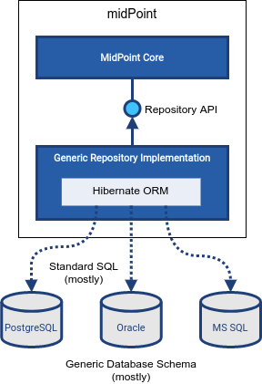

= Generic Repository
:page-upkeep-status: orange
:page-deprecated: true
:page-deprecated-since: "4.4"
:page-replaced-by: ../native-postgresql/
:page-moved-from: /midpoint/reference/repository/db/*
:page-display-order: 50
:page-deprecated-since: "4.4"
:page-toc: top

MidPoint stores its data in a relational database.
Historically, midPoint supported several database engines that could be used to store the data.
A "generic" implementation of data storage mechanisms (a.k.a. "repository") was developed for that purpose, using abstraction libraries to support several database engines with a single code-base.

Generic repository implementation has one advantage: you can choose one of several database engines.
However, it has many disadvantages.
The implementation has to be generic, fitting all the supported database engines at once.
Therefore only "standard" mechanisms common to all supported databases can be used.
Only "standard" SQL commands can be used, the implementation cannot take advantage of database-specific improvements (such as `SELECT FOR UPDATE` command).
Only "standard" database schema can be used, the implementation cannot take advantage from database-specific features (such as hierarchical database tables, partitioning, etc.)
Therefore, the generic repository implementation is limited.
It can still do all the things necessary for basic midPoint operation.
However, it does not do them very well.

.Replaced by native PostgreSQL repository
WARNING: Generic repository implementation is now *deprecated*.
It was replaced by a xref:../native-postgresql/[Native PostgreSQL repository implementation] in midPoint 4.4.
The native repository implementation was developed as a part of xref:/midpoint/projects/midscale/[midScale project], aiming at improving midPoint scalability.
Generic repository implementation will be still supported for some time.
However, its use is *strongly discouraged*, especially for new midPoint deployments.
Existing midPoint deployments that still use the generic repository are *strongly recommended to migrate to xref:../native-postgresql/[Native PostgreSQL repository]* as soon as possible.

Please see following pages for details:

++++

++++

== See also

* xref:/midpoint/reference/repository/repository-database-support/[Repository Database Support]
discusses old and new repository and our support strategy.

* xref:../native-postgresql/[Native PostgreSQL repository]
