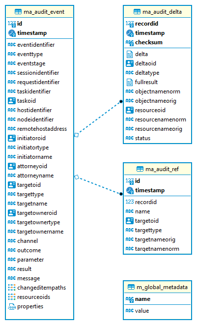

= Native PostgreSQL Audit Trail
:page-nav-title: SQL Audit
:page-display-order: 15
:page-since: "4.4"
:page-toc: top

[IMPORTANT]
This page documents the audit trail based on the new Native PostgreSQL Repository introduced in midPoint 4.4.
For the old Generic SQL audit trail see xref:../generic/generic-audit/[this page].

*First things first!* You want to check configuration overview lower, make the necessary changes in the new `config.xml`,
but before you run your midPoint in production mode, you have to consider *audit migration* and *partitioning*.

.Before you migrate your audit!
[IMPORTANT]
====
If you want to migrate your old audit to the new database, *be sure to prepare the audit database as described
in the link:#audit-migration-from-other-database[migration notes] before you start using the new repository audit*.

You'll definitely want to prepare the ID sequence to keep all audit IDs unique!
====

.If you want partitioned audit tables...
[IMPORTANT]
Check the link:#partitioning[Partitioning] section before you start MidPoint for production purposes.
Anything later will be too late.

Only if you don't care about either, you may safely ignore those sections.

== Configuration overview

SQL auditing is configured in `config.xml` inside
xref:/midpoint/reference/deployment/midpoint-home-directory/[midPoint home directory],
also known as `midpoint.home`.

See xref:/midpoint/reference/security/audit/[Auditing] for more general information about auditing
and some other configuration options, not specific for the SQL trail implementation.

SQL audit trail for the Native Repository is enabled in `audit` configuration element by
adding `auditService` element containing `auditServiceFactoryClass` element with the value
`com.evolveum.midpoint.repo.sqale.audit.SqaleAuditServiceFactory`.

For example, the `audit` section may look like this (the first `auditService` is not related to the repository):

[source,xml]
----
<audit>
    <auditService>
        <auditServiceFactoryClass>com.evolveum.midpoint.audit.impl.LoggerAuditServiceFactory</auditServiceFactoryClass>
    </auditService>
    <auditService>
        <auditServiceFactoryClass>com.evolveum.midpoint.repo.sqale.audit.SqaleAuditServiceFactory</auditServiceFactoryClass>
    <auditService>
</audit>
----

Without further configuration, audit uses the same datasource as the main repository (in the `repository` element).
The audit tables (see link:#audit-tables[below]) must be part of the repository database in that case.

To enable separate database connection settings, use `jdbcUrl` in the `auditService` element.
See the options in the following sections for more details.

== Configuration options

Many xref:../configuration/#configuration-options[repository options] can be used for
the SQL audit trail - these are mentioned in the table below.
Some of them are relevant only if separate data source with its own connection pool is used for the SQL audit.
Few options do not depend on the database connection and can be tweaked separately - these are named in the second table below.

All the options for the concrete audit trail implementation (or audit service) are placed directly under `auditService` element.

=== Basic connection options

You may skip this table, if you want to use the same database settings and the same connection pool
for both main repository and the SQL audit - this is perfectly acceptable solution for most deployments.

[%autowidth]
|===
| Option | Description | Default

| `jdbcUrl`
| URL for JDBC connection.
When this is present, separate connection pool will be initialized for the SQL audit.
See https://jdbc.postgresql.org/documentation/head/connect.html[Connecting to the Database] from PostgreSQL JDBC Driver documentation for more.
| `jdbc:postgresql://localhost:5432/midpoint`

| `jdbcUsername`
| Username for JDBC connection.
Can be empty, if username is not needed or provided in JDBC URL or otherwise.

Example: `midaudit`
|

| `jdbcPassword`
| Password for JDBC connection.
Can be empty, if password is not needed or provided in JDBC URL or otherwise.

Example: `password`
|

| `database`
| Ignored by the Native repository and cannot be changed - do not use it.
| `postgresql`

| `driverClassName`
| Ignored by the Native repository and cannot be changed - do not use it.
| `org.postgresql.Driver`

// TODO remove when 4.4 support ends
| `dataSource`
| Uses JNDI DataSource loading, when this option is defined in configuration.
This is only relevant for WAR deployment which is not recommended anyway.
`jdbcUrl`, `jdbcUsername`, `jdbcPassword`, and `driverClassName` is ignored and should not be used.
Example: `<dataSource>java:comp/env/jdbc/midaudit</dataSource>`

*WARNING:
This is obsolete functionality that is no longer supported or maintained.*
It is relevant only for WAR deployments on Tomcat and even there we recommend using explicit configuration using options above.
|
|===

It is possible to connect to the database without specifying password or username or both.
Simply skip configuration elements *jdbcUsername* and *jdbcPassword*.
If everything is configured as expected, connection will be successful, otherwise JDBC driver will throw an exception and midPoint will not start.

There are more connection pool settings, see xref:../configuration/#other-connection-pool-options[their description]
in the repository configuration document.
Again, these are only relevant if separate connection setup is used.
You may try to lower `minPoolSize` and monitor the usage of the connections to adjust `maxPoolSize` later too.

[IMPORTANT]
If the same database server is used for the repository and SQL audit, it is important to count the
`maxPoolSize` for audit to the total possible count of used connections and avoid going over PostgreSQL
`max_connections` setting.

=== Other SQL audit configuration options

Default values of these options are taken from `repository` element, and only if not specified there,
the value in the *Default* column is used.

[%autowidth]
|===
| Option | Description | Default

| `fullObjectFormat`
| Property specifies format (language) used to store serialized object representation into
`ma_audit_delta` table (`delta` and `fullResult` columns).
Supported values are `json` and `xml`.
This is safe to change any time, objects are read properly regardless of the format they are stored in.
| `json`

| `iterativeSearchByPagingBatchSize`
| The size of the "page" for iterative search, that is the maximum number of results returned by a single iteration.
This is a rather internal setting and the default value is reasonable balance between query overhead and
time to process the results.

It can be raised if the iterative search overhead (executing the select)
is too high compared to the time used for processing the page results.
| `100`

| `createMissingCustomColumns`
| Specifies whether midPoint should create missing columns for link:#custom-column[custom properties] during the startup.
| `false`

| `sqlDurationWarningMs`
| Duration in millis after which the query is logged by `com.evolveum.midpoint.repo.sqlbase.querydsl.SqlLogger`
on the `WARN` level, including the provided parameters.
| `0` (disabled)

|===

There are no options for compression as this is left to PostgreSQL.
This also makes the inspection of the values in the columns easier.

== Audit tables

Audit logs are stored in the tables structured as shown below.
You can find current schema script for audit in link:https://github.com/Evolveum/midpoint/blob/master/config/sql/native/postgres-audit.sql[git],
or in the distribution packages in the file `doc/config/sql/native/postgres-audit.sql`.

.Native PostgreSQL audit tables

`ma_audit_event` is the main table representing each audit event.
See xref:/midpoint/reference/security/audit/#audit-record-structure[Audit record structure]
for detailed logical descritiption of the events.

* Each record can have multiple deltas associated with it, these are stored in `ma_audit_delta`.
* References are stored in `ma_audit_ref` table, multiple references for the same `recordId`
can be stored, even under the same `name`.
Conceptually, this stores multimap (name -> references) for each record.
* Audit event `changedItem` and `resourceOid` are stored as arrays of `TEXT` directly in `ma_audit_event` table.
* Item `property`, which is a multimap (name -> strings), is stored in JSONB column directly in `ma_audit_event` table.
* Custom properties (`customColumnProperty`) are stored each in dedicated column of `TEXT` type.
See the section link:#custom-column[Custom columns] below for details.

Audit event record should be uniquely identified by its `id` column (matching `recordId` in the related tables).
However, for technical reasons related to the partitioning support, only uniqueness of `id`+`timestamp` combination is enforced on the database level.
Database will assign a new unique ID from the sequence which ensures uniqueness for a clean audit.
But if ID is provided, and is unique in combination with the timestamp, DB will accept it.
Audit export/import preserves the original record IDs, so if you don't set the ID sequence accordingly,
new audit events will likely use these old existing IDs.

[IMPORTANT]
====
Audit event record ID is unique under normal circumstances.
To keep ID unique even after migrating your old audit from previous database use the steps from the
link:#audit-migration-from-other-database[migration notes] below.

If you don't do this, audit events will be written normally, but non-unique IDs can cause errors in the GUI!
====

=== Upgrading

To upgrade the audit database, run the provided `postgres-audit-upgrade.sql` anytime, it should be safe.
It always runs only the missing parts of the upgrade process.
Be sure you're running the upgrade script provided with the version you're actually using, see
xref:/midpoint/reference/upgrade/database-schema-upgrade/#upgrading-native-postgresql-repository[database schema upgrade].

You can find further details in the source code documentation for `apply_audit_change` procedure in the `postgres-audit.sql` script.

== Partitioning

Audit tables are designed to https://www.postgresql.org/docs/current/ddl-partitioning.html[allow partitioning] by the `timestamp` column.
This is what PostgreSQL calls *declarative* partitioning by *range*.
All audit tables can be split - preferably they should use the same partition ranges, which is exactly what the supported procedure described lower does.

_Declarative_ partitioning means that the rows are placed into the right partition and also searched for in that partition, if the
partitioning key (`timestamp` attribute) is used in the search conditions - which is always advisable.
Word "declarative" however *does not* mean that the partitions are automatically created when needed.
There are solutions for this problem out there, but these are not described here and are not supported.

[NOTE]
.PostgreSQL partitioning caveats
Column `timestamp` is the partition key, and as such it must be present in all partitioned tables,
that is also `ma_audit_delta` and `ma_audit_ref`.
It also must be part of any unique index, including primary key, and of course the foreign keys referencing `ma_audit_table`.
If `timestamp` is used in queries, only the relevant partitions are searched.
On the other hand, if it is not part of the query, all partitions must be consulted - which is like executing `UNION` query on all of them.

=== Do I need partitioning?

For anything but large-scale deployments the answer is: "Likely not."
In that case you don't need to do anything as the default partition is already precreated for all tables
and audit rows have a place to go to.

You should not consider partitioning for the search performance alone.
The main benefit of audit partitioning is *fast audit cleanup*.
You should consider partitioning if you struggled with audit cleanup previously.
With partitioning you can virtually instantly drop or detach partitions from the active table which makes the audit data cleanup and/or archival much easier.

[NOTE]
With partitions or not (BTW, there is always the default one), outside this section you do not need to consider partitions.
Always work with the tables described in previous sections (e.g. `ma_audit_event`) even though they are only virtual.
The whole point of _declarative partitioning_ is that you do not need to care about it for normal use cases.

=== Creating partitions

MidPoint offers an SQL procedure `audit_create_monthly_partitions` that is declared in `postgres-audit.sql`
(current version https://github.com/Evolveum/midpoint/blob/master/config/sql/native/postgres-audit.sql[here]).
As the name suggests, it creates monthly partitions which is quite fine-grained and is easy to utilize,
whether your cleanup is executed monthly, quarterly or yearly.

See also the discussion on the Cleanup task in the section below.

To create partitions for the next 5 years, simply run this SQL command:

[source,sql]
----
call audit_create_monthly_partitions(60);
----

If you have anything in the default partition, the command will likely fail with the following error:

----
[23514] ERROR: updated partition constraint for default partition "ma_audit_event_default" would be violated by some row
----

You have to resolve the situation by deleting the rows in the default partition, which is likely to delete all the audit rows.
Alternatively, you may only detach the partition if you want to do something with the rows later.
However, this likely indicates that the partitioning is done too late in the process.

If you're planning to link:#audit-migration-from-other-database[migrate the old audit], don't forget to create partitions into the past too:

[source,sql]
----
call audit_create_monthly_partitions(-60);
----

Of course, investigate your old audit to find out how many partitions are needed.
Alternatively, decide on the earliest date and use a filter for the audit export (example in the section on migration).

To check existing audit partitions, including estimated row count, you can use the following SQL query:

[source,sql]
----
select i.inhrelid::regclass::text as partition, t.reltuples rows_estimate
from pg_inherits i
join pg_class t on t.oid = i.inhrelid
where inhparent = 'ma_audit_event'::regclass
order by partition;
----

It is safe to run `audit_create_monthly_partitions` multiple times, it reports existing partitions and creates only the missing ones.

[IMPORTANT]
.Schedule the partition creation!
You should schedule the procedure call or add it to a regular checklist, because 5 years may pass faster than expected.
Audit will continue adding rows into the default partition and it will not be possible to use the procedure without changes.
You can create future partitions and later migrate the data from the default partition when they are in the past, but it's best to avoid this situation altogether.
Schedule the procedure call; then you can also consider creating less than 60 partitions into the future.

.What about quarterly or yearly partitions?
[NOTE]
====
There is no need for concern regarding the count of partitions, unless you plan to keep hundreds of them.

If you really need partitions over longer time period, you may adapt the creation procedure.
We would recommend using natively supported PostgreSQL intervals, that is `quarter` or `year`.
If you want two-month partitions, you want to be sure they are all starting with odd months,
but it's not so trivial with https://www.postgresql.org/docs/current/functions-datetime.html#FUNCTIONS-DATETIME-TRUNC[date_trunc]
used in the procedure.
Adopting different supported interval, however, should be easy.

Just remember that this way you're changing the granularity for your data cleanup procedure as well.
====

=== Cleanup task vs partitions

MidPoint already has one mechanism to clean up the audit tables - the precreated *Cleanup* task, executed once a day.
The task consults the xref:/midpoint/reference/deployment/removing-obsolete-information/[Cleanup policy]
(part of ) to figure out what to delete.
If you absolutely require something on day-to-day basis and the audit database can handle deletion
of a day's work, you may stick to the Cleanup task.
There is also an option to use `maxRecords` instead of `maxAge` in the `auditRecords` under `cleanupPolicy`.

If you want to use Cleanup task, you probably do not need partions; but you might - read on.
There is one problem with deleting data from the big audit table though.
PostgreSQL needs to reclaim the empty space; the process is called https://www.postgresql.org/docs/current/routine-vacuuming.html[vacuuming].
In theory, you don't need to care about it, if the auto-vacuuming can keep up with the deletions,
but there is a warning in the linked document that you may need to run `VACUUM FULL` eventually, which requires a table lock.
That would make writing into audit impossible during the operation, and full vacuum takes time.

This makes partitions attractive, even if you want to use these traditional cleanup methods based on `DELETE`.
Non-vacuumed partition still needs vacuuming, but only locks that partition - which likely is not the partition for current time, used for inserting the new audit entries.

However, if you don't need to clean up data daily, you may utilize full potential of the partitions.
Let's say, you don't need audit events older than 12 months, but can tolerate 13 months.
That means that if it's December 2021, you may drop partition for November 2020, just like you dropped the one for October 2020 the previous month.
Partitions created by the `audit_create_monthly_partitions` procedure are named with a specific suffix, so you know exactly what partitions they are.

To drop these partitions, you simply drop their tables (first the dependent ones):

[source,sql]
----
drop table ma_audit_ref_202009;
drop table ma_audit_delta_202009;
drop table ma_audit_event_202009;
----

Alternatively, just detach them, which makes them invisible for midPoint
and you can later decide what to do with them (here the order does not matter):

[source,sql]
----
alter table ma_audit_event detach partition ma_audit_event_202011;
alter table ma_audit_delta detach partition ma_audit_delta_202011;
alter table ma_audit_ref detach partition ma_audit_ref_202011;
----

Currently, there is no automation for these tasks available - these may be provided in the future.
However, this is considered advanced PostgreSQL already, and your DB admin should be ready to automate these tasks.

[NOTE]
If you want to retire the audit data on the database level with partitions, it is best to leave `auditRecords`
element in the `cleanupPolicy` empty.

== Audit migration from other database

[NOTE]
Audit migration is implemented in xref:/midpoint/reference/deployment/ninja[Ninja] since midPoint 4.4.1.

If you plan to migrate audit records from the Generic repository, you need to make necessary
preparations *before* you start using the new audit.
It is possible to perform the migration later, but it is important to be prepared for it before you start using the new audit database.

=== Preparing the new audit database for migration

This is part of the xref:/midpoint/reference/repository/native-postgresql/migration/[Migration to Native PostgreSQL Repository],
If you're not coming from that guide, please, check it now to put these steps in the context of the whole process.

As described in the section about link:#audit-tables[audit tables], Native SQL audit uses
combination of `id` and `timestamp` as a unique identifier (primary key).
There is currently nothing in audit mechanism that relies on uniqueness of `id` column (or `repoId` in schema),
but the *GUI assumes the ID is unique when searching/reading the audit*.
Unique ID is also a nice property, especially if other external systems reading the audit database.

Technically, it does not matter whether you import first the audit or the repository.
It is more convenient to migrate the repository first, though, because audit can be migrated slowly while the system is working.

The following steps are the same for a separate audit database or a shared one with the repository:

. Be sure there are no essential audit records created in your new environment before the preparation steps.
You can test the new environment, if you're OK with audit deletion before going serious.

. Check your old audit database and find out what the highest used `ID` is:
+
[source,sql]
----
select max(id) from m_audit_event;
----

. Make an informed estimate (or wild guess) how many more records will be created until the old system is fully migrated,
or simply use much higher number to set the `id` in the new audit database (it is `bigint` column, don't worry about going over maximum value of 9223372036854775807):
+
[source,sql]
----
-- use your value, 100m can be still too low for your deployment
select setval(pg_get_serial_sequence('ma_audit_event', 'id'), 100000000);
----

. If you used any custom columns in the audit table, create them in the `ma_audit_event` table as well.
Use the type `TEXT` for these columns.
See the section link:#custom-column[Custom columns] below for details.

. If you want to use partitioning, *prepare the partitions before you start using the audit for real!*
It is possible to migrate data later, but it can be extremely cumbersome, so get ready before going live.
Check the link:#partitioning[Partitioning] section above.
Don't worry about any test audits that you delete later, but anything production better goes into the right partitions.
Don't forget to prepare partitions into the future for production, but also for the past for your migrated audit.

=== Executing the migration

Audit migration is performed using the xref:/midpoint/reference/deployment/ninja[Ninja] tool.
It does not require the old MidPoint running, it is actually better when it does not.
That's why it is better to migrate audit data after the objects are migrated already and the new upgraded MidPoint is up and running.

To export the old audit you need the following:

* The old audit database must be accessible by Ninja; JDBC connection is used.
* xref:/midpoint/reference/deployment/midpoint-home-directory/[MidPoint home directory] with `config.xml` is available.
The configuration file is essential, but other parts of MidPoint home are important too - especially the extension schema files.

Now it is time to decide whether you want to export/import the whole audit at once, or do it in smaller slices.

[IMPORTANT]
.Before you import...
New audit stores serialized objects in `ma_audit_delta` table, in the columns `delta` and `fullResult`.
If you have any external analysis tool based on the content of these columns, you'll likely want to specify
`fullObjectFormat` in the `auditService` section of the `config.xml`, because it defaults to JSON for the new audit.
You can set it to `xml`, which was the previous default; do so *before you run the import commands*.
New audit does not compress these columns.
If you don't need XML, do not set anything, default JSON format takes much less space.

==== Single roundtrip audit migration

To do it all at once just run the following command (use `-z` for manageable file sizes):

[source,bash]
----
MIDPOINT_HOME='/var/old-mp-home' bin/ninja.sh -v export-audit -z -o audit-export.zip
----

[NOTE]
If you use unbundled JDBC driver, check xref:/midpoint/reference/deployment/ninja[Ninja documentation] how to specify the JDBC JAR.

You can also use filter to export only some audit events, typically by their timestamp.
Following example uses Midpoint query filter preceded by `%` (different parameter escaping may be needed if you don't use `bash`):

[source,bash]
----
MIDPOINT_HOME='/var/old-mp-home' bin/ninja.sh -v export-audit -z -o audit-export.zip -f '% timestamp >= "2019-01-01"'
----

Be sure to check the first audit records and add the timezone if needed, e.g. the proper value
for you can look something like `2019-01-01-05:00` where `-05:00` is a timezone (see https://en.wikipedia.org/wiki/ISO_8601[ISO 8601]).
Format with time is also recognized (with or without timezone), e.g. `2019-01-01T12:00:00+01:00`.

Now you can move the file to a new environment, if necessary, and import the audit using the following command:

[source,bash]
----
MIDPOINT_HOME='/var/new-mp-home' bin/ninja.sh -v import-audit -z -i audit-export.zip
----

Be sure there is enough free disk space on the target database server.

[NOTE]
You may ask: "What if I tweak the `iterativeSearchByPagingBatchSize` setting in the `config.xml` for the export?"
Based on our tests the effect is little to none, probably because the page searches are based on the indexed `ID` column.
So you probably don't have to worry about this at all.

==== Chunked audit migration

If you need to migrate more than a million audit records, it's better to split the work into smaller chunks.
If anything goes wrong, it's always better to know exactly what batch of audit records caused the problem.
The following examples use PostgreSQL as both the source database (Generic repo) and the target database (Native repo).
You need to adopt the SQL commands to your database, if you use different RDBMS.
Ninja commands will work regardless of the source RDBMS, as long as the repo is upgraded
to version 4.4 and Ninja 4.4.1 is used (audit import/export didn't make it to the first 4.4 release).

First find the total amount of audit events for migration, then decide into how many chunks you want to split them.
As an example, we have an audit trail with around 10 million rows and we want to split it into 10 export files.
Audit event IDs are typically assigned as a continuous series so we can easily eyeball the boundaries
after we find out what the minimimum and maximum ID are.
Because the IDs have mostly no "holes" in the sequence whatsoever, it should be quite easy.
Alternatively we can use the database tools to do it for us.

When we take it to an extreme, we can even let the database generate the shell commands for us.
Note, that the query has the first interval closed, just in case the commented `WHERE` is used,
but the last interval is open, because we don't expect that some newest audits are to be skipped.

[source,sql]
----
with defs (threads, files) as (values (5, 10))
select 'bin/ninja.sh -v export-audit -o audit-export-' || lpad(num::text, 2, '0') || '.zip -z -ow' ||
    ' -f ''% ' || case when goe is not null then 'repoId >= ' || goe else '' end ||
    case when goe is not null and lt is not null then ' and ' else '' end ||
    case when lt is not null then 'repoId < ' || lt else '' end || '''' ||
    -- adding & to run the command in background, lt check to avoid & for the last command
    -- -2 because first row is 2, because of the offset 1
    case when (num - 2) % threads < threads - 1 and lt is not null then ' &' else '' end
from (
    -- this generates the ranges, leaving the fist goe and last lt null
    select row_number() over () num,
           lag(id) OVER (ORDER BY id) as goe,
           case when id = max then null else id end as lt
    from (
        -- this generates the id percentiles
        select max(id) max, unnest(percentile_disc(
            (select array_agg(x) from generate_series(
                0, 1, (1::numeric) / (select files from defs)) as g(x)))
            within group (order by id)) as id
        from m_audit_event
        -- optional: where timestamp > 'yyyy-mm-dd' -- or other filter
    ) percentiles
-- offset removes the first open interval, which is critical if where above is used
offset 1) boundaries, defs;
----

Just change the values for `threads` (how many paralel Ninjas for export) and `files` (number of chunks)
at the first line as you wish and add optinal timestamp condtition to elimiate very old entries.

Run the query and paste the result into an `export.sh` script after the designated line:

[source,bash]
----
#!/bin/bash
export MIDPOINT_HOME=/var/old-mp-home

### THIS PART IS PASTED FROM THE SQL OUTPUT
bin/ninja.sh -v export-audit -o audit-export-02.zip -z -O -f '% repoId >= 1 and repoId < 20004' &
bin/ninja.sh -v export-audit -o audit-export-03.zip -z -O -f '% repoId >= 20004 and repoId < 40008' &
bin/ninja.sh -v export-audit -o audit-export-04.zip -z -O -f '% repoId >= 40008 and repoId < 60011' &
bin/ninja.sh -v export-audit -o audit-export-05.zip -z -O -f '% repoId >= 60011 and repoId < 80015' &
bin/ninja.sh -v export-audit -o audit-export-06.zip -z -O -f '% repoId >= 80015 and repoId < 100018'
bin/ninja.sh -v export-audit -o audit-export-07.zip -z -O -f '% repoId >= 100018 and repoId < 120022' &
bin/ninja.sh -v export-audit -o audit-export-08.zip -z -O -f '% repoId >= 120022 and repoId < 140026' &
bin/ninja.sh -v export-audit -o audit-export-09.zip -z -O -f '% repoId >= 140026 and repoId < 160029' &
bin/ninja.sh -v export-audit -o audit-export-10.zip -z -O -f '% repoId >= 160029 and repoId < 180033' &
bin/ninja.sh -v export-audit -o audit-export-11.zip -z -O -f '% repoId >= 180033'
----

Notice that some ninjas are to be run in the background (`&` suffix) and some not, working as a barrier.
Each Ninja requires some memory (~1G), so don't run many of them on a confined server.
Going over 5 Ninjas brings diminishing returns in speed anyway.

After you move the files to your new environment, you import them with a bash loop:

[source,bash]
----
$ for i in audit-export-*zip; do
  MIDPOINT_HOME=/var/old-mp-home bin/ninja.sh -v import-audit -i $i -l 4 -z
done
----

Here we instruct Ninja to use 4 threads to push the audit entries to the target database.

Performance of export/import may vary depending on the infrastructure and the audit itself,
but with the setup from the example export wrote over 1000 records per second to a file
accessing a remote database and import wrote over 400 records per second to a local database.

As the audit export/import can be executed while the rest of the midPoint is up and running,
this can run on the background and there should be no need to push the speed too much.
MidPoint application itself is not affected at all, but it may not be a good idea to push
the underlying database too hard.

== Custom column

[WARNING]
.EXPERIMENTAL
====
This feature is *xref:/midpoint/versioning/experimental/[experimental]*.
It means that it is not intended for production use.
The feature is not finished.
It is not stable.
The implementation may contain bugs, the configuration may change at any moment without any warning and it may not work at all.
Use at your own risk.
This feature is not covered by midPoint support.
In case that you are interested in xref:/support/subscription-sponsoring/[supporting] development of this feature, please consider purchasing link:https://evolveum.com/services/professional-support/[midPoint Platform subscription].

It would be more flexible to have an `extension` container in the audit event record.
Current implementation requires DB changes for each custom property and allows only a single string as value for each property.
====

When we need some other information in the audit table, we can add custom columns to the table in the database.
We can use new column to tag some special audit records for reporting.

Custom columns is configured in three steps:

. Creating the `TEXT` columns in `ma_audit_event` table in the database using SQL command.

. Adding the configuration for each custom column to `config.xml` file in the xref:/midpoint/reference/deployment/midpoint-home-directory/[midPoint home directory].

. Adding the configuration how the audit event record property is created to the xref:/midpoint/reference/concepts/system-configuration-object/[system configuration object].

.1. Creating the column in `ma_audit_event`:
[source,sql]
----
ALTER TABLE ma_audit_event ADD custFoo TEXT;

CREATE INDEX ma_audit_event_custFoo_idx ON ma_audit_event (custFoo);
----

If the search by the property is required (which is likely), the index is needed.
In order to avoid conflicting column names, it is recommended to name the columns as 'custXXX' where `XXX `represents the name of the custom property.

.2. Adding the configuration in `config.xml` file:
[source,xml]
----
<configuration>
    <midpoint>
        ...
        <audit>
            <auditService>
                <auditServiceFactoryClass>com.evolveum.midpoint.audit.impl.LoggerAuditServiceFactory</auditServiceFactoryClass>
            </auditService>
            <auditService>
                <auditServiceFactoryClass>com.evolveum.midpoint.repo.sql.SqlAuditServiceFactory</auditServiceFactoryClass>
                <customColumn>
                    <columnName>custFoo</columnName>
                    <eventRecordPropertyName>foo</eventRecordPropertyName>
                </customColumn>
            </auditService>
        </audit>
        ...
    </midpoint>
</configuration>
----

Multiple `customColumn` elements can be added.
After adding of this configuration is needed restart of midpoint.

While not recommended, it is possible to let midPoint create the missing custom columns - if the connection allows it.
Just add the following line inside the `auditService` element:

[source,xml]
----
<createMissingCustomColumns>true</createMissingCustomColumns>
----

This creates the missing column, but it *does not create the index*.
It can be useful in experimental environments, but definitely not recommended for production ones, including UAT, etc.

.3. Setting up the custom property initialization - modify the xref:/midpoint/reference/concepts/system-configuration-object/[system configuration object]:
[source,xml]
----
<systemConfiguration>
    ...
    <audit>
        <eventRecording>
            <property>
                <name>foo</name>
                <expression>
                    <path>$target/extension/foo</path>
                </expression>
            </property>
        </eventRecording>
    </audit>
    ...
</systemConfiguration>
----

We can use a script in expression for obtaining some special information.
In the script we can use variable `target`, which represent target object of audit record, and `auditRecord`, which represent audit record itself (type `AuditEventRecord`).

An example with custom column is available link:https://github.com/Evolveum/midpoint-samples/tree/master/samples/audit[in the samples].

== Configuration examples

Both examples also configure the audit service for writing the audit trail to a log file
(factory class `LoggerAuditServiceFactory`).

=== Basic SQL audit setup

This setup uses the same setup and set of connections as the main repository.
The audit tables (prefixed `ma_`) must be present in the same database as the main repository.

.config.xml
[source,xml]
----
<configuration>
    <midpoint>
        ...
        <repository>
            <type>native</type>
            <database>postgresql</database>
            <jdbcUrl>jdbc:postgresql://192.168.56.33:5432/midpoint</jdbcUrl>
            <jdbcUsername>midpoint</jdbcUsername>
            <jdbcPassword>password</jdbcPassword>
        </repository>
        <audit>
            <auditService>
                <auditServiceFactoryClass>com.evolveum.midpoint.audit.impl.LoggerAuditServiceFactory</auditServiceFactoryClass>
            </auditService>
            <auditService>
                <auditServiceFactoryClass>com.evolveum.midpoint.repo.sqale.audit.SqaleAuditServiceFactory</auditServiceFactoryClass>
            </auditService>
        </audit>
...
----

=== SQL audit using its own database

Here we use different database for the audit by specifying `jdbcUrl` and other related options.
Couple of notes to the example below:

* You can use the same JDBC URL, username and password to use the same database, but with separate connection pool.
This probably does not make much sense, adjusting connection pool in the `repository` is more flexible, but it is possible.
* Example below uses the same database server, which is probably not ideal, if you decide for this scenario.
Separate databases allow for some flexibility, but separate database servers are better.
* Example below shows `maxPoolSize` and `fullObjectFormat` overrides.
Normally these values are taken from the main `repository` section - and if not present there, from the defaults.
** These defaults for the main repository may be unnecessarily generous for the audit connection pool,
although the default settings do release unused physical connections.
** `fullObjectFormat` is shown only for demonstration purposes, do not change it unless you have specific needs.

.config.xml
[source,xml]
----
<configuration>
    <midpoint>
        ...
        <repository>
            <type>native</type>
            <database>postgresql</database>
            <jdbcUrl>jdbc:postgresql://192.168.56.33:5432/midpoint</jdbcUrl>
            <jdbcUsername>midpoint</jdbcUsername>
            <jdbcPassword>password</jdbcPassword>
        </repository>
        <audit>
            <auditService>
                <auditServiceFactoryClass>com.evolveum.midpoint.audit.impl.LoggerAuditServiceFactory</auditServiceFactoryClass>
            </auditService>
            <auditService>
                <auditServiceFactoryClass>com.evolveum.midpoint.repo.sqale.audit.SqaleAuditServiceFactory</auditServiceFactoryClass>
                <jdbcUrl>jdbc:postgresql://192.168.56.33:5432/midaudit?ApplicationName=audit</jdbcUrl>
                <jdbcUsername>midaudit</jdbcUsername>
                <jdbcPassword>password</jdbcPassword>
                <maxPoolSize>4</maxPoolSize>
                <fullObjectFormat>xml</fullObjectFormat>
            </auditService>
        </audit>
...
----

== See Also

* xref:../native-postgresql/[Native PostgreSQL Repository]
* xref:../generic/[Old Generic Repository]
* xref:/midpoint/reference/deployment/clustering-ha/[Clustering / high availability setup]
* xref:/midpoint/reference/repository/native-postgresql/migration/[Migration to Native PostgreSQL Repository]
* xref:/midpoint/reference/tasks/task-manager/configuration/[Task Manager Configuration]

== External links

* https://www.postgresql.org/docs/current/ddl-partitioning.html[PostgreSQL Table Partitioning]
* https://jdbc.postgresql.org/documentation/head/connect.html[Connecting to the PostgreSQL Database]
* https://github.com/Evolveum/midpoint/blob/master/config/sql/native/postgres-audit.sql[postgres-audit.sql] on GitHub
