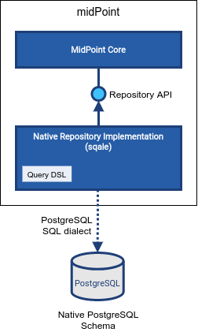

= Native PostgreSQL Repository
:page-since: "4.4"
:page-upkeep-status: orange
:page-keywords: [ 'PostgreSQL', 'repository', 'database' ]
:page-display-order: 40

MidPoint stores its data in a relational database.
The database of choice for midPoint is PostgreSQL, leading open source relational database.
MidPoint contains implementation of data storage mechanisms (a.k.a. "repository") that tuned specifically for PostgreSQL database, taking advantage of PostgreSQL-specific features.

Please see following pages for details:

++++

++++

.Sqale
TIP: Native PostgreSQL repository implementation is nick-named "sqale" (read "scale") in midPoint source code.
The implementation can be found in `repo-sqale` component.
It was developed in midPoint 4.3 and 4.4 as a part of xref:/midpoint/projects/midscale/[midScale project].

== See also

* xref:/midpoint/reference/repository/repository-database-support/[Repository Database Support]
discusses old and new repository and our support strategy.
