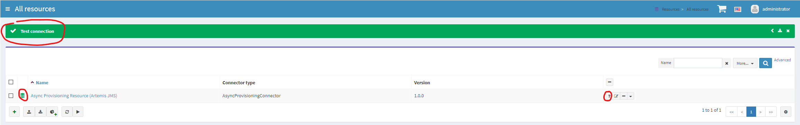
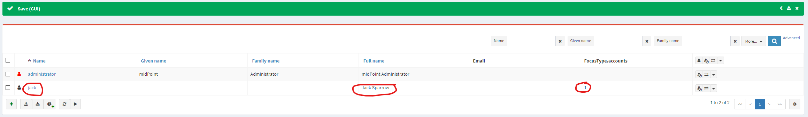
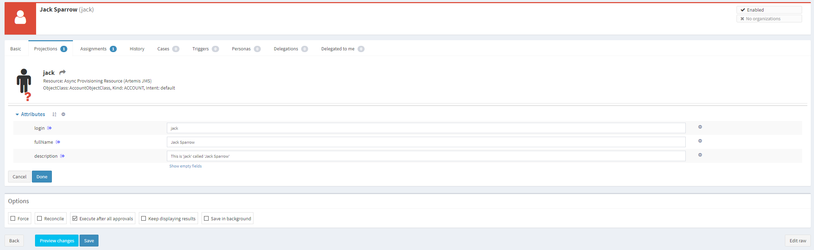

= Asynchronous Resource Configuration (Outbound)
:page-wiki-name: Asynchronous Resource Configuration (Outbound)
:page-wiki-id: 52003381
:page-wiki-metadata-create-user: mederly
:page-wiki-metadata-create-date: 2020-12-01T13:17:35.634+01:00
:page-wiki-metadata-modify-user: mederly
:page-wiki-metadata-modify-date: 2020-12-01T23:54:37.481+01:00
:page-nav-title: Configuration
:page-since: "4.3"
:page-experimental: true
:page-toc: top

== Introduction

See xref:/midpoint/reference/resources/asynchronous/outbound/[Asynchronous (Messaging) Outbound Resources] for an introduction to the topic.

The following text will be a combination of a documentation with a simple tutorial on how to configure an asynchronous resource.

== Prerequisites

Before configuring asynchronous resource, we need to have a target where it will send messages to.
The target can be a messaging queue or topic, REST endpoint, or something like that.
However, the support in midPoint is currently limited to Apache ActiveMQ Artemis queues and topics (speaking in JMS language).
Therefore, before we start, we need to have Apache ActiveMQ Artemis 2.x installed and running.
In our example we have chosen a default implementation on the local host, with enabling the security - using `admin` / `secret` as the credentials.

We will use `ProvisioningQueue` queue as a mechanism for communication between midPoint and (fictitious) target system.
So the queue should exist.
This can be ensured by including the following into `broker.xml` configuration file:

[source,xml]
----
<address name="ProvisioningQueue">
    <anycast>
        <queue name="ProvisioningQueue"/>
    </anycast>
</address>
----

Please see ActiveMQ Artemis documentation for more information.

== JNDI preparation

Objects in JMS (connection factories, queues, topics, and so on) are typically configured via JNDI.
ActiveMQ does _not_ have a full JNDI server.
Its JMS client is configured using JNDI property files.
Therefore we have to prepare one.

Let's create the following `jndi.properties` file:

.jndi.properties file
[source]
----
java.naming.factory.initial=org.apache.activemq.artemis.jndi.ActiveMQInitialContextFactory
connectionFactory.localhostConnectionFactory=tcp://localhost:61616
queue.ProvisioningQueue=ProvisioningQueue
----

The file has to be on the classpath.
The easiest way is to wrap it into JAR file and place that file in `lib` directory in midPoint home (for standalone deployments) or into Tomcat lib directory (for explicit Tomcat deployments; but these are deprecated since midPoint 4.2).

.Script that creates jndi-config.jar file
[source,bash]
----
jar cvf jndi-config.jar jndi.properties
----

You have to run the script from the directory where `jndi.properties` file is stored:

[source]
----
$ jar cvf jndi-config.jar jndi.properties
added manifest
adding: jndi.properties(in = 201) (out= 136)(deflated 32%)
----

(Note that `jar` command is part of Java Development Kit.)

== Resource definition

The resource object should then look like this:

.Asynchronous provisioning resource object
[source,xml]
----
<?xml version="1.0" encoding="UTF-8"?>
<resource oid="063b83df-6bd7-4daf-9903-5010faf72f26"
          xmlns="http://midpoint.evolveum.com/xml/ns/public/common/common-3"
          xmlns:q="http://prism.evolveum.com/xml/ns/public/query-3"
          xmlns:ri="http://midpoint.evolveum.com/xml/ns/public/resource/instance-3"
          xmlns:conf="http://midpoint.evolveum.com/xml/ns/public/connector/builtin-1/bundle/com.evolveum.midpoint.provisioning.ucf.impl.builtin.async.provisioning/AsyncProvisioningConnector">

    <name>Async Provisioning Resource (Artemis JMS)</name>
    <connectorRef type="ConnectorType">
        <filter>
            <q:text>connectorType = "AsyncProvisioningConnector"</q:text>
        </filter>
    </connectorRef>
    <connectorConfiguration>
        <conf:targets>
            <jms>
                <connectionFactory>localhostConnectionFactory</connectionFactory>
                <username>admin</username>
                <password>secret</password>
                <destination>ProvisioningQueue</destination>
            </jms>
        </conf:targets>
        <conf:predefinedTransformation>simplifiedJson</conf:predefinedTransformation>
    </connectorConfiguration>
    <schema>
        <definition>
            <xsd:schema xmlns:xsd="http://www.w3.org/2001/XMLSchema" elementFormDefault="qualified"
                        xmlns:ra="http://midpoint.evolveum.com/xml/ns/public/resource/annotation-3"
                        targetNamespace="http://midpoint.evolveum.com/xml/ns/public/resource/instance-3">
                <xsd:import namespace="http://midpoint.evolveum.com/xml/ns/public/connector/icf-1/resource-schema-3"/>
                <xsd:import namespace="http://midpoint.evolveum.com/xml/ns/public/resource/annotation-3"/>
                <xsd:complexType name="AccountObjectClass">
                    <xsd:annotation>
                        <xsd:appinfo>
                            <ra:resourceObject/>
                            <ra:identifier>ri:login</ra:identifier>
                            <ra:displayNameAttribute>ri:login</ra:displayNameAttribute>
                            <ra:namingAttribute>ri:login</ra:namingAttribute>
                            <ra:kind>account</ra:kind>
                            <ra:default/>
                        </xsd:appinfo>
                    </xsd:annotation>
                    <xsd:sequence>
                        <xsd:element name="login" type="xsd:string" minOccurs="0"/>
                        <xsd:element name="fullName" type="xsd:string" minOccurs="0"/>
                        <xsd:element name="description" type="xsd:string" minOccurs="0"/>
                    </xsd:sequence>
                </xsd:complexType>
            </xsd:schema>
        </definition>
    </schema>
    <schemaHandling>
        <objectType>
            <objectClass>ri:AccountObjectClass</objectClass>
            <attribute>
                <ref>ri:login</ref>
                <outbound>
                    <strength>strong</strength>
                    <source>
                        <path>name</path>
                    </source>
                </outbound>
            </attribute>
            <attribute>
                <ref>ri:fullName</ref>
                <outbound>
                    <strength>strong</strength>
                    <source>
                        <path>fullName</path>
                    </source>
                </outbound>
            </attribute>
            <attribute>
                <ref>ri:description</ref>
                <outbound>
                    <strength>strong</strength>
                    <source>
                        <path>name</path>
                    </source>
                    <source>
                        <path>fullName</path>
                    </source>
                    <expression>
                        
                    </expression>
                </outbound>
            </attribute>
        </objectType>
    </schemaHandling>
    <capabilities>
        <configured xmlns:cap="http://midpoint.evolveum.com/xml/ns/public/resource/capabilities-3">
            <cap:read>
                <cap:cachingOnly>true</cap:cachingOnly>
            </cap:read>
        </configured>
    </capabilities>
</resource>
----

Let us describe individual parts of the resource definition.

=== Connector configuration

We have to tell the connector two things:

. Where it should send asynchronous operation requests to.

. How to constructs these requests.

As for the former, we use `targets` element to specify one or more targets.
(Yes, it is possible to specify more than one target.
This is to ensure high availability or load balancing at the application level.
But this feature is really highly experimental, and is there mainly as a placeholder for future implementation.
Do not use it.
Specify only a single target for now.)

Target types available:

[%autowidth]
|===
| Target type | Description | Status

| `jms`
| JMS 2.0 or 1.1 targets.
| Tested with JMS 2.0.

| `artemis`
| Target communicating using Apache ActiveMQ Artemis Core protocol.
| Not much tested.
Experimental.

| `other`
| Custom implementation of target connection code.
| Not much tested.
Experimental.

|===

Configuration properties for JMS target:

[%autowidth]
|===
| Property | Description | Example

| `connectionFactory`
| Connection factory name.
It is looked up via JNDI.
| localhostConnectionFactory

| `username`
| User name used to authenticate to JMS broker (if needed).
| admin

| `password`
| Password used to authenticate to JMS broker (if needed).
| secret

| `destination`
| Destination (queue or topic) to send messages to.
It is looked up via JNDI.
| ProvisioningQueue

|===

Our sample configuration is the following:

[source,xml]
----
<connectorConfiguration>
    <conf:targets>
        <jms>
            <connectionFactory>localhostConnectionFactory</connectionFactory>
            <username>admin</username>
            <password>secret</password>
            <destination>ProvisioningQueue</destination>
        </jms>
    </conf:targets>
    <conf:predefinedTransformation>simplifiedJson</conf:predefinedTransformation>
</connectorConfiguration>
----

We give the `localhostConnectionFactory` value for the name of the connection factory to use.
It is pointing to the following entry in `jndi.properties` file:

[source]
----
connectionFactory.localhostConnectionFactory=tcp://localhost:61616
----

It says that midPoint will try to reach the broker using TCP protocol on the local host, at default port 61616.

When installing ActiveMQ, we chose `admin` as the administrator's user name and `secret` as the password.
So we have to specify them in the configuration.

Finally, the queue we use to send messages to is `ProvisioningQueue`. (The name is, of course, arbitrary.
But it should exist on the broker, and the target system should read messages from it.)

Again, `ProvisioningQueue` is JNDI name.
ActiveMQ expects entry of the form `queue.NAME` or `topic.NAME` to exist in `jndi.properties` file.
That's why we have the following line there:

[source]
----
queue.ProvisioningQueue=ProvisioningQueue
----

Please see ActiveMQ Artemis documentation for detailed information on using JNDI properties.

=== Request construction

MidPoint represents operations that are to be executed on the target as internal Java objects of link:https://github.com/Evolveum/midpoint/blob/master/provisioning/ucf-impl-builtin/src/main/java/com/evolveum/midpoint/provisioning/ucf/impl/builtin/async/provisioning/OperationRequested.java[OperationRequested] class.
In order to send them to the target, they have to be transformed into text or binary form.
There are a couple of predefined transformations; or we can create our own.

The predefined ones are:

[%autowidth]
|===
| Transformation | Description | Use

| `fullJson`
| Creates JSON representation of the link:https://github.com/Evolveum/midpoint/blob/master/infra/schema/src/main/resources/xml/ns/public/common/common-asynchronous-3.xsd#L745-L901[AsyncProvisioningOperationRequestedType] object.
(It is the serializable form of `OperationRequested` instances.) The JSON produced is in midPoint-style serialization, using e.g. `@ns` elements for namespace declarations, `@type/@value` elements, and so on.
| This is the most comprehensive representation of the request, but requires rather sophisticated client to parse it.
The usual way of reading this structure is to use `prism` midPoint module at the receiving side.
Therefore we suggest using simplified JSON serialization (described below) instead.

| `fullJsonWithoutShadow`
| This is a variant of the above that omits current resource object shadow from the message (because it is usually not needed).
| The messages are shorter than in `fullJson` transformation but the reader still needs to be quite sophisticated.

| `simplifiedJson`
| Creates simplified JSON representation of the request.
The structure is described by the link:https://github.com/Evolveum/midpoint/blob/master/infra/schema/src/main/java/com/evolveum/midpoint/schema/messaging/JsonAsyncProvisioningRequest.java[JsonAsyncProvisioningRequest] class.
The messages are serialized in JSON-native way.
| This is probably the best generic request serialization to start with.
There is one limitation, though: because namespaces are not used, it is not possible to have more attributes with the same local name, but different namespace (like `icfs:name` and `ri:name`).

| `simplifiedQualifiedJson`
| Creates simplified JSON representation, but with qualified names of attributes and object class.
| It is more complex than `simplifiedJson` but suitable for cases when there can be ambiguities in attribute or object class names.

|===

In our example we will use `simplifiedJson` transformation.

=== Schema

MidPoint usually determines schema for resource objects (accounts, groups, and so on) by querying the resource.
However, in this case it is not possible to do that, because the resource is not directly reachable.

So, in a way similar to manual resources, we have to define the schema ourselves.
An example:

[source,xml]
----
    <schema>
        <definition>
            <xsd:schema xmlns:xsd="http://www.w3.org/2001/XMLSchema" elementFormDefault="qualified"
                        xmlns:ra="http://midpoint.evolveum.com/xml/ns/public/resource/annotation-3"
                        targetNamespace="http://midpoint.evolveum.com/xml/ns/public/resource/instance-3">
                <xsd:import namespace="http://midpoint.evolveum.com/xml/ns/public/connector/icf-1/resource-schema-3"/>
                <xsd:import namespace="http://midpoint.evolveum.com/xml/ns/public/resource/annotation-3"/>
                <xsd:complexType name="AccountObjectClass">
                    <xsd:annotation>
                        <xsd:appinfo>
                            <ra:resourceObject/>
                            <ra:identifier>ri:login</ra:identifier>
                            <ra:displayNameAttribute>ri:login</ra:displayNameAttribute>
                            <ra:namingAttribute>ri:login</ra:namingAttribute>
                            <ra:kind>account</ra:kind>
                            <ra:default/>
                        </xsd:appinfo>
                    </xsd:annotation>
                    <xsd:sequence>
                        <xsd:element name="login" type="xsd:string" minOccurs="0"/>
                        <xsd:element name="fullName" type="xsd:string" minOccurs="0"/>
                        <xsd:element name="description" type="xsd:string" minOccurs="0"/>
                    </xsd:sequence>
                </xsd:complexType>
            </xsd:schema>
        </definition>
    </schema>
----

This means that accounts on the target resource have three properties:

. `login`

. `fullName`

. `description`

=== Schema handling

[source,xml]
----
    <schemaHandling>
        <objectType>
            <objectClass>ri:AccountObjectClass</objectClass>
            <attribute>
                <ref>ri:login</ref>
                <outbound>
                    <strength>strong</strength>
                    <source>
                        <path>name</path>
                    </source>
                </outbound>
            </attribute>
            <attribute>
                <ref>ri:fullName</ref>
                <outbound>
                    <strength>strong</strength>
                    <source>
                        <path>fullName</path>
                    </source>
                </outbound>
            </attribute>
            <attribute>
                <ref>ri:description</ref>
                <outbound>
                    <strength>strong</strength>
                    <source>
                        <path>name</path>
                    </source>
                    <source>
                        <path>fullName</path>
                    </source>
                    <expression>
                        
                    </expression>
                </outbound>
            </attribute>
        </objectType>
    </schemaHandling>
----

This is a standard definition of how resource objects are created or interpreted.
It is the same as for regular (connected) resources.
In this particular case, it says that:

. `login` will be set to the value of user's `name`;

. `fullName` will be set to the value of user's full name;

. `description` will be constructed as a string in the form `This is '$name' called '$fullName'` e.g. "This is 'jack' called 'Jack Sparrow'".

=== Capabilities

In order for the resource to work correctly, it must do attribute caching.
It is enabled by specifying the following capabilities:

[source,xml]
----
    <capabilities>
        <configured xmlns:cap="http://midpoint.evolveum.com/xml/ns/public/resource/capabilities-3">
            <cap:read>
                <cap:cachingOnly>true</cap:cachingOnly>
            </cap:read>
        </configured>
    </capabilities>

----

== Testing the configuration

=== Importing and testing the resource definition

After everything is in place (broker is running, `jndi-config.jar` was created and put into `lib` subdirectory in midPoint home directory, midPoint was started) we can import the resource definition.

After importing let us test it.
The successful result looks like this:

And the log file should contain something like the following:

[source]
----
2020-12-01 17:21:47,359 [] [http-nio-8080-exec-2] INFO (com.evolveum.midpoint.provisioning.impl.ConnectorManager): Created new connector instance for ConnectorSpec(resource:063b83df-6bd7-4daf-9903-5010faf72f26(Async Provisioning Resource (Artemis JMS)), name=null, oid=38139148-e36a-4a9a-b9cc-93106d7cc598): AsyncProvisioningConnector v1.0.0
2020-12-01 17:21:47,374 [PROVISIONING] [http-nio-8080-exec-2] INFO (com.evolveum.midpoint.provisioning.ucf.impl.builtin.async.provisioning.AsyncProvisioningConnectorInstance): Setting new configuration in AsyncProvisioningConnectorInstance (Async Provisioning Resource (Artemis JMS))
2020-12-01 17:21:48,555 [] [http-nio-8080-exec-2] INFO (com.evolveum.midpoint.provisioning.impl.ResourceOperationalStateManager): Availability status changed from DOWN to UP for resource:063b83df-6bd7-4daf-9903-5010faf72f26(Async Provisioning Resource (Artemis JMS)) because testing connection using ConnectorSpec(resource:063b83df-6bd7-4daf-9903-5010faf72f26(Async Provisioning Resource (Artemis JMS)), name=null, oid=38139148-e36a-4a9a-b9cc-93106d7cc598). Connector test successful.
----

(Or an error description if the test is not successful.)

=== Creating a user and his account

Let us create a user with an account on the asynchronous resource.

If we give the user a name `jack`, full name `Jack Sparrow` and a resource assignment to our resource, and click on Save button, the user will be created in midPoint.

The user will have one account.
The account can be displayed when opening the user.

Of course, midPoint does not _know_ if the account was really created on the target resource.
(In reality, it wasn't.) But it _assumes_ so; and shows the values of the attributes as they should be.

=== Inspecting the message queue

Using Artemis console we can have a look at `ProvisioningQueue`. There should be a single message with the following content:

[source,js]
----
{
  "operation" : "add",
  "objectClass" : "AccountObjectClass",
  "attributes" : {
    "fullName" : [ "Jack Sparrow" ],
    "description" : [ "This is 'jack' called 'Jack Sparrow'" ],
    "login" : [ "jack" ]
  }
}
----

This is a request to create an account with specified attributes (login, fullName, description).

Now we can play with the user, e.g. change his name or full name, unassigning the resource or even deleting the user.
Corresponding requests should be placed into `ProvisioningQueue` at the broker.

For example, after changing full name to `Jack SPARROW`, the following message is produced:

[source,js]
----
{
  "operation" : "modify",
  "objectClass" : "AccountObjectClass",
  "primaryIdentifiers" : {
    "login" : [ "jack" ]
  },
  "secondaryIdentifiers" : { },
  "changes" : {
    "fullName" : {
      "replace" : [ "Jack SPARROW" ]
    },
    "description" : {
      "replace" : [ "This is 'jack' called 'Jack SPARROW'" ]
    }
  }
}
----

We see that `fullName`  and `description` attributes are affected.
The `login` is unchanged, so it is not mentioned among the changes.

== Advanced topics

=== Absolute changes

Some resources require that they receive _full object state_ instead of relative changes.
In the example above, the resource would require getting values of all three attributes: `login`, `fullName`, and `description` - not only changed ones.

This can be ensured by setting the following capability:

[source]
----
<cap:update>
    <cap:attributeContentRequirement>all</cap:attributeContentRequirement>
</cap:update>
----

Then the changes will look like this (now changing full name back to Jack Sparrow):

[source,js]
----
{
  "operation" : "modify",
  "objectClass" : "AccountObjectClass",
  "primaryIdentifiers" : {
    "login" : [ "jack" ]
  },
  "secondaryIdentifiers" : { },
  "changes" : {
    "fullName" : {
      "replace" : [ "Jack Sparrow" ]
    },
    "description" : {
      "replace" : [ "This is 'jack' called 'Jack Sparrow'" ]
    },
    "login" : {
      "replace" : [ "jack" ]
    }
  }
}
----

=== Using custom transformation

It is possible to specify custom transformation expression.
An example:

[source,xml]
----
<conf:transformExpression>
    
</conf:transformExpression>

----

Because the (universal) construction of the JSON change requests is quite laborious, midPoint provides a helper link:https://github.com/Evolveum/midpoint/blob/master/provisioning/ucf-impl-builtin/src/main/java/com/evolveum/midpoint/provisioning/ucf/impl/builtin/async/provisioning/JsonRequestFormatter.java[requestFormatter]. It operates on the standard structure of "simplified JSON" (i.e. `JsonAsyncProvisioningRequest`) but allows the script to configure formatting process by e.g. setting various formatting options as well as directly supplying parts of the resulting request.

In the above example we set `changeMapAsAttributes` option that causes formatting REPLACE-style changes with a simple list of attribute values.
It is to be used in connection with the absolute changes mode described above.

The resulting request message looks like this:

[source,js]
----
{
  "operation" : "modify",
  "objectClass" : "AccountObjectClass",
  "attributes" : {
    "fullName" : [ "Jack SPARROW" ],
    "description" : [ "This is 'jack' called 'Jack SPARROW'" ],
    "login" : [ "jack" ]
  },
  "primaryIdentifiers" : {
    "login" : [ "jack" ]
  },
  "secondaryIdentifiers" : { }
}
----

Note: For a description of individual items in this structure, please see link:https://github.com/Evolveum/midpoint/blob/master/infra/schema/src/main/java/com/evolveum/midpoint/schema/messaging/JsonAsyncProvisioningRequest.java[JsonAsyncProvisioningRequest].

Custom transformation script can expect the following variables:

[%autowidth]
|===
| Variable | Type | Description

| `operationRequested`
| `OperationRequested`
| The abstract operation that is being requested by midPoint.

| `transformerHelper`
| `link:https://github.com/Evolveum/midpoint/blob/ef727fa65400a18ddc16228ca4fd5c27c786d2a7/provisioning/ucf-impl-builtin/src/main/java/com/evolveum/midpoint/provisioning/ucf/impl/builtin/async/provisioning/TransformerHelper.java[TransformerHelper]`
| Helper methods.
Please see javadoc for the class.

| `requestFormatter`
| link:https://github.com/Evolveum/midpoint/blob/master/provisioning/ucf-impl-builtin/src/main/java/com/evolveum/midpoint/provisioning/ucf/impl/builtin/async/provisioning/JsonRequestFormatter.java[JsonRequestFormatter]
| Creates requests and optionally serializes them into JSON.

|===

==== Using Apache Velocity

When creating custom text messages, Apache Velocity can help a lot.
An example:

[source,xml]
----
<conf:transformExpression>
    
</conf:transformExpression>

----

This script expects single-valued attributes `login`, `fullName`, and `description`, and creates text messages like these:

.Account creation message
[source]
----
operation: add
login: jack
fullName: Jack Sparrow
description: This is 'jack' called 'Jack Sparrow'
----

 +

.Account modification message
[source]
----
operation: modify
login: jack
fullName: Jack SPARROW
description: This is 'jack' called 'Jack SPARROW'
----

 +

.Account deletion message
[source]
----
operation: delete
login: jack
fullName:
description:
----

The template works like this:

. `$request = $requestFormatter.changeMapAsAttributes().identifiersAsAttributes().createRequest()` configures a formatter to represents both changes and identifiers as regular attributes, and then creates a request object (without serialization into JSON).
So the `$request` variable will contain a reference to `JsonAsyncProvisioningRequest` with attributes filled-in for all three kinds of operations (add, modify, delete).

. `$attrs = $request.attributesSimplified` obtains a simplified version of the attributes to the variable `attrs`. The simplification means that we get a map where single-valued attributes will not be represented as collection of values (as is the case of `request.attributes`), but as simple values instead.

. Therefore, expressions like `$!attrs["login"]` return single values of specified attributes  or null, if the given attribute has no value.

Please see link:https://velocity.apache.org/engine/1.7/user-guide.html[Velocity User Guide] for more information.
(MidPoint currently uses Velocity 1.7.)
