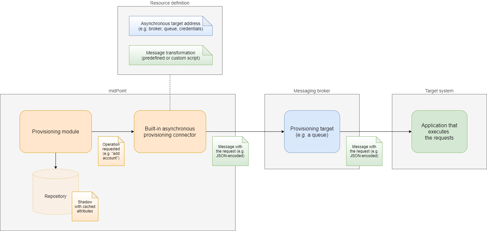

= Asynchronous (Messaging) Outbound Resources
:page-nav-title: Outbound
:page-wiki-name: Asynchronous (Messaging) Outbound Resources
:page-wiki-id: 52003377
:page-wiki-metadata-create-user: mederly
:page-wiki-metadata-create-date: 2020-11-27T16:29:29.843+01:00
:page-wiki-metadata-modify-user: mederly
:page-wiki-metadata-modify-date: 2020-12-01T15:50:43.643+01:00
:page-since: "4.3"
:page-experimental: true
:page-experimental-since: "4.3"
:page-midpoint-feature: true
:page-alias: { "parent" : "/midpoint/features/current/", "title" : "Asynchronous (Messaging) Outbound Resources" }
:page-upkeep-status: green

There are situations where a target resource is not accessible in a direct, synchronous, CRUD-like way.
Such a resource can receive commands to add, modify, or delete accounts and other objects, but processes them asynchronously - in an unspecified time.

Support for such resource was planned for a longer time.
Starting with 4.3, it becomes a reality.

== Overview

The idea of asynchronous provisioning is very similar to the one of xref:/midpoint/reference/resources/manual/[manual provisioning]. Generally, when midPoint has something to do on a resource (like creating, updating, or deleting an account), the provisioning module asks a connector to do that.
For synchronous resources, the connector ensures the execution of the operation, and informs provisioning module about the result.
But not in the case of _asynchronous provisioning connector_. Here the connector sends a _request_ (e.g. a JMS message containing JSON-encoded data about the requested operation) to specified _target_ (e.g. JMS queue), where it will wait until the real target system retrieves and processes it.
And because midPoint has no access to the target system to know about the current state of the account, the provisioning keeps all the account attributes in the repository using a mechanism called xref:/midpoint/reference/resources/attribute-caching/[attribute caching].

== Configuration overview

When configuring an asynchronous resource, two basic questions have to be answered:

. Where we should send requests to?

. How should these requests look like?

The answer to the first question is usually an address (URL, JNDI name, ...) of a messaging broker, plus specification of an address (e.g. JMS queue) within it.

The answer to the second one is a specification of message format, or a custom transformation script.

Let us illustrate it.
In the above picture, orange components are standard midPoint parts: provisioning module, asynchronous connector, and repository.
The blue box is typically a part of standard messaging infrastructure, like ActiveMQ or RabbitMQ broker.
And the green box is a custom application.
In a similar way, orange "documents" are ones that are defined by midPoint: operations requested, and shadows in the repository.
Green documents are custom ones: messages carrying the requests from midPoint to the application.

The answer to the first question, i.e. specification of the target "address", is the blue part of the resource definition.
It points to the blue-colored provisioning target.

The answer to the second question, i.e. specification of message transformation, is the green part of the resource definition.
It describes how orange documents (operations requested) are transformed into green ones (messages carrying requests).

=== An example

[source,xml]
----
<connectorConfiguration>
    <conf:targets>
        <jms>
            <connectionFactory>mainBrokerConnectionFactory</connectionFactory>
            <destination>FileServerRequestsQueue</destination>
        </jms>
    </conf:targets>
    <conf:predefinedTransformation>simplifiedJson</conf:predefinedTransformation>
</connectorConfiguration>

----

This configuration snippet is a part of an asynchronous resource definition.
It says that:

. There is a single JMS target we will send messages to.
It resides on a broker reachable via `mainBrokerConnectionFactory` (a JNDI name to be resolved), and the specific queue is obtained by resolving `FileSystemRequestsQueue` name.

. When transforming operations into requests, the `simplifiedJson` predefined transformation will be used.

== Configuration details

See xref:/midpoint/reference/resources/asynchronous/outbound/configuration/[Asynchronous Resource Configuration (Outbound)] page for configuration details.

== Current state of the implementation

The design of this feature is highly modular.
In theory, the communication with the asynchronous target can use any transport: various kinds of message queuing technologies, REST, SOAP web services, and so on.
But the current implementation was created and tested with a particular target in mind:

* Apache ActiveMQ Artemis 2.x;

* using JMS 2.0 to connect to it.

Other JMS 2.0 providers should be pluggable.
JMS 1.1 might work as well but there can be some classloading issues.
It looks like some engineering effort will be needed to be able to use them with midPoint.