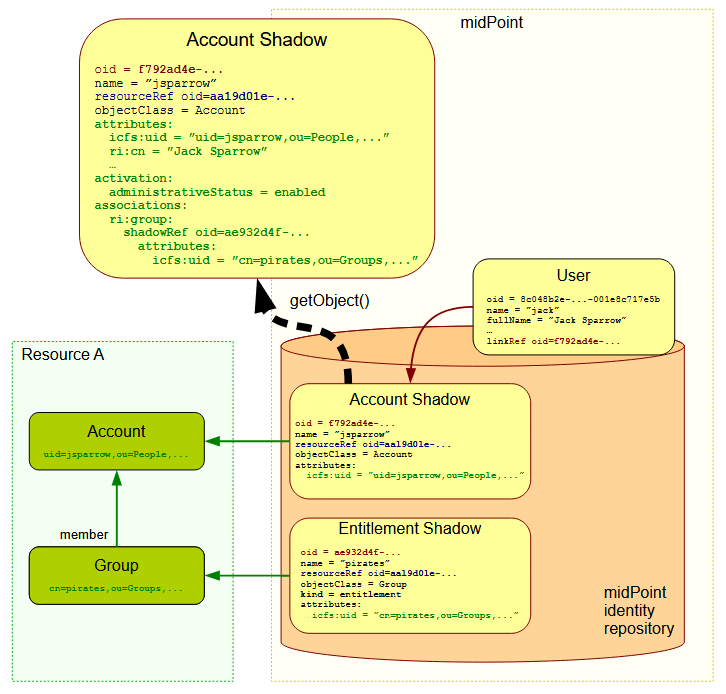

= Entitlements and Associations
:page-wiki-name: Entitlements
:page-wiki-id: 13598822
:page-wiki-metadata-create-user: semancik
:page-wiki-metadata-create-date: 2014-01-09T14:23:08.383+01:00
:page-wiki-metadata-modify-user: vera
:page-wiki-metadata-modify-date: 2020-03-31T14:52:37.580+02:00
:page-toc: top
:page-upkeep-status: green

== Introduction

An entitlement is a resource object similar to an account.
But unlike account the entitlement does *not* represent a user.
The entitlement represents a privilege, access right, resource-side role or group or any similar concept.
The entitlements are very frequently used to represent groups.

MidPoint can be configured to fully understand entitlements.
MidPoint can know which resource objects represent groups.
Therefore midPoint can manage group membership in a structured and automated way.
MidPoint can list entitlements and therefore it can be used to create smart and convenient user interfaces.
MidPoint support for entitlements goes beyond the capabilities of vast majority of IDM solutions.

[TIP]
.Why are entitlements so important?
====
Group membership management is traditionally one of the worst nightmares of identity management solutions.
While the concept of grouping is supported by almost every resource the actual group implementation differs a lot.
Some systems store the list of groups in account objects.
Other systems (such as LDAP) store the list of members in group objects.
The systems often store the list of member or group identifiers in a plain string attributes therefore it is difficult to automatically find out which attribute it is.
Support for group membership traditionally involved heavy customization of IDM tools that slowed down the projects.
Even worse it required a very costly maintenance such as manual synchronization of list of groups and roles in the IDM system.
This situation is just not acceptable for efficient IDM deployments.

That's the reason for unified entitlement support in midPoint.
MidPoint can manage all groups in a uniform way regardless of the grouping mechanism that the resource is using.
All that is needed is a handful of configuration lines.
And the nightmare is over.
Especially when entitlements are combined with the power of xref:/midpoint/reference/roles-policies/assignment/[assignments] and xref:/midpoint/reference/synchronization/generic-synchronization/[generic synchronization].
====

== Entitlement Shadow

It is important to remember that entitlement is a *resource object*. Entitlement resides on the resource.
It is *not* an object that is maintained by midPoint.
Entitlements only reflect the reality on the resource.
Similarly to all other resource-side object the entitlement is represented in midPoint only as a xref:/midpoint/reference/resources/shadow/[shadow].

image::schemas-entitlement-1.png[]

== Entitlement, Account and User

The primary purpose of an entitlement is to be associated with accounts (*not* users!).
E.g. an account can be added as a member of a group.
This is realized in midPoint by associating a "group entitlement" with user's account.
MidPoint xref:/midpoint/architecture/archive/subsystems/provisioning/[provisioning component] modifies the resource in appropriate way to add account to a group.
Similarly to other shadow-related operations midPoint then forgets about it.
The information remains only on the resource.
(Unless shadow caching is enabled.)
When such association happens the situation looks like this:

Similarly to account attributes, midPoint always reads fresh data from the resource when dealing with entitlements.
Therefore midPoint does not need to remember the association.
It can read it directly from the resource anytime.
And that's exactly what midPoint does when an account xref:/midpoint/reference/resources/shadow/[shadow] is retrieved:

MidPoint fetches the shadow from its repository and it uses the identifiers stored in the shadow to locate account object on the resource.
MidPoint retrieves the account object.
Then midPoint looks for entitlement information in the account and processes any associations.
MidPoint (or the respective connector) may need to retrieve or search additional objects to fully process the associations.
E.g. standard LDAP groups store the list of members in the group object therefore midPoint (or the LDAP connector) needs to search the group objects to fully process the association information.
All that is done transparently.
Regardless what kind of grouping and association mechanism is used, midPoint presents the data in a unified form.

NOTE: Recently-introduced shadow caching feature allows to store parts of these information right in the repository.
This includes relations between shadows, like the group membership.
However, the general principle described above still applies if the requested data are not in the cache.

== Associations

Relations between accounts and entitlements are implemented using so-called *associations*.
(However, associations have much broader applicability, as described below.)

An association is a relation between a *subject* and one or more *objects*.

When using associations to implement entitlements, the subject is the party that receives the entitlement (usually an account), while the object is the entitlement itself (usually a group).

An association can be either simple or complex:

* A *simple association* is just a relation between one subject and one object.
This is the typical way how entitlements are represented.

* A *complex association* has either multiple objects present, or it can contain additional data (currently attributes and activation data) on its own.
Typical examples:

** *User access rights*: a user has a set of rights to read, write, and/or administer given directories.
Each access right is a value of this association, and has the user (as its subject), the directory (as its object), and the access level (as its attribute).

** *HR contracts*: a person has a set of contracts, where each contract has an organizational unit, a cost center, a job position, validity, and other data.
Each contract is a value of this association.
The person is the subject.
The organization unit, the cost center, and the job position are the objects (assuming they are represented as separate resource objects in HR).
Everything else is stored in association attributes and activation data.

[NOTE]
====
Simple associations are supported by midPoint in full.

Complex associations are xref:/midpoint/versioning/experimental/[an experimental feature].
====

== Associations and Reference Attributes

Technically, associations are based on so-called *reference attributes*.
These are special attributes describing relations (links) between resource objects.
Each reference attribute resides on the *subject*, and each of its values (as they may be single- or multi-valued, just like any other attributes) points to a single *object*.

Normally, reference attributes are hidden from the users.
They are visible only to the lower layers of midPoint, including connectors.

[NOTE]
====
A simple association is equivalent to a reference attribute.
There are no extra objects involved.

A complex association is implemented using a separate resource object (holding the association data), called *association data object*.
A subject of the association has a reference to this association data object.
The association data object has references to individual objects of the association.

//#TODO a figure would be helpful here#
====

Some connectors, LDAP/AD in particular, support reference attributes out of the box.
Others will provide this support later.
Until that, it is possible to define *simulated references* in midPoint, so that you can utilize the full power of associations in your deployments.

[NOTE]
====
*A note on the terminology: items, values, and types*

(Feel free to skip this note if it's too technical at first reading.)

In midPoint, we distinguish between *items* (also called xref:/midpoint/devel/prism/data-structures/[prism items]) and their *values*.

Items are properties (like `givenName`), references (like `targetRef` in `assignment`), and containers (like `assignment`) that provide building blocks for objects in midPoint.
Also attributes and associations are special kinds of items, used to describe the content of resource objects.

Each item can be single-valued or multivalued.
The former can have either zero to one value, while the latter can have zero, one, or more values.

For example, LDAP `employeeNumber` attribute is a single-valued one.
It can have zero or more values.
LDAP `telephoneNumber` attribute is a multivalued one.
It can have zero, one, or more values.

Reference attributes can be also single- or multivalued.
For example, `group` attribute (pointing to the groups an account is member of) is multivalued.
Each of the values is called _reference attribute value_, or _reference value_ for short, while the attribute itself is called _reference attribute_, or _reference_ for short.
This may look strange at first, but it's perfectly logical once one get accustomed to it.

And the same applies to associations.
For example, `group` association (based on the `group` reference attribute) is multivalued as well.
Each of the values is called _association value_, while the `group` item itself is _association_.

*Association and reference types*

Associations and simulated reference attributes are defined at the global (resource-wide) level.
Their definitions come in the form of _association types_ and _reference attribute types_.
When applied to given object type or class (like `account/default` or `ri:inetOrgPerson`), they manifest themselves as _association_ and _reference attribute_ there.
(Associations can be visible only on object types.
Reference attributes are defined primarily on object classes, so they are visible on both object classes and object types.)

For example,

- `ri:groupMembership` can be the association type name.
When attached to `account/default` and `entitlement/group` object types, it can be seen there as `ri:group` association.

- `ri:groupMembership` can be the simulated reference attribute type name.
When present on `ri:inetOrgPerson` and `ri:groupOfNames` object classes, it can be seen there as `ri:group` reference attribute.
====

[NOTE]
====
*Second terminology note: simple vs reference vs complex*

(Again, feel free to skip this note if it's too technical at first reading.)

We have the following kinds of attributes:

* *Simple* attributes: contain primitive values only (strings, integers, timestamps, and so on).
These are the only ones present in midPoint 4.8 and earlier.
Technically, they are a specialization of xref:/midpoint/devel/prism/data-structures/[prism properties] described above.

* *Reference* attributes: contain "pointers" to other resource objects, i.e., each reference attribute value points to a single object.
Technically, they are a specialization of xref:/midpoint/devel/prism/data-structures/[prism references] described above.

* *Complex* attributes: these will contain complex values, i.e., those that consist of a tree of simple, reference, and complex attributes themselves.
Technically, they will be a specialization of xref:/midpoint/devel/prism/data-structures/[prism containers] described above.
They do not exist in midPoint nor ConnId yet.
Their use is planned for the future.

As for associations, we have two kinds of associations:

* *Simple* associations: each association value points to a single resource object.
They are functionally equivalent to reference attributes.

* *Complex* associations: each association value has:
** zero, one, or more reference attributes to association objects,
** zero, one, or more simple attributes,
** optionally, additional data like activation information.

//Technically, associations are specialization of *containers*.
====

=== Defining Associations

Associations are defined in the xref:/midpoint/reference/resources/resource-configuration/schema-handling/[Resource Schema Handling] section of xref:/midpoint/reference/resources/resource-configuration/[Resource Configuration].

Simulated references are defined in the xref:/midpoint/reference/resources/resource-configuration/capabilities/[Capabilities] section.

Let's cover defining simulated references first.
If you use connector having this capability, feel free to skip to xref:#_association_participants_definition[Association Participants Definition] section.

=== Simulated Reference Type Definition

==== Participating Resource Objects

Each simulated reference type has two sides: object side and subject side.
(In short, we call these also *participants*.)

First, we have to define what resource objects can participate in the reference type on each of these sides.
We call this the *delineation* and we use the following properties to do it:

.Delineating reference type participants
[autowidth]
|===
| Configuration item | Meaning | Example

| `objectClass`
| Name of the object class for the participant.
| `ri:inetOrgPerson`

| `baseContext`
| The definition of base context (resource object container).
This object will be used as a base for searches for the participant objects.
Usually only the objects that are hierarchically below the `baseContext` are returned by such a search.

Experimental.
a|
[source,xml]
----
<baseContext>
    <objectClass>ri:organizationalUnit</objectClass>
    <filter>
        <q:text>attributes/dn = "ou=groups,dc=evolveum,dc=net"</q:text>
    </filter>
</baseContext>
----

| `searchHierarchyScope`
| Definition of search hierarchy scope.
It specifies how "deep" the search should go into the object hierarchy.
It is only applicable to resources that support hierarchical organization of objects (e.g. LDAP resources).

The value of `sub` means subtree search: it goes deep down the hierarchy, as deep as possible.

The value of `one` means one-level search. The search is reaching just one level below the base context object.

Experimental.
| `sub`

| `auxiliaryObjectClass`
| Restriction of the participant to the specified auxiliary object class, if present.
Typically used if the binding attribute is defined in this class, like `ri:uid` for a `posixAccount`, which is a member of a `posixGroup`.

Currently supported only for the subjects.

Experimental.

| `ri:posixAccount`
|===

There can be zero, one, or more delineations.

All delineations on the object side must share the same object class.

The following example shows how to define `groupMembership` reference type that binds together accounts and groups (as subjects) and groups (as objects).

.An example of delineating reference type participants
[source,xml]
----
<capabilities>
    <c:configured xmlns="http://midpoint.evolveum.com/xml/ns/public/resource/capabilities-3">
        <references>
            <type>
                <name>ri:groupMembership</name>
                <subject>
                    <delineation>
                        <objectClass>ri:AccountObjectClass</objectClass>
                    </delineation>
                    <delineation>
                        <objectClass>ri:GroupObjectClass</objectClass>
                    </delineation>
                    <!-- ... -->
                </subject>
                <object>
                    <delineation>
                        <objectClass>ri:GroupObjectClass</objectClass>
                    </delineation>
                    <!-- ... -->
                </object>
                <!-- ... -->
            </type>
            <!-- ... -->
        </references>
    </c:configured>
</capabilities>
----

[NOTE]
====
When defining associations on top of simulated reference attributes, it is possible to re-use the delineation information from the associations themselves.
See xref:#_association_participants_definition[Association Participants Definition] below for an example.
====

==== Bindings

Next, we should define how subjects and objects are bound together, in particular:

. how to find objects (i.e., reference attribute values) for given reference in the subject;
. how to add/remove objects (i.e., reference attribute values) for given reference in the subject.

MidPoint supports bindings that are either subject-to-object or object-to-subject.

The *subject-to-object* direction is quite simple.
In this case the subject (account) has a list of its entitlements (groups).
It may look like this:

.Subject-to-object direction
[source,ldif]
----
objectclass: account
username: jack
fullName: Jack Sparrow
groups: pirates
groups: captains

objectclass: account
username: will
fullName: Will Turner
groups: pirates

objectclass: group
groupname: pirates

objectclass: group
groupname: captains
----

In this case the binding attribute on the subject side is `groups` and the binding attribute on the object side is `groupname`.

The management of this binding is very easy.

* When reading, midPoint will just retrieve the subject (account) and all of the necessary data are there.
* When updating (i.e., adding or deleting reference values), midPoint will simply add or delete the respective `groups` values on the subject (account).

The *object-to-subject* direction is more complex.
In this case the binding points the other way around.
The object (group) has the list of subjects (accounts) that are the members.
Like this:

.Object-to-subject direction
[source,ldif]
----
objectclass: account
username: jack
fullName: Jack Sparrow

objectclass: account
username: will
fullName: Will Turner

objectclass: group
groupname: pirates
members: jack
members: will

objectclass: group
groupname: captains
members: jack
----

In this case the binding attribute on the subject side is `username` and the binding attribute on the object side is `members`.

The management of this binding is also complex.

* When reading, we cannot simply retrieve the subject (account).
The membership data are not there.
What we need is to _search_ for all the objects.
E.g. if we want to get a list of all groups that `jack` belongs to then we need to search for all groups that match the filter `(members=jack)`.

* When updating (i.e., adding or deleting reference values), midPoint will have to update `members` attribute of concrete groups: the `jack` value is either added to, or deleted from, that attribute on each group whose membership is being added or deleted from `jack`.

The direction of the reference has significant consequences in many areas.
Firstly there is performance impact.
The object-to-subject references need more operations than the subject-to-object references.
And these additional operations are usually big searches over the resource.
Secondly this has consequences for troubleshooting.
Different types of references produce different connector operations.
Especially the searches for object-to-subject references may be quite tricky to troubleshoot.

==== Primary and Secondary Bindings

There are two kinds of bindings:

* *Primary binding*: This is the one used to update the reference.
It can be also used to retrieve the reference values, if no other binding is defined.
It may be either object-to-subject or subject-to-object.

* *Secondary binding*: There are situations where the resource provides additional data that allow more efficient retrieval of reference values.
In such cases, you can define secondary binding that utilizes them.
It is always subject-to-object, and is defined only if the primary binding is object-to-subject.

An real-life example for an LDAP resource:

* The primary binding may be between account `ri:dn` attribute and group `ri:member` one.
It is used for updating the user's group membership data.
* The secondary binding may be between account `ri:memberOf` attribute and group `ri:dn` one.
It is used for reading the user's group membership data.
The `memberOf` (or similar) attribute is typically provided by advanced LDAP servers.
It is a virtual read-only account attribute that contains a list of groups the account is a member of.

==== Some Examples

This is the `groupMembership` reference type typical for LDAP servers.
(If, for some reason, you don't use the native capability of the LDAP connector for this.)

* When querying, `ri:memberOf` attribute on the subject (account or group) is used.
* When updating, `ri:member` attribute on the object (group) is used.
* The reference is visible as (virtual) `group` reference attribute on the subject (account or group).

.An example of LDAP group membership definition
[source,xml]
----
<capabilities>
    <c:configured xmlns="http://midpoint.evolveum.com/xml/ns/public/resource/capabilities-3">
        <references>
            <type>
                <name>ri:groupMembership</name>
                <subject>
                    <delineation>
                        <objectClass>ri:inetOrgPerson</objectClass>
                    </delineation>
                    <delineation>
                        <objectClass>ri:groupOfNames</objectClass>
                    </delineation>
                    <primaryBindingAttributeRef>ri:dn</primaryBindingAttributeRef>
                    <secondaryBindingAttributeRef>ri:memberOf</secondaryBindingAttributeRef>
                    <localItemName>ri:group</localItemName>
                </subject>
                <object>
                    <delineation>
                        <objectClass>ri:groupOfNames</objectClass>
                    </delineation>
                    <primaryBindingAttributeRef>ri:member</primaryBindingAttributeRef>
                    <secondaryBindingAttributeRef>ri:dn</secondaryBindingAttributeRef>
                </object>
                <direction>objectToSubject</direction>
            </type>
        </references>
    </c:configured>
</capabilities>
----

This is a typical example of subject-to-object reference.

* When querying and updating, `ri:privileges` attribute on the subject (account) is used.
* The reference is visible as (virtual) `ri:priv` reference attribute on the subject (account).

.An example of a custom "privileges" definition
[source,xml]
----
<capabilities>
    <c:configured xmlns="http://midpoint.evolveum.com/xml/ns/public/resource/capabilities-3">
        <references>
            <type>
                <name>ri:accountPrivilege</name>
                <subject>
                    <delineation>
                        <objectClass>ri:account</objectClass>
                    </delineation>
                    <primaryBindingAttributeRef>ri:privileges</primaryBindingAttributeRef>
                    <localItemName>ri:priv</localItemName>
                </subject>
                <object>
                    <delineation>
                        <objectClass>ri:privilege</objectClass>
                    </delineation>
                    <primaryBindingAttributeRef>icfs:name</primaryBindingAttributeRef>
                </object>
                <direction>subjectToObject</direction>
            </type>
        </references>
    </c:configured>
</capabilities>
----

[#_association_participants_definition]
=== Association Participants Definition

Now, let's have a look at how associations - or more precisely, association types - are defined on top of reference attributes.

First of all, association types are defined outside participating object types.
(Before 4.9, associations were defined as part of their subjects.)
Each type of associations is now contained in its own `associationType` item under `schemaHandling`.

A minimalistic definition of an association type looks like this:

.A minimalistic association type definition
[source,xml]
----
<resource>
    <!-- ... -->
    <schemaHandling>
        <!-- ... -->
        <associationType>
            <name>groupMembership</name>
            <subject>
                <objectType>
                    <kind>account</kind>
                    <intent>default</intent>
                </objectType>
                <association>
                    <ref>ri:group</ref>
                </association>
            </subject>
        </associationType>
    </schemaHandling>
</resource>
----

The definition must contain the association type name, which must be unique resource-wide.

Then, it must contain the specification of the subject type or types to which it applies.
In the above example, the `groupMembership` association type applies to `account/default` object type.
The `association` item then defines how is the association present on that object type.
In particular, `ri:group` is the name under which the association is known on objects of `account/default` type.

If not specified otherwise, the association name - `ri:group` here - is also the name of the reference attribute that provides the data for this association.
In other words, all values of `ri:group` attribute (provided by the connector or the module for simulating reference attributes) are considered as values of `ri:group` association.

The engineer can restrict the values from the connector by looking at specific object types.

For example, let's assume we have an Active Directory resource, with two kinds of groups: security groups and distribution groups.
In midPoint, we will have two distinct object types for them: `entitlement/security-group` and `entitlement/distribution-group`.
For simplicity, let us assume only one type of accounts: `account/default`.

Also, let us assume that we have `ri:group` reference attribute, provided by connector, that contains information of all groups the particular account is member of - both security and distribution ones.
(This is how simple `memberOf` attribute works in AD.)

Finally, let's assume we want to define two distinct associations: `ri:securityGroup` holding all security groups, and `ri:distributionGroup` holding all distribution groups.

The definition then looks like this:

.An example of two distinct association type definitions
[source,xml]
----
<resource>
    <!-- ... -->
    <schemaHandling>
        <objectType>
            <kind>account</kind>
            <intent>default</intent>
            <!-- delineation, attributes, correlation, and synchronization for accounts -->
        </objectType>
        <objectType>
            <kind>entitlement</kind>
            <intent>security-group</intent>
            <!-- delineation, attributes, correlation, and synchronization for security groups -->
        </objectType>
        <objectType>
            <kind>entitlement</kind>
            <intent>distribution-group</intent>
            <!-- delineation, attributes, correlation, and synchronization for distribution groups -->
        </objectType>
        <!-- ... -->
        <associationType>
            <name>securityGroupMembership</name>
            <subject>
                <objectType>
                    <kind>account</kind>
                    <intent>default</intent>
                </objectType>
                <association>
                    <ref>ri:securityGroup</ref>
                    <sourceAttributeRef>ri:group</sourceAttributeRef>
                    <!-- inbound and outbound mappings for this type of association -->
                </association>
            </subject>
            <object>
                <objectType>
                    <kind>entitlement</kind>
                    <intent>security-group</kind>
                </objectType>
            </object>
        </associationType>
        <associationType>
            <name>distributionGroupMembership</name>
            <subject>
                <objectType>
                    <kind>account</kind>
                    <intent>default</intent>
                </objectType>
                <association>
                    <ref>ri:distributionGroup</ref>
                    <sourceAttributeRef>ri:group</sourceAttributeRef>
                    <!-- inbound and outbound mappings for this type of association -->
                </association>
            </subject>
            <object>
                <objectType>
                    <kind>entitlement</kind>
                    <intent>distribution-group</kind>
                </objectType>
            </object>
        </associationType>
    </schemaHandling>
</resource>
----

[NOTE]
====
*What happens to the values of the source reference attribute `ri:group`?*

In order to avoid duplication of data, each value of the source reference attribute (i.e., the one on which the association is based), is examined, and:

. If it matches one of the associations (`ri:securityGroup` or `ri:distributionGroup` in the above example), it is *moved* to that association.
This means that the value is removed from the reference attribute, and is put into the association.
. If it matches none of the associations (or there are no associations defined), it *remains* in the source attribute.

Hence, at the beginning, when there are no associations defined, all the values are visible in the reference attribute.
Later, as the association or associations are defined, and data are cleaned up (i.e., all shadows are correctly classified into object types), there should be no values in the reference attribute, and everything should be visible in the association or associations.
====

=== Association Mappings

Just like simple attributes, associations are managed either manually via GUI, or, which is preferred, automatically using mappings.

==== Outbound Mappings

Outbound mappings take information from the focus object (e.g., a user), and use it to create a value or values of given association.

The most typical scenario is to take user's role membership, and for each role that has a relevant group as its projection on given resource use that group as the association value object.

The mapping then looks like this:

.Sample association outbound mapping
[source,xml]
----
<associationType>
    <name>userMembership</name>
    <subject>
        <objectType>
            <kind>account</kind>
            <intent>default</intent>
        </objectType>
        <association>
            <ref>ri:group</ref>
            <outbound>
                <name>account-group-outbound</name>
                <strength>strong</strength>
                <expression>
                    <associationConstruction> <!--1-->
                        <objectRef> <!--2-->
                            <mapping>
                                <expression>
                                    <associationFromLink/> <!--3-->
                                </expression>
                            </mapping>
                        </objectRef>
                    </associationConstruction>
                </expression>
            </outbound>
        </association>
    </subject>
    <!-- ... -->
</associationType>
----
<1> This means we are going to construct a value for this association (although very simple, consisting of a single object reference).
<2> This describes the value of the object reference being constructed.
<3> This says we are to determine it from the role membership, as described above.

Instead of `associationFromLink`, we can use any other expression that returns `ShadowAssociationValueType` objects as its output.
Another typical one is `associationTargetSearch`.

The important question here is: how should midPoint treat association values that exist on the resource, but are not provided by outbound mapping(s)?
We deal with it in xref:#_tolerating_existing_association_values[Tolerating Existing Association Values] section below.

[#_inbound_mappings]
==== Inbound Mappings

Inbound mappings take existing association values, and create or update existing values in the midPoint focus object (e.g., a user).

This process is more complex than it may seem.
Previously (in midPoint 4.8 and before), it involved completely computing all values for respective focus object item (e.g., `assignment`) and adding or replacing existing values.
Now, it is possible to do more fine-grained updates: to select values that have to be updated, and to update their content.

A new `associationSynchronization` expression evaluator was created for this purpose.
It looks like this:

.Sample association inbound mapping
[source,xml]
----
<associationType>
    <name>userMembership</name>
    <subject>
        <objectType>
            <kind>account</kind>
            <intent>default</intent>
        </objectType>
        <association>
            <ref>ri:group</ref>
            <inbound>
                <name>account-group-inbound</name>
                <strength>strong</strength>
                <expression>
                    <associationSynchronization> <!--1-->
                        <objectRef> <!--2-->
                            <correlator/>
                            <mapping>
                                <expression>
                                    <shadowOwnerReferenceSearch/> <!--3-->
                                </expression>
                                <target>
                                    <path>targetRef</path> <!--3-->
                                </target>
                            </mapping>
                        </objectRef>
                        <synchronization>
                            <reaction>
                                <situation>unmatched</situation>
                                <actions>
                                    <addFocusValue/>
                                </actions>
                            </reaction>
                            <reaction>
                                <situation>matched</situation>
                                <actions>
                                    <synchronize/>
                                </actions>
                            </reaction>
                        </synchronization>
                    </associationSynchronization>
                </expression>
            </inbound>
        </association>
    </subject>
</associationType>
----
<1> This means we are going to synchronize association values into the focus object.
<2> Association value has (potentially) many items.
Here we say we are going to process the object reference.
(For this particular association, there is only one, so it's not necessary to specify its name.)
<3> This means we are going to take the association value object (typically, a group), find its owner in midPoint (typically a role), and put its reference to assignment's `targetRef` item.

The core of the mapping (`shadowOwnerReferenceSearch`) mirrors the `associationFromLink` evaluator used for outbound mappings.
The main difference from the outbound direction, though, is the `synchronization` part. Let us explain.

The association synchronization works like this:

. First of all, currently it is limited to assignments.
So, `associationSynchronization` evaluator *always* targets focus assignments.
If you'd want to map the association to a different item, you have to use a different expression evaluator.

. After getting an association value, the evaluator tries to look up which assignment this value correlates to.
This is actually very similar to the process of correlation of accounts to focus objects.
Hence, the configuration is similar as well.
In the example above, `correlator` item is used to denote the object reference (or, more precisely, the corresponding focus item - `targetRef`) as the correlator.
An equivalent, though more verbose, configuration would look like this:
+
.Explicit correlation specification example
[source,xml]
----
<associationSynchronization>
    <objectRef>
        <mapping>
            <!-- ... -->
        </mapping>
    </objectRef>
    <correlation>
        <correlators>
            <items>
                <item>
                    <ref>targetRef</ref> <!--1-->
                </item>
            </items>
        </correlators>
    </correlation>
    <synchronization>
        <!-- ... -->
    </synchronization>
</associationSynchronization>
----
<1> This denotes the `targetRef` as the item used for the correlation.

. After the correlation is done, there are three possible outcomes:
.. no matching assignment is found (`unmatched` synchronization situation),
.. a matching assignment is found (`matched` synchronization situation),
.. no matching assignment is found, but there is a matching indirect role membership value (`indirectlyMatched` synchronization situation).

. Appropriate synchronization action is selected, based on the configuration.
There are currently these actions available:

.. `addFocusValue`: A new assignment is created, based on the association value.
Used for `unmatched` situation.
.. `synchronize`: Existing assignment is updated, based on the association value.
Used for `matched` situation.

There may be situations when previously existing association value is no longer there.
How does the inbound mapping decide whether to keep the assignment that was (presumably) created from this value, or not?
It uses the same mechanism as other mappings targeting multivalued items: ranges.
By default, the provenance metadata are used to know which assignments were created by this particular mapping; and the default behavior is to remove them after the mapping ceases to produce them as its output.

[#_tolerating_existing_association_values]
==== Tolerating Existing Association Values

Let's return to the question how midPoint knows which association values present on the resource to keep, and which to remove, if they are not provided by actual output mappings.

Traditionally, there is the `tolerant` flag that drives this behavior for attributes.
The same flag is present for associations, and is set like this:

.Setting the tolerance for associations
[source,xml]
----
<associationType>
    <name>userGroupMembership</name>
    <subject>
        <objectType>
            <!-- ... -->
        </objectType>
        <association>
            <ref>ri:group</ref>
            <!-- ... -->
            <tolerant>false</tolerant>
        </association>
    </subject>
</associationType>
----

Just as for attributes, the default value is `true`, which means that extra values are tolerated.
The above example sets the tolerance to `false`, so that any extra association values are removed.

The tolerance can be, however, overridden for each individual association value.
This is currently supported for simple associations, and is driven by the object mark(s) present on the association _object_, e.g., a group.

For example, let us assume a group `guests` shadow has mark `Unmanaged`, as it is currently being managed from the resource itself.

.Mark for "unmanaged" shadows
[source,xml]
----
<mark xmlns="http://midpoint.evolveum.com/xml/ns/public/common/common-3"
    oid="00000000-0000-0000-0000-000000000805">
    <name>Unmanaged</name>
    <documentation>
        Marks a shadow that is tolerated by midPoint but not managed by it.
        MidPoint should not create, modify, nor delete such objects (at the low level).
        MidPoint should not execute outbound mappings on such objects.
        MidPoint should not manage membership of these objects (if applicable; e.g., for groups).
    </documentation>
    <!-- ... -->
    <objectOperationPolicy>
        <!-- ... -->
        <synchronize>
            <!-- ... -->
            <membership>
                <!-- ... -->
                <tolerant>true</tolerant>
            </membership>
        </synchronize>
    </objectOperationPolicy>
</mark>
----

Also assume that the tolerance for the association is set to `false`.

When an association value pointing to the `guests` group is present on the resource, but not provided by any outbound mapping (which are turned off by the `Unmanaged` mark anyway), it is tolerated because the value of `true` in the object mark overrides the value of `false` set in the association.

Please see xref:/midpoint/reference/concepts/mark/managed-and-unmanaged-shadows[] for more information.

==== Tolerance, Deltas, and Reconciliation

MidPoint can remove association values even when the `tolerant` setting is on.
The reason is that most midPoint operations are delta-based.
E.g. if user interface is used to add or remove an assignment, a xref:/midpoint/devel/prism/concepts/deltas/[delta] is created and sent as a parameter of the operation.
In this case we know what has changed.
Therefore we can easily add and remove entitlement membership.
We can do this even if the entitlement is set to be _tolerant_.
We can do this because we know that the last assignment that "induced" that group was just removed.

But the situation is different for reconciliation and recomputation.
E.g., in case that the role definition is changed.
There are in fact two operation: the change of the role and then the reconciliation of the user.
These operations are independent.
Therefore for the second operation there is no delta.
MidPoint does not know what has changed in the role.
Therefore it cannot use the same logic to remove the user from the entitlement.
Slightly different logic is used in reconciliation.
Logic that is not based on deltas (because there are none).
And in this case the tolerant flag is important.
If it is set to `true` then midPoint will *not* remove the extra values from the attribute or the extra entitlements.
If it is set to `false` then midPoint will remove them.

For these operations to work correctly even in reconciliation it is important to set the _tolerant_ property.
Please make sure you have the association set to non-tolerant in the `schemaHandling` section of the resource definition.

Also, please make sure that your mappings are strong.
Mappings that are of "normal" strength are inherently delta-based and they are usually *not* processed by the reconciliation at all.
For "normal" mappings the last change wins.
But in reconciliation we have no idea what change was the last one - whether the one on the resource or the one in midPoint.
Therefore we prefer the conservative approach and we rather maintain status quo.

==== Mappings for Reference Attributes

We described the mappings for associations.
What about reference attributes, you may ask.
As they are just an implementation vehicle for associations, they are not meant to be managed directly: neither in GUI (maybe except for emergency situations), nor via mappings.

=== Associations/References Versus Attributes

Some midPoint deployments may have a dilemma whether to use associations (based on reference attributes) or just simple attributes.
E.g. if there is a readable and updatable `groups` simple attribute for accounts, we may question whether we should managed it a simple multi-valued attribute, without defining any reference or association over it.
However there are two arguments in favor of associations/references:

* Associations and references are smart.
References knows that the their values are supposed to represent groups; whereas simple attributes see just plain strings, without knowing that they represents, e.g., the names of groups.
The midPoint user interface may use this information from the reference attribute to list all available groups when user wants to add new reference attribute (or association) values.
User then simply selects value(s) from the list.
No need to enter the group name manually.

* The object-to-subject references are very difficult to model as simple attributes.
In this case the attribute that needs to be modified is in fact in a different object.
MidPoint tries to isolate the operations to a single object (or a set of related objects).
Therefore modeling object-to-subject references using simple attributes may be very difficult.
The simulated (or connector-native) references makes this very easy.

== See Also

* xref:/midpoint/reference/resources/shadow/[Shadow Objects]

* xref:/midpoint/reference/synchronization/generic-synchronization/[Generic Synchronization]

* xref:/midpoint/reference/roles-policies/assignment/[Assignment]

* xref:/midpoint/reference/resources/resource-configuration/schema-handling/[Resource Schema Handling]
