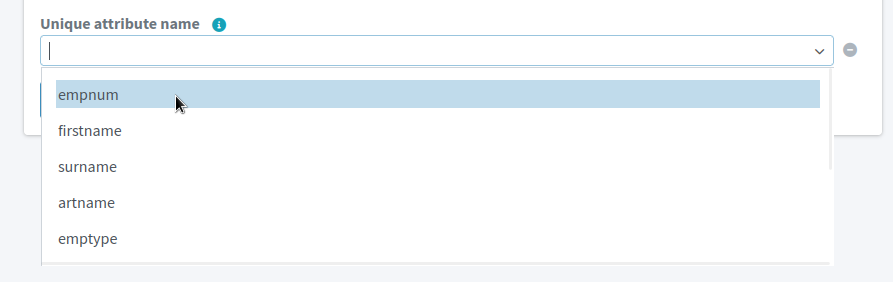

= Create a New Resource in MidPoint GUI
:page-nav-title: 'Create New Resource in GUI'
:page-display-order: 10
:page-toc: top
:experimental:
:icons: font

Every system you to connect to midPoint is represented as a resource in midPoint.
To connect a system, you need to create a resource for it first.

This guide shows you how to create a new resource in midPoint via the web GUI and configure it to access the resource.

[NOTE]
====
See xref:/midpoint/reference/resources/resource-configuration/[] for advanced configuration options and in-depth explanations.
====

// TODO:  Create a guide for templates in GUI and link it here.
Before you continue, you may want to have  a look at xref:/midpoint/reference/resources/resource-configuration/inheritance/[] to learn about template configuration.

== Create New Resource

. In icon:database[] *Resources*, select icon:plus-circle[] *New Resource*.
. Select icon:pencil[] *From Scratch*.
. Select a connector. +
    For example, to read a CSV file, use the *CsvConnector*.

Now, you'll configure the resource on several screens.

=== 1. Basic Information
. Type *Name* and *Description* of the resource. +
    For example,
    * Name: _HRIS_
    * Description: _CSV exports from the HR system_
. Keep the *Lifecycle state* as _Proposed_ until you finish and test the configuration of the resource.
. Click btn:[Next: Configuration].

=== 2. Establish a Connection

Now, you need to provide information on how to connect to the resource.

In the case of the CSV connector, the only configuration required is the path to the source CSV file.
The exact path depends on your midPoint instance configuration.

If you use Docker, have a look at link:/midpoint/quickstart/#file-paths-in-docker-containers[working with file paths in Docker containers].

For remote resources such as LDAP servers, the configuration is more complex.
Refer to the documentation of the particular connector you're using.

When you're done, click btn:[Next: Discovery].

[TIP]
--
MidPoint validates the configuration before you can get to the next step.
If midPoint can't connect to the resource, it'll tell you so and won't let you continue.
--

=== 3. MidPoint Discovery

Use this screen to tell midPoint about your data structure.
Refer to the information tooltip icons to learn about the purpose of each field.

Importantly and regardless of the resource type, you need to *select a unique attribute*, i.e., an attribute that uniquely identifies each entry in your database.

When you're done, click btn:[Next: Schema].

.Conveniently, midPoint suggests the field names so that you don't need to type them manually. Here, they're columns found in a CSV file.

=== 4. Schema of Object Types

In the final screen, select the schema of the object types that are in the resource.

If you're connecting a resource with only one type of objects, such as users, *use the pre-selected _AccountObjectClass_ schema*.

In more advanced configurations, you may want to refer to xref:/midpoint/reference/resources/resource-schema/[] and xref:/midpoint/reference/resources/shadow/kind-intent-objectclass/#object-class[].

Click btn:[Create Resource] to finish the configuration.

The final screen provides options for your next steps.
The best first action after creating a resource is to preview its data to confirm that midPoint is retrieving data from the resource correctly.
Click btn:[Preview Resource Data] to inspect the objects that midPoint sees on the resource.
You can then return to the resource wizard and adjust the resource configuration as needed.

[TIP]
====
If you need to access the resource configuration later:

. In Resources > All resources, select the resource.
. In the left-side resource navigation, these are the sections you'll use the most in the beginning: +
    *Basic*, *Connector configuration*, and *Resource objects*.

====

== Next Steps

With the resource created, xref:/midpoint/reference/admin-gui/resource-wizard/object-type/[*configure its object types*].
You need to do this to tell midPoint what the objects in the resource contain and how to work with them.

Once you configure the object type, you can xref:/midpoint/reference/tasks/synchronization-tasks/import-and-reconciliation/[import users from the resource] to midPoint.
