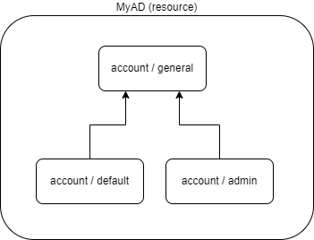
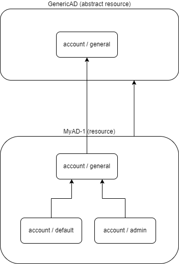

= Resource and Object Type Inheritance
:page-since: 4.6
:page-toc: top

When configuring resources in the past, some amount of copy-and-paste work was inevitable: either when dealing
with multiple object types in a resource, or across similar resources. Since 4.6, this should be no longer
the case. MidPoint provides the feature of _inheritance_ between resources as well as between individual
object types.

== Resource Inheritance

A resource can specify its _super-resource_ (a parent) of which it inherits the configuration.

A typical use of this feature would be to implement so-called _resource templates_: abstract configurations,
that can be made operational by filling-in missing configuration pieces, like specific connection parameters,
credentials, or other specific configuration item.

NOTE: The current implementation is limited to a single parent for each particular resource. (Parents can
be chained, so a resource can have a parent, grandparent, grand-grand-parent, and so on.) In the future we
may relax this single-parent limitation, and allow a resource to inherit from more ancestor, allowing some
common configuration fragments to be injected into multiple resources at once.

== Object Type Inheritance

Independently of resource inheritance, any _object type_ defined within a resource (like e.g. `account/default`)
can have its _super-type_ defined. The super-type can be either explicit or implicit:

* explicit super-typing occurs when the super-type is explicitly mentioned in the object type definition;
it has to have a different identification (kind-intent pair);
* implicit super-typing occurs in connection to resource inheritance: all object types defined in the parent resource
automatically become super-types for corresponding object types defined in the child resource (if such object types
in child resource do exist).

NOTE: The current implementation is limited to a single parent for each particular object type. (Again, parents
can be chained, just like for resources.) This also means that explicit and implicit inheritance cannot be applied
at the same time: if there is an object type with implicit supertype, it cannot have an explicit super-type defined.

=== Examples

.Single resource, two concrete object types with a parent

Here we see `MyAD` resource, with object type of `account/general` that has two (explicitly defined) subtypes:
`account/default` and `account/admin`.

.Two resources, with implicit inheritance between corresponding object types

`MyAD-1` resource inherits from abstract `GenericAD` resource that serves as a template (in this case).
The object type `account/general` in `MyAD-1` is an implicit child of `account/general` in `GenericAD`,
and - at the same time - it is an explicit parent of `account/default` and `account/admin` in `MyAD-1`.

== Configuring Resource Inheritance

The super-resource is defined by including the `super` item in the child resource configuration:

.Listing 1. A resource inheriting from a super (parent) resource
[source,xml]
----
<resource oid="...">
    <name>MyAD-1</name>
    <super>
        <resourceRef oid="873a5483-ded8-4607-ac06-ea5ae92ce755"/> <!-- GenericAD -->
    </super>
    ...
</resource>
----

The referenced super-resource may or may not be a fully-functional one. It may well be so that it is only a template,
lacking key information necessary to connect to it, obtain its schema and capabilities, and so on. There are two relevant properties here:

* If `template` is set to `true`, it tells midPoint that this is in fact a template that is to be presented to users in Resource Wizard as a starting point for creation of new resources.
* If `abstract` is set to `true`, it tells midPoint to avoid using this resource directly, because it lacks the necessary information needed e.g. to connect to it.
The templates are usually abstract resources.

.Listing 2. The super (parent) resource, marked as an abstract template
[source,xml]
----
<resource oid="873a5483-ded8-4607-ac06-ea5ae92ce755">
    <name>GenericAD</name>
    <template>true</template>
    <abstract>true</abstract>
    ...
</resource>
----

== Configuring Object Type Inheritance

For implicit inheritance, nothing needs to be configured: the inheritance relation is established automatically
based on matching `kind` and `intent` in parent and child resource definitions.

The explicit type inheritance is defined like this:

.Listing 3. Two object types inheriting from a supertype
[source,xml]
----
<resource oid="...">
    ...
    <schemaHandling>
        <objectType>
            <kind>account</kind>
            <intent>default</intent>
            <super>
                <kind>account</kind>
                <intent>general</intent>
            </super>
            <attribute> <!-- Existing attribute -->
                <ref>ri:drink</ref>
                <tolerant>false</tolerant> <!-- Overriding the default value -->
            </attribute>
        </objectType>
        <objectType>
            <kind>account</kind>
            <intent>admin</intent>
            <super>
                <kind>account</kind>
                <intent>general</intent>
            </super>
            <attribute> <!-- Existing attribute -->
                <ref>ri:drink</ref>
                <documentation>Administrators do not drink!</documentation>
                <limitations>
                    <processing>ignore</processing>
                </limitations>
            </attribute>
        </objectType>
        <objectType>
            <kind>account</kind>
            <intent>general</intent>
            <abstract>true</abstract>
            <objectClass>ri:AccountObjectClass</objectClass>
            <attribute>
                <ref>ri:drink</ref>
                ...
            </attribute>
        </objectType>
    </schemaHandling>
</resource>
----

We see two concrete object types (`account/default` and `account/admin`) inheriting from an abstract one: `account/general`.
They both modify the definition of `ri:drink` attribute. The former changes the `tolerant` flag to `false`, while the latter
sets the attribute as ignored. More on the exact merging algorithms is in the following section.

== Samples

Sample abstract and specific CSV resource can be seen here:

https://github.com/Evolveum/midpoint-samples/tree/master/samples/resources/csv/inheritance

== Security Aspects

If an untrustworthy user is allowed to create a resource with the `super` item (or add that item to an existing resource), it may compromise the system security.

The reason is that the resolution of super-resources is a low-level operation that cannot be restricted by authorizations.
In other words, once there is a resource with `super` item set, whoever can read or use that resource object, can do that regardless of whether he/she has the authorization to read or use the referenced super-resource.

Therefore, especially for multi-tenant environments, creation of a resource object with `super` item has to be restricted.
For example, an authorization like the following one can be used:

.Listing 4. An authorization restricting manipulation of the resource `super` item
[source,xml]
----
<authorization>
    <action>http://midpoint.evolveum.com/xml/ns/public/security/authorization-model-3#add</action>
    <action>http://midpoint.evolveum.com/xml/ns/public/security/authorization-model-3#modify</action>
    <object>
        <type>ResourceType</type>
    </object>
    <exceptItem>super</exceptItem>
</authorization>
----

A holder of the above authorization can add and modify resource definition objects, except for their `super` item.
So, any resource added must not have that item present; and any modification to existing resource must not manipulate `super` item as well.

== Tips and Tricks

=== Disabling Synchronization Reaction

If you need to disable a specific synchronization reaction present in the parent resource, you can override its `lifecycleState` property to a value that effectively disables it (in the child resource).
A good candidate is the value of `draft`.

So, for example, if you have a reaction like this:

.Listing 5. A synchronization reaction to be disabled (in parent resource)
[source,xml]
----
<synchronization>
    ...
    <reaction>
        <name>new-accounts</name>
        <situation>unmatched</situation>
        <actions>
            <addFocus/>
        </actions>
    </reaction>
</synchronization>
----

You can disable it in this way:

.Listing 6. Disabling a synchronization reaction in a child resource
[source,xml]
----
<synchronization>
    <reaction>
        <name>new-accounts</name>
        <lifecycleState>draft</lifecycleState>
    </reaction>
</synchronization>
----

The prerequisite is that the reaction is named, so that it can be referred to in the child resource.

== Addendum: Configuration Merging Algorithm Details

NOTE: *TL;DR* Atomic values are overridden, composite values are merged. Values of multivalued items are
put together, and the ones that refer to the same entity (connector, attribute, mapping, and so on) are merged.

When a resource or an object type inherits from its parent, a _configuration merge_ operation is executed. The merging process
starts from the top of the hierarchy: the first-level child is merged with the top object. Then the second-level child is merged
with the (already merged) first-level child, and so on, down to the object at the bottom of the hierarchy.

The merge operation looks like this:

1. When merging an object, all its _items_ are merged.footnote:[E.g. for a resource definitions, individual items are: `name`,
`description`, `documentation`, `connectorRef`, `connectorConfiguration`, `additionalConnector`, `schema`, `schemaHandling`,
and so on.]

2. When merging an item, there are two cases:

a. If the item is single-valued (i.e. it can - by definition - have at most one value), then the item is either replaced or merged.

- The former case is applied to so-called (atomic) _properties_ and _references_. A typical property is e.g. `name`. An example
of a reference is e.g. `connectorRef`. So, no merging of the content of these two kinds of items occur. They are simply replaced
as a whole.
- The latter case (merging) is applied to (structured) _containers_. A typical container is e.g. `connectorConfiguration`. It
is recursively merged using the same algorithm as is applied to the resource as a whole.

b. If the item is multivalued (i.e. it can have more than one value), then the algorithm is a bit more complex. It tries to find
matching values that are present on both sides, and then - for each such matching pair - creates a single merged value, instead
of copying both of them. The non-matching values are simply copied as they are.

=== Finding Matching Value

Currently, the following types of items have defined so-called _keys_, i.e. properties that are used to find matching values
of given item type.

.Keys for items in resource objects
[%autowidth]
[%header]
|===
| Item | Type | Key

| `additionalConnector`
| `ConnectorInstanceSpecificationType`
| `name` (the local connector name)

| `schemaHandling/objectType`
| `ResourceObjectTypeDefinitionType`
| `kind` and `intent` footnote:[The exact implementation of merging is a bit different from the other items mentioned here.
The matching definitions are linked by implicit inheritance relation, and merged when the resource schema is parsed. But
this specialty is not externally visible. It may be seen only in detailed (TRACE-level) system logs.]
|===

.Keys for items in resource objects type definitions (`schemaHandling/objectType`)
[%autowidth]
[%header]
|===
| Item | Type | Key

| `attribute` and `association`
| `ResourceItemDefinitionType`
| `ref`

| all mappings
| `MappingType`
| `name`

| `limitations`
| `PropertyLimitationsType`
| `layer` footnote:[The behavior here is a little specific: We merge the entries that have no layers specified,
and for all other layers we simply do per-layer merging. See link:https://github.com/Evolveum/midpoint/blob/master/infra/schema/src/main/java/com/evolveum/midpoint/schema/merger/objdef/LimitationsMerger.java[the code].]

| `correlation/correlators`
| `AbstractCorrelatorType`
| `name` footnote:[This may change before 4.6 release.]

| `correlation/correlators/definitions/items/item`
| `CorrelationItemDefinitionType`
| `name` footnote:[This is experimental, and may change before 4.6 release.]

| `target` footnote:[Under `correlation/correlators/definitions/items/item` or `correlation/correlators/definitions/places`.]
| `CorrelationItemTargetDefinitionType`
| `qualifier` footnote:[This is experimental, and may change before 4.6 release.]

| `synchronization/reaction`
| `SynchronizationReactionNewType`
| `name`

| `synchronization/reaction/action/*`
| `AbstractSynchronizationActionType`
| `name`

|===

Notes:

1. Although being structured, _expressions_ in mappings are properties, not containers. So they are being replaced, not merged.
2. Outbound mappings for attributes and associations are single-valued, so they are merged automatically (without using a name
to pair them). However, outbound mappings for special properties (e.g. password) are multivalued, so they are appended just as
inbound mappings are.
3. The static schema is inherited as a whole, i.e. as an atomic property. It is expected that parent resources will not have
the schema; but if they are not abstract, they will eventually have one. In order for the current implementation to work, such
(non-abstract) resources in parent-child relationship need to have the same schema.
4. Merging of the legacy (detached) `synchronization` section was not treated in any special way. The standard algorithm will
be used; no attempts to find matching values of items are made. We recommend migrating to the new object-type specific
synchronization configuration.
5. Resource name is always required: it will not be inherited from the parent.
6. The current configuration driving the merge can be seen in link:https://github.com/Evolveum/midpoint/blob/master/infra/schema/src/main/java/com/evolveum/midpoint/schema/merger/TypeSpecificMergersConfigurator.java[the source code].
