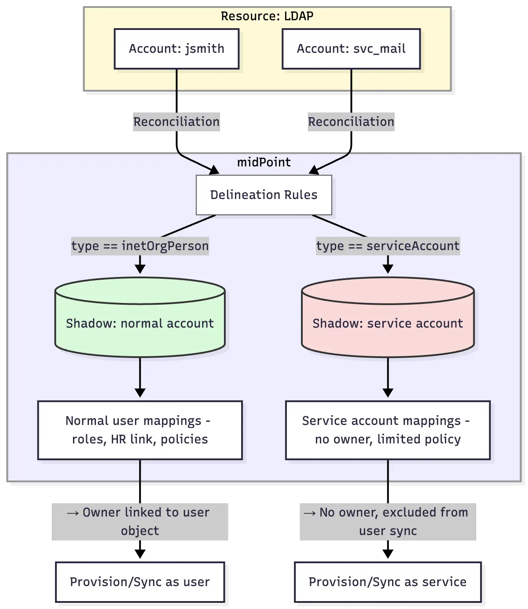

= Resource Object Type Delineation
:page-description: This describes delineation in resource configuration and how to use it to segment a resource into distinct parts or scopes.
:page-keywords: delineation, resource object type, resource configuration

This describes _delineation_ in resource configuration and how to use it to segment a resource into distinct parts or scopes.

== Introduction

Delineation defines clear, logical partitions within a single resource.
This enables you to segment your input data so that you can use different attribute mappings, role assignment rules, or policies for individual segments.

Delineation serves as a first level segmentation of resource objects into distinct partitions or scopes.
This means that first you segment the resource into partitions using delineation, and then you can further segment each partition using other methods, such as mapping rules or filters.

Delineation is primarily intended for scenarios where the boundaries between the partitions are stable and unlikely to change over time, i.e., objects do not move between the partitions.
For example, you might want to separate user accounts from service accounts on a given resource.
Although delineation can also be applied in more dynamic scenarios (such as to distinguish staff from students in an academic deployment), if you know you might be moving objects from one partition to another (e.g., a student becomes a staff member), you might want to consider a different segmenting method.

The example below illustrates how delineation can be used to separate user accounts from service accounts on a given resource.

.Example of delineation usage to separate user accounts from service accounts

[TIP]
====
The system does not automatically reclassify objects when they move between delineated partitions.
Only new objects and objects without any classification are automatically classified when they are handled by the system.

Therefore, if you decide to use delineation in more dynamic scenarios, you should reflect that in your system recovery planning.
In the event of a system recovery, shifting objects between delineations could potentially lead to inconsistencies or broken links. +
To workaround this, either only recover your configuration, or ensure that both configuration and data (repository) are recovered to the same point in time. +
Also, note that after an object moves from one delineated partition to another, you need to trigger xref:/midpoint/reference/tasks/shadow-reclassification-task[reclassification] to ensure the object is correctly associated with its new delineation.
====

== Define delineation

The `delineation` section of a resource configuration is used to specify the set of resource objects that belong to the given resource object type.

The following example defines the `entitlement/unixGroup` type that consists of all objects which have the `groupOfNames` class on the given resource.

.A simple example of object type delineation
[source,xml]
----
<objectType>
    <kind>entitlement</kind>
    <intent>unixGroup</intent>
    <delineation>
        <objectClass>ri:groupOfNames</objectClass>
    </delineation>
</objectType>
----

Now let us extend the definition to include the base context.

The following configuration restricts the `entitlement/unixGroup` type to objects of the `groupOfNames` class that reside within the `ou=unixgroups,dc=example,dc=com` organizational unit.

.Object type delineation with a base context restriction
[source,xml]
----
<objectType>
    <kind>entitlement</kind>
    <intent>unixGroup</intent>
    <delineation>
        <objectClass>ri:groupOfNames</objectClass>
        <baseContext>
            <objectClass>ri:organizationalUnit</objectClass>
            <filter>
                <q:text>attributes/dn = "ou=unixgroups,dc=example,dc=com"</q:text>
            </filter>
        </baseContext>
    </delineation>
</objectType>
----

The base context is used to search for objects of the `entitlement/unixGroup` type by adding the base context condition to the search query.
However, it can also be used as a _classification rule_ that helps to determine whether an incoming object of the `groupOfNames` class belongs to the `entitlement/unixGroup` type or not.

[NOTE]
====
The use of the base context for classification has some restrictions, namely:

* The base context root must be specified by the `equal` filter ('=' sign) with a single value of the type of "LDAP distinguished name".
The fact that it is a distinguished name is determined by the presence of `distinguishedName` matching rule for the attribute.
* The shadow being classified must have a primary or secondary identifier, again with the `distinguishedName` matching rule set.

See link:https://github.com/Evolveum/midpoint/blob/master/provisioning/provisioning-impl/src/main/java/com/evolveum/midpoint/provisioning/impl/shadows/classification/DelineationMatcher.java[DelineationMatcher] for more information.
====

All delineation configuration items are summarized in the following table.

.List of delineation configuration items
[%header]
[%autowidth]
|===
| Item | Description

| `objectClass`
| Object class (like `ri:inetOrgPerson`) for this resource object type.

| `auxiliaryObjectClass` (multivalued)
| The reference to additional object classes for this object.
The reference should point to the object class definition and this definition should be marked as auxiliary.

Definitions of attributes from these classes are "imported" to the object type.
However, currently these auxiliary object classes are _not_ used for classification, i.e., the classification decision is not based on their presence in a specific resource object.

| `baseContext`
| The definition of the base context (resource object container).
This object will be used as a base for searches for objects of this type.
Usually only the objects that are hierarchically below the `baseContext` are returned by such a search.
This is used, for example, to specify an LDAP `organizationalUnit` that contains users or groups of a particular type.
This information is used for object classification as well.
See also the `baseContextClassificationUse` property.

| `searchHierarchyScope`
| Definition of the search hierarchy scope.
It specifies how "deep" the search should go into the object hierarchy.
It is only applicable to resources that support the hierarchical organization of objects, e.g., LDAP resources.
This information is used for object classification (along with `baseContext`) as well.
See also the `baseContextClassificationUse` property.

| `filter` (multivalued)
| A filter that defines the object set.
Used for both searching and classification.
Filters specified for a subtype are appended to any filters defined in the supertype.

| `classificationCondition`
| Expression that is evaluated to check whether a resource object is of a given type.
It is assumed to return a boolean value.
(If no condition is present then it is assumed to be always true, i.e., the classification is done using other means.)
It is preferable to use declarative means for classification, i.e., the base context and filters.

| `classificationOrder`
| Defines the order in which a delineation specification should be used for classification.
No value means it should be used at the end.

| `baseContextClassificationUse`
| Defines how the base context should be used for the classification.
The valid values for this property are listed in a <<baseContextClassificationUse_values,separate table>> below.
|===

NOTE: The `baseContext` and `filter` items are processed already on the resource side to limit the set of objects retrieved from the resource.

[[baseContextClassificationUse_values]]
.Valid values for the `baseContextClassificationUse` property
[%header]
[%autowidth]
|===
| Value | Description
| `required`
| The base context must be used (if it is present in the delineation).
If it cannot be applied, the delineation is considered as non-matching.
| `ifApplicable`
| This is used if the base context is not applicable.
Otherwise, it is ignored.
This is the default setting.
| `ignored`
| The base context is not used for classification.
|===

== Conditions in delineation

If it is not possible to use standard means of classification, i.e., specifying the object class, filters, the base context, and so on, you can alternatively use the classification condition.

The following code provides a configuration example to check whether the account belongs to the `test` intent.
It checks whether it has the form of `Tnnnnnn` (case insensitive) where `n` is a digit.

.Classification condition example
[source,xml]
----
<objectType>
    <kind>account</kind>
    <intent>test</intent>
    <delineation>
        <objectClass>ri:AccountObjectClass</objectClass>
        <classificationCondition>
            <variable>
                <name>userId</name>
                <path>$projection/attributes/icfs:name</path>
            </variable>
            
        </classificationCondition>
    </delineation>
----

NOTE: This should be your last resort option.
If possible, use filters instead.
