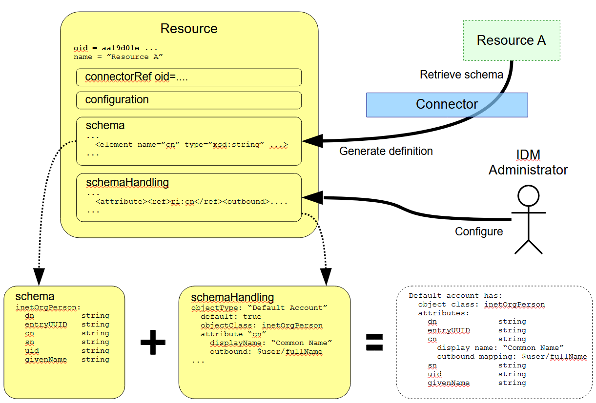

= Resource Schema Handling
:page-nav-title: Schema Handling
:page-wiki-name: Resource Schema Handling
:page-wiki-id: 655429
:page-wiki-metadata-create-user: semancik
:page-wiki-metadata-create-date: 2011-04-29T12:18:31.418+02:00
:page-wiki-metadata-modify-user: semancik
:page-wiki-metadata-modify-date: 2018-04-13T17:36:31.155+02:00
:page-upkeep-status: red
:page-toc: top

== Introduction

Resource schema handling is a definition of how the xref:/midpoint/reference/resources/resource-schema/[Resource Schema] is used by midPoint.
Simply speaking, the resource schema handling defines how the individual attributes should be named, whether they are readable or writeable, how to fill the values of such attributes if new account is being created, how to use the attributes if a change is detected on the resource, etc.

The resource schema handling is related to the xref:/midpoint/reference/resources/resource-schema/[Resource Schema], but there is a fundamental distinction:

* xref:/midpoint/reference/resources/resource-schema/[Resource Schema] specifies *capabilities of the resource and the connector*.
It does not define how the schema is used (although it may suggest it).

* Resource schema handling specifies the *decisions of IDM administrators*.
It defines how the resource schema is used by midPoint to implement parts of IDM logic, present the data to the user, etc.

While xref:/midpoint/reference/resources/resource-schema/[Resource Schema] is usually generated from the resource by a connector, the resource schema handling must be manually defined by the IDM administrator.
Defining resource schema handling is a substantial part of midPoint customization.

Schema handling defines object types (accounts, entitlements, other types of objects) and types of associations among them.
Accounts are data records representing user on the Resource.
Entitlements are objects that can be assigned to accounts (such as groups, roles, privileges, team membership, etc.).
See xref:/midpoint/reference/schema/data-model-essentials/[Basic Data Model] for the introduction to these concepts.

== Resource Object Types

By _resource object_ we understand any object on the resource that is visible to midPoint.
These are usually _account_ objects but may also be a wide variety of _group_ types, resource-specific low-level roles, privileges, organizational units, configuration objects, etc.
Strictly speaking _resource objects_ are the objects stored on the resource.
When they are replicated to midPoint we call them _resource object shadows_ (or just _shadows_).
These two terms are often used interchangeably.

It is critical for a successful IDM deployment to correctly understand the meaning and usage patterns of resource objects for each resource connected to midPoint.
Identity management is mostly just after manipulating resource objects after all.
Therefore it is vital to configure midPoint to correctly understand and handle individual resource object types.
Therefore the major part of the _schema handling_ section is dedicated to this task.
The configuration may seem to be a bit complex at the first sight.
But it is very flexible and powerful.
Having this part of the configuration right significantly simplifies the overall IDM solution.

=== Kind, Intent and Object Class

MidPoint identifies each type of resource object by using a *(kind, intent)* tuple.
I.e. each resource object has a *kind* and an *intent*.
Kind defines what the object _is_, intent specified how the object _behaves_.

On the other hand, xref:/midpoint/reference/resources/resource-schema/[Object Class] is a type of the object how the _resource_ understands it.
It is therefore a "technical" type of the resource object.
Object classes are presented to midPoint by the connector.
But midPoint usually does not know what to do with a specific object class, e.g. an LDAP objectclass `inetOrgPerson`.
Therefore, midPoint sorts out the object class to _kind_ and _intent_ as specified above.
MidPoint then known quite well what to do with (e.g.) _default account_.

See xref:/midpoint/reference/resources/shadow/kind-intent-objectclass/['Kind, Intent and ObjectClass'] page for more details.

=== The Definition

Object type definition specifies how a specific object type on the resource should look like and how it should behave.
The definition is identified by the (kind, intent) tuple.
E.g. there is usually at least one definition for default account object type (kind=account, intent=default).
The definition specifies what xref:/midpoint/reference/resources/resource-schema/[Object Class] to use for such objects, how to handle the attributes, how to determine attribute values, etc.

The resource object definition specified using the `objectType` element in `schemaHandling` section.
It contains:

* *Kind* of the resource object.
If not specified it defaults to `account`.

* *Intent* of the resource object.
If not specified it defaults to `default`.

* *Display Name* of the resource object type.
This human-readable string is used in GUI and other tools when displaying information about resource objects.

* An indication whether the resource object type is the *default type* for the given kind and for the given object class on the resource.
If no intent is explicitly specified for a particular object kind, for example when defining the resource object construction, then the default type will be used.
Only a single intent can be marked as default for each object kind and for each object class in the scope of a resource definition.
See xref:#_default_for_kind["Default for Kind" Property] and xref:#_default_for_object_class["Default for Object Class" Property] for more information.

* *Delineation* of the resource object type.
MidPoint must know what resource objects belong to the object type and what do not.
The most typical criterion is the object class.
Other criteria, e.g., a filter based on attributes, can be used as well.
See xref:#_delineation[Delineation] section below.

* *Focus objects* (users, roles, orgs, and so on) corresponding to given resource object type.
See xref:#_focus_objects[Focus objects] section below.

// * *Auxiliary object classes* are additional object classes that define extra characteristics for the object.
// Auxiliary abject classes can usually be attached to objects of any structural object class.
// There may be any number of auxiliary object classes.
// Note: auxiliary object class support is available since midPoint 3.2.

// * *Base context* is a point in a hierarchical tree under which objects of this type are stored.
// This is an optional feature that is only applicable to resources that have hierarchical structure (such as LDAP directories).
// Note: base context support is available since midPoint 3.4 and 3.3.1.

* *Attribute definitions* are definition that provide more details about handling of attributes that form a particular object type.
The administrator can define a specific data and behavior for each attribute:

** *Display name* of the attribute.
This is a human readable name used in GUI and similar tools.

** *Limitations* of the attribute.
E.g. administrator can make the attribute read-only even if the connector can both read and write the attribute value.

** *xref:/midpoint/reference/expressions/mappings/outbound-mapping/[Outbound Mapping]* defines how the attribute value is created when the account is created or updated.
It defines the data flow out of midPont to the resource.

** *xref:/midpoint/reference/expressions/mappings/inbound-mapping/[Inbound Mappings]* define how the attribute value is used, e.g., when a change of the account is detected on the resource.
It defines data flow from the resource into midPoint.

** Other aspects such as tolerance, ability to ignore the attribute, etc.

* *Credentials* handling defines how credentials are synchronized for this account.
Which usually includes only section for:

** *Password* defines a password synchronization properties, it usually contains xref:/midpoint/reference/expressions/mappings/outbound-mapping/[Outbound Mapping] definition.
It may also contain xref:/midpoint/reference/expressions/mappings/inbound-mapping/[Inbound Mapping] but as most resources hash their password this has a very limited use.

* *xref:/midpoint/reference/resources/resource-configuration/schema-handling/activation/[Activation]* handling defines how the activation status of the account is synchronized.
It usually contains section for:

** *Existence mapping* determines when the object should and should not exist.

** *Administrative status* mapping defines how activation administrative status is synchronized with the resource.
It may contain xref:/midpoint/reference/expressions/mappings/outbound-mapping/[outbound] and xref:/midpoint/reference/expressions/mappings/inbound-mapping/[inbound] mappings.

** *Validity* mappings defines how validity dates (`validFrom`, `validTo`) are synchronized with the resource.
It may contain xref:/midpoint/reference/expressions/mappings/outbound-mapping/[outbound] and xref:/midpoint/reference/expressions/mappings/inbound-mapping/[inbound] mappings.

* *Iteration* section defines the parameters of iterative cycles.
Such cycles are used e.g. when determining a unique identifier values from non-unique inputs.
E.g. a iteration cycle may be used to try account identifiers `jack2`, `jack3` and `jack4` in case there is already an account with identifier `jack`.

* *Protected* objects definition.
The accounts that are defined in the protected account section will never be touched by midPoint.
MidPoint will not synchronize them, will not reconcile them and will not modify them.
This is usually used to protect system accounts such as `root` or `administrator`.
See xref:/midpoint/reference/resources/resource-configuration/protected-accounts/[] for more information.

* *Correlation* specifies how how to locate an owner (user, role, org, ...) of the resource object (account, role, org. unit, ...).
See xref:/midpoint/reference/resources/resource-configuration/#_correlation_and_synchronization[Correlation and Synchronization] and xref:/midpoint/reference/correlation/[].

* *Synchronization* specifies how midPoint should behave in specific situations, e.g., when it encounters a newly created or recently deleted account.
See xref:#_synchronization[Synchronization] section below.

* *Inheritance*, see xref:/midpoint/reference/resources/resource-configuration/inheritance/[].

The schema handling is additive to a resource schema definitions.
This means that there is no need to define all the attributes from the object class in the schema handling section.
The attributes that are defined in the object class and are not mentioned in schema handling are taken from the object class definition without any change.

[#_delineation]
=== Delineation

A new section, called `delineation`, is used to specify the set of resource objects that comprise the given resource object type.

The following basic example defines the type of `entitlement/unixGroup` that consists of all objects having the class of `groupOfNames` on a given resource.

.Listing 1. The most simple example of object type delineation
[source,xml]
----
<objectType>
    <kind>entitlement</kind>
    <intent>unixGroup</intent>
    <delineation>
        <objectClass>ri:groupOfNames</objectClass>
    </delineation>
</objectType>
----

Now let us extend the definition to include the base context.

The following configuration restricts the `entitlement/unixGroup` type to objects of `groupOfNames` class that reside within `ou=unixgroups,dc=example,dc=com` organizational unit.

.Listing 2. Object type delineation with a base context restriction
[source,xml]
----
<objectType>
    <kind>entitlement</kind>
    <intent>unixGroup</intent>
    <delineation>
        <objectClass>ri:groupOfNames</objectClass>
        <baseContext>
            <objectClass>ri:organizationalUnit</objectClass>
            <filter>
                <q:text>attributes/dn = "ou=unixgroups,dc=example,dc=com"</q:text>
            </filter>
        </baseContext>
    </delineation>
</objectType>
----

The base context is used to search for objects of `entitlement/unixGroup` type by adding the base context condition to the search query.
However, it can be used also as a _classification rule_ that helps to determine whether an incoming object of `groupOfNames` class belongs to the `entitlement/unixGroup` type or not.

[NOTE]
====
The use of the base context for classification has some restrictions, namely:

. The base context root must be specified by `equal` filter with a single value of the type of "LDAP distinguished name".
The fact that it is a distinguished name is determined by the presence of `distinguishedName` matching rule for it.
. The shadow being classified must have a primary or secondary identifier, again with the `distinguishedName` matching rule set.

See link:https://github.com/Evolveum/midpoint/blob/master/provisioning/provisioning-impl/src/main/java/com/evolveum/midpoint/provisioning/impl/shadows/classification/DelineationMatcher.java[DelineationMatcher] for more information.
====

All delineation configuration items are summarized in the following table.

.List of delineation configuration items
[%header]
[%autowidth]
|===
| Item | Description

| `objectClass`
| Object class (like `ri:inetOrgPerson`) for this resource object type.

| `auxiliaryObjectClass` (multivalued)
| The reference to additional object classes for this object.
The reference should point to object class definition and this definition should be marked as auxiliary.

Definitions of attributes from these classes are "imported" to the object type.
However, currently these auxiliary object classes are _not_ used for classification; i.e. the classification decision is not based on their presence in the specific resource object.

| `baseContext`
| The definition of base context (resource object container).
This object will be used as a base for searches for objects of this type.
Usually only the objects that are hierarchically below the `baseContext` are returned by such a search.
E.g. this is used to specify LDAP `organizationalUnit` that contains users or groups of particular type.
This information is used for object classification as well.
See also `baseContextClassificationUse` property.

| `searchHierarchyScope`
| Definition of search hierarchy scope.
It specifies how "deep" the search should go into the object hierarchy.
It is only applicable to resources that support hierarchical organization of objects (e.g. LDAP resources).
This information is used for object classification (along with `baseContext`) as well.
See also `baseContextClassificationUse` property.

| `filter` (multivalued)
| A filter that defines the object set.
Used for both searching and classification.
Filter(s) specified for a subtype are appended to any filter(s) defined in the supertype.

| `classificationCondition`
| Expression that is evaluated to check whether a resource object is of given type.
It is assumed to return a boolean value.
(If no condition is present then it is assumed to be always true, i.e. the classification is done using the other means.)
It is preferable to use declarative means for classification, i.e. base context and filter(s).

| `classificationOrder`
| In what order should this delineation specification be used for classification?
No value means it should be used at the end.

| `baseContextClassificationUse`
| How should be the base context used for the classification? (See below.)
|===

.The values for `baseContextClassificationUse` property
[%header]
[%autowidth]
|===
| Value | Description
| `required`
| The base context must be used (if it's present in the delineation).
If it cannot be applied, the delineation is considered as non-matching.
| `ifApplicable`
| If the base context is not applicable, it is used.
Otherwise, it is ignored.
This is the default setting.
| `ignored`
| The base context is not used for classification.
|===

[#_focus_objects]
=== Focus Objects

The `focus` section specifies which focus objects (users, roles, orgs, and so on) correspond to given resource object type.

.Listing 3. Specifying focus objects
[source,xml]
----
<objectType>
    <kind>entitlement</kind>
    <intent>unixGroup</intent>
    <delineation>
        <objectClass>ri:groupOfNames</objectClass>
    </delineation>
    <focus>
        <type>OrgType</type>
        <archetypeRef oid="be2c817e-387c-441a-82d0-e5a15e7cefcd"/> <!-- Unix Group Archetype -->
    </focus>
</objectType>
----

There are two configuration items available:

.List of focus connection configuration items
[%header]
[%autowidth]
|===
| Item | Description | Default value
| `type`
| Type of the focus objects.
| `UserType`
| `archetypeRef`
| Focus archetype corresponding to this resource object type.
If specified, the value is enforced upon focus objects that have a projection of this object type linked.
It is also used during correlation, i.e. when correlating a resource object of this type, midPoint looks for focus objects having specified archetype.
| no archetype (all objects of given type)
|===

Notes/limitations:

1. The archetype must be currently a structural one.
In the future, we may consider allowing multiple (i.e. structural and/or auxiliary) archetypes here.

2. The enforcement means that if the focus has no archetype, the archetype is added to the focus.
If it has a different archetype, a policy violation exception is raised.
This behavior may change in the future, e.g. it may become configurable.

3. The enforcement is done for _all_ projections, i.e. not only for ones being synchronized into midPoint, but also for the ones that are created by midPoint.
But beware of the timing: if a projection is added during the clockwork run, and that projection enforces an archetype, the effects of this enforcement may be limited during the current clockwork run.
For example, if the archetype induces some projections, they might not be created because of the processing in waves.
Generally speaking, it is safer to set the focus archetype explicitly (e.g. by primary delta or in the object template) in these cases.

== Attribute Definitions

Attribute definitions are part of object type definition.
They provide more details about handling of attributes that form a particular object type.
The administrator can define a specific data and behavior for each attribute.
The basic and quite straightforward attribute definition elements are:

* *Display name* of the attribute.
This is a human readable name used in GUI and similar tools.

* *Description* is a human-readable explanation of the attribute purpose, the purpose of the mappings, etc.
It may be quite long.

* *Limitations* of the attribute.
See below.

* *Matching Rule* of the attribute.
See below.

* *Mappings* that define automated attribute handling.
See below.

* *Tolerance* specifies whether the attribute tolerates values that are set outside midPoint.
See below.

* *Fetch strategy* influences when midPoint will fetch this attribute.
See below.

* *Exclusive strong* See below.

* *Read-Replace mode* See below.

* *Secondary identifier* See below.

* *Volatility Trigger* See below.

* *Modification Priority* See below.

=== Attribute Tolerance

*Tolerance* specifies whether the attribute tolerates values that are set outside midPoint.
A _tolerant_ attribute will tolerate foreign values in the attribute.
E.g. if the attribute is a set of account privileges, setting it to tolerant will keep also the values set by native administration tools.
On the other hand _non-tolerant_ attributes will only allow values set by midPoint.
If a foreign value is detected in the attribute then midPoint will remove that value during reconciliation.

All attributes are considered to be tolerant by default.
This is in accord with midPoint philosophy to be non-intrusive by default and not to destroy any values unless explicitly said so.

The same principle applies to both single-valued and multi-valued attributes.
However, there are subtle differences.
MidPoint will almost always overwrite the value of a single-value attribute.
Even for tolerant attributes.
This is quite obvious, as the attribute cannot hold more than one value and therefore the value that is provided by midPoint is probably the correct one.
In case of tolerant multi-value attributes, midPoint will not overwrite existing values.
The values provided by midPoint will be added to existing values of the attribute.
However, midPoint may delete existing value of the attribute even if that attribute is tolerant.
MidPoint will do that in case that such value is removed from midPoint (e.g. by unassigning a role) and that such value was given by authoritative xref:/midpoint/reference/expressions/mappings/[mapping].
In this case, midPoint cannot reliably distinguish whether this particular value was added to the resource by midPoint or whether the value existed in the account even before midPoint discovered it.
But the usual case is that midPoint added the value and that is what midPoint will assume in this case.
Therefore, such value is removed even if the attribute is non-tolerant.
If you want avoid removing the value then you can set the mapping to be non-authoritative.

[NOTE]
.Tolerant single-value attributes
====
Single value attributes will usually be behave as expected, even if they are tolerant (which is the default setting).
It means that mappings will overwrite the values and such attribute will behave almost in the same way as non-tolerant.
But there is one crucial difference that becomes obvious in case that the mapping produces empty value.
Tolerant attribute will *not* delete the attribute value in this case.
And that makes sense, even though it is not entirely intuitive.
In this case midPoint has an option to keep the attribute value untouched.
So it will not touch it.
In case of non-empty value there is no option to keep the original value untouched because the target attribute can only hold one value.
But in this case there is an option.
On the other hand, non-tolerant attribute *will* delete the target value and then the mapping will work as expected.

Therefore it is *recommended to set most of the single-value attributes* for which there are mappings *to a non-tolerant mode*.

Even though this behavior may be somehow counter-intuitive, it makes perfect sense from the conceptual point of view.
Single-value and multi-value attributes behave in a similar way.
And keeping this aligned also allows to keep midPoint algorithms cleaner, handle less exceptions and special cases and it also gives midPoint a slight better flexibility.
Therefore please forgive us this little non-intuitive weirdness.

====

=== Mappings

Perhaps the most powerful parts of the definition are xref:/midpoint/reference/expressions/mappings/[mappings] that take two slightly distinct forms:

* *xref:/midpoint/reference/expressions/mappings/outbound-mapping/[Outbound Mapping]* defines how the attribute value is created when the account is created or updated.
It defines the data flow out of midPont to the resource.

* *xref:/midpoint/reference/expressions/mappings/inbound-mapping/[Inbound Mappings]* define how the attribute value is used, e.g., when a change of the account is detected on the resource.
It defines data flow from the resource into midPoint.

TODO: expand

=== Attribute Limitations

The limitations include

* *Ignore* flag, if set to `true` will make the attribute effectively disappear.
The attribute will still be passed between midPoint and the resource, but the GUI and other parts of midPoint logic will pretend that it is not there.

* *Multiplicity override* by use of *minOccurs* and *maxOccurs* element.
It can be used to adjust multiplicity of the attribute.
The multiplicity is usually determined by the schema which is generated by the connector.
However, the connector might provide a wrong schema.
Or more commonly the schema is used differently as is formally defined.
Perhaps the most common case is LDAP.
Most LDAP attributes are defined as multi-value while vast majority of systems use them as single-value.
The multiplicity override can be used to let midPoint think that these attributes are in fact single-valued.

* *Access* limitations of the attribute.
E.g. administrator can make the attribute read-only even if the connector can both read and write the attribute value.
The access limitation consists of three boolean switches:

** *add*

** *read*

** *modify*

.Listing 4. Attribute limitation example
[source,xml]
----
<attribute>
    <ref>ri:cn</ref>
    ...
    <limitations>
        <minOccurs>1</minOccurs>
        <maxOccurs>1</maxOccurs>
        <access>
            <add>true</add>
            <read>true</read>
            <modify>false</modify>
        </access>
    </limitations>
    ...
</attribute>

----

The limitations can be expressed for several layers.
Currently there are two layers defined:

* *Presentation* layer is aimed at the GUI and other forms of external data presentation such as an application behind a web service.

* *Model* layer defines midPoint internals.
It is applied to mappings, internal schema validations, etc.

Separate set of limitations can be configured for each layer.
This is often used to hide some attributes in the GUI while compute them in the model.
Therefore such attribute needs to be ignored in the GUI but it has to be read-write in the model.
Following example illustrates such configuration.
A limitation that does not specify any layer applies to all the layers.
The other limitations may modify that.

.Listing 5. Attribute limitation with layers
[source,xml]
----
<attribute>
    <ref>ri:cn</ref>
    ...
    <limitations>
        <minOccurs>1</minOccurs>
        <maxOccurs>1</maxOccurs>
        <access>
            <add>true</add>
            <read>true</read>
            <modify>true</modify>
        </access>
    </limitations>
    <limitations>
        <layer>presentation</layer>
        <ignore>true</ignore>
    </limitations>
    ...
</attribute>
----

=== Fetch Strategy

The `fetchStrategy` setting affects how and when midPoint retrieves value of this attribute.
It is particularly useful in two cases: big attributes and attributes that are not returned by default.
The `fetchStrategy` can have one of three values:

* *implicit*: MidPoint expects that the attribute will be implicitly returned by the connector in each fetch request and there is no need to explicitly request the attribute.
This is the default.

* *explicit*: MidPoint expects that the attribute will NOT be implicitly returned by the connector.
To fetch the attribute midPoint has to explicitly request it.
Therefore midPoint will explicitly request this attribute in each fetch request.
This setting is ideal for attributes that the connector does not return by default (e.g. operational attributes) but you want to see these attributes in midPoint anyway.

* *minimal*: Fetch the attribute only if absolutely necessary.
MidPoint expects that the attribute might be implicitly returned by the connector.
Therefore it will try to avoid fetching this value (if possible).
This option can be used for values that cause performance overhead (e.g. list of members of large groups, big binary attributes and so on).

These three options can be very handy to tune midPoint performance - and specially the user interface performance.
However, please note that proper functioning of these option depends on many things.
Firstly the resource and the connector must properly support the "attributes to get" functionality.
Smart resource and mature connectors such as LDAP support it.
But others do not.
It can be partially simulated in the ConnId layer.
But this will address the issues only partially.
Secondly, this feature depends on proper declaration of resource schema.
E.g. if midPoint wants to avoid a fetch of a big attribute then midPoint has to request all the attributes except the one that we do not want.
For that midPoint needs to know what other attribute names are.
Most resource support schema properly and this works well.
But there may be some connectors/resources where schema declaration is not entirely perfect.

=== Exclusive Strong

When set to false then both strong and normal mapping values are merged to produce the final set of values.
When set to true only strong values are used if there is at least one strong mapping.
Normal values are used if there is no strong mapping.

Default value is *false*.

=== Matching Rule

Specification of a matching rule for an attribute, overriding a matching rule provided by the connector (if any).
Matching rule is used to compare values of the attribute.
If no matching rule is specified (here or by the connector), midPoint uses the literal comparison which is good for most attribute types and for case-sensitive strings.
An alternative matching rule may be specified e.g. for case insensitive strings.

=== Read-Replace Mode

Modifications to this attribute are executed in REPLACE form only.
I.e. if ADD or DELETE VALUE is requested, midPoint will fetch the object state, compute the expected result and write it to the resource object via REPLACE VALUE operation.
This works around some weird connector behavior.

This mode is currently supported for attributes only - not for associations.

*EXPERIMENTAL*. May change in future.

=== Secondary Identifier

Indicated if the attribute should be considered as secondary identifier.
If set to `true`, this attribute is assumed and enforced to be unique.
Also, it is stored in repository and used for example by synchronization (correlation rule), consistency mechanism, etc.

This can also be used to disable the secondary identifier - for instance when the attribute used as a secondary identifier by default is not unique.
Normally, `icfs:name` is chosen as a secondary identifier, however ConnId contract for it doesn't mandate its uniqueness.
If the resource doesn't provide unique name it's better to let midPoint know about it:

.Listing 6. Disabling `icfs:name` as the secondary identifier
[source,xml]
----
<attribute>
    <ref>icfs:name</ref>
    <!-- Name is not unique, so we need to disable this as a secondary identifier. -->
    <secondaryIdentifier>false</secondaryIdentifier>
    ... the rest of the attribute config, mappings, etc.
</attribute>
----

[NOTE]
This may work fine, but the result is not guaranteed.
Some scenarios may require secondary identifier.

=== Volatility Trigger

If set to true it indicates that change of this attribute may cause changes in other attributes.
In that case midPoint re-reads the object after the change of this attribute.

=== Modification Priority

Modification priority of this item.
Items with specified priorities are modified in order that follows these priorities: these with lower numbers are modified first, these with higher numbers next, and items with unspecified priorities are modified last.
Each priority level gets its own modify operation (or operations, if required by ConnId limitations).
Currently this property is supported only for simple attributes.
(It is envisioned that 'addingPriority' could be created as well in the future; it would concern creating new objects.
In that case, attributes with numerically lowest adding priority would be used to create an object, and other attributes would be set via MODIFY operation, again, according to their priorities.)

[#_synchronization]
== Synchronization

The `synchronization` section specifies how midPoint reacts when a new synchronization event is detected, e.g. an event that account is created or deleted.
The reaction may be to create a new user, delete or disable existing user, to ignore the event and so on.

The synchronization section is used only if there is an external or unexpected event related to the _resource_.
E.g., this section will be used if reconciliation finds a new account, if live sync detects a delete delta for an account, if discovery finds an unexpected conflicting account and so on.
I.e. this section defines a reaction to *external* events.
This section will *not* be used for events that are initiated by midPoint itself (e.g., a role-based provisioning).

The xref:/midpoint/reference/synchronization/introduction/[Synchronization] page provides a generic introduction to midPoint synchronization feature.
This page describes how to configure a synchronization policy for a resource.

=== Synchronization Algorithm

When midPoint detects a synchronization event, it executes the following algorithm:

. Shadow is *classified*, i.e., its object type (kind and intent) is determined.
This usually applies to newly discovered shadows, as the kind and intent are stored in midPoint repository in the shadow object.

. *Synchronization situation* is determined.

. Appropriate *reaction* is found and executed.

This applies to all xref:/midpoint/reference/synchronization/flavors/[synchronization flavors] by default.
The idea is that midPoint will react to any change always in the same way regardless of how the change was detected.
These mechanisms help keeping the policies simple and consistent.
However, if an exception to this rule is needed, it can be configured e.g. by using a channel limitation (see below).

=== Situations

When midPoint detects a synchronization event, it is categorized into one of the _situations_.
The _situation_ describes how the change relates to the midPoint state regarding the changed resource object (account), user and the midPoint policies.
MidPoint is using xref:/midpoint/reference/roles-policies/assignment/assigning-vs-linking/[links] and xref:/midpoint/reference/correlation/[correlation] to determine the situation.
The xref:/midpoint/reference/synchronization/situations/[Synchronization Situations] page describes the details.

=== Channels

Channel defines a mechanism that was used to detect a change.
When it comes to synchronization the channel is usually set to liveSync, reconciliation, discovery or import.
The channel may be used in the reactions to alter the synchronization behaviour for some cases.
E.g. a channel definition can be used to define a different behaviour during initial import and during a normal sustained operation.
The xref:/midpoint/reference/concepts/channel/[Channels] page provides more details about channels.

=== Reactions

Obviously midPoint has to react to a synchronization event to be really useful.
MidPoint usually reacts to a synchronization event by executing the usual synchronization algorithms that are used to recompute consequences of any other change in the system (i.e., xref:/midpoint/reference/concepts/clockwork/clockwork-and-projector/[Clockwork and Projector]).
As usual, midPoint does nothing by default and the execution of this algorithm has to explicitly enabled by using an action like `addFocus`, `link`, or `synchronize` in the reaction.

However, synchronization cases are usually little bit more complex than normal provisioning changes.
Synchronization often detects inconsistencies.
E.g., a real-world situation that is different than what midPoint thinks that the situation should be.
For example, an account which was linked to a user has been deleted.
MidPoint obviously should not blindly pretend that everything is all right.
MidPoint should react.
And the reaction may not be a simple "synchronize the attributes" algorithm.
E.g., if this account was deleted we may want to leave it deleted and just unlink it, we may want to re-create the account, we may want to disable or even delete the user that was linked to that account or we may want to do a bunch of other things.
Therefore, midPoint allows to specify a set of _actions_ to take place as part of the reaction.
Although the actions are usually quite simple and straightforward, they can be combined into a very comprehensive policies.
(Currently, the usual situation is that there is just a single action.)

=== Configuration

.Synchronization configuration items
[%header]
[%autowidth]
|===
| Item | Description
| `reaction` (multivalued)
| Reaction(s) to individual synchronization situation(s).
This is the core of the configuration.
| `defaultSettings`
| Settings that are applied to all clockwork-based actions defined here.
| `opportunistic`
| If set to true midPoint will try to link and synchronize objects whenever possible.
E.g. it will link accounts in a case if an account with a conflicting account is found and correlation expression matches.
MidPoint can be quite aggressive in this mode therefore this switch is used to turn it off.
It is on by default.
|===

An example:

.Listing 7. Sample synchronization reactions
[source,xml]
----
<objectType>
    <!-- ... -->
    <synchronization>
        <defaultSettings>
            <limitPropagation>true</limitPropagation>
        </defaultSettings>
        <reaction>
            <situation>linked</situation>
            <actions>
                <synchronize/>
            </actions>
        </reaction>
        <reaction>
            <situation>deleted</situation>
            <actions>
                <unlink/>
            </actions>
        </reaction>
        <reaction>
            <situation>unlinked</situation>
            <actions>
                <link/>
            </actions>
        </reaction>
        <reaction>
            <situation>unmatched</situation>
            <actions>
                <addFocus/>
            </actions>
        </reaction>
    </synchronization>
</objectType>
----

=== Synchronization Reactions

This part is the core of the `synchronization` configuration.
For each xref:/midpoint/reference/synchronization/situations/[synchronization situation] there is a synchronization action specified.
(In theory, there can be more of them, but usually there is exactly one action defined for each situation.)

Each reaction may have the following configuration items:

.Synchronization reaction configuration items
[%header]
[%autowidth]
|===
| Item | Description
| `name`
| The name of the reaction. Just for documentation purposes.
| `description`
| The description of the reaction. Just for documentation purposes.
| `documentation`
| The documentation of the reaction.
| `order`
| Order in which this reaction is to be evaluated.
(Related to other reactions.)
Smaller numbers go first.
Reactions with no order go last.
| `situation` (multivalued)
| Defines a particular synchronization situation or situations.
| `channel` (multivalued)
| If present, limits the applicability of this reaction to given synchronization channel or channels.
| `condition`
| Expression that is evaluated to check whether this reaction is applicable in a particular context.
It is assumed to return a boolean value.
If it returns 'true' then this reaction will be applied.
If it returns 'false' it will be ignored.
| `actions`
| Action or actions to be executed in the given situation.
|===

The following synchronization actions are available.
The local part of the legacy action URI or URIs is specified for the migration purposes.

.Synchronization actions
[%header]
[%autowidth]
|===
| Action | Description | Legacy action URI (part)
| `synchronize`
| The data from the resource objects are "synchronized into" the focus object, via mappings and similar means.
| `#synchronize`, `#modifyUser`
| `link`
| Links resource object to its owning focus.
| `#link`, `#linkAccount`
| `addFocus`
| Creates an owning focus for the resource object.
| `#addFocus`, `#addUser`
| `deleteFocus`
| Deletes the owning focus for the resource object.
| `#deleteFocus`, `#deleteUser`
| `inactivateFocus`
| Inactivates (disables) the owning focus for the resource object.
| `#inactivateFocus`, `#disableUser`
| `deleteResourceObject`
| Deletes the resource object.
| `#deleteShadow`, `#deleteAccount`
| `inactivateResourceObject`
| Inactivates (disables) the resource object.
| `#inactivateShadow`, `#disableAccount`
| `createCorrelationCase`
| Creates (or updates) a correlation case for resource object - typically in "disputed" synchronization state, i.e. one whose owner cannot be reliably determined.
| none
|===

Each action may have the following configuration items:

.Configuration items for a synchronization action
[%header]
[%autowidth]
|===
| Item | Description | Default value
| `name`, `description`, `documentation`
| For documentation purposes
|
| `order`
| Order in which this action is to be executed, if there are more of them.
(Related to other actions for given reaction.)
Smaller numbers go first.
Entries with no order go last.
Usually not needed, because single action is typically present.
|
| `synchronize`
| If set to `false`, the full clockwork processing will not run.
So e.g. linking and unlinking will be done in "fast" way.
If set to `true` (the default), the full clockwork processing runs, as in the `synchronize` action.
| `true`
| `reconcile`
| If `true`, the focus and the projection being synchronized will be reconciled while executing changes.
| `true` for situations when there is no known object delta - i.e. change information - coming from the resource
| `reconcileAll`
| If set to `true`, applicable synchronization reactions will attempt to reconcile the real attributes from all resources with the state of the midPoint repository.
This may require additional read and recompute, therefore may be slightly less efficient.
| `false`
| `limitPropagation`
| Option to limit change computation and execution only for the source resource.
| `false`
| `objectTemplateRef`
| Object template used in case the focus object is created or modified.
| template defined in archetype or system configuration
| `executeOptions` (experimental)
| Model execute options that will be used when invoking this reaction.
Options explicitly specified here take precedence over any options derived from the context or other parameters (like "recompute").
So please use with care.
| derived from the context or other parameters
|===

The `synchronize` option and the ones below it are not applicable to `createCorrelationCase` action.

=== Default Synchronization Action Settings

This item contains the default values for `reconcile`, `reconcileAll`, `limitPropagation`, `objectTemplateRef`, and `executeOptions` configuration items.
These are applied to all reactions, unless overridden.

=== Migrating The Legacy (pre-4.6) Synchronization Section

The configuration items have the following new places:

.New places for legacy synchronization settings
[%header]
[%autowidth]
|===
| Original item | New place | Path

| `kind` and `intent`
| object type identification
| `kind` and `intent`

| `objectClass`
| object type delineation
| `delineation/objectClass`

| `focusType`
| focus specification
| `focus/type`

| `enabled`
| indirectly replaceable via conditions in classification and synchronization
| `delineation/classificationCondition` and `synchronization/reaction[xxx]/condition`

| `condition`
| condition in the delineation
| `delineation/classificationCondition`

| `correlation`
| owner filter in the `filter` correlator
| `correlation/correlators/filter/ownerFilter`

| `confirmation`
| confirmation expression in the `filter` correlator
| `correlation/correlators/filter/confirmation`

| `correlationDefinition` (experimental in 4.5)
| correlation definition
| `correlation`

| `objectTemplateRef`, `reconcile`, `limitPropagation`
| default settings for synchronization reactions
| `synchronization/defaultSettings/objectTemplateRef`,
`.../reconcile`, `.../limitPropagation`

| `opportunistic`
| synchronization settings
| `synchronization/opportunistic`

| `reaction`
| synchronization reactions (new syntax)
| `synchronization/reaction`
|===

Note that `synchronizationSorter` is still at the original place.
The reason is that it is not connected to any specific object type.

=== Examples

The following configuration snippet illustrates a configuration of an authoritative resource.
A user will be created when a new resource account is detected, user will be deleted when the account is deleted and so on.
For this to work well it needs to be supplemented with other parts of the object type definition, which are not shown in the example to keep it focused on the configuration of synchronization part.

.Listing 8. Authoritative Resource
[source,xml]
----
<resource>
    ...
    <objectType>
        ...
        <synchronization>
            <reaction>
                <situation>linked</situation>
                <actions>
                    <synchronize/>
                </actions>
            </reaction>
            <reaction>
                <situation>deleted</situation>
                <actions>
                    <deleteFocus/>
                </actions>
            </reaction>
            <reaction>
                <situation>unlinked</situation>
                <actions>
                    <link/>
                </actions>
            </reaction>
            <reaction>
                <situation>unmatched</situation>
                <actions>
                    <addFocus/>
                </actions>
            </reaction>
        </synchronization>
    </objectType>
</resource>
----

==== Reaction Examples

The usual reaction for a `linked` situation is just to synchronize the changes from the resource to the user.
The actual synchronization is done by standard midPoint synchronization code (xref:/midpoint/reference/concepts/clockwork/clockwork-and-projector/[Clockwork and Projector]) which is in turn using xref:/midpoint/reference/expressions/mappings/inbound-mapping/[inbound mappings] to do so.
Therefore the synchronization reaction simply needs to invoke standard midPoint synchronization code:

.Listing 9. The usual reaction to "linked" situation
[source,xml]
----
<reaction>
    <situation>linked</situation>
    <actions>
        <synchronize/>
    </actions>
</reaction>
----

No other action is necessary in this case.
Please note that the standard synchronization code will *not* be invoked unless this action is explicitly defined.
MidPoint does not synchronize anything by default.

A migration phase is important part of IDM solution deployment.
Accounts from various resources are linked to an existing user base in this phase.
xref:/midpoint/reference/correlation/[] is often used in this phase.
When correlation matches the result, will be `unlinked` situation.
A simple account linking is usually the desired action:

.Listing 10. The usual reaction to "unlinked" situation (for an authoritative resource)
[source,xml]
----
<reaction>
    <situation>unlinked</situation>
    <actions>
        <link/>
    </actions>
</reaction>
----

Note that standard midPoint synchronization run is still needed for the link to be created.
No synchronization means no change.
But even if the synchronization is executed it does not necessarily mean that the account attributes or the user property values will be synchronized.
Whether the values are affected is determined by xref:/midpoint/reference/expressions/mappings/inbound-mapping/[inbound mappings] and xref:/midpoint/reference/expressions/mappings/outbound-mapping/[outbound mappings].
If the mappings are empty then only the link will be created, and assignments and the object template will be evaluated.

Typical authoritative resource will need to create new users when new account is detected.
This is a reaction to `unmatched` situation.
The `addFocus` action is used to force the creation of new user:

.Listing 11. The usual reaction to "unmatched" situation (for an authoritative resource)
[source,xml]
----
<reaction>
    <situation>unmatched</situation>
    <actions>
        <addFocus/>
    </action>
</reaction>
----

The new empty user will be created and the account will be linked to it.
xref:/midpoint/reference/expressions/mappings/inbound-mapping/[Inbound mappings] and xref:/midpoint/reference/expressions/object-template/[object template] can be used to populate the empty user.
In fact one of these must be used e.g. to set correct name for the new user.

Non-authoritative resource will typically react to `unmatched` situation in a very different way.
Such resources will often delete or disable the account.
This can easily be achieved using a `deleteResourceObject` action:

.Listing 12. The usual reaction to "unmatched" situation (for a non-authoritative resource)
[source,xml]
----
<reaction>
    <situation>unmatched</situation>
    <action>
        <deleteResourceObject/>
    </action>
</reaction>
----

==== Group Synchronization Example

MidPoint synchronization capability goes beyond simple user-account synchronization.
MidPoint has a xref:/midpoint/reference/synchronization/generic-synchronization/[generic synchronization] capability that can be used to synchronize almost any type of objects.
The following example shows a configuration to synchronize groups (resource objects) and roles (midPoint objects).
This setup will create a new midPoint role when a new group is detected on the resource.

.Listing 13. Group Synchronization Example
[source,xml]
----
<resource>
    ...
    <synchronization>
        ...
        <objectType>
            <kind>entitlement</kind>
            <intent>group</intent>
            <delineation>
                <objectClass>ri:GroupObjectClass</objectClass>
            </delineation>
            <focus>
                <type>RoleType</type>
            </focus>
            <correlators>
                <items>
                    <item>
                        <ref>name</ref>
                    </item>
                </items>
            </correlators>
            <reaction>
                <situation>linked</situation>
                <actions>
                    <synchronize/>
                </actions>
            </reaction>
            <reaction>
                <situation>deleted</situation>
                <actions>
                    <synchronize/> <!-- includes unlinking -->
                </actions>
            </reaction>
            <reaction>
                <situation>unlinked</situation>
                <actions>
                    <link/>
                </actions>
            </reaction>
            <reaction>
                <situation>unmatched</situation>
                <actions>
                    <addFocus/>
                </actions>
            </reaction>
        </objectSynchronization>
    </synchronization>
</resource>
----

// This is no longer true; we want to get rid of "account/default" magic, so schemaHandling will be obligatory to do anything reasonable with the resource
//
// == Resource Schema Annotations
//
// To make the job of IDM administrator easier, well-written connectors will provide reasonable default values for some of the schema handling parameters.
// Such defaults are specified in the xref:/midpoint/reference/resources/resource-schema/[Resource Schema] in a form of XSD annotations.
// See xref:/midpoint/reference/resources/resource-schema/[Resource Schema] for more details.
//
// In the extreme case the entire Resource Schema Handling part is optional.
// All the details may be default to values defined in the Resource Schema annotations.
// But that is expected to be a very rare case.

== Advanced Topics

[#_resource_object_classification]
=== Resource Object Classification

The classification means determining the object type (i.e. kind and intent) for a resource object that is seen by midPoint.

NOTE: The normal course of action is that the first time an object is seen, it is classified.
There are special cases, however, when classification criteria are being developed.
It is common to do objects classification and re-classification, until the criteria are stabilized.
See also xref:/midpoint/reference/simulation/tutorial/[].

The overall classification algorithm is the following:

. First, candidate object types with classification order specified are tried - in their respective order.
The first matching one is used.

. Then, candidate object types without order are tried.
Matching ones are collected.

- If there is a default object type ("default for object class") among matching ones, it is used.
- If there is exactly one matching type, it is used.
- If there is no matching type, the classification is unsuccessful.
- If there are multiple (non-default) matching types, a special heuristic is executed:
the first one with the legacy `synchronization` section present is returned.
Otherwise, arbitrary one is used.
(This may be changed in the future.)

The details can be seen in the link:https://github.com/Evolveum/midpoint/blob/4c96aac35f54cfd656f14ef574d753fbce73f7bf/provisioning/provisioning-impl/src/main/java/com/evolveum/midpoint/provisioning/impl/shadows/classification/ResourceObjectClassifier.java[source code].

NOTE: The original items `auxiliaryObjectClass`, `baseContext`, `searchHierarchyScope` are marked as deprecated.
The `objectClass` property has a mixed meaning (the delineation in object type definition and the identifier in object class definition - see below), so it is formally not deprecated here.
But in object type definitions it should be specified with the `delineation` item.

Here is an (artificial) example of using advanced resource object type delineation.

.Listing 14. Example of resource object type delineation
[source,xml]
----
<schemaHandling>

    <objectType>
        <kind>account</kind>
        <intent>employee</intent>
        <documentation>
            Standard employee account. Resides in `employees` OU. Representative: `alice-employee.ldif`.
        </documentation>
        <delineation>
            <objectClass>ri:inetOrgPerson</objectClass>
            <baseContext>
                <objectClass>ri:organizationalUnit</objectClass>
                <filter>
                    <q:text>attributes/dn = "ou=employees,dc=example,dc=com"</q:text>
                </filter>
            </baseContext>
        </delineation>
    </objectType>

    <objectType>
        <kind>account</kind>
        <intent>special</intent>
        <documentation>
            An account devoted to special duties. It resides in `special` OU.
            This type is abstract, and has two subtypes: `admin` and `tester`.
        </documentation>
        <abstract>true</abstract>
        <delineation>
            <objectClass>ri:inetOrgPerson</objectClass>
            <baseContext>
                <objectClass>ri:organizationalUnit</objectClass>
                <filter>
                    <q:text>attributes/dn = "ou=special,dc=example,dc=com"</q:text>
                </filter>
            </baseContext>
        </delineation>
    </objectType>

    <objectType>
        <kind>account</kind>
        <intent>admin</intent>
        <documentation>
            Account used for administration. Resides in `special` OU (defined in the supertype).
            Additional filtering condition: `businessCategory` is `admin`. Representative: `jim-admin.ldif`.
        </documentation>
        <super>
            <kind>account</kind>
            <intent>special</intent>
        </super>
        <delineation>
            <!-- baseContext is inherited -->
            <filter>
                <q:text>attributes/businessCategory = "admin"</q:text>
            </filter>
        </delineation>
    </objectType>

    <objectType>
        <kind>account</kind>
        <intent>tester</intent>
        <documentation>
            Account used for testing. Resides in `special` OU (defined in the supertype).
            Additional filtering condition: `businessCategory` is `tester`. Representative: `ann-tester.ldif`.
        </documentation>
        <super>
            <kind>account</kind>
            <intent>special</intent>
        </super>
        <delineation>
            <!-- baseContext is inherited -->
            <filter>
                <q:text>attributes/businessCategory = "tester"</q:text>
            </filter>
        </delineation>
    </objectType>

</schemaHandling>
----

.Listing 15. Alice, an employee
[source]
----
dn: uid=alice,ou=employees,dc=example,dc=com
uid: alice
cn: Alice Green
sn: Green
givenName: Alice
objectclass: top
objectclass: person
objectclass: organizationalPerson
objectclass: inetOrgPerson
----

.Listing 16. Jim, an admin
[source]
----
dn: uid=jim,ou=special,dc=example,dc=com
uid: jim
cn: Jim Admin
sn: Admin
givenName: Jim
businessCategory: admin
objectclass: top
objectclass: person
objectclass: organizationalPerson
objectclass: inetOrgPerson
----

.Listing 17. Ann, a tester
[source]
----
dn: uid=ann,ou=special,dc=example,dc=com
uid: ann
cn: Ann the Tester
sn: Tester
givenName: Ann
businessCategory: tester
objectclass: top
objectclass: person
objectclass: organizationalPerson
objectclass: inetOrgPerson
----

=== Object Class Definition Adaptation

There may be situations when you want to override some settings (for example, attribute values cardinality, protected objects, or attribute fetch strategy) not only for selected object type(s), but for _all_ objects in a given object class.
For example, you may need to specify fetch strategy for specific attribute of `groupOfUniqueNames` object class, and apply this consistently to all search operations over
this object class.
To do so, special `schemaHandling/objectClass` definition can be used.

This is something that had been achieved by setting `default=true` for a selected object type definition.
However, the use of object class refinement is more focused and (in a sense) more clear way how to achieve this.

Beware: Although the XSD type is formally `ResourceObjectTypeDefinitionType` (primarily because of implementation reasons), not all elements of `ResourceObjectTypeDefinitionType` are supported here.
For example, it's not possible to specify kind, intent, nor super-type here.
Because of a limitation of XSD language we are not able to express these restrictions without changing the order of XML elements in complying documents (because the typical solution: deriving both `ResourceObjectTypeDefinitionType` and something like `ResourceObjectClassDefinitionType` from a common ancestor would mean that the order of XML elements in resulting documents would be different from what it is now).

We also advise to avoid specification of pure object-type concepts (like mappings) in these definitions.
It is better to create a special (abstract) object type to do this.

[#_default_for_kind]
=== "Default for Kind" Property

This property specifies whether the given resource object type is the default one _for given kind of objects_, i.e. for accounts, entitlements or "generic objects".

Only one type can be the default one for given kind.
Setting this flag to `true` for more than one type is an error.

There are two specific places where this is used.

==== Resource Object Construction

When a resource object construction is assigned to a focus object (for example, to a user), there are the following defaults:

. if _kind_ is not specified, the _account_ is assumed;
. if _intent_ is not specified, the "default for kind" intent is assumed - for the given kind.

==== Search for Resource Objects

There are situations when midPoint searches for resource objects.
The most prominent are searches done as part of import or reconciliation activities.
The use of `projectionDiscriminator` in `associationFromLink` results in a search operation as well.
(See xref:#_sample_constructions[sample constructions] below.)

When searching for resource objects _without providing object class name_, the following applies:

. _kind_ must be specified;
. if _intent_ is not specified, the "default for kind" intent is assumed - for the given kind.

See also xref:/midpoint/reference/tasks/activities/resource-object-set-specification/[].

==== An Example

Let us have the following configuration of object types:

.Listing 18. Sample configuration
[source,xml]
----
<objectType>
    <!-- no kind nor intent specified --> <!--1--><!--2-->
    <displayName>Default account</displayName>
    <defaultForKind>true</defaultForKind>
    <!-- ... -->
</objectType>
<objectType>
    <kind>account</kind>
    <intent>testing</intent>
    <displayName>Testing account</displayName>
    <!-- ... -->
</objectType>
<objectType>
    <kind>entitlement</kind>
    <intent>group</intent>
    <displayName>Standard group</displayName>
    <defaultForKind>true</defaultForKind>
    <!-- ... -->
</objectType>
<objectType>
    <kind>entitlement</kind>
    <intent>other</intent>
    <displayName>Some other entitlement</displayName>
    <!-- ... -->
</objectType>
----
<1> If kind is not specified in the definition, `account` is assumed.
<2> If intent is not specified in the definition, `default` (literally) is assumed.

[#_sample_constructions]
.Listing 19. Sample resource object constructions
[source,xml]
----
<role xmlns="http://midpoint.evolveum.com/xml/ns/public/common/common-3">
    <!-- ... -->
    <assignment>
        <construction>
            <resourceRef oid="0e5b7304-ea5c-438e-84d1-2b0ce40517ce"/>
            <kind>entitlement</kind>
            <!-- no intent specified --> <!--1-->
        </construction>
    </assignment>
    <inducement>
        <construction>
            <resourceRef oid="0e5b7304-ea5c-438e-84d1-2b0ce40517ce"/>
            <!-- no kind nor intent specified --> <!--2-->
            <association>
                <ref>ri:groups</ref>
                <outbound>
                    <expression>
                        <associationFromLink>
                            <projectionDiscriminator>
                                <kind>entitlement</kind>
                                <!-- no intent specified --> <!--3-->
                            </projectionDiscriminator>
                        </associationFromLink>
                    </expression>
                </outbound>
            </association>
        </construction>
    </inducement>
</role>
----
<1> `group` intent is assumed, as it is marked as "default for kind" for entitlements (see <<Resource Object Construction>>)
<2> `account` kind is assumed, and within it, `default` intent, as it is marked as "default for kind" for accounts (see <<Resource Object Construction>>)
<3> `group` intent is assumed, as it is marked as "default for kind" for entitlements, and we are doing a search for entitlements here (see <<Search for Resource Objects>>)

[#_default_for_object_class]
=== "Default for Object Class" Property

This property specifies whether the given resource object type is the default one for its object class, e.g. for `ri:AccountObjectClass` or `ri:inetOrgPerson`.

Only one type can be the default one for given object class.
Setting this flag to `true` for more than one type is an error.

There are two specific places where this is used.

==== Classifying the Resource Objects

When xref:#_resource_object_classification[classifying resource objects], we often use the type marked as "default for object class" as a "catch-all" type when no other type matches.
However, this functionality can be achieved - perhaps more cleanly - also using `classificationOrder` property of object type delineation.
See the classification algorithm description.

==== Looking for Default Definitions

This applies when searching for resource objects, typically in import or reconciliation activities, and using only the object class name.
For example:

.Listing 20. Importing accounts by object class name
[source,xml]
----
<task>
    <!-- ... -->
    <activity>
        <work>
            <import>
                <resourceObjects>
                    <resourceRef oid="2696334a-c3d1-4aa6-b147-ff16cd387a0f"/>
                    <objectclass>ri:inetOrgPerson</objectclass>
                </resourceObjects>
            </import>
        </work>
    </activity>
</task>
----

There are definitions that should be applied when the query against the resource (looking for all `inetOrgPerson` objects) is issued.
For example, midPoint needs to specify attributes to return or the base context.
When `defaultForObjectClass` is used in a type definition that refers to `inetOrgPerson` class, that type definition is used to provide the necessary information.
(Note that midPoint still attempts to synchronize all members of `inetOrgPerson`.)

However, since 4.6, the preferred way to provide such object-class-level definitions that should be applicable to all objects of given object class
(e.g. `inetOrgPerson`) is to use <<Object Class Definition Adaptation>>, i.e. to provide `schemaHandling/objectClass` refinement for `ri:inetOrgPerson`.
Therefore, it's no longer necessary nor recommended to specify default object type for object class just for this purpose.

Overall, it is better to avoid `defaultForObjectClass` setting, and hence also `default` setting.

=== "Default" Property

This is a shorthand for specifying both `defaultForKind` and `defaultForObjectClass`.

These three properties, `defaultForKind`, `defaultForObjectClass` and `default`, may be changed or even removed in the future.

=== Conditions in Delineation

If it's not possible to use standard means of classification, i.e., specifying the object class, a filter, a base context, and so on, as the last resort one can use the classification condition.

The following code provides a configuration example to check whether the account belongs to the `test` intent.
It checks whether it has the form of `Tnnnnnn` (case insensitive) where `n` is any digit.

.Listing 21. Classification condition example
[source,xml]
----
<objectType>
    <kind>account</kind>
    <intent>test</intent>
    <delineation>
        <objectClass>ri:AccountObjectClass</objectClass>
        <classificationCondition>
            <variable>
                <name>userId</name>
                <path>$projection/attributes/icfs:name</path>
            </variable>
            
        </classificationCondition>
    </delineation>
----

NOTE: This should be really the last resort.
Specification using filters is strongly recommended, if possible.

=== Using Synchronization When Not Synchronizing Anything

The `correlation` and `synchronization` sections may be required even if you are not explicitly synchronizing anything into midPoint.
You may need it even if there is no live sync running and you have no inbound mappings.
MidPoint is always consulting these sections when it finds a new resource object (unexpectedly).
That can occur, e.g., if it tries to create an account but finds that the account already exists on the resource.
The correlation and (probably) `unlinked` -> `link` reaction is appropriate for that case.

==== Default Behavior with No Synchronization Defined

As usual the default midPoint action is "do nothing".
Therefore midPoint will do nothing unless a synchronization reaction is explicitly set up.
This default setting limits potential damage that midPoint might cause during system setup, experiments and tests.

MidPoint is transparently managing xref:/midpoint/reference/resources/shadow/[object shadows] in the identity repository all the time.
This mechanism is independent of synchronization policy, situations or reactions.
This has to be done independently as the shadows are just a cache of the real state of the resource.
Therefore a new shadow will be created automatically for each new account even if no policy or reaction is defined.
The shadows will also automatically be deleted if a corresponding resource object is deleted even though no synchronization policy defines that explicitly.
Shadows are managed automatically and you do not need to care about it explicitly.
However it still applies that midPoint will not react to a change in a shadow in any other way than by updating the shadow in repository unless there is an explicit synchronization reaction set up.

The last situation of each resource object is recorded its corresponding shadow.
Therefore it can be used for troubleshooting and reporting.

Import of objects from the resource is also considered to be a form of synchronization.
Therefore it needs a valid synchronization policy to work correctly.

== See Also

* xref:/midpoint/reference/resources/resource-schema/[Resource Schema]

* xref:/midpoint/reference/resources/shadow/[Shadow Objects]

* xref:/midpoint/architecture/archive/interactions/resource-schema-mapping/[Resource Schema Mapping]

* xref:/midpoint/reference/expressions/mappings/inbound-mapping/[Inbound Mapping]

* xref:/midpoint/reference/expressions/mappings/outbound-mapping/[Outbound Mapping]

* xref:/midpoint/reference/expressions/mappings/mapping-evaluation-examples/[Mapping Evaluation Examples]

== External links

* What is link:https://evolveum.com/midpoint/[midPoint Open Source Identity & Access Management]

* link:https://evolveum.com/[Evolveum] - Team of IAM professionals who developed midPoint
