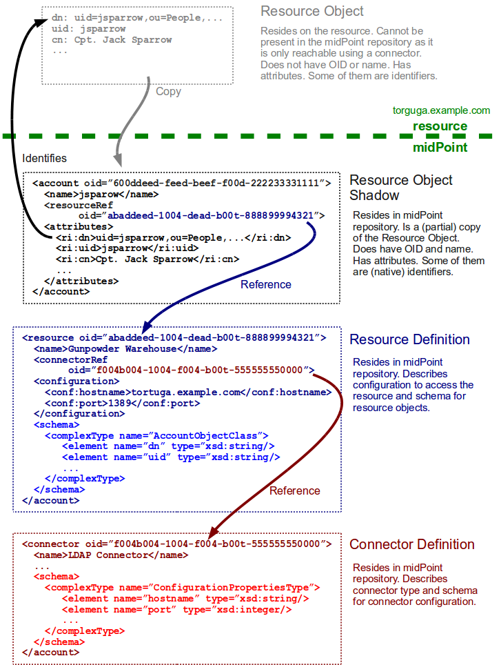
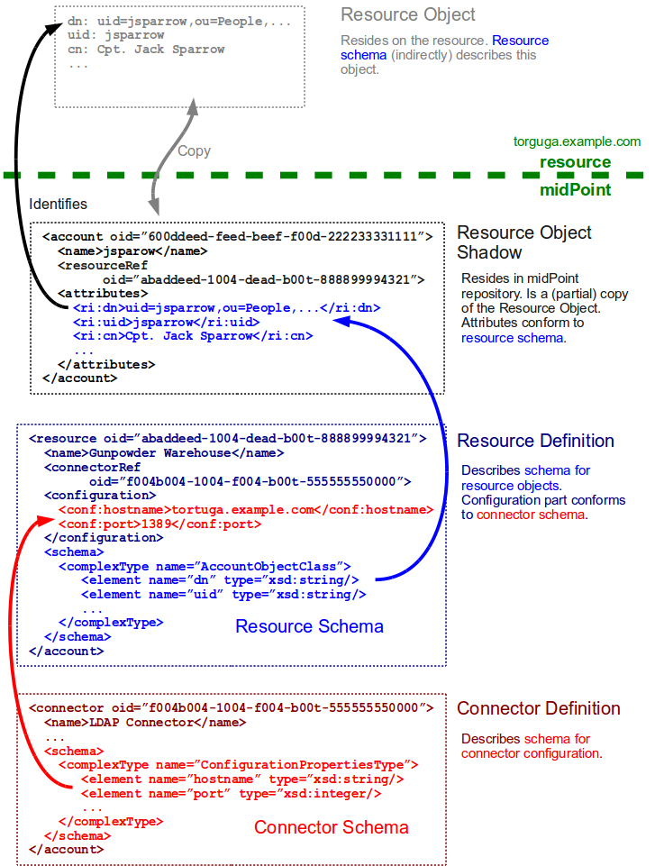

= Resource and Connector Schema Explanation
:page-wiki-name: Resource and Connector Schema Explanation
:page-wiki-id: 3145800
:page-wiki-metadata-create-user: semancik
:page-wiki-metadata-create-date: 2011-09-26T18:27:12.073+02:00
:page-wiki-metadata-modify-user: peterkortvel@gmail.com
:page-wiki-metadata-modify-date: 2016-02-20T15:45:54.868+01:00
:page-upkeep-status: orange

Resource and connector schemas are dynamic schemas - they are created and interpreted in the run-time.
Both resource and connector schemas are stored in the repository, as a part of resource and connector objects.
This page explains how are these schemas used and how they work together to support dynamic resource object shadow structure and resource configuration.

[TIP]
.Simplified examples
====
The examples provided on this page are considerably simplified.
The goal is to demonstrate the concept.
Complete and working examples can be found in the link:https://svn.evolveum.com/midpoint/trunk/samples/[samples section of source code respository].
====

== Object Storage and References

Following figure illustrates a "static" state.
It shows where are the objects stored and how they are referenced.

== Dynamic Schemas

Following figure illustrates how dynamic schemas work.
The colors specify different dynamic namespaces:

* red denotes connector schema and also to the parts of resource configuration that it specifies

* blue denotes resource schema and also the parts of resource object shadow that it specifies

== Namespaces

The <attributes> part of the resource object shadow must be in the resource schema namespace also called _resource instance namespace_ as namespace URI is specified for each resource instance.
It usually has prefix `ri`. The namespace URL may be explicitly specified in xref:/midpoint/architecture/archive/data-model/midpoint-common-schema/resourcetype/[resource definition]. If it is not then a default value will be used:

[source]
----
http://midpoint.evolveum.com/xml/ns/public/resource/instance-2

----

The <configuration> part of the resource must be in the connector schema namespace also called _connector instance configuration namespace_. This namespace is generated for each connector type and it usually contains connector type definition.
When using ICF connectors the namespace has usually prefix `icfi` and it looks like this:

[source]
----
http://midpoint.evolveum.com/xml/ns/public/connector/icf-1/bundle/org.identityconnectors.ldap/org.identityconnectors.ldap.LdapConnector

----

// TODO
// == Schema Annotations