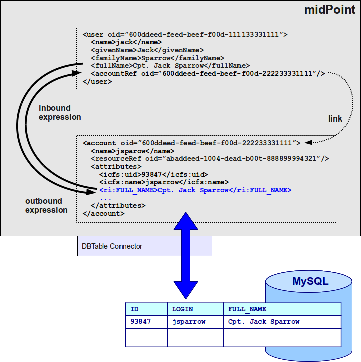

= Shadow objects
:page-wiki-name: Shadow Objects
:page-wiki-id: 655431
:page-wiki-metadata-create-user: semancik
:page-wiki-metadata-create-date: 2011-04-29T12:19:25.870+02:00
:page-wiki-metadata-modify-user: semancik
:page-wiki-metadata-modify-date: 2013-02-04T19:17:24.173+01:00
:page-upkeep-status: orange
// TODO: many links here lead to architecture/archive. We need to revise the article and update references.

MidPoint works with two distinct concepts that represent objects on the resources, such as accounts, groups, permissions, etc.
These concepts are resource objects and their connected resource object shadows.

* *Resource objects* are real objects on the target resources.
These are LDAP entries, lines in `/etc/passwd` files, database rows, etc.
Access to resource objects is provided by provisioning frameworks such as xref:/connectors/[identity connectors], OpenPTK, or others.

* *Resource object shadows* are objects in an IDM repository.
They are short pieces of XML that usually contain basic information about the related resource object and are just pointers to the real resource object.
Resource object shadows may cache the information from their particular resource object to speed up information access.
How much or how little information is cached in the resource object shadow is specified by system (resource) configuration.
Resource object shadows are also called simply "shadows" or "shadow objects".

[%autowidth]
|===
|  Type  |  Stored in  |  Identified by  |  Schema  |  Content

|  Resource object
|  Natively on the resource
|  Any identifier
|  Any schema
|  All resource object data

|  Resource object shadow
|  Local midPoint repository database
|  OID
|  Fixed midPoint schema
|  Common resource object data

|===

Refer to xref:/midpoint/architecture/concepts/shadow/[] to learn more about the concept of shadows.

== How object references work in midPoint

The figure below illustrates the way how references between user, shadows connected to the user, and the resource objects represented by the shadows work together.

The user (`<user>`) and account shadow (`<account>`) objects are midPoint objects stored in midPoint repository database.
More precisely only the parts shown in black are stored in the repository, the parts in blue are fetched from the resource on demand.

User and account shadow objects are _linked_. It means that the user is an _owner_ of the specified account.
User and all accounts owned by the user are xref:/midpoint/reference/synchronization/introduction/[synchronized] using xref:/midpoint/reference/expressions/mappings/inbound-mapping/[inbound] and xref:/midpoint/reference/expressions/mappings/outbound-mapping/[outbound] mappings.

A change of a shadow results in a change of a resource object.
In fact, shadows are little more than a projections of resource objects.
Only the most important parts of a shadow are stored in midPoint repository.
Usually, only the identifiers are stored and therefore the shadow acts as a "mapping" object between xref:/midpoint/devel/prism/concepts/object-identifier/[OID] and native resource identifiers (e.g. LDAP DN, UUID, ...).

== What is the structure of a resource object shadow

Resource object shadows have a fixed schema.
They are defined in xref:/midpoint/architecture/archive/data-model/midpoint-common-schema/[midPoint common schema] and are (indirect) subtypes of xref:/midpoint/devel/prism/schema/[object].
Therefore they are identified by xref:/midpoint/devel/prism/concepts/object-identifier/[OID], can be stored in the repository, the client code may use a `name` property as a human-readable name, etc.
In short, they are usual identity objects in the midPoint system.

Resource object shadows have one additional extensibility point: the `attributes` element.
This element is used to store attributes of the resource object that are not fixed to midPoint static schema.
Attributes that are fetched from the resource may be stored in this element.
These attributes can have different form and different meaning for each individual resource instance.
The schema for the `attributes` element is not fixed, it is just an `xsd:any` wild card.
However, midPoint expects that all the elements under the `attributes` tag are in the form of xref:/midpoint/devel/prism/schema/[properties].

=== Resource object shadow example

The following form of shadow object is provided by the xref:/midpoint/architecture/archive/subsystems/provisioning/provisioning-service-interface/[provisioning service interface].
It has most of the interesting attributes that were probably freshly fetched from the resource.

.Shadow object when retrieved from provisioning
[source,xml]
----

<account oid="12345">
  <name>bond</name>
  <objectClass>ds1:AccountObjectClass</objectClass>
  <attributes>
     <ds1:dn>uid=bond,o=mi5</ds1:dn>
     <ds1:uid>bond</ds1:uid>
     <ds1:cn>James Bond</ds1:cn>
     <ds1:sn>Bond</ds1:sn>
     <ds1:givenName>James</ds1:givenName>
  </attributes>
  <resourceRef oid="333"/>
</account>

----

The following form of shadow object will be stored in the repository.
It contains only the very basic information, usually only the identifiers.
It may contain cached data as well, but that is not mandatory.

.Shadow object as stored in the repository
[source,xml]
----

<account oid="12345">
  <name>bond</name>
  <objectClass>ds1:AccountObjectClass</objectClass>
  <attributes>
     <ds1:dn>uid=bond,o=mi5</ds1:dn>
  </attributes>
  <resourceRef oid="333"/>
</account>

----

Default namespace in both examples points to the xref:/midpoint/architecture/archive/data-model/midpoint-common-schema/[midPoint common schema]. The `ds1` prefix is bound to the resource schema namespace, schema specific to the resource instance.
See the xref:/midpoint/reference/resources/resource-schema/[Resource Schema] page for more details.

== Resource object

Resource objects are native objects on the resource represented as XML.
They have no fixed structure, except that they should be constructed from xref:/midpoint/devel/prism/schema/[properties].
They are quite formless because we cannot predict all the possible objects that a target resource can have and may be interesting to identity management.
There may be _projects_, _workgroups-that-are-almost-but-not-quite-entirely-unlike-organizational-units_, _server clusters_, _coffee machines_, _kangaroos_, or any other type of objects that we cannot imagine now.

Resource objects will not be stored in midPoint repository.
They cannot as they have no fixed structure and therefore they have no OID.
Resource objects are not directly used by stock midPoint logic.
Stock midPoint code always works with shadow objects, not resource objects.
As resource objects have no fixed schema, it is very difficult to write _generic_ code that would work with them.
Resource objects are more like necessary evil than something that we really want in an IDM system.
The sole purpose of resource objects is to be available to customized business logic.

[NOTE]
====
The operations that work with resource objects are not yet implemented in provisioning interface.

====

=== Resource object example

The following example shows the same object but represented as resource object using xref:/midpoint/reference/resources/resource-schema/[resource schema].
This is really not a typical example, it is provided here only for comparison with the shadow object.

.Resource Object
[source,xml]
----

<object xsi:type="ds1:AccountObjectClass">
   <ds1:dn>uid=bond,o=mi5</ds1:dn>
   <ds1:uid>bond</ds1:uid>
   <ds1:cn>James Bond</ds1:cn>
   <ds1:sn>Bond</ds1:sn>
   <ds1:givenName>James</ds1:givenName>
</object>

----

More typical example of resource object is provided below.

.Resource Object
[source,xml]
----

<object xsi:type="au:KangarooObjectClass">
   <au:serialNumber>473562145x384fv2</au:serialNumber>
   <au:variety>au:TasmanianForesterType</au:variety>
   <au:name>Tassie</au:name>
   <au:tailLength unit="meter">0.8</au:tailLength>
</object>

----

If it looks fictional, it may be caused by the fact that it is fictional.
If we could define appropriate type, stereotype or class of typical resource object that are found in IDM deployments now, we would do it.
We would create appropriate (static) type of shadow objects for them.
But, similarly to the fact that kangaroos are not frequently used in IDM deployments, the resource objects are really designed only to support the unexpected, strange, and exotic cases.

=== Resource object identification

Resource objects are identified by whatever native identifier the resource uses.
It may be `DN` for LDAP, `username` and `groupname` for traditional systems, numeric `uids`, `guid`, `UUIDs`, `GUID`, `nsUniqueIds` or even some combination of several identifiers.
We cannot really dictate any fixed identifier type, format or scheme.

Therefore, we have chosen not to choose a common identifier.
Every connector will choose or suggest an identification mechanism for each the resource object type.
The connector will announce the identification mechanism in the xref:/midpoint/reference/resources/resource-schema/[resource schema] using the xref:/midpoint/reference/resources/resource-schema/[resource schema annotations].

// TODO: maybe an example?

== See Also

* xref:/midpoint/reference/resources/resource-schema/[]

* xref:/midpoint/reference/resources/resource-configuration/schema-handling/[]

* xref:/midpoint/reference/resources/resource-schema/explanation/[]

* xref:/midpoint/reference/resources/shadow/purpose/[]
