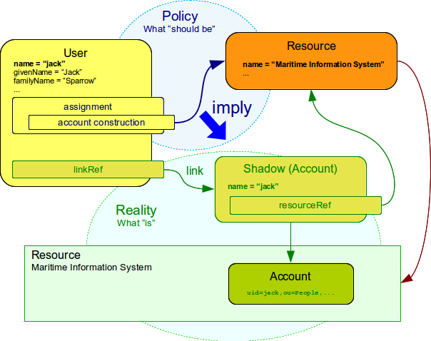
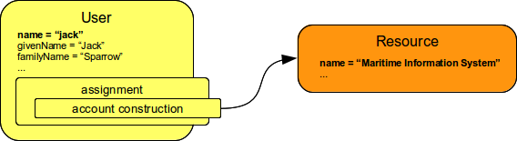
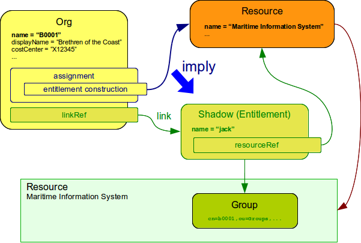

= Assignment Configuration
:page-wiki-name: Assignment Configuration
:page-wiki-id: 9437195
:page-wiki-metadata-create-user: semancik
:page-wiki-metadata-create-date: 2013-05-13T14:45:44.992+02:00
:page-wiki-metadata-modify-user: semancik
:page-wiki-metadata-modify-date: 2019-04-03T09:22:26.276+02:00
:page-upkeep-status: yellow
:page-toc: top

== Introduction

Assignment is a generic concept of associating user (or other xref:/midpoint/reference/schema/focus-and-projections/[focal object]) with the things that he should have or belong to.
Assignment may associate user with an account, role, organizational unit or similar objects.
Accounts and roles are the most common things that assignments are used for.

Assignment describes that the object *should have* something.
It represents a decision or a policy, a desired state.
The actual state of the user may be different.
E.g. an account is assigned to a user, but such account cannot be created because the target resource is currently down.
Assignment represents the desired state.
The actual state of system as seen by midPoint is represented by links and shadow objects.
It is a responsibility of IDM system to reconcile these two states and also real state of the target resource.
The following figure illustrates the concept and the xref:/midpoint/reference/roles-policies/assignment/assigning-vs-linking/[Assigning vs Linking] page describes it in more details.

Assignments are not special to a xref:/midpoint/architecture/archive/data-model/midpoint-common-schema/usertype/[user object].
Any xref:/midpoint/reference/schema/focus-and-projections/[focal] object can have assignments.
This mechanism is used to implement xref:/midpoint/reference/synchronization/generic-synchronization/[generic synchronization].
Please also note that roles contain _inducement_ that is related to the concept of assignment and it actually has a very same structure.
Every piece of assignment definition described on this page can also be applied to inducement definition.
However the purpose and behaviour of inducement is quite different.
See xref:/midpoint/reference/roles-policies/assignment/assignment-vs-inducement/[Assignment vs Inducement] page for a detailed explanation.

The assignment mechanism is a very powerful one.
But with great power comes a great responsibility.
The assignments may be very confusing to engineers that are new to identity management concepts or to engineers that worked only with legacy IDM systems (such as those that do not distinguish policy and reality).
This section tries to explain the basic principles and correct use of assignments.
Good understanding of these principles is critical for efficient midPoint deployment.

== Construction Assignments

Construction assignments are "direct" assignments.
The construction assignments specify that some resource object should be constructed (created) on the resource.
This resource object is usually an account therefore the construction assignment assigns account to a user directly (cf. role assignment below).
Construction assignments contain a `construction` element that specify what kind of resource object should be constructed and how it should look like.

The very simple form of construction assignment is provided below.

.Simple construction assignment
[source,xml]
----
    <assignment>
        <construction>
            <resourceRef oid="c0c010c0-d34d-b33f-f00d-333345454545" type="ResourceType"/>
            <kind>account</kind>
        </construction>
    </assignment>
----

This construction specifies that an _account_ should be created on resource identified by xref:/midpoint/devel/prism/concepts/object-identifier/[OID]`c0c010c0-d34d-b33f-f00d-333345454545`.
When this assignment is processed then such account will be created (if it does not exist already) and linked to the user that has this assignment.
The assignment is a kind of permanent policy.
Therefore if such account is deleted sometime later midPoint will try to re-create the account as long as the assignment is there.

=== Kind and Intent

Most of the construction assignments assign accounts.
However there may be several account types: default account, administration account, testing account, ...
The assignment may also assign a very different kinds of objects.
E.g. in xref:/midpoint/reference/synchronization/generic-synchronization/[generic synchronization] cases an assignment may assign an xref:/midpoint/reference/resources/entitlements/[entitlement] (e.g. a group) to midPoint xref:/midpoint/architecture/archive/data-model/midpoint-common-schema/roletype/[role.] The `kind` and `intent` elements in the construction part define what resource object is actually assigned.
See xref:/midpoint/reference/resources/shadow/kind-intent-objectclass/['Kind, Intent and ObjectClass'] page for more details.
If no kind and intent are specified then the assignment assigns default account on the specified resource.

Please not that there is a substantial difference between assigning an _account_ to a group and assigning an entitlement (e.g. a group) to a _user_.
The former case is what is usually desired: a provisioned account (resource object) is assigned to an existing group (also resource object).
The later case is a very devious (ab)use of xref:/midpoint/reference/synchronization/generic-synchronization/[generic synchronization].
Assigning an entitlement to a _user_ causes that a new group will be created for this user and it will be linked to a user.
This is most like what you do *not* want.
See the xref:/midpoint/reference/resources/entitlements/[Entitlements] page for more details.

=== Attributes

Construction assignments can be used to define an outbound mapping for a specified attribute of the constructed resource object.

The following example specifies that an _account_ should be created on the resource.
It also specified that the attribute `title` of such account should be set to a fixed value `Bloody Pirate`.

.Static attribute value
[source,xml]
----
    <assignment>
        <construction>
            <resourceRef oid="10000000-0000-0000-0000-000000000004" type="c:ResourceType"/>
            <kind>account</kind>
            <attribute>
                <ref>ri:title</ref>
                <outbound>
                    <expression>
                        <value>Bloody Pirate</value>
                    </expression>
                </outbound>
            </attribute>
        </construction>
    </assignment>
----

This _attribute_ definition in assignment use the same principle that is used for resource xref:/midpoint/reference/expressions/mappings/outbound-mapping/[outbound mappings].
Therefore, the full scale of xref:/midpoint/reference/expressions/mappings/[mapping capabilities] can be used here.
Other xref:/midpoint/reference/resources/resource-configuration/schema-handling/#attribute-definitions[configuration options of resource attribute], like _tolerance_ or _limitations_, can't be used in assignments.

The new outbound mapping defined in assignment is representing a policy, which will be merged with other policies before the target resource object is provisioned or modified.
Most importantly the resulting values are merged with the results of resource's xref:/midpoint/reference/expressions/mappings/outbound-mapping/[outbound mappings].
The values are merged by default and no special configuration is required.

[NOTE]
.Do not overuse
====
Do not overuse the ability of assignments to enforce attribute values.
Assignments usually specify exceptions to the policies.
The lower is the number of exceptions the more consistent the policies are.
Consistent policies are easier to maintain.
Care should be taken even if this ability is used in a form of xref:/midpoint/reference/roles-policies/rbac/[role inducements].
Some legacy IDM systems had no other way how to define a policy for attribute values than roles.
Therefore, some IDM engineers have tendency to abuse RBAC mechanisms to define global policies.
This is *not* the case with midPoint.
MidPoint has a clean and elegant mechanism for specifying resource-global policies: xref:/midpoint/reference/expressions/mappings/outbound-mapping/[outbound mappings].

*Rule of the thumb:* xref:/midpoint/reference/expressions/mappings/outbound-mapping/[Outbound mappings] should be used to set attribute values if possible.
If not then xref:/midpoint/reference/roles-policies/rbac/[role inducements] should be used.
Specifying attribute values in assignments should be used only if no other mechanisms is sufficient to implement the policy.

====

Very complex expressions can be used in the assignments.
The following example is using a groovy script to set a value of account `description` attribute to a value based on user's full name and locality.
It produces values similar to "Jack Sparrow is the best pirate Caribbean has ever seen".

.Attribute value derived by expression
[source,xml]
----
    <assignment>
        <construction>
            <resourceRef oid="10000000-0000-0000-0000-000000000004" type="c:ResourceType"/>
            <kind>account</kind>
            <attribute>
                <ref>ri:description</ref>
                <outbound>
                    <source>
                        <path>$user/fullName</path>
                    </source>
                    <source>
                        <path>$user/locality</path>
                    </source>
                    <expression>
                        
                    </expression>
                </outbound>
            </attribute>
        </construction>
    </assignment>
----

=== Strong and Weak Constructions

The default construction type is _strong_.
It means that if such a construction is assigned to a user, the account will immediately get created.
This is the expected behavior in vast majority of cases.
However, there are cases when we do not want to immediately create an account.
Maybe the construction just adds several attributes to existing account - if the user already has that account.
Therefore, there is a possibility to make the construction _weak_.
Weak constructions do not add new account immediately.
If the weak construction is the only construction for a specific account it is simply ignored.
Weak construction is applied only if there is another (strong) construction that adds the account.
In that case the weak construction is also applied and it can be used to "enrich" the account with additional attributes.

[source,xml]
----
<construction>
    <resourceRef ..../>
    ...
    <strength>weak</strength>
</construction>
----

Projection (account) lifecycle is controlled by strong constructions.
Weak constructions do not cause creation or addition of an account.
Only strong constructions can do that.
Weak constructions may be used to enrich the projection with additional data.
If no strength is specified then the construction defaults to _strong_.

=== Entitlement Associations

xref:/midpoint/reference/resources/entitlements/[Entitlements] are resource objects that represent groups, privileges, resource roles or similar objects that can be associated to accounts.
Similarly to attribute values, assignments can also specify entitlement associations.
The simplest way how to specify entitlement association in an assignment is to directly specify entitlement's xref:/midpoint/reference/resources/shadow/[shadow]xref:/midpoint/devel/prism/concepts/object-identifier/[OID:]

.Entitlement association using entitlement shadow OID
[source,xml]
----
    <assignment>
        <construction>
            <resourceRef oid="10000000-0000-0000-0000-000000000004"/>
            <kind>account</kind>
            <association>
                <ref>ri:group</ref>
                <outbound>
                    <expression>
                        <value>
                            <shadowRef oid="20000000-0000-0000-3333-000000000001"/>
                        </value>
                    </expression>
                </outbound>
            </association>
        </construction>
    </assignment>
----

This assignment construct an account on the specified resource.
This account will be associated with the group represented by shadow with OID `20000000-0000-0000-3333-000000000001`.

[TIP]
.Entitlements are resource objects
====
Please keep in mind that xref:/midpoint/reference/resources/entitlements/[entitlements] are resource objects such as groups, privileges or ACLs.
As all resource objects the entitlements are represented by xref:/midpoint/reference/resources/shadow/[shadow objects] in midPoint.
Therefore the entitlements are referred to by using OID of such shadow objects.
This is the preferred way how to bind assignment to a specific entitlement.
The OIDs are designed to be immutable and midPoint will try to maintain the shadow (and its OID) even if the entitlement is renamed.
Therefore this kind of entitlement should work just fine even if the group is later renamed or moved.

====

There is also a more sophisticated way how to associate entitlements with accounts inside an assignment.
There is a special-purpose `associationTargetSearch`xref:/midpoint/reference/expressions/expressions/[expression evaluator] that allows significant flexibility.
This type of expression is using a xref:/midpoint/reference/concepts/query/[search query] to dynamically locate the entitlement shadow.
Following example is looking up the group by name:

.Entitlement association using static associationTargetSearch
[source,xml]
----
    <assignment>
         <construction>
            <resourceRef oid="10000000-0000-0000-0000-000000000004"/>
            <kind>account</kind>
            <association>
                <ref>ri:group</ref>
                <outbound>
                    <expression>
                        <associationTargetSearch>
                            <filter>
                                <q:text>attributes/name = "landlubers"</q:text>
                            </filter>
                        </associationTargetSearch>
                    </expression>
                </outbound>
            </association>
        </construction>
    </assignment>
----

This assignment associates an account with a group identified by name `landlubers`.

This `associationTargetSearch` mechanism is usually used in a combination with an inner expression in the search filter.
In this case we can use algorithm to determine the name of the entitlement (group) that we are looking for.

.Entitlement association using dynamic associationTargetSearch
[source,xml]
----
    <assignment>
         <construction>
            <resourceRef oid="10000000-0000-0000-0000-000000000004"/>
            <kind>account</kind>
            <association>
                <ref>ri:group</ref>
                <outbound>
                    <source>
                        <path>name</path>
                    </source>
                    <expression>
                        <associationTargetSearch>
                            <filter>
                                <q:text>attributes/name = `"group-" + name`</q:text>
                            </filter>
                        </associationTargetSearch>
                    </expression>
                </outbound>
            </association>
        </construction>
    </assignment>
----

If an assignment like this appears in a role, it will use the name of the role to determine a group name.
Therefore if the name of the role is `foo`, it will look for group with name `group-foo`.
This may not be very useful on its own.
But when it is combined with a xref:/midpoint/reference/roles-policies/metaroles/gensync/[metarole] mechanism then it becomes an extremely powerful tool.

=== Construction Variables

Following variables can be used in assignment mappings:

[%autowidth]
|===
| Variable | Type | Description

| `assignment`
| `PrismContainer<AssignmentType>`
| The *magic assignment* variable.
It will be always set to a value.
Its value is basically the assignment that is the source of the assignment/inducement chain (usually user assignment).
However, it is enriched by the values from the other inducements and roles along the chain.
Extension part of this magic data structure contains values compiled from the whole chain.
The value that is closer to focus (e.g. closer to user) overrides all the values that are further away along the chain.

| `thisAssignment`
| `AssignmentType`
| The assignment or incucement that contains the construction.

| `immediateAssignment`
| `AssignmentType`
| The assignment or inducement that is right in front of `thisAssignment` in the assignment/inducement chain.

| `focusAssignment`
| `AssignmentType`
| The assignment contained in the focus object (e.g. in a user).
This is the "primary" assignment, the source of the whole assignment/inducement chain.

| `source`
| `ObjectType`
| The object which contains the construction.
It can either be focus object (in case of direct assignments) or a sublcass of abstract role (role or org, in case of indirect inducement).

| `focus` (or `user`)
| `FocusType`
| The focus object, usually a user.
Therefore also `user` variable name is provided for convenience and readability.

| `containingObject`
| `AbstractRoleType`
| The role that contains the expression (currently present only when evaluating constructions, and is the same as `source`).

| `thisObject`
| `AbstractRoleType`
| Deprecated.
Do not use.
Use assignmentPath instead.

| `immediateRole`
| `AbstractRoleType`
| The role that is right in front of `thisAssignment` in the assignment/inducement chain.

| `assignmentPath`
| `AssignmentPath`
| Sequence of assignments from the focal object to the point of evaluation.
(More exactly, each item in this sequence is an link:https://github.com/Evolveum/midpoint/blob/master/model/model-api/src/main/java/com/evolveum/midpoint/model/api/context/AssignmentPathSegment.java[AssignmentPathSegment].
It is a structure that contains an assignment augmented with additional information, like the actual source and target objects.)
See xref:/midpoint/reference/roles-policies/assignment/using-assignment-path-in-expressions/[Using Assignment Path in Expressions] and xref:/midpoint/reference/roles-policies/assignment/assignment-path-variables-example/[Assignment Path Variables Example]

|===

Use of these variables is xref:/midpoint/reference/roles-policies/assignment/assignment-path-variables-example/[illustrated on the example here].

=== The loginMode Variable

At login time, many parts of assignments, e.g. constructions and focus mappings are *not* evaluated - because of performance as well as availability reasons.
But sometimes even the evaluation of _conditions_ on paths to these elements might be time-consuming and even unavailable because of missing security context.
To optimize these evaluations midPoint provides special `loginMode` variable.
If it's `true` it means that the evaluation is carried out at login time.
Conditions to targets that are irrelevant at this moment can then be quickly evaluated to `false`.

This variable is present also in target filtering expressions.

=== Construction Assignments in Generic Synchronization

Things are getting a bit more complex when xref:/midpoint/reference/synchronization/generic-synchronization/[generic synchronization] feature is used.
In such a case we may want to create groups based on midPoint organizational units.
The same assignment mechanism that is used for user-account pair can be also used in this case.
In this specific case we want to create an assignment that is placed inside an xref:/midpoint/architecture/archive/data-model/midpoint-common-schema/orgtype/[Org] object.
This assignment will state that a group that represents the Org should be created on the resource.
The situation looks like this:

The `B0001`xref:/midpoint/architecture/archive/data-model/midpoint-common-schema/orgtype/[Org] object represents an organizational unit in midPoint.
As the xref:/midpoint/architecture/archive/data-model/midpoint-common-schema/orgtype/[Org] is a xref:/midpoint/reference/schema/focus-and-projections/[focal object] it can have assignments.
Following assignment is added to the xref:/midpoint/architecture/archive/data-model/midpoint-common-schema/orgtype/[Org] object:

.Simple construction assignment
[source,xml]
----
    <assignment>
        <construction>
            <resourceRef oid="c0c010c0-d34d-b33f-f00d-333345454545" type="ResourceType"/>
            <kind>entitlement</kind>
            <intent>group</intent>
        </construction>
    </assignment>
----

This assignment states that an xref:/midpoint/reference/resources/entitlements/[entitlement] (which is a resource object) should be created.
This entitlement is of `group` type (specified by `intent` settings).
Therefore when the assignment is processed by midPoint a group `b0001` will be created on the resource.

Entitlement construction assignments are very similar to the account construction assignments.
In fact the very same principles apply.
Therefore for this approach to work well you need to do the same as for accounts: define entitlement in xref:/midpoint/reference/resources/resource-configuration/schema-handling/[Resource Schema Handling] which usually includes some xref:/midpoint/reference/expressions/mappings/outbound-mapping/[outbound mappings] to set group identifiers and other attributes.
The xref:/midpoint/reference/resources/entitlements/[Entitlements] page has some examples how to do this.

[TIP]
.Intent
====
xref:/midpoint/reference/resources/shadow/kind-intent-objectclass/[Intent] setting is usually not used often when working with accounts.
What is usually desired is to create "default account" for a user.
Therefore default setting of intent usually works well for accounts and it is often omitted from the configuration.
However it is quite different for entitlements.
The concept of "default entitlement" usually does not make any sense.
We usually want to explicitly assign a "group", "ACL" or "privilege".
And this is usually specified by using xref:/midpoint/reference/resources/shadow/kind-intent-objectclass/[intent].

====

Please be very careful when working with assignments and roles.
Roles usually contain *inducement* as such inducements should not apply to a role but it should apply to users that have this role.
However as xref:/midpoint/architecture/archive/data-model/midpoint-common-schema/roletype/[RoleType] is a xref:/midpoint/reference/schema/focus-and-projections/[focal object] it is perfectly legal for a role to contain an *assignment*.
Such assignment applies to a role itself and it can be used e.g. to create a group as a representation of the role.
See xref:/midpoint/reference/roles-policies/assignment/assignment-vs-inducement/[Assignment vs Inducement] page for more details.
Also have a look at xref:/midpoint/reference/roles-policies/rbac/[Advanced Hybrid RBAC] page for an interesting discussion of meta-roles.

== Role Assignments

Role assignments are "indirect" assignments.
E.g. a role is assigned to a user and such role contains a collection of constructions that applies to the user.
Obviously a role can be assigned to many users therefore creating an xref:/midpoint/reference/roles-policies/rbac/[RBAC] structure.

image::assignments-role-1.png[]

Simple role assignment is really a very simple thing:

.Simple construction assignment
[source,xml]
----
    <assignment>
        <targetRef oid="c0c010c0-d34d-b33f-f00d-444111111111" type="RoleType"/>
    </assignment>
----

Almost all the power is in the role definition.
The xref:/midpoint/reference/roles-policies/rbac/[Advanced Hybrid RBAC] and xref:/midpoint/reference/roles-policies/roles-and-policies-configuration/[Roles and Policies Configuration] pages provide much more details about RBAC and role definitions.

== Parametric Assignments

Assignment, all by itself, is a great and powerful mechanism.
But it can get even better.
One of the main purposes of the `assignment` structure is to contain parameters, e.g. parameters that are not related to the user or a role, but parameters that are related to the association of a user to a role.
The usual assignment parameters are start and end dates of the assignment.
This can be used in case a role is assigned to a user only for a specified amount of time, when a new employee record is created before he really joins the company, etc.
Such approach is illustrated in the following example.
The example specifies that Jack Sparrow will be assigned to role of a Captain, but only starting 30th of May 1623 AD.

.Simple Parametric Assignment Example
[source,xml]
----
<user oid="c0c010c0-d34d-b33f-f00d-111111111111">
    <name>jack</name>
    <fullName>Cpt. Jack Sparrow</fullName>
    <givenName>Jack</givenName>
    <familyName>Sparrow</familyName>
    <honorificPrefix>Cpt.</honorificPrefix>
    <assignment>
        <targetRef oid="c0c010c0-d34d-b33f-f00d-444111111111" type="RoleType"/>
		<activation>
		    <validFrom>1623-05-30T23:30:00-00:00</validFrom>
        </activation>
	</assignment>
</user>

----

The assignment can also be temporarily disabled, using the `administrativeStatus` element, as illustrated in the following example.

.Disabling Assignment Example
[source,xml]
----
<user oid="c0c010c0-d34d-b33f-f00d-111111111111">
    <name>jack</name>
    <fullName>Cpt. Jack Sparrow</fullName>
    <givenName>Jack</givenName>
    <familyName>Sparrow</familyName>
    <honorificPrefix>Cpt.</honorificPrefix>
    <assignment>
        <targetRef oid="c0c010c0-d34d-b33f-f00d-444111111111" type="RoleType"/>
        <activation>
		  <administrativeStatus>disabled</administrativeStatus>
		</activation>
    </assignment>
</user>

----

This kind of assignment parameters, called xref:/midpoint/reference/concepts/activation/[activation], is pre-defined in midPoint.
Therefore the IDM system will take care of processing that by itself, without any substantial customization.

=== Assignments and Business Logic

Assignment parameters can be arbitrarily extended by using the `extension` element.
Such extension may contain any custom data and such data can be used in the expressions in assigned object.
Following example illustrates the use of custom assignment parameter `shipName`.
The parameter is defined in the extension and later used in the assigned role definition to fill in the value of `l` LDAP attribute.

.Disabling Assignment Example
[source,xml]
----
<user oid="c0c010c0-d34d-b33f-f00d-111111111111">
    <name>jack</name>
    <fullName>Cpt. Jack Sparrow</fullName>
    <givenName>Jack</givenName>
    <familyName>Sparrow</familyName>
    <honorificPrefix>Cpt.</honorificPrefix>
    <assignment>
        <extension>
          <piracy:shipName>Black Pearl</piracy:shipName>
        </extension>
        <targetRef oid="c0c010c0-d34d-b33f-f00d-444111111111" type="RoleType"/>
    </assignment>
</user>

<role oid="c0c010c0-d34d-b33f-f00d-444111111111">
    <name>Captain</name>
    <inducement>
        <construction>
            <!-- Following reference points to an LDAP resource -->
            <resourceRef oid="c0c010c0-d34d-b33f-f00d-333111111111" type="ResourceType"/>
            <kind>account</kind>
            <attribute>
                <ref>ri:l</ref>
                <outbound>
                    <source>
                        <name>shipName</name>
                        <path>$assignment/c:extension/piracy:shipName</path>
                    </source>
                    <expression>
                        
                    </expression>
                </outbound>
            </attribute>
        </construction>
    </inducement>
</role>

----

Such extension may contain any custom data and such data can be used in the expressions in assigned object.
Such assignment extensions can then be used as a parameters in the roles.
Therefore a role assignment can specify details such as a department for which the role applies, the branch office, access zone in the building and so on.
This _parametric_ RBAC structure is a good mechanism to fight the xref:/iam/role-explosion/[role explosion] problem.
See xref:/midpoint/reference/roles-policies/rbac/[Advanced Hybrid RBAC] for more details.

== Enforcement Modes

Main article: xref:/midpoint/reference/synchronization/projection-policy/[Projection Policy]

There are many ways how to resolve the difference between the policy (assignments) and reality.
The goal of xref:/midpoint/reference/synchronization/projection-policy/[enforcement modes] is to determine account _legality_.
I.e. midPoint computes whether the specific account (or any other _projection_) is legal or illegal.
An account is legal if there is a valid assignment for it or if an enforcement mode allows it.
E.g. in FULL enforcement mode the account is legal only if there is a valid assignment.
In NONE enforcement mode the account is legal anytime it exists regardless of the assignments.

The legality of the account is then used by the xref:/midpoint/reference/resources/resource-configuration/schema-handling/activation/[activation] mechanism to determine what to do with the account.
The activation usually deals with illegal accounts and determines whether to delete the account, disable it or do any other action.

== Assignments and Mappings

Assignments are often created automatically by midPoint mappings, especially in the xref:/midpoint/reference/expressions/object-template/[object template].
It is perfectly possible to create assignments using a `value`xref:/midpoint/reference/expressions/expressions/[expression evaluator].
However this method works well only for simple cases.
Therefore there is a specialized `assignmentTargetSearch`xref:/midpoint/reference/expressions/expressions/[expression evaluator] designed for the very specific purpose of creating assignments.
It is using a xref:/midpoint/reference/concepts/query/[search query] to dynamically locate assignment targets.
It can be configured using inner expressions which makes it a very powerful mechanism.
See xref:/midpoint/reference/expressions/expressions/[Expression] page for more details.

== Referential Integrity

MidPoint does *not* support strict xref:/midpoint/architecture/concepts/relaxed-referential-integrity/[referential integrity].
This was a very conscious decision during midPoint design.
Therefore case should be taken when deleting objects, that are targets of existing assignments.
Assignments to the deleted objects will *not*  be deleted.
Such assignments will remain in "holder" objects.
Such "dangling" assignments will be silently ignored in most cases, but they may be displayed by GUI, they may produce log records or even some warning.
Therefore the best strategy is to avoid creating such "dangling" assignments.

See xref:/midpoint/architecture/concepts/relaxed-referential-integrity/[Relaxed Referential Integrity] page for more details.

== See Also

* xref:/midpoint/reference/roles-policies/assignment/[Assignment] feature description

* xref:/midpoint/reference/synchronization/generic-synchronization/[Generic Synchronization]

* xref:/midpoint/reference/resources/entitlements/[Entitlements]

* xref:/midpoint/reference/synchronization/projection-policy/[Projection Policy]

* xref:/midpoint/reference/roles-policies/assignment/assigning-vs-linking/[Assigning vs Linking]

* xref:/midpoint/reference/roles-policies/assignment/assignment-vs-inducement/[Assignment vs Inducement]

* xref:/midpoint/reference/resources/resource-configuration/schema-handling/activation/[Resource Schema Handling: Activation]

* xref:/midpoint/reference/schema/focus-and-projections/[Focus and Projections]

* xref:/midpoint/reference/expressions/expressions/[Expression], especially part about assignment expressions

* xref:/midpoint/architecture/concepts/relaxed-referential-integrity/[Relaxed Referential Integrity]
