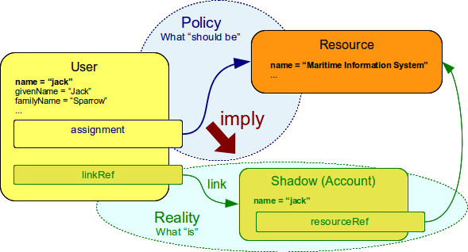
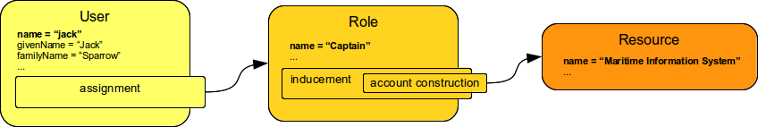
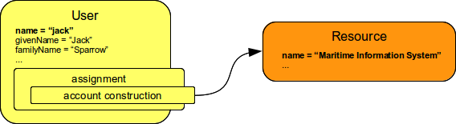

= Assignment
:page-wiki-name: Assignment
:page-wiki-id: 655530
:page-wiki-metadata-create-user: semancik
:page-wiki-metadata-create-date: 2011-05-03T19:21:25.854+02:00
:page-wiki-metadata-modify-user: vskocenova
:page-wiki-metadata-modify-date: 2019-07-10T13:25:40.634+02:00
:page-midpoint-feature: true
:page-alias: { "parent" : "/midpoint/features/current/" }
:page-upkeep-status: orange
:page-upkeep-note: Probably just minor updates needed.

Assignment is a generic concept of associating user with the things that he should have or belong to.
Assignment may associate user with an account, role, organizational unit or similar objects.
Accounts and roles are the most common things that assignments are used for.

Assignment describes that the user *should have* something.
It represents a decision or a policy, a desired state.
The actual state of the user may be different.
E.g. an account is assigned to a user, but such account cannot be created because the target resource is currently down.
Assignment represents the desired state.
The actual state of system as seen by midPoint is represented by links and shadow objects.
It is a responsibility of IDM system to reconcile these two states and also real state of the target resource.

[TIP]
.Why do we care so much about "policy vs reality"?
====
Because we are not naive.
We just cannot pretend that everything is OK when it is not.
Too often policy specifies one thing but the reality is very different.
Provisioning system works with many information stores - its own repository and a lot of resources.
While midPoint is usually set up to manage the resources system administrators can still use native administration tools to change things.
Disabling such tools is usually not feasible and it is often also counter-productive.
Other tools and events may also run parallel to midPoint.
Therefore midPoint just must expect that things change "in the background".
And if things change midPoint must know what really is there and what should be there.
MidPoint must know the difference to be able to fix it.
And to operate efficiently.
And it does.
====

== Simple Role Assignment Example

Following diagram provides simple example of a user being assigned to a role.

.Simple Role Assignment

The situation depicted in the diagram could be expressed in XML as:

.Simple Role Assignment Example
[source,xml]
----
<user oid="c0c010c0-d34d-b33f-f00d-111111111111">
    <name>jack</name>
    <fullName>Cpt. Jack Sparrow</fullName>
    <givenName>Jack</givenName>
    <familyName>Sparrow</familyName>
    <honorificPrefix>Cpt.</honorificPrefix>
    <assignment>
        <targetRef oid="c0c010c0-d34d-b33f-f00d-444111111111" type="RoleType"/>
    </assignment>
</user>

<role oid="c0c010c0-d34d-b33f-f00d-444111111111">
    <name>Captain</name>
    <!-- Complete role definition comes here -->
</role>

----

== Simple Account Assignment

We expect that most midPoint deployments will use xref:/midpoint/reference/roles-policies/rbac/[roles] to manage user accounts, entitlements and privileges.
However we understand that there is always a need to make an "exception" or a special case.
Therefore it is possible to assign account to a user directly.

In this case the assignment takes a slightly different form:

.Simple Account Assignment Example
[source,xml]
----
<user oid="c0c010c0-d34d-b33f-f00d-111111111111">
    <name>jack</name>
    <fullName>Cpt. Jack Sparrow</fullName>
    <givenName>Jack</givenName>
    <familyName>Sparrow</familyName>
    <honorificPrefix>Cpt.</honorificPrefix>
    <assignment>
        <construction>
            <resourceRef oid="c0c010c0-d34d-b33f-f00d-333345454545" type="ResourceType"/>
            <kind>account</kind>
        </construction>
    </assignment>
</user>

<resource oid="c0c010c0-d34d-b33f-f00d-333345454545">
    <name>Maritime Information System</name>
    <!-- Complete resource definition comes here -->
</resource>

----

The account is assigned directly to the user.
The `construction` structure is the same as the one used in role definitions therefore full power of expressions can be used to fine tune account attributes and entitlements.

== Parametric Assignment

Assignment, all by itself, is a great and powerful mechanism.
But it can get even better.
One of the main purposes of the `assignment` structure is to contain parameters, e.g. parameters that are not related to the user or a role, but parameters that are related to the association of a user to a role.
The usual assignment parameters are start and end dates of the assignment.
This can be used in case a role is assigned to a user only for a specified amount of time, when a new employee record is created before he really joins the company, etc.
The assignment can also be temporarily disabled.
This kind of assignment parameters, called xref:/midpoint/reference/concepts/activation/[activation], is pre-defined in midPoint.
Therefore the IDM system will take care of processing that by itself, without any substantial customization.

Assignment parameters can be arbitrarily extended by using the `extension` element.
Such extension may contain any custom data and such data can be used in the expressions in assigned object.
Such assignment extensions can then be used as a parameters in the roles.
Therefore a role assignment can specify details such as a department for which the role applies, the branch office, access zone in the building and so on.
This _parametric_ RBAC structure is a good mechanism to fight the xref:/iam/iga/rbac/role-explosion/[role explosion] problem.
See xref:/midpoint/reference/roles-policies/rbac/[Advanced Hybrid RBAC] for more details.
The xref:/midpoint/reference/roles-policies/assignment/configuration/[Assignment Configuration] page provides examples of such parametric assignments.

== See Also

* xref:/midpoint/reference/roles-policies/assignment/configuration/[Assignment Configuration] page in Documentation section

* xref:/midpoint/reference/roles-policies/rbac/[Advanced Hybrid RBAC]

* xref:/midpoint/reference/roles-policies/assignment/assigning-vs-linking/[Assigning vs Linking]