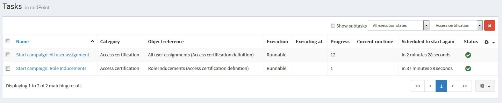

= Access Certification
:page-wiki-name: Access Certification
:page-wiki-id: 21200930
:page-wiki-metadata-create-user: mederly
:page-wiki-metadata-create-date: 2015-09-08T10:37:07.596+02:00
:page-wiki-metadata-modify-user: mederly
:page-wiki-metadata-modify-date: 2020-06-18T07:37:54.090+02:00
:page-toc: top
:page-upkeep-status: orange

== Introduction

MidPoint provides the possibility to periodically review various settings, e.g. assignment of roles to users.
This feature is called *Access certification*. It is implemented in the form of certification campaigns.

A *certification campaign* is a review process that consists of identifying a set of certification cases, selecting reviewers for them, gathering decisions of these reviewers, and executing remediation process, if needed.
Reviewer selection and decision gathering can be done multiple times, in case of multi-stage campaigns.
Remediation process can be automated or manual.
It is assumed that certification campaigns will be run regularly, e.g. yearly, twice a year, monthly, and so on.

In the following we'll see how a campaign looks like.
Then we'll go through a very quick tutorial.
And after that we'll have a look at various possibilities connected to defining certification campaigns.

== Certification campaign

Certification campaigns are created using templates that are called *certification campaign definitions*, or certification definitions for short.
Each definition contains the following elements:

. *name* - the name of the certification campaign definition, e.g. "All user assignments"

. *description* - more verbose description of the definition, e.g. "Certifies all users' assignments.
Everything is certified by the administrator."

. *handlerUri* - defines the software element (handler) that implements all the processing required by the certification campaigns of the given type.
There are handlers that come bundled with midPoint, while others can be customer-written.
Currently, there is one handler named [.underline]#http://midpoint.evolveum.com/xml/ns/public/certification/handlers-3#direct-assignment#, that is able to handle certification of many types of direct assignments, e.g. user-to-role, user-to-org, role-to-role, etc.

. *scopeDefinition* - while the handler provides basic character of the certification (e.g. "we'll be dealing with direct assignments"), the scope definition says more precisely which objects (in this case, assignments) are involved.
E.g. only user-to-role? And which users? Which roles? And so on.
More on this below.

. *ownerRef* - who owns the definition and related campaigns? Campaign owner may be different from the owner of the campaign definition.

. *remediationDefinition* - how will the remediation phase look like, e.g. will it be automated or manual?

. *reiterationDefinition* - should the iteration start automatically (by default is manual)? how many iterations are allowed?

. *stageDefinition*(s) - how will the individual review stages look like, e.g. how long should a given stage take? how will the reviewers be selected? More on this below.

. *reviewStrategy* - defines a strategy which is used to compute review outcome for a given case.

. *view* - specifies a view for a presentation of the certification items collections which are created on the basis of the current certification definition.
This means that every certification campaign created on the basis of this definition will use this view while displaying certification items collection.

An example of a campaign definition (taken from link:https://github.com/Evolveum/midpoint-samples/blob/master/samples/certification/def-all-user-assignments.xml[samples/certification/def-all-user-assignments.xml] file):

[source,xml]
----
<accessCertificationDefinition
        xmlns='http://midpoint.evolveum.com/xml/ns/public/common/common-3'
        xmlns:xsi="http://www.w3.org/2001/XMLSchema-instance">
    <name>All user assignments</name>
    <description>Certifies all users' assignments. Everything is certified by the administrator.</description>
    <handlerUri>http://midpoint.evolveum.com/xml/ns/public/certification/handlers-3#direct-assignment</handlerUri>
    <ownerRef oid="00000000-0000-0000-0000-000000000002" type="UserType"><!-- administrator --></ownerRef>
    <remediationDefinition>
        
    </remediationDefinition>
    <stageDefinition>
        <number>1</number>
        <name>Administrator's review</name>
        <description>In this stage, the administrator has to review all the assignments of all users.</description>
        <duration>P14D</duration>   <!-- 14 days -->
        <notifyBeforeDeadline>PT48H</notifyBeforeDeadline> <!-- 48 hours -->
        <notifyBeforeDeadline>PT12H</notifyBeforeDeadline>
        <notifyOnlyWhenNoDecision>true</notifyOnlyWhenNoDecision>  <!-- this is the default -->
        <reviewerSpecification>
            <defaultReviewerRef oid="00000000-0000-0000-0000-000000000002" type="UserType" />   <!-- administrator -->
        </reviewerSpecification>
    </stageDefinition>
</accessCertificationDefinition>
----

In this case, scope definition is missing.
It means that default values are used: all assignments of all users are taken into account.

There is one stage.
Stage definition consists of the following:

. *number* - because in midPoint data structures, lists are generally unordered, each stage has a number that specifies in which order it will be executed.
Numbers have to start at 1 and increase consecutively.

. *name* and *description*,

. duration, specified as *duration* property - this influences notifications and automated closure of the stage,

. *notifyBeforeDeadline* - how long before deadline (given by the stage duration) will notifications be sent.
This is a multivalued property, so it is possible to specify more than one notification.
In the above example, first notification is sent 48 hours before deadline, and the second one 12 hours before.

. *notifyOnlyWhenNoDecision* - if set to true (the default), notifications are sent only to reviewers that have not decided yet.

. *reviewerSpecification* - how the reviewers will be selected? In this simplistic case, everything will be reviewed by the administrator.
More on reviewer specification below.

== Very quick tutorial

It is advisable to go through a xref:/midpoint/reference/roles-policies/certification/tutorial/[very quick tutorial] at this point in order to see how certification works.

== Campaign definition options

Scope definition and reviewer definition are powerful mechanisms allowing to customize certification campaign a lot.
Let us have look at the details.

=== Scope definition

Scope definition controls the set of certification cases that are created when the certification campaign is started.
You can configure the following:

. *objectType* - what kind of objects we are dealing with? The default is UserType.
But you can specify also RoleType, OrgType, ServiceType, FocusType or AbstractRoleType here.

. *searchFilter* - what objects of a given type should be selected? This is a standard midPoint filter.
The default is "all objects of a given type".

. *itemSelectionExpression* - expression that selects items that are to be included in the certification.
Exact use of this expression depends on the certification handler.
The direct assignment handler calls this expression individually with each assignment to determine which assignments should be included and which should not.

. *caseGenerationExpression* - in the future, it will be possible to define an expression that produces certification cases.
This can be any expression, whose input is an object that has passed the search filter specified above, and its output is a list of certification cases.
However, this is not implemented yet.

. Handler-specific properties.
For example, direct assignment handler provides the following ones:

.. *includeAssignments* - should assignments be included in the certification? (default = true)

.. *includeInducements* - should inducements be included in the certification? (default = true)

.. *includeRoles* - should assignments/inducements of roles be included in the certification? (default = true)

.. *includeOrgs* - should assignments/inducements of orgs be included in the certification? (default = true)

.. *includeResources* - should assignments/inducements of resources be included in the certification? (default = true)

.. *includeServices* - should assignments/inducements of services be included in the certification? (default = true)

.. *includeUsers* - should assignments/inducements of users (e.g. deputy relations) be included in the certification? (default = true)

.. *enabledItemsOnly* - should we approve only assignments/inducements that are currently enabled? (I.e. with administrativeStatus either null or ENABLED) (default = true)

.. *relation* - relation(s) which are to be considered.
Value of q:any means "any relation".
If no relation is present, org:default (i.e. null) is assumed.

An example of more advanced scope definition:

[source,xml]
----
<scopeDefinition xsi:type="AccessCertificationAssignmentReviewScopeType">
    <objectType>UserType</objectType>
    <searchFilter>
        <q:org>
            <q:path>parentOrgRef</q:path>
            <q:orgRef oid="00000000-8888-6666-0000-100000000001">       <!-- Governor Office -->
                <q:scope>SUBTREE</q:scope>
            </q:orgRef>
        </q:org>
    </searchFilter>
    <itemSelectionExpression>
        
    </itemSelectionExpression>
    <includeRoles>true</includeRoles>
    <includeOrgs>false</includeOrgs>
    <includeResources>false</includeResources>
</scopeDefinition>
----

This selects user-role assignments for users that belong under GovernorOffice and for roles with riskLevel = "critical".

=== Stage definitions

This is described in xref:/midpoint/reference/roles-policies/certification/stages/[a separate document].

=== Automated scheduling of campaigns

Campaigns can be automatically started by using tasks.
So, for example, to auto-start campaigns in samples/certification directory, please import the `start-*.xml` files.

The task looks like this:

[source,xml]
----
<task ...>
    <name>Start campaign: Role Inducements</name>
    <ownerRef oid="00000000-0000-0000-0000-000000000002"/>
    <executionStatus>runnable</executionStatus>
    <category>AccessCertification</category>
    <handlerUri>http://midpoint.evolveum.com/xml/ns/public/certification/task/campaign-creation/handler-3</handlerUri>
    <objectRef type="AccessCertificationDefinitionType">
        <filter>
            <q:text>name = "Role Inducements"</q:text>
        </filter>
    </objectRef>
    <recurrence>recurring</recurrence>
    <binding>loose</binding>
    <schedule>
        <cronLikePattern>0 0 0 * * ?</cronLikePattern>        <!-- each day at midnight (for testing) -->
    </schedule>
</task>

----

After importing the task(s), campaigns are automatically scheduled at given times.

Current status of a campaign can be seen when clicking on "Campaigns scheduling" under "Certifications" menu.
All certification-related tasks are shown.
(Besides tasks for starting campaigns there are also remediation tasks, but that will be eventually fixed.)

=== Access certification configuration in system configuration

Access certification configuration can be defined as a part of the system configuration.
This configuration is used globally in the system and applied to all campaigns.

You can define the following items within the _accessCertification_ element:

. *availableResponse* - what responses are available to reviewers? Empty list means all responses.

WARNING: This element is deprecated.
It is advised to use the configuration of the actions for certification items collection view.

. *allowCertificationItemsMenus* - defines if the certification items menu items should be added to the left menu so that "Certification items" and "My certification items" pages can be reached directly from the main menu.
If not defined (or set to false), the certification items pages can be reached only from the active campaigns panel.
This configuration option was added to support old behavior where the certification items pages had their own menu items.
The default value is false.
By default, the user sees "Active campaigns" and "My active campaigns" menu items going through which certification items page can be reached.

. *multiselect* - defines the possibility to select multiple items in the certification items collection view table (possible values are: _selectAll_ - gives the possibility to select all items at once, _selectIndividualItems_ - gives the possibility to select individual items without possibility to select all at once, _noSelect_ - no possibility to select any items).

. *defaultView* - defines a default view for a presentation of the certification items collection.

==== Configuring decision options for certification items

It is possible to configure the available set of responses to be used while making a decision on a certification item(s).
By default, there are 2 available responses in the system: accept and revoke.
You can configure _availableResponse_ items in the _accessCertification_ element straight in the system configuration.

[source,xml]
----
<accessCertification>
    <availableResponse>accept</availableResponse>
    <availableResponse>revoke</availableResponse>
    <availableResponse>noResponse</availableResponse>
</accessCertification>
----

WARNING: Be aware that _availableResponse_ element is deprecated therefore it's advised to use the configuration of the actions for certification items collection view.

=== Configuring collection views for certification items

Certification items collection view brings more extended configuration options.
Default certification items collection view can be configured in the _systemConfiguration -> accessCertification -> defaultView_.
Collection view configuration should define identifier and type.
Collection view can also contain columns and actions configuration.

[source,xml]
----
            <defaultView>
                <identifier>defaultCertItemsView</identifier>
                <column>
                    <name>certItemObject</name>
                    <display>
                        <label>Cert. item object</label>
                    </display>
                </column>
                <column>
                    <name>stage</name>
                    <path>stageNumber</path>
                    <display>
                        <label>Stage</label>
                    </display>
                </column>
                <column>
                    <name>certItemEditableComment</name>
                </column>
                <includeDefaultColumns>true</includeDefaultColumns>
                <type>AccessCertificationWorkItemType</type>
                <action>
                    <identifier>certItemAccept</identifier>
                    <panel>
                        <display>
                            <label>Do you really want to accept the item?</label>
                        </display>
                        <container>
                            <identifier>comment</identifier>
                            <display>
                                <label>Please, provide a comment (required)</label>
                            </display>
                            <item>
                                <path>output/comment</path>
                                <mandatory>true</mandatory>
                            </item>
                        </container>
                        <type>AccessCertificationWorkItemType</type>
                    </panel>
                </action>
            </defaultView>
----

To learn more about actions configuration, please follow to xref:/midpoint/reference/roles-policies/certification/actions/[GUI Actions] page.
To learn more about columns configuration, please follow to xref:/midpoint/reference/roles-policies/certification/columns-configuration/[Columns configuration] page.

Object collection view configuration can be also defined within access certification definition (_view_ element).
This configuration will be merged with the global one and applied to all campaigns created on the base of this definition.

=== Dashboard widget configuration

Certification dashboard widget can be configured to be shown on the self-service dashboard page.
The widget configuration is as a part of the system configuration initial object.
The configuration can be found in the _systemConfiguration -> adminGuiConfiguration -> homePage_ element.
It is hidden in the `End user` initial object by default and can be adopted to the specific needs of the project (please, see xref:/midpoint/reference/admin-gui/admin-gui-config/#how-it-works[Admin GUI configuration merging mechanism]).

[source,xml]
----
            <widget>
                <identifier>myCertificationItems</identifier>
                <display>
                    <label>
                        <t:orig>Certification items</t:orig>
                        <t:norm>certification items</t:norm>
                        <t:translation>
                            <t:key>PageCertItems.title</t:key>
                        </t:translation>
                    </label>
                    <icon>
                        <cssClass>fa fa-certificate</cssClass>
                    </icon>
                </display>
                <displayOrder>50</displayOrder>
                <panelType>myCertificationItems</panelType>
                <previewSize>5</previewSize>
                <action>
                    <identifier>viewAll</identifier>
                    <display>
                        <label>
                            <t:orig>View all</t:orig>
                            <t:norm>view all</t:norm>
                            <t:translation>
                                <t:key>PageSelfDashboard.button.viewAll</t:key>
                            </t:translation>
                        </label>
                        <icon>
                            <cssClass>fa fa-search</cssClass>
                        </icon>
                    </display>
                    <target>
                        <targetUrl>/admin/certification/myActiveCampaigns</targetUrl>
                    </target>
                </action>
            </widget>
----

== Reporting

There are four types of reports available: certification definitions, campaigns, campaign cases and campaign decisions.
They are described on xref:/midpoint/reference/roles-policies/certification/reports/[Access Certification Reports] page.

== Notifications

Certification module provides notifications for certification campaign owner as well as for individual reviewers.
More information can be found on xref:/midpoint/reference/roles-policies/certification/notifications/[Access Certification Notifications] page.

== Security

Individual operations are authorized in a specific way.
For detailed information, please see xref:/midpoint/reference/roles-policies/certification/authorization/[Access Certification Security] page.
