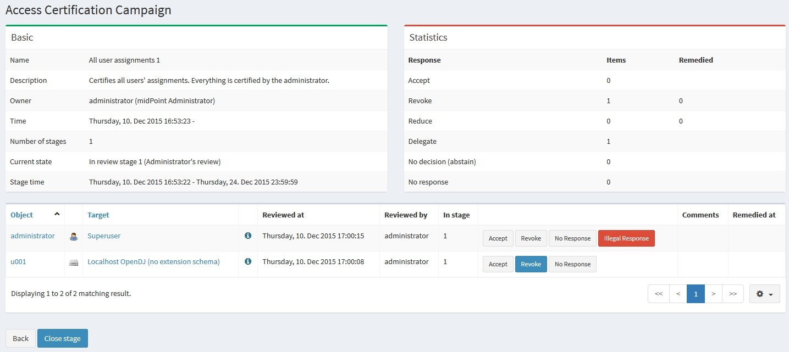

= Access Certification
:page-wiki-name: Access Certification
:page-wiki-id: 21200930
:page-wiki-metadata-create-user: mederly
:page-wiki-metadata-create-date: 2015-09-08T10:37:07.596+02:00
:page-wiki-metadata-modify-user: mederly
:page-wiki-metadata-modify-date: 2020-06-18T07:37:54.090+02:00
:page-toc: top
:page-upkeep-status: orange

== Introduction

MidPoint provides the possibility to periodically review various settings, e.g. assignment of roles to users.
This feature is called *Access certification*. It is implemented in the form of certification campaigns.

A *certification campaign* is a review process that consists of identifying a set of certification cases, selecting reviewers for them, gathering decisions of these reviewers, and executing remediation process, if needed.
Reviewer selection and decision gathering can be done multiple times, in case of multi-stage campaigns.
Remediation process can be automated or manual.
It is assumed that certification campaigns will be run regularly, e.g. yearly, twice a year, monthly, and so on.

In the following we'll see how a campaign looks like.
Then we'll go through a very quick tutorial.
And after that we'll have a look at various possibilities connected to defining certification campaigns.

[WARNING]
====
Information on this page is related to midPoint 3.4.

In version 3.3, access certification feature is present at the level of a *technology preview*. It is not suitable for production environments, mainly because of performance issues.
Also, not all features mentioned here are implemented in 3.3.
====

== Certification campaign

Certification campaigns are created using templates that are called *certification campaign definitions*, or certification definitions for short.
Each definition contains the following elements:

. *name* - the name of the certification campaign definition, e.g. "All user assignments"

. *description* - more verbose description of the definition, e.g. "Certifies all users' assignments.
Everything is certified by the administrator."

. *handlerUri* - defines the software element (handler) that implements all the processing required by the certification campaigns of the given type.
There are handlers that come bundled with midPoint, while others can be customer-written.
Currently, there is one handler named [.underline]#http://midpoint.evolveum.com/xml/ns/public/certification/handlers-3#direct-assignment#, that is able to handle certification of many types of direct assignments, e.g. user-to-role, user-to-org, role-to-role, etc.

. *scopeDefinition* - while the handler provides basic character of the certification (e.g. "we'll be dealing with direct assignments"), the scope definition says more precisely which objects (in this case, assignments) are involved.
E.g. only user-to-role? And which users? Which roles? And so on.
More on this below.

. *ownerRef* - who owns the definition and related campaigns? Campaign owner may be different from the owner of the campaign definition.

. *stageDefinition*(s) - how will the individual review stages look like, e.g. how long should a given stage take? how will the reviewers be selected? More on this below.

. *remediationDefinition* - how will the remediation phase look like, e.g. will it be automated or manual?

An example of a campaign definition (taken from link:https://github.com/Evolveum/midpoint-samples/blob/master/samples/certification/def-all-user-assignments.xml[samples/certification/def-all-user-assignments.xml] file):

[source,xml]
----
<accessCertificationDefinition
        xmlns="http://midpoint.evolveum.com/xml/ns/public/common/common-3"
        xmlns:q="http://prism.evolveum.com/xml/ns/public/query-3"
        xmlns:xsi="http://www.w3.org/2001/XMLSchema-instance">
    <name>All user assignments</name>
    <description>Certifies all users' assignments. Everything is certified by the administrator.</description>
    <handlerUri>http://midpoint.evolveum.com/xml/ns/public/certification/handlers-3#direct-assignment</handlerUri>
    <stageDefinition>
        <number>1</number>
        <name>Administrator's review</name>
        <description>In this stage, the administrator has to review all the assignments of all users.</description>
        <duration>P14D</duration>   <!-- 14 days -->
        <notifyBeforeDeadline>PT48H</notifyBeforeDeadline> <!-- 48 hours -->
        <notifyBeforeDeadline>PT12H</notifyBeforeDeadline>
        <notifyOnlyWhenNoDecision>true</notifyOnlyWhenNoDecision>  <!-- this is the default -->
        <reviewerSpecification>
            <defaultReviewerRef oid="00000000-0000-0000-0000-000000000002" type="UserType" />   <!-- administrator -->
        </reviewerSpecification>
    </stageDefinition>
    <remediationDefinition>
        
    </remediationDefinition>
</accessCertificationDefinition>
----

In this case, scope definition is missing.
It means that default values are used: all assignments of all users are taken into account.

There is one stage.
Stage definition consists of the following:

. *number* - because in midPoint data structures, lists are generally unordered, each stage has a number that specifies in which order it will be executed.
Numbers have to start at 1 and increase consecutively.

. *name* and *description*,

. duration, specified as *duration* property - this influences notifications and automated closure of the stage,

. *notifyBeforeDeadline* - how long before deadline (given by the stage duration) will notifications be sent.
This is a multivalued property, so it is possible to specify more than one notification.
In the above example, first notification is sent 48 hours before deadline, and the second one 12 hours before.

. *notifyOnlyWhenNoDecision* - if set to true (the default), notifications are sent only to reviewers that have not decided yet.

. *reviewerSpecification* - how the reviewers will be selected? In this simplistic case, everything will be reviewed by the administrator.
More on reviewer specification below.

== Very quick tutorial

It is advisable to go through a xref:/midpoint/reference/roles-policies/certification/tutorial/[very quick tutorial] at this point in order to see how certification works.

== Campaign definition options

Scope definition and reviewer definition are powerful mechanisms allowing to customize certification campaign a lot.
Let us have look at the details.

=== Scope definition

Scope definition controls the set of certification cases that are created when the certification campaign is started.
You can configure the following:

. *objectType* - what kind of objects we are dealing with? The default is UserType.
But you can specify also RoleType, OrgType, ServiceType, FocusType or AbstractRoleType here.

. *searchFilter* - what objects of a given type should be selected? This is a standard midPoint filter.
The default is "all objects of a given type".

. *itemSelectionExpression* - expression that selects items that are to be included in the certification.
Exact use of this expression depends on the certification handler.
The direct assignment handler calls this expression individually with each assignment to determine which assignments should be included and which should not.

. *caseGenerationExpression* - in the future, it will be possible to define an expression that produces certification cases.
This can be any expression, whose input is an object that has passed the search filter specified above, and its output is a list of certification cases.
However, this is not implemented yet.

. Handler-specific properties.
For example, direct assignment handler provides the following ones:

.. *includeAssignments* - should assignments be included in the certification? (default = true)

.. *includeInducements* - should inducements be included in the certification? (default = true)

.. *includeRoles* - should assignments/inducements of roles be included in the certification? (default = true)

.. *includeOrgs* - should assignments/inducements of orgs be included in the certification? (default = true)

.. *includeResources* - should assignments/inducements of resources be included in the certification? (default = true)

.. *includeServices* - should assignments/inducements of services be included in the certification? (default = true)

.. *enabledItemsOnly* - should we approve only assignments/inducements that are currently enabled? (I.e. with administrativeStatus either null or ENABLED) (default = true)

An example of more advanced scope definition:

[source,xml]
----
<scopeDefinition xsi:type="AccessCertificationAssignmentReviewScopeType">
    <objectType>UserType</objectType>
    <searchFilter>
        <q:org>
            <q:path>parentOrgRef</q:path>
            <q:orgRef oid="00000000-8888-6666-0000-100000000001">       <!-- Governor Office -->
                <q:scope>SUBTREE</q:scope>
            </q:orgRef>
        </q:org>
    </searchFilter>
    <itemSelectionExpression>
        
    </itemSelectionExpression>
    <includeRoles>true</includeRoles>
    <includeOrgs>false</includeOrgs>
    <includeResources>false</includeResources>
</scopeDefinition>
----

This selects user-role assignments for users that belong under GovernorOffice and for roles with riskLevel = "critical".

=== Stage definitions

This is described in xref:/midpoint/reference/roles-policies/certification/stages/[a separate document].

=== Automated scheduling of campaigns

Campaigns can be automatically started by using tasks.
So, for example, to auto-start campaigns in samples/certification directory, please import the `start-*.xml` files.

The task looks like this:

[source,xml]
----
<task ...>
    <name>Start campaign: Role Inducements</name>
    <ownerRef oid="00000000-0000-0000-0000-000000000002"/>
    <executionStatus>runnable</executionStatus>
    <category>AccessCertification</category>
    <handlerUri>http://midpoint.evolveum.com/xml/ns/public/certification/task/campaign-creation/handler-3</handlerUri>
    <objectRef type="AccessCertificationDefinitionType">
        <filter>
            <q:text>name = "Role Inducements"</q:text>
        </filter>
    </objectRef>
    <recurrence>recurring</recurrence>
    <binding>loose</binding>
    <schedule>
        <cronLikePattern>0 0 0 * * ?</cronLikePattern>        <!-- each day at midnight (for testing) -->
    </schedule>
</task>

----

After importing the task(s), campaigns are automatically scheduled at given times.

Current status of a campaign can be seen when clicking on "Campaigns scheduling" under "Certifications" menu.
All certification-related tasks are shown.
(Besides tasks for starting campaigns there are also remediation tasks, but that will be eventually fixed.)

image::scheduling.jpg[]

=== Configuring choice buttons

Unneeded choice buttons might be hidden at the level of the system configuration.
The configuration is done by listing available buttons, like this:

[source,xml]
----
<accessCertification>
    <availableResponse>accept</availableResponse>
    <availableResponse>revoke</availableResponse>
    <availableResponse>noResponse</availableResponse>
</accessCertification>
----

If there are no available responses listed, all 6 can be used (accept, revoke, reduce, notDecided, delegate, noResponse).

If there is a pre-existing response that is currently not among specified items, it is displayed as red button "Illegal Response" just to distinguish it from "no response" state.
It can be changed to any of the available responses.
Seems like this:

As for statistics, we currently list all 6 of responses.
(Might be changed in the future.)

== Reporting

There are four types of reports available: certification definitions, campaigns, campaign cases and campaign decisions.
They are described on xref:/midpoint/reference/roles-policies/certification/reports/[Access Certification Reports] page.

== Notifications

Certification module provides notifications for certification campaign owner as well as for individual reviewers.
More information can be found on xref:/midpoint/reference/roles-policies/certification/notifications/[Access Certification Notifications] page.

== Security

Individual operations are authorized in a specific way.
For detailed information, please see xref:/midpoint/reference/roles-policies/certification/authorization/[Access Certification Security] page.
